# Platform Architecture

A C4-style reference for the `platform-template` monorepo. Describes the platform as it currently runs.

> **Caveat.** This is a descriptive map, not a contract — it drifts as the code evolves. Treat claims here as a starting point for understanding the shape of things, not as ground truth. When a specific behavior matters (a file path, a function signature, an exact list of fields, an enforcement rule), verify against the source before relying on it. If you find a mismatch worth fixing, update this doc.

The platform is a Cloudflare Workers monorepo. Public traffic enters through a single Worker called **bouncer**. Bouncer resolves the user's session, stamps a signed attestation onto the forwarded request, and dispatches to one of several upstream Workers (apps or internal services) via service bindings. Apps trust bouncer's attestation, skip the redundant session lookup, and render. The session authority — Better Auth + the user database — lives in a Worker called **guestlist**, which only ever receives traffic over service bindings.

The template is opinionated about **TanStack Start** apps but the underlying primitives are framework-agnostic. You can drop in a Hono Worker, a plain `fetch` handler, or an Astro-on-Workers app and consume the same shared primitives (envelope verifier, guestlist client, request context, canonical log). The Start-specific helpers (`createPlatformStartApp`, the kit's `createDevEnvelopeStamper`) layer on top — but the worker `fetch` entry stays hand-written per app to keep the `@cloudflare/vite-plugin` HMR contract intact (see §3.3).

Dev/prod parity is explicit. Apps run alone in development (no bouncer in front, just service bindings to guestlist) and the same code paths route to guestlist. The same apps in production require a valid bouncer attestation envelope or return 403. The behavioral split is two `ENVIRONMENT` checks, both encoded inside `@si/auth`'s verifier — never scattered across app code.

Sections §1–§6 describe the request/auth spine (containers, components, shared patterns, adding an app, config & secrets). Sections §7–§10 cover the platform's operational surfaces: the Stripe billing-ingestion pipeline (§7), release engineering & CI/CD (§8), DevOps/IaC — the wrangler config model, binding inventory, and provisioning (§9), and the testing strategy (§10). Product analytics is a cross-cutting shared pattern (§4.8).

---

# §1 — Context

The system from outside in.

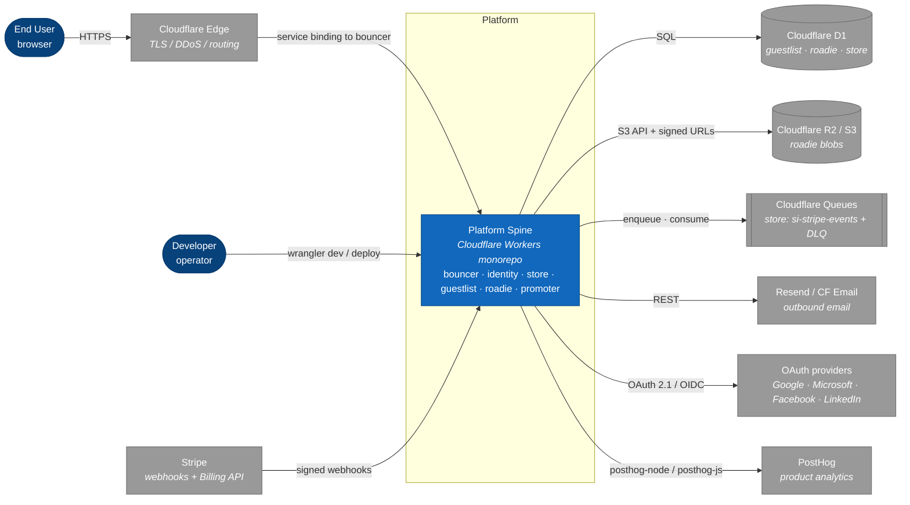

**Actors.**

- **End User** — a browser. Uses one or more apps mounted under the platform's single host per environment (e.g., `platform.example/account` for identity, `platform.example/shop` for a storefront app). One Better Auth cookie scoped to the apex domain authenticates all apps.
- **Developer / Operator** — the person running the monorepo. Runs `bun run dev` locally or `wrangler deploy` to ship. Operates the platform; not an end user of the apps it hosts.

**External dependencies.**

- **Cloudflare Edge** — TLS termination + DDoS + request routing. Every public host in the platform is a CF Custom Domain pointing at the bouncer Worker.
- **Cloudflare D1** — relational store. Guestlist owns the auth schema (users, sessions, accounts, two-factor, organizations). Roadie owns the blob index. Store owns the storefront catalog + orders + the Stripe idempotency ledger. No app reads another worker's D1.
- **Cloudflare R2 / S3-compatible storage** — roadie's blob backend. App workers never touch R2 directly; they request signed PUT/GET URLs from roadie.
- **Cloudflare Queues** — store's async billing-ingestion transport. Store is the only worker that binds queues (`si-stripe-events-{env}` + a dead-letter queue). See §7.
- **Resend / Cloudflare Email Service** — promoter's email backend. Staging uses Resend (`RESEND_API_KEY`); production uses the Cloudflare Email Service `send_email` binding (`EMAIL_PROVIDER` var selects). App workers never call the email backend directly.
- **OAuth providers** — Google, Microsoft, Facebook, LinkedIn. Optional. Wired in guestlist's `auth-config.ts` when client ids/secrets are present in env.
- **Stripe** — billing. Sends signed webhooks to two disjoint listeners (store's `/hooks/store` commerce pipeline; guestlist's better-auth subscription webhook) and is the target of the Billing API. Optional and additive — every worker boots, typechecks, tests, and runs `bun run dev` with **zero** Stripe config; absence is a branch, never a throw. See §7.
- **PostHog** — product analytics. Reached only through `@si/analytics`; store + identity capture client and server events. The write token is a committed public constant in `@si/config`, not a secret. See §4.8.

---

# §2 — Containers

The deployed Workers and what they do.

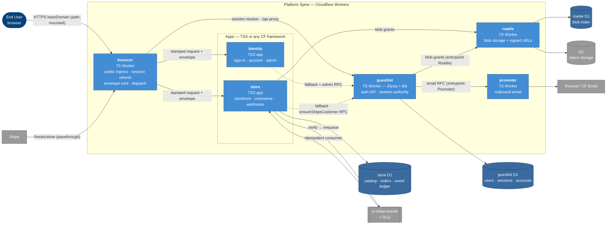

## §2.1 Containers in detail

| Container          | Role                                                                                                                                                                                                                                                                                                                                                                                                                | Public host?                                                                                                                                   | Holds secrets?                                                                                        |
| ------------------ | ------------------------------------------------------------------------------------------------------------------------------------------------------------------------------------------------------------------------------------------------------------------------------------------------------------------------------------------------------------------------------------------------------------------- | ---------------------------------------------------------------------------------------------------------------------------------------------- | ----------------------------------------------------------------------------------------------------- |
| **bouncer**        | Single public ingress. Resolves session via guestlist. Mints + stamps bouncer attestation envelope. Dispatches to apps (passthrough or mounted-microfrontend mode). Strips privileged headers from inbound and outbound traffic.                                                                                                                                                                                    | Yes — every public hostname is a bouncer Custom Domain.                                                                                        | `BNC_ATT_PRIV` (Ed25519 private key for envelope signing). No `BETTER_AUTH_SECRET`.                   |
| **guestlist**      | Sole authority on session validity. Owns Better Auth wiring, the user database, plugin set (passkey, twoFactor, oauthProvider, admin, organization). Exposes `/api/auth/*` (BA handler), `/api/avatar/*` (presigned-upload flow via roadie), `/admin/*` (sessions, stats, API keys, OAuth clients), `/user/connections`, `/u/avatar/:refId` (public avatar read broker), `/providers`, `/.well-known/*`, `/health`. | No public Custom Domain in the target topology. Reached only via service bindings (from bouncer for `/api`/`/u`, from apps for session/admin). | `BETTER_AUTH_SECRET`, OAuth client secrets, internal API tokens.                                      |
| **roadie**         | Blob storage and signed-URL minting for app-uploaded files. Apps request "give me a PUT URL for blob X for user Y"; roadie validates and returns a presigned R2 URL.                                                                                                                                                                                                                                                | No public Custom Domain.                                                                                                                       | `S3_ACCESS_KEY_ID`, `S3_SECRET_ACCESS_KEY`, signed-meta secret.                                       |
| **promoter**       | Outbound transactional email. Wraps Resend behind a typed RPC surface (`sendVerificationEmail`, `sendMagicLinkEmail`, etc.). Apps don't speak to Resend; they speak to promoter over a service binding.                                                                                                                                                                                                             | No public Custom Domain.                                                                                                                       | `RESEND_API_KEY`, signed-meta secret.                                                                 |
| **identity** (app) | Sign-in, sign-up, account settings, admin sessions surface. The reference TanStack Start app.                                                                                                                                                                                                                                                                                                                       | No direct host. `<baseDomain>/account` is bouncer → identity (vmf-mounted).                                                                    | None at the app level. `BOUNCER_ATTESTATION_KEYS` is committed code (public keys), not a secret.      |
| **store** (app)    | Storefront + commerce. TanStack Start app owning its own D1 (catalog, `customer_order`, `processed_stripe_event` ledger). Hosts the commerce billing pipeline: a `/hooks/store` webhook front door that verifies + enqueues Stripe events, and a `queue()` consumer that idempotently applies order state (§7). Binds guestlist (session + `ensureStripeCustomer` RPC) and roadie (product photos).                 | No direct host. `<baseDomain>/shop` is bouncer → store (vmf); `<baseDomain>/hooks/store` is bouncer → store (passthrough, raw body).           | `STRIPE_SECRET_KEY`, `STRIPE_WEBHOOK_SIGNING_SECRET` (both optional — absent = manual-stub checkout). |
| **other apps**     | Product-specific. Each app reaches the same primitives via the same kit factories. May be TSS or any other CF-deployable framework.                                                                                                                                                                                                                                                                                 | Each gets a path mount under the shared host, owned by bouncer (passthrough or vmf) — e.g. `store` at `<baseDomain>/shop`.                     | None.                                                                                                 |

## §2.2 Service binding graph

The trust graph is a DAG:

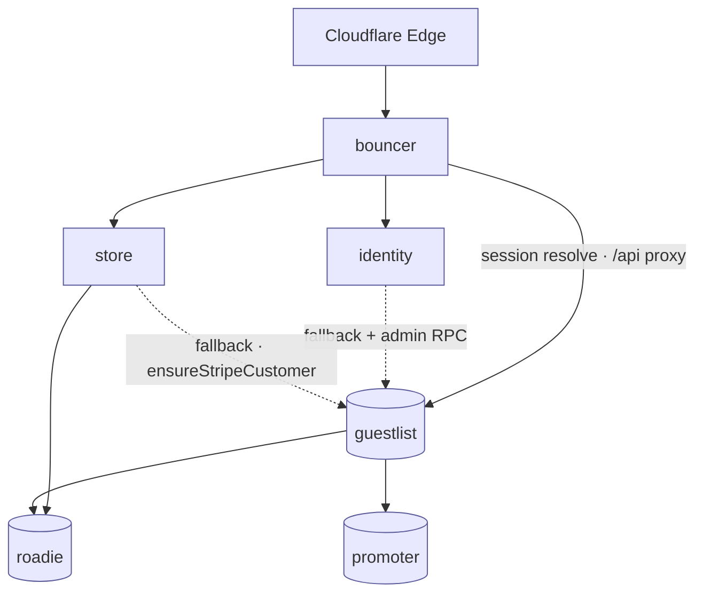

- **Bouncer** binds to every app (`IDENTITY`, `STORE`) and to guestlist. Bouncer never binds to roadie or promoter (no use case).
- **Apps** bind to guestlist (session fallback + `/api/auth` proxy + user search; store also for `ensureStripeCustomer`), and where useful to roadie (blob grants). Store binds roadie for product photos; identity binds only guestlist today.
- **Guestlist** is not a leaf — it binds **promoter** (transactional email, entrypoint `Promoter`) and **roadie** (avatar blobs, entrypoint `Roadie` + `props.callerApp: "guestlist"`). Every worker that binds `ROADIE` must set that entrypoint + `props.callerApp`, or roadie's `readCallerApp` throws on every call (§9, roadie runbook).
- **Apps** do not bind to each other. App-to-app communication, when needed, is mediated by bouncer or by a shared service.
- **Roadie and promoter** are the true leaves — they bind nothing inside the platform. They are RPC _targets_ (of guestlist and store), not callers.

This shape is what makes the security model tractable: the platform's only inbound surface from the public Internet is bouncer, and the platform's authority chain converges on guestlist.

---

# §3 — Components

This section drops one level deeper into each Worker. Component diagrams + the load-bearing files.

## §3.1 bouncer

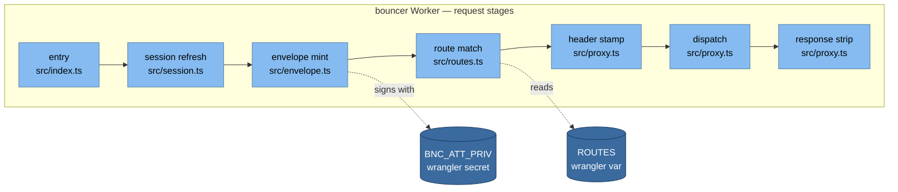

| stage             | file              | what it does                                                                                             |
| ----------------- | ----------------- | -------------------------------------------------------------------------------------------------------- |
| `entry`           | `src/index.ts`    | fetch handler; opens request context; runs stages in order                                               |
| `session refresh` | `src/session.ts`  | calls `guestlist.getSession()` over service binding; captures actor, session projection, refresh cookies |
| `envelope mint`   | `src/envelope.ts` | builds Ed25519-signed attestation payload from resolved `{ actor, session }`                             |
| `route match`     | `src/routes.ts`   | compiled host+path matcher; produces a route binding + mode                                              |
| `header stamp`    | `src/proxy.ts`    | strips inbound `x-platform-*`; stamps bouncer-authored values + the envelope                             |
| `dispatch`        | `src/proxy.ts`    | forwards to upstream via service binding (passthrough or VMF mode)                                       |
| `response strip`  | `src/proxy.ts`    | strips `x-platform-att` from upstream response before returning                                          |

**Request lifecycle.**

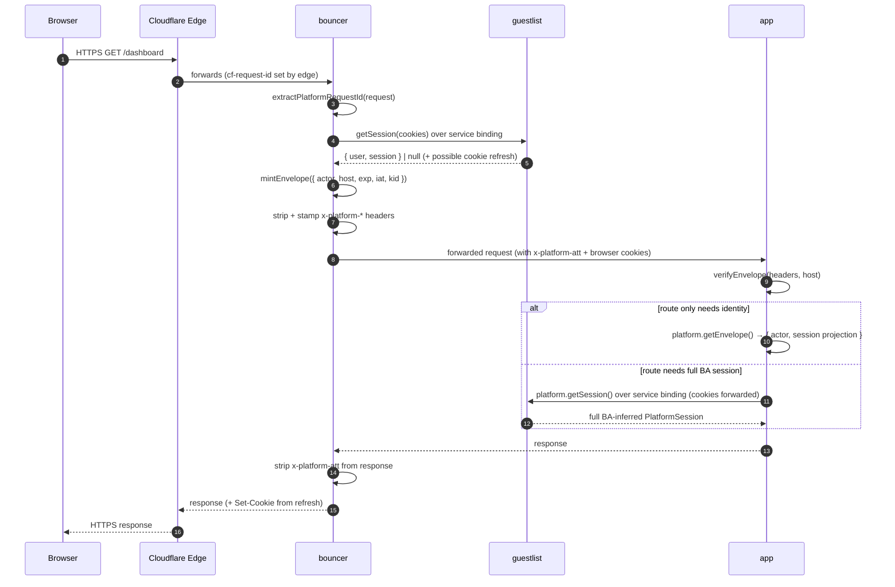

**Notes.**

- Step 4 is bouncer's only guestlist hop. Whether app pays a second hop is the app's choice (step 9 vs. step 11): identity-only consumers call `platform.getEnvelope()` and pay nothing; routes that need full BA session metadata (`twoFactorEnabled`, `createdAt`, etc.) call `platform.getSession()` which RPCs guestlist with the inbound cookies (~1ms same-colo).
- Browser cookies flow through bouncer to the app unchanged — bouncer's strip-and-stamp only touches `x-platform-*` headers (see §4.1.3). That's what lets `platform.getSession()` authenticate at guestlist without any envelope-to-session synthesis: the cookie is the source of truth, the envelope is the signed origin assertion.
- Step 6's strip is the hygiene rule: never let a client-supplied `x-platform-*` header survive into upstream.
- If step 4's `guestlist.getSession()` returns `null` (no session, or expired), the envelope carries `actor: null` and `session: null`. The envelope is still stamped — every bouncer-forwarded request gets one, so the prod enforcement check is uniform. The verifier enforces the cross-field invariant `actor === null ⟺ session === null`.
- Bouncer's `ROUTES` config carries no auth-requirement flag — it dispatches every matched route the same way regardless of `actor`. Redirecting anonymous users to sign-in is the app's responsibility (route guards built on `createPrincipalGate` / `requireUserMiddleware`), not bouncer's.

## §3.2 guestlist

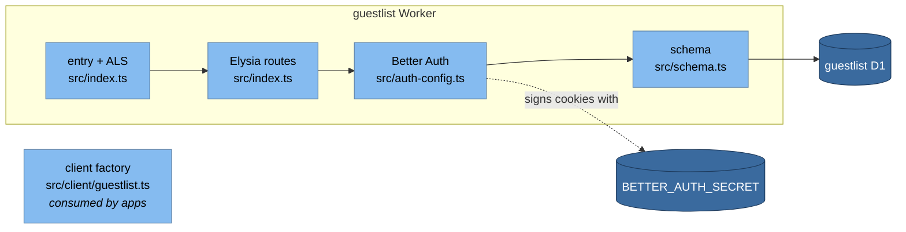

| component      | role                                                                                                                                  |
| -------------- | ------------------------------------------------------------------------------------------------------------------------------------- |
| entry + ALS    | wraps fetch in `executionContext` + `withRequestContext`; reads `x-platform-*` as log correlation only                                |
| Elysia routes  | mounts `/api/auth/*`, `/api/avatar/*`, `/admin/*`, `/user/connections`, `/u/avatar/:refId`, `/health`, `/providers`, `/.well-known/*` |
| Better Auth    | BA instance with plugin set (passkey, twoFactor, oauthProvider, admin, organization)                                                  |
| schema         | Drizzle schema: user, session, account, twoFactor, organization tables                                                                |
| client factory | `createGuestlistClient(...)` — apps consume this to call guestlist over their service binding                                         |

**Invariants.**

1. **Guestlist is the sole holder of `BETTER_AUTH_SECRET`.** No other Worker. Cookie validation lives where the secret lives.
2. **Guestlist is reached only via service binding in the target topology.** It has no public Custom Domain. The bouncer proxies `/api/auth/*` and `/u/*` under the shared host to guestlist; that proxy is the only public path to guestlist.
3. **`x-platform-actor-*` headers at guestlist's boundary are log-correlation only.** They never feed authz. Authoritative actor identity at guestlist always derives from the cookie. (Comment that pins this lives at `workers/guestlist/src/index.ts` boundary; see §4.1.4.)

## §3.3 apps (identity)

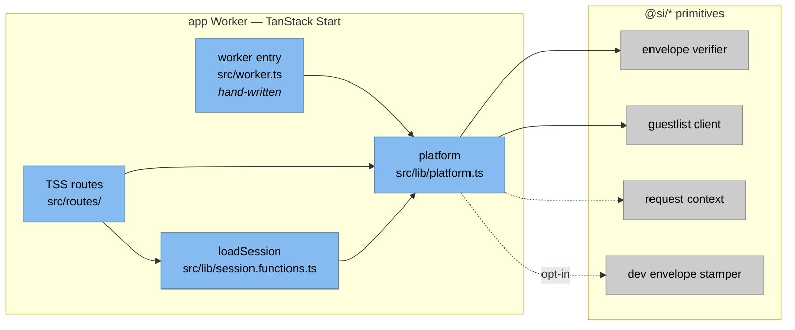

| component      | role                                                                                                                                                                                                                                                                                                                    |
| -------------- | ----------------------------------------------------------------------------------------------------------------------------------------------------------------------------------------------------------------------------------------------------------------------------------------------------------------------- |
| `worker entry` | Hand-written `export default { fetch(...) }` that imports `@tanstack/react-start/server-entry` directly. Wrapping it inside a workspace package's factory breaks `@cloudflare/vite-plugin` HMR (the static `server-entry` import can't be roundtripped through a kit module), so each app keeps its own ~10-line entry. |
| `platform`     | `createPlatformStartApp({ name, ... })` — single wiring file; exposes `getEnvelope`, `getSession`, `getActiveOrgId`, `getGuestlist`, `envelopeMiddleware`, `apiProxyHandlers`, `makeAuthProvider`, `devEnvelopeStamper`.                                                                                                |
| `TSS routes`   | identity: sign-in / sign-up / account / admin-sessions / `/api/$` catch-all.                                                                                                                                                                                                                                            |
| `loadSession`  | `createServerFn` wrapper around `platform.getSession(getRequestHeaders())` — 5 lines, required at app top-level by the TSS compiler                                                                                                                                                                                     |

**Per-app file budget.** Roughly ~50 code lines + ~80 lines of load-bearing comment per TSS app — most of the comment volume documents constraints (TSS HMR / bundle-leakage / `Register.server.requestContext` augmentation) that bite if you forget them.

```
workers/identity/src/
├── worker.ts                       # ~10 code lines (+ 21-line HMR rationale comment)
├── lib/
│   ├── platform.ts                 # ~10 code lines (+ 16-line comment block)
│   ├── session.functions.ts        # 5 code lines  — createServerFn wrapper (required by TSS compiler)
│   ├── auth-context.ts             # ~10 lines — wraps kit's createReactStartAuthProvider
│   ├── guestlist.ts                # ~10 lines — wires createGuestlistFactory with the app's name
│   └── (app-specific helpers)
├── routes/
│   ├── api/$.ts                    # ~30 code lines — apiProxyHandlers + request-context header seeding
│   ├── __root.tsx                  # standard TSS root; uses AuthProvider + loadSession
│   └── ...
├── app-brand.ts                    # APP_PRODUCT_NAME (per-app)
└── wrangler.jsonc         # bindings: GUESTLIST, ROADIE?, PROMOTER?
```

The kit's `createDevEnvelopeStamper` is opt-in per app (passed via `devEnvelopeSigner` + `devEnvelopeGuestlist` to `createPlatformStartApp`). Identity doesn't opt in — its TSS server fns cookie-authenticate against guestlist directly. See §4.5.

## §3.4 roadie

Roadie is a small Worker that owns the platform's blob plane. Apps don't directly hold S3 credentials; they request signed PUT/GET URLs from roadie. Roadie records the blob in its D1 index and returns presigned R2 URLs. The S3 SigV4 credentials live in roadie's secret set; the R2 bucket binding lives only in roadie's `wrangler.jsonc`.

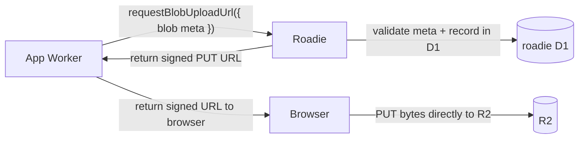

**Trust model.** Roadie is reached only over service bindings from app workers inside the platform — no public Custom Domain, no inbound traffic from outside the trust boundary. Identity travels in the RPC `meta` parameter the calling app provides (validated for shape but not for cryptographic origin), so roadie trusts the caller absolutely. The protection that matters is keeping roadie unreachable from outside the platform — the wrangler-config lint forbids `workers_dev: true` and any `routes`/`custom_domain` entries on leaf services. A future hardening would have roadie run the bouncer envelope verifier on the inbound request the same way an app does (the envelope flows through bouncer → app → roadie unchanged); the primitive exists in `@si/auth` already. Same goes for issuing a signed-meta token alongside the R2 URL so the browser PUT can't be forged from a leaked URL without the matching token. Not implemented today.

## §3.5 promoter

Promoter is similar in shape but for email. Apps call typed RPCs over a service binding (`send({ kind: "verification", to, code })` and friends); promoter formats via templates and dispatches. Apps never hold `RESEND_API_KEY`. The backend is provider-selected by the `EMAIL_PROVIDER` var: **staging uses Resend** (`RESEND_API_KEY` secret), **production uses the Cloudflare Email Service `send_email` binding** (`EMAIL`, declared only in `env.production`). Promoter also runs cron jobs; it binds no queues today (the only queue infra on the platform lives on store — §7).

**Trust model.** Same posture as roadie: service-binding-only callee, no public Custom Domain, identity from the RPC `meta` parameter. Same future hardening applies — envelope verification on the inbound side, a signed-meta token for outbound-email idempotency. Not implemented today.

## §3.6 store

Store is the platform's storefront + commerce app. Structurally it is a second reference TanStack Start app (same kit factories, envelope verifier, and dev-direct topology as identity — §3.3), but it adds three things identity doesn't have: **its own D1 database**, the **Stripe commerce webhook pipeline** (the only Cloudflare Queue producer/consumer on the platform), and a **product-analytics** server seam (§4.8).

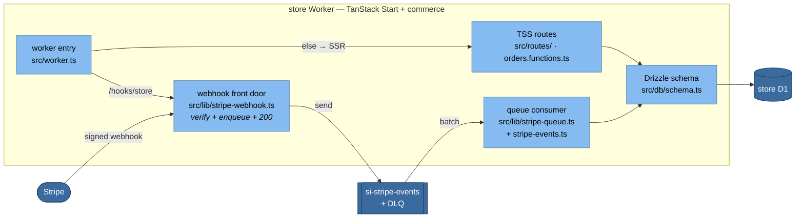

| component          | role                                                                                                                                                                                                                                                       |
| ------------------ | ---------------------------------------------------------------------------------------------------------------------------------------------------------------------------------------------------------------------------------------------------------- |
| `worker entry`     | `src/worker.ts` — hand-written `fetch` that **short-circuits `/hooks/store` before SSR** (webhook needs the raw body, not TSS), and otherwise wraps the request in `runWithExecutionContext(ctx, …)` + Start. Also exports the `queue()` consumer handler. |
| webhook front door | `handleStoreStripeWebhook` — config gate → signature check (`constructEventAsync`) → enqueue a compact event snapshot → `200`. Dumb by design (§7).                                                                                                        |
| queue consumer     | `consumeStripeEventBatch` / `processStoreStripeEvent` — idempotent per-message ack/retry against the `processed_stripe_event` ledger; a name-regex forks the DLQ batch to `processDlqBatch` (§7).                                                          |
| TSS routes         | storefront browse/cart/checkout + `orders.functions.ts` (`placeOrder`). Checkout today is the **manual pending→paid stub** — Checkout Session _creation_ is deferred (§7).                                                                                 |
| schema             | Drizzle: `customer_order` (+ nullable `stripe_customer_id`, unique `stripe_checkout_session_id`, `payment_status`), catalog tables, and the `processed_stripe_event` idempotency ledger.                                                                   |

**Status.** The billing pipeline is at **ingestion-only** maturity (exec-plan `0002`, phase P1): webhook receipt → verify → enqueue → idempotent consumer → order-state update all exist and are tested. What is **not** wired yet: Checkout Session creation (nothing calls `sessions.create`), so no order carries a session id, so every _real_ event currently finds no matching order and drains to the DLQ as retryable — the design is forward-compatible (no ledger row is written until an order matches). The `@better-auth/stripe` subscription plugin on guestlist is likewise present-but-dormant (§7). Full pipeline detail is §7.

---

# §4 — Shared Patterns

The substance. This section documents the cross-cutting patterns every app and service participates in.

## §4.1 Security

### §4.1.1 The internal header contract: `x-platform-*`

The platform speaks one well-typed internal header family. **Only bouncer translates `cf-*` to `x-platform-*`.** Apps and services never read `cf-*` directly.

```ts
// @si/auth/platform-headers (target — moved out of guestlist client)
export const PLATFORM_HEADERS = {
  rid: "x-platform-rid", // canonical request id
  att: "x-platform-att", // bouncer attestation envelope (JWS)
  caller: "x-platform-caller", // calling worker name: "bouncer", "identity", ...
  actor: {
    kind: "x-platform-actor-kind", // "user" | "service"  — log correlation only
    id: "x-platform-actor-id", // string              — log correlation only
  },
} as const;

export interface PlatformRequestContract {
  rid: string; // required on every internal request
  att?: string; // present on bouncer → app traffic; absent on worker → worker traffic
  caller?: string;
  actorKind?: "user" | "service";
  actorId?: string;
}
```

Why this exists:

- **One family, one place to grep.** Every privileged header has the `x-platform-` prefix. Adding a sixth field is a one-file edit.
- **Type-safe.** The constant + interface get imported anywhere the boundary reads or writes.
- **Framework-agnostic.** The contract has nothing to do with TanStack Start, Hono, or any other web framework. It applies to every CF Worker that participates in the platform.
- **Decouples from Cloudflare.** A future port to a non-CF runtime touches bouncer only; everything else already speaks the internal contract.

### §4.1.2 Bouncer attestation envelope

Bouncer stamps an Ed25519-signed JWS envelope on every forwarded request — authed or not, public-page or admin-only.

**Envelope shape (signed payload).**

```ts
type EnvelopePayload = {
  v: 1; // version
  iss: "bouncer"; // issuer
  iat: number; // epoch seconds (issue time)
  exp: number; // iat + 30 seconds
  host: string; // public host bouncer routed (lowercased, no port)
  actor: EnvelopeActorUser | null; // null for public/optional traffic
  session: EnvelopeSessionData | null; // null iff actor is null
  activeOrgId?: string | null; // BA org plugin's resolved active org id,
  // denormalized at mint time so apps can
  // gate org-scoped UI without a guestlist
  // hop. `null` for actors with no active org.
};

type EnvelopeActorUser = {
  kind: "user";
  id: string;
  role: string | null;
  // Common UX fields — enough to render avatar/menu/header
  // without an app-side guestlist hop. Anything beyond this
  // (org membership, 2FA state, etc.) goes through guestlist.
  name?: string;
  email?: string;
  image?: string | null;
};

// Safe subset of BA's full session — id/userId/expiresAt only. No `token`
// (that's the cookie itself), no `ipAddress`/`userAgent` (stale by verify
// time — apps read current values from `cf-connecting-ip` / `user-agent`).
type EnvelopeSessionData = {
  id: string;
  userId: string;
  expiresAt: number; // epoch seconds
};
```

The verifier enforces a cross-field invariant: `actor === null ⟺ session === null`. A signed envelope with one populated and the other null is rejected as `invalid: "actor_session_mismatch"`. `activeOrgId` is not coupled to the invariant — an authenticated actor with no active org has `activeOrgId: null`.

**Header (JOSE-compact).**

```
x-platform-att: <b64url(joseHeader)>.<b64url(payload)>.<b64url(sig)>

joseHeader = { "alg": "EdDSA", "kid": "gw-2026-05" }
```

**Crypto choice.** Ed25519 (`alg: "EdDSA"`):

- Bouncer holds the private key as a single wrangler secret (`BNC_ATT_PRIV`).
- Apps hold only the public key set, committed as code in `packages/config/src/bouncer-attestation.ts`. **Public keys are not secrets.** Zero new secrets to manage on apps.
- Verification cost ~0.1 ms per request inside a CF Worker.
- `kid` lets the verifier accept a key set (old + new) during rotation; no flag day.

**Anti-replay properties.**

- `host` field binds the envelope to the routed hostname. A stolen envelope minted for `staging.<baseDomain>` is rejected on `<baseDomain>` (production), and vice versa. Apps sharing one host via path mounts (e.g. `/account`, `/shop`) share that host's envelope trust — the mount boundary between them is enforced by bouncer's routing, not by the envelope.
- `exp = iat + 30s`. Replay window is 30 seconds, matching the standard JWT compromise — no server-side nonce store required.
- `alg` is hardcoded `"EdDSA"` in the verifier; `alg: "none"` and algorithm-confusion attacks are rejected.
- Unknown `kid` is rejected (no fall-open behavior).

### §4.1.3 Header strip + stamp at bouncer

Bouncer is the only worker that writes `x-platform-*` headers onto requests. The strip-then-stamp rule guarantees no client-supplied privileged header survives the proxy boundary, regardless of how the client crafted the request.

```ts
// workers/bouncer/src/proxy.ts (target shape)
function stampUpstreamHeaders(
  request: Request,
  envelope: string,
  actor: { kind: "user"; id: string } | null,
): Request {
  const headers = new Headers(request.headers);

  // STRIP — privileged platform-family headers; client values never survive.
  headers.delete("x-platform-rid");
  headers.delete("x-platform-att");
  headers.delete("x-platform-caller");
  headers.delete("x-platform-actor-kind");
  headers.delete("x-platform-actor-id");

  // STAMP — values authored by bouncer from its request context.
  headers.set("x-platform-rid", getPlatformRid());
  headers.set("x-platform-caller", "bouncer");
  headers.set("x-platform-att", envelope);
  if (actor) {
    headers.set("x-platform-actor-kind", actor.kind);
    headers.set("x-platform-actor-id", actor.id);
  }

  // cf-* headers are LEFT IN PLACE — they're informational (cf-connecting-ip,
  // cf-ipcountry, etc.) and apps are free to consume them. They are NEVER the
  // source of identity or request id downstream.

  return new Request(request, { headers });
}
```

**On the response side**, bouncer also strips `x-platform-att` from upstream responses before returning to the client. The envelope is internal-only; it should never leak to a browser.

### §4.1.4 Verification on the app side

Apps verify envelopes through a single shared primitive in `@si/auth`.

```ts
// @si/auth/createBouncerEnvelopeVerifier (framework-agnostic)
export function createBouncerEnvelopeVerifier(opts: {
  keys: Record<string, string>; // kid → base64-PEM Ed25519 pubkey
  env: "development" | "staging" | "production";
  expectedHost: (req: Request) => string; // typically req.url.hostname
}): (req: Request) => Promise<EnvelopeResult>;

type EnvelopeResult =
  | {
      kind: "valid";
      actor: EnvelopeActorUser | null;
      session: EnvelopeSessionData | null;
    }
  | { kind: "missing" } // no x-platform-att header
  | { kind: "invalid"; reason: string };
```

**Dev/prod enforcement matrix.** Baked into the verifier — apps don't repeat the logic.

| `ENVIRONMENT` | envelope missing                                            | envelope invalid                   |
| ------------- | ----------------------------------------------------------- | ---------------------------------- |
| `development` | `kind: "missing"` → apps fall back to direct guestlist call | log + same fallback                |
| `staging`     | same as dev (warning log)                                   | same as dev (warning log)          |
| `production`  | **throw `403 — bouncer_required`**                          | **throw `403 — envelope_invalid`** |

The verifier factory itself **asserts at construction time that `keys` is non-empty when `env === "production"`**. A worker deployed to production with no key set fails to boot, not silently fails open at request time.

### §4.1.5 Defense in depth

Two layers always hold:

1. **The app's own route guards** (`createPrincipalGate` / `requireUserMiddleware` and friends) enforce UX policy — redirecting anonymous users to sign-in, gating admin routes. Bouncer dispatches every matched route uniformly and attaches the actor for downstream to read; it does not gate on auth itself.
2. **The app's verifier runs as a precondition** on every `platform.getEnvelope()` and `platform.getSession()` call inside loaders/middleware. In prod the verifier throws `403 — bouncer_required` / `envelope_invalid` on missing/tampered envelopes — that's the security backstop; in dev/staging it returns `kind: "missing"` and identity-only consumers see `null` (apps that need full session still cookie-authenticate against guestlist the same way).

A route guard that forgets to gate a page is a UX bug, not a security hole — a missing or tampered envelope in prod is still caught by the verifier (403). Both must hold; neither replaces the other.

## §4.2 User identity & session access

Apps never deal with JWS, headers, or envelopes directly. The platform exposes **three reader functions** — the envelope is intentionally not synthesized into a "session" by the kit, because the envelope's narrow payload can't honestly satisfy Better Auth's full plugin-merged session shape. Picking which one to call is the only thing app code thinks about.

```ts
// Fast path — narrow, signed, no I/O.
// Use for auth gates, log correlation, header chrome.
const env = await platform.getEnvelope(headers);
if (env) {
  env.actor.id;
  env.actor.role;
  env.actor.email; // optional
  env.session.expiresAt; // epoch seconds
}

// Org id — narrow, signed, no I/O. Pre-stamped on the envelope at mint time.
// Use for org-scoped UI gates that don't need full membership metadata.
const orgId = await platform.getActiveOrgId(headers); // string | null

// Full path — BA-inferred `PlatformSession`, ~1ms service-binding hop.
// Use for plugin-extended fields (twoFactorEnabled, createdAt, username, etc.).
const session = await platform.getSession(headers);
if (session) {
  session.user.id;
  session.user.twoFactorEnabled; // BA admin/2FA plugin field
  session.session.token; // BA-managed cookie value
}
```

All three run the envelope verifier as a precondition, so production's "every request must originate through bouncer" guarantee holds. The split is purely about whether the caller is willing to make a guestlist service-binding RPC (`getSession`) or can read what the envelope already carries (`getEnvelope`, `getActiveOrgId`).

`createPlatformStartApp` also returns supporting middleware and provider factories so apps don't have to wire the readers per route:

- `envelopeMiddleware` — TSS middleware that runs the verifier once and exposes `ctx.principal` (`{ kind: "user", actor, session, activeOrgId }` or `{ kind: "anonymous" }`). Used by `createPrincipalGate(...)` to build per-app `requireUserMiddleware` / `requireAdminMiddleware`.
- `apiProxyHandlers` — handlers object for `/api/$.ts` that proxies `/api/auth/*` and `/api/avatar/*` to guestlist over the service binding, seeding the platform header contract.
- `makeAuthProvider` — session-driven `AuthProvider` factory for client-side auth state; not used by `identity` today (which uses `envelopeMiddleware` and `createReactStartAuthProvider` directly). `@si/kit` has no `sessionMiddleware`/`createSessionMiddleware` export — `makeAuthProvider` is the kit's only session-driven client-auth factory.
- `devEnvelopeStamper` — per-app opt-in for dev-direct topology; see §4.5.

**Type relationship.** `PlatformSession` is a strict superset of `EnvelopeData`'s relevant fields — same `user.id`, same `user.email`, etc. Anywhere envelope data is enough, the full session also works; anywhere the full session is required, the envelope can't substitute (it doesn't carry the BA-plugin extras). Apps don't have to choose one model — they pick per call site:

- Route loader for a public-page header → `getEnvelope()`.
- Route loader for `/account` (reads `twoFactorEnabled`, `emailVerified`) → `getSession()`.
- Server-fn auth gate (just needs `user.id`) → `envelopeMiddleware` → `ctx.principal.actor.id`.
- Org-scoped server-fn (gates on the caller's active org) → `getActiveOrgId()`.
- Admin impersonation panel (reads `session.impersonatedBy`) → `getSession()`.

**Cookies still flow through.** Bouncer's strip-and-stamp doesn't touch the `Cookie` header. Apps' guestlist client (`getCookies()` from `@tanstack/react-start/server` → service-binding RPC) authenticates against the same session the browser sent. The envelope is the signed bouncer-origin assertion; the cookie remains the actual auth credential.

**Apps authenticate via the envelope, not a local cookie reader.** `@si/auth` exposes no entrypoint for apps to verify the session cookie directly. No app needs `BETTER_AUTH_SECRET` — that secret lives in guestlist alone (§3.2 invariant #1).

## §4.3 Cross-worker communication

All worker-to-worker communication is via Cloudflare service bindings. **Never via public HTTP.** Three patterns:

### §4.3.1 App → guestlist

Apps wire `createGuestlistClient(...)` once via `createPlatformStartApp`. The returned client looks like:

```ts
platform.getGuestlist().getSession();
platform.getGuestlist().listUserSessions({ userId });
platform.getGuestlist().admin.banUser({ userId, reason });
```

The factory sets the `x-platform-caller` header to the app's name, forwards `x-platform-rid` from the active request context, and passes through cookies on calls that need them (e.g., `getSession`). Guestlist reads these headers as log-correlation context only.

### §4.3.2 App → roadie / promoter

Same pattern. Each service exposes a typed RPC client (`createRoadieClient`, `createPromoterClient`) plumbed through the same `createPlatformStartApp`-returned object:

```ts
platform.getRoadie().requestUploadUrl({ blobMeta });
platform.getPromoter().sendVerificationEmail({ to, code });
```

### §4.3.3 Bouncer → app

Bouncer uses the raw `Fetcher` from its service binding (no typed client) because bouncer is proxying arbitrary HTTP, not making typed RPCs. The fetcher dispatches the (modified) `Request` to the upstream worker via `upstream.fetch(request)`. Same call pattern handles WebSocket upgrades (see §4.6).

## §4.4 Request lifecycle & correlation

Every Worker opens an ALS request scope at its `fetch` boundary. The scope carries `{ requestId, actorKind, actorId, callerApp }` and is read by canonical-log emission, service-client headers, and middleware.

```ts
// Every worker entry follows this shape:
export default {
  async fetch(request, env, ctx) {
    return withRequestContext({ requestId: extractPlatformRequestId(request) }, () =>
      withRequestLog({ service: "<name>" }, request, async (log) => {
        // ... actual handler
      }),
    );
  },
} satisfies ExportedHandler<Env>;
```

Every app hand-writes its `worker.ts` along these lines — the kit deliberately does **not** ship a factory wrapper. Wrapping the entry inside a workspace package's factory breaks `@cloudflare/vite-plugin` HMR: the static import of `@tanstack/react-start/server-entry` from a kit module can't be roundtripped on HMR re-eval, so `createStartHandler` resolves to `undefined` after the first route-file edit. Keeping the entry flat lets the vite plugin handle the static import correctly. The kit exports `extractPlatformStartContext(request)` to do the request-context seeding, but the surrounding `export default { fetch }` stays in the app.

**`extractPlatformRequestId(request)` fallback chain.** A tiered lookup that works in every topology:

```ts
export function extractPlatformRequestId(req: Request): string {
  // 1. Internal contract — set by bouncer, or by an upstream platform caller.
  const internal = req.headers.get(PLATFORM_HEADERS.rid);
  if (internal) return internal;
  // 2. Only bouncer gets here when CF is in front — it reads cf-request-id
  //    via its dedicated extractor. Other workers don't, because they're
  //    only reached via service binding from another platform worker that
  //    has already set x-platform-rid.
  // 3. Dev-app-alone, or any path without an upstream platform caller — mint.
  return crypto.randomUUID();
}
```

Bouncer itself has a slightly different entry — it reads `cf-request-id` because it sits behind CF's edge and the public Internet's "client" doesn't speak the platform contract.

## §4.5 Dev/prod parity & the dev-direct topology

Apps must run alone in development without bouncer in front. The same code runs in both topologies; the behavioral difference is encoded in `ENVIRONMENT`.

**The two topologies.**

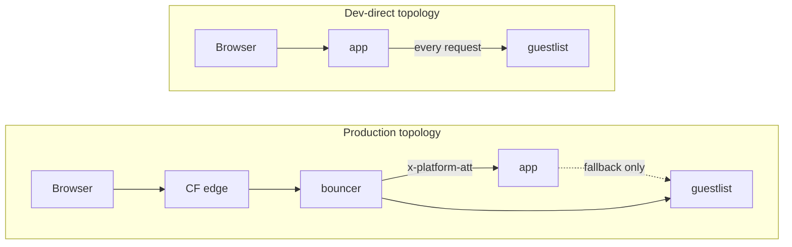

**What the app does differently.**

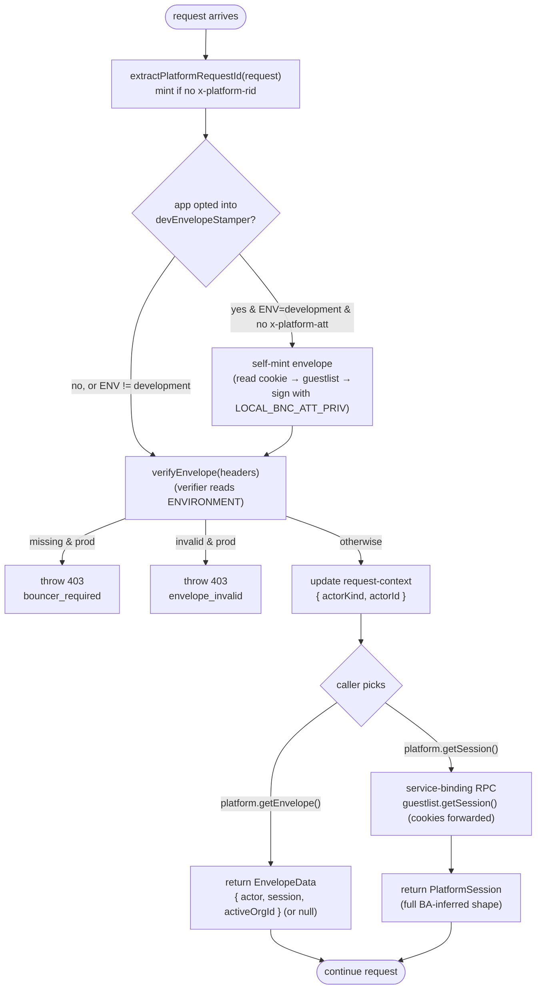

The verifier is the entire dev/prod story. Apps don't have `if (ENVIRONMENT === ...)` branches in their own code — `getEnvelope()` and `getSession()` both feed off the same precondition. Which one the caller invokes is a per-route choice based on whether BA-extended fields are needed.

**The `devEnvelopeStamper` opt-in.** Most TSS apps work fine with the "envelope absent → `getEnvelope()` returns null → `getSession()` cookie-authenticates via guestlist" path that the verifier already handles in dev. Some apps would need a _valid envelope on the inbound request itself_ before TSS or a downstream consumer ever runs — e.g. a Durable Object WS-upgrade handler that verifies the envelope directly on `ctx.request` (DOs have no TSS context) and would see a missing envelope and reject with `unauthenticated` in dev-direct topology without one.

- **Identity** does _not_ opt in — every identity request goes through TSS server fns or middleware, which fall back to cookie auth through guestlist; no consumer reads `ctx.request.headers["x-platform-att"]` directly.

When an app opts in, the kit's `createDevEnvelopeStamper` runs at the worker `fetch` boundary, _before_ TSS captures the H3 event. It reads the inbound `Cookie` header (via `@si/auth`'s `parseRequestCookies`), calls guestlist to resolve the session, signs an Ed25519 envelope with `LOCAL_BNC_ATT_PRIV` + `kid: "dev"`, and stamps the platform header contract onto a forwarded `Request`. **Hard no-op outside `ENVIRONMENT === "development"`** — the stamper short-circuits before doing any work and never touches the request. Production bouncer remains the sole minter; the well-known dev `kid` lives in `BOUNCER_ATTESTATION_KEYS` alongside real prod keys, so the verifier accepts dev-stamped envelopes locally but the kid would mean nothing in prod (no holder of the matching private key).

**Why this is safe in production.**

1. `ENVIRONMENT === "production"` is a strict string compare, no truthy fallback.
2. `BOUNCER_ATTESTATION_KEYS` is asserted non-empty when constructing the verifier in production — a misconfigured worker fails to boot, not silently fails open.
3. Apps have no public Custom Domain in production; they're reached only via service binding from bouncer. CI enforces this via wrangler-config linting (see §6.3).
4. `createDevEnvelopeStamper` is a hard no-op outside dev — even if an app ships `BNC_ATT_PRIV` in a non-dev wrangler secret store (it shouldn't), the stamper won't fire and won't sign anything.

**Why this works in development.**

1. No CF edge → no `cf-request-id` → app's entry shim mints one.
2. No bouncer → no `x-platform-att` on the wire. Two sub-cases:
   - Apps **without** `devEnvelopeStamper`: verifier returns `kind: "missing"` → `getEnvelope()` returns `null`; `getSession()` proceeds to its guestlist service-binding hop using cookies on the inbound request.
   - Apps **with** `devEnvelopeStamper`: the stamper self-mints from the cookie before the verifier runs, so the verifier sees a valid envelope just like in prod.
3. App's `GUESTLIST` service binding is wired in every environment's `wrangler.jsonc` (including dev) — `getSession()` always has somewhere to land, stamper or no stamper.

A developer pulls the repo, runs `bun install && bun run bootstrap && bun run migrate`, then `cd workers/identity && bun run dev` (or `bun run dev` from root to boot the whole stack), and sign-in works against a local guestlist — no bouncer involved.

## §4.6 WebSocket upgrades

Bouncer proxies WebSocket upgrades transparently. The attestation lives on the upgrade request headers; framed messages are not annotated.

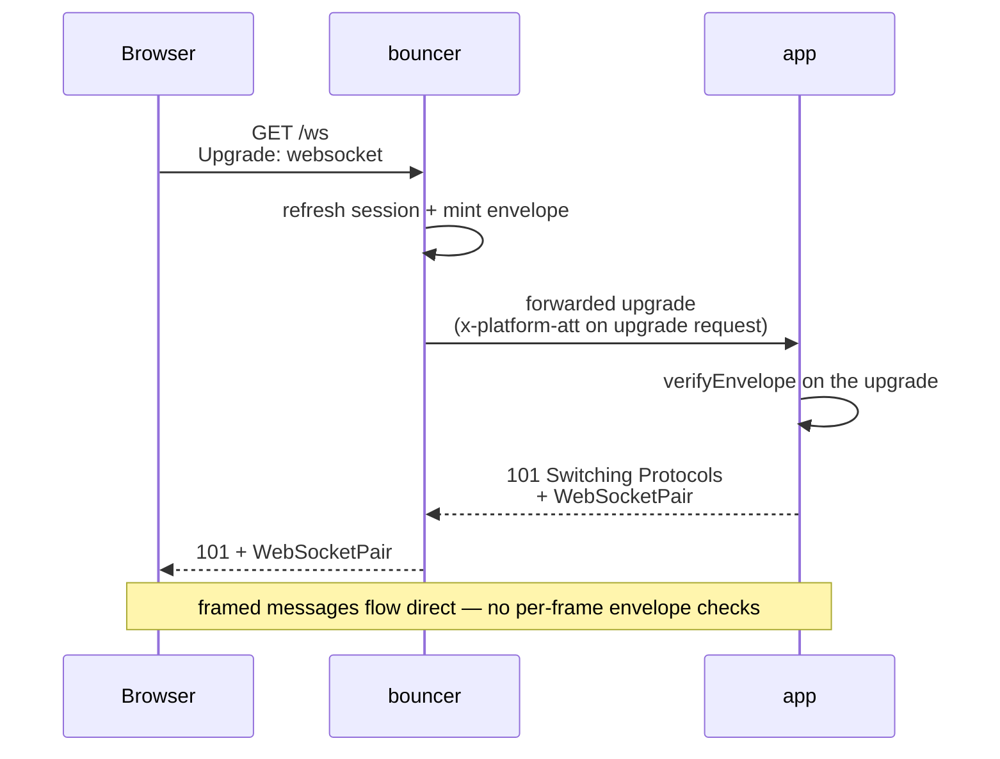

The actor is "frozen" at upgrade time. If the user's session is revoked mid-connection, the WebSocket stays open until the app closes it on its own logic. This matches the existing semantics of `getSession()` in route loaders — point-in-time identity.

## §4.7 Canonical logging

Every Worker emits **one canonical log line per request** at the boundary. Per-request `log.add({...})` calls accrue fields into a single ALS-scoped builder; the final line is JSON, contains the resolved actor + caller + request id + outcome + timings.

```ts
withRequestLog({ service: "identity" }, request, async (log) => {
  log.add({ route: "/dashboard" });
  // ... handler
  log.outcome("ok"); // or "internal_error", "http_404", etc.
  // single JSON line emitted on scope close
});
```

The shape is consistent across bouncer, guestlist, apps, roadie, promoter. Log aggregation (Workers Logs, Logpush) keys off `request_id` to join lines from different services for the same end-user request.

## §4.8 Product analytics (`@si/analytics`)

Product analytics is a single shared package, `@si/analytics`, that is the **only** place the PostHog SDKs are imported. A vitest guard (`packages/analytics/src/__tests__/vendor-boundary.test.ts`) walks `workers/` and `packages/` and fails if `posthog-node`, `posthog-js`, or `@posthog/react` is imported anywhere else — so every consumer reaches PostHog through this one seam. The package has exactly three public entry points: `@si/analytics/events` (an isomorphic, zero-dep typed event registry), `@si/analytics/client` (browser), and `@si/analytics/server`.

**Config is a committed constant, not a secret.** `packages/config/src/analytics.ts` exports `platformAnalyticsConfig = { token: "phc_…", host: "https://us.i.posthog.com" }` — the PostHog **write** key is public by design and is inlined into both the client and SSR bundles. There is no `POSTHOG_*` env var or wrangler secret. The only env-driven input is `ENVIRONMENT` (a wrangler `var`, surfaced to the bundle via each app's `vite.config.ts` `CLIENT_VARS` allowlist), which is stamped onto every event and drives the client dev kill-switch.

**Client model** (`packages/analytics/src/client.tsx`).

- `AnalyticsProvider({ app, environment, session, children })` mounts `@posthog/react`'s `PostHogProvider` plus an identity bridge. It is a **hard no-op in development** (`if (environment === "development") return children`), and configures cost-control defaults: `person_profiles: "identified_only"`, `autocapture: false`, `disable_session_recording: true`, SPA pageviews on history change.
- `useCapture()` returns a fully-typed `(event, props) => posthog.capture(...)` keyed on the `ClientEventProps` registry (`signed_in`, `signed_up`, `magic_link_requested`, `product_viewed`, `cart_item_added`, `checkout_started`, `checkout_failed`, …) — there is no stringly-typed capture. `useCaptureException()` wraps `captureException`.
- `AnalyticsIdentityBridge` drives `identify` / `group` / `reset` off session transitions: it `identify(user.id, …)` on sign-in (resetting first on an A→B person switch, which posthog-js requires), `group("organization", …)` when the session has an active org, and `reset()` on sign-out/expiry. `is_customer` is set as a derived boolean (`stripeCustomerId != null`) — the raw Stripe id is never sent.

**Server model** (`packages/analytics/src/server/`). The server surface deliberately exposes **no** `capture(distinctId, …)` — "a server event on the wrong person is not representable at any call site." Instead `makeAnalyticsEvent({ app, requireAuth, environment })` returns a TanStack **function-middleware** factory `analyticsEvent(event, derive?)` that (1) composes the app's auth gate, (2) runs the wrapped handler, then (3) derives properties from `{ session, data, result }` and delivers with `distinctId` **forced** to `session.user.id`. A thrown handler (failure/redirect) emits nothing; a `null` derive result is a clean skip. Store mounts exactly one — `order_placed` on the `placeOrder` server fn — so a single middleware line both auth-gates and instruments. `serverAnalytics(app, env).captureAnonymous(...)` covers the rare genuinely-anonymous server metric.

**Execution-context flushing — why it exists.** A Worker isolate can be frozen the instant it returns a `Response`, dropping any in-flight PostHog POST. The delivery layer (`packages/analytics/src/server/delivery.ts`) builds a module-singleton `posthog-node` client with `flushAt: 1, flushInterval: 0` (no background timer — timers don't survive an isolate) and sends each event via `captureImmediate`, whose returned promise **is** the flush unit. To keep the isolate alive for that promise without adding request latency, delivery reads an `ExecutionContext` out of an `AsyncLocalStorage` seeded at the worker `fetch` boundary:

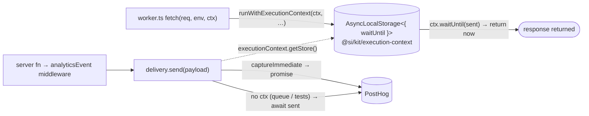

`@si/kit/execution-context` is tiny — it exports the `executionContext` ALS, `runWithExecutionContext(ctx, fn)`, and a structural `WaitUntilContext = { waitUntil }` (so kit needs no `@cloudflare/workers-types` dependency). Both SSR workers (`store`, `identity`) wrap their whole request in it; the store `queue()` consumer does **not**, so analytics emitted from a queue path take the `await sent` branch and are never dropped.

**Consumers.** Store mounts `AnalyticsProvider app="store"` (SPA pageviews + `product_viewed` / `cart_item_*` / `checkout_*` client events + the `order_placed` server event). Identity mounts `AnalyticsProvider app="identity"` (auth-lifecycle client events: `signed_in`, `signed_up`, `magic_link_requested`, `password_changed`, `account_deleted`, `signed_out`; no server-side capture). **Guestlist has no analytics** — it is a backend auth worker with no SSR root and no PostHog dependency or execution-context wrapper.

---

# §5 — Adding a new app

The 90% case is a TanStack Start app. The non-Start path is a documented 10% case for when you need to drop in a Hono or plain-Workers app.

## §5.1 Adding a TanStack Start app

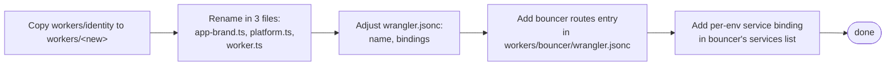

**The required edits.** The fastest way to start is `cp -r workers/identity workers/<new>` and edit. Most files only need the app name swapped; the load-bearing pieces are:

1. `workers/<new>/src/lib/platform.ts` — wires the platform object. Identity's version is ~10 code lines + a 16-line comment explaining the `createServerOnlyFn` bundle-leakage constraint; copy it verbatim and change the `name`:
   ```ts
   export const platform = createPlatformStartApp({
     name: "<new>",
     getGuestlist,
     guestlistFetcher: guestlistFetcher as () => typeof fetch,
     getEnvironment: createServerOnlyFn(() => env.ENVIRONMENT),
     expectedHost: createServerOnlyFn(() => new URL(env.<NEW>_URL).hostname.toLowerCase()),
   });
   export const { getSession, getEnvelope, getActiveOrgId, envelopeMiddleware, apiProxyHandlers } = platform;
   ```
2. `workers/<new>/src/lib/session.functions.ts` — copy verbatim (TSS-compiler constraint that the `createServerFn` call lives at module top-level):
   ```ts
   import { createServerFn } from "@tanstack/react-start";
   import { getRequestHeaders } from "@tanstack/react-start/server";
   import { platform } from "@/lib/platform";
   export const loadSession = createServerFn({ method: "GET" }).handler(() =>
     platform.getSession(getRequestHeaders()),
   );
   ```
3. `workers/<new>/src/worker.ts` — copy identity's hand-written entry verbatim. Do **not** wrap this in a kit factory (see §3.3 / §4.4 — HMR breaks). The full file is ~10 code lines plus a 21-line comment block that future-you will thank you for:

   ```ts
   import startEntry from "@tanstack/react-start/server-entry";
   import { extractPlatformStartContext } from "@si/kit/react-start";

   declare module "@tanstack/react-start" {
     interface Register {
       server: { requestContext: { requestId: string; callerApp?: string } };
     }
   }

   export default {
     async fetch(request: Request): Promise<Response> {
       return startEntry.fetch(request, { context: extractPlatformStartContext(request) });
     },
   } satisfies ExportedHandler<Env>;
   ```

4. `workers/<new>/src/routes/api/$.ts` — handlers + request-context header seeding for guestlist correlation. Copy identity's file (~30 code lines).
5. `workers/<new>/src/lib/auth-context.ts` + `lib/guestlist.ts` — thin wrappers around `createReactStartAuthProvider` and `createGuestlistFactory` respectively. ~10 lines each; copy from identity.
6. `workers/<new>/src/app-brand.ts` — set `APP_PRODUCT_NAME`.
7. `workers/<new>/wrangler.jsonc` — name, service bindings to `GUESTLIST` (+ `ROADIE`, `PROMOTER` if used). Apps must have `workers_dev: false` and no `routes`/`custom_domain` — bouncer owns the public hostname.
8. `workers/bouncer/wrangler.jsonc` — add a `services` binding entry for the new app and a `ROUTES` entry mapping a path mount on the shared host (e.g. `/<new>`) to the new binding, in `passthrough` or `vmf` mode as appropriate.

Apps that need an envelope on the inbound `Request` itself in dev (see §4.5) additionally pass `devEnvelopeSigner` + `devEnvelopeGuestlist` to `createPlatformStartApp` and call the returned `devEnvelopeStamper` from their worker `fetch` before TSS runs.

Total: ~50 code lines + ~80 lines of load-bearing comment across 8 files, of which ~5 are app-name string substitutions.

## §5.2 Adding a non-TanStack-Start app

A non-Start app composes the same framework-agnostic primitives directly. The canonical entry looks like:

```ts
import { createBouncerEnvelopeVerifier, PLATFORM_HEADERS } from "@si/auth";
import { createGuestlistClient } from "@si/guestlist-service/client";
import { withRequestContext, extractPlatformRequestId } from "@si/kit/request-context";
import { withRequestLog } from "@si/kit/log";
import { BOUNCER_ATTESTATION_KEYS } from "@si/config";

const verifyEnvelope = createBouncerEnvelopeVerifier({
  keys: BOUNCER_ATTESTATION_KEYS,
  env: env.ENVIRONMENT,
  expectedHost: (req) => new URL(req.url).hostname.toLowerCase(),
});

export default {
  async fetch(request: Request, env: Env, ctx: ExecutionContext) {
    const rid = extractPlatformRequestId(request);
    return withRequestContext({ requestId: rid }, () =>
      withRequestLog({ service: "<name>" }, request, async (log) => {
        const result = await verifyEnvelope(request);
        // result.kind === "valid"   → result.actor and result.session are
        //                              both present, or both null (verifier
        //                              enforces actor ⟺ session invariant)
        // result.kind === "missing" → no x-platform-att (dev/staging only;
        //                              prod throws 403 inside the verifier)
        // result.kind === "invalid" → tampered or expired (same)
        // For full BA session metadata, call guestlist over the service
        // binding the same way TSS apps do — cookies on the inbound request
        // flow through bouncer unchanged.

        // ... your framework's routing here (Hono, plain handlers, etc.)
        return new Response("ok");
      }),
    );
  },
} satisfies ExportedHandler<Env>;
```

Everything else (config, secrets, bouncer wiring) is the same as the TSS path. The app gets a wrangler config, a service binding to guestlist, a bouncer route — identical infrastructure.

---

# §6 — Config & Secrets

## §6.1 Config split

A small set of files owns the platform's branding and deploy surface.

| File                                         | What lives here                                                                                                                                                                  | When you edit it                                          |
| -------------------------------------------- | -------------------------------------------------------------------------------------------------------------------------------------------------------------------------------- | --------------------------------------------------------- |
| `packages/config/src/brand.ts`               | `brand.{name, short, supportEmail}`; `cookies.prefix`; `auth.{providerId, passkeyRpName, twoFactorIssuer}`                                                                       | Once per fork. Sets the visible identity of the platform. |
| `packages/config/src/deploy.ts`              | `baseDomain`, `devDomain`, `workerPrefix`, `cloudflareAccountId` — code-consumed values only. Per-env D1 ids, routes, and domains live in each worker's `wrangler.jsonc` (§6.2). | Once per fork.                                            |
| `packages/config/src/bouncer-attestation.ts` | `BOUNCER_ATTESTATION_KEYS` — `kid → public-key` map                                                                                                                              | On Ed25519 key rotation (see §6.4).                       |
| `workers/<app>/src/app-brand.ts`             | `APP_PRODUCT_NAME` per app (each app is its own product)                                                                                                                         | Once per app.                                             |

These files cover every brandable / deployable constant in the platform. **Anything that needs branding reads from `@si/config`** (or from the app's local `app-brand.ts`). No platform-name literal lives outside these files.

## §6.2 Wrangler configs

Each service/app has one checked-in `wrangler.jsonc` (source, not generated): the top level is staging and the single `env.production` block is the production deploy. Domain/account/id/name literals live directly in these files; `packages/config/src/deploy.ts` retains only the values that runtime/build/test code imports (baseDomain, devDomain, workerPrefix, cloudflareAccountId).

There is no render step. `wrangler deploy` (no `--env`) ships staging; `wrangler deploy --env production` ships production; local dev runs against the staging top level with `.dev.vars` overrides. After editing a `wrangler.jsonc` or `deploy.ts`, regenerate per-service worker types: `cd <service> && bun run types`.

## §6.3 Secrets matrix

| Secret                                      | Per env | Holder             | Purpose                                                                                                              |
| ------------------------------------------- | ------- | ------------------ | -------------------------------------------------------------------------------------------------------------------- |
| `BETTER_AUTH_SECRET`                        | yes     | **guestlist only** | Better Auth cookie signing. Single holder by design — no app holds it.                                               |
| `BNC_ATT_PRIV`                              | yes     | **bouncer only**   | Ed25519 private key for envelope signing. Single secret, single rotation point.                                      |
| `RESEND_API_KEY`                            | yes     | promoter           | Outbound email.                                                                                                      |
| `S3_ACCESS_KEY_ID` / `S3_SECRET_ACCESS_KEY` | yes     | roadie             | R2 SigV4 credentials.                                                                                                |
| OAuth client id/secret pairs                | yes     | guestlist          | Google, Microsoft, Facebook, LinkedIn — wired conditionally.                                                         |
| `STRIPE_SECRET_KEY`                         | yes     | guestlist + store  | Stripe Billing API. **Optional/additive** — absent = no-Stripe fallback (§7).                                        |
| `STRIPE_WEBHOOK_SIGNING_SECRET`             | yes     | guestlist + store  | Webhook signature verification. Both must be present for a worker's Stripe surface to activate (`stripeConfigured`). |

Both Stripe secrets are unset in every env today; guestlist's better-auth Stripe plugin stays out of the plugin array and store's `/hooks/store` returns `503` until they are provided (§7). Guestlist's webhook-secret var is named `STRIPE_WEBHOOK_SIGNING_SECRET` here (the better-auth plugin's own reader is `STRIPE_WEBHOOK_SECRET` — see the exec-plan for the two-listener split).

Things that are **not secrets** (public values, committed to repo or `vars`):

- `BETTER_AUTH_URL`, `IDENTITY_URL`, `STORE_URL`, `AUTH_DOMAIN` — public URLs.
- `EMAIL_FROM` — the From: address (the API key is the secret).
- `BOUNCER_ATTESTATION_KEYS` — public-key set; lives in `packages/config/src/bouncer-attestation.ts`.
- **PostHog `token` + `host`** — the PostHog **write** key is public by design; committed as `platformAnalyticsConfig` in `packages/config/src/analytics.ts` and inlined into bundles (§4.8). Not a secret, not an env var.
- D1 ids, account ids — non-sensitive identifiers.

## §6.4 Rotation runbooks

### `BETTER_AUTH_SECRET` (guestlist)

Single-holder rotation is one command and one moment of session invalidation:

```sh
echo "$(openssl rand -base64 32)" | \
  bunx wrangler secret put BETTER_AUTH_SECRET --env production --cwd workers/guestlist
```

Every active session is invalidated. Users sign in again. No coordination across services needed (because the secret only lives in guestlist).

### `BNC_ATT_PRIV` (bouncer, with overlap window)

Public-key publication is via committed code, so rotation is a code change + a secret rotation in sequence:

1. Generate keypair: `openssl genpkey -algorithm ed25519 -out priv.pem; openssl pkey -in priv.pem -pubout -out pub.pem`.
2. **PR #1** — add new `kid: pub.pem` entry to `BOUNCER_ATTESTATION_KEYS` (both old + new in the set). Deploy all apps.
3. **PR #2** — `wrangler secret put BNC_ATT_PRIV` on bouncer with the new private key. Update `BNC_ATT_KID` env var on bouncer to the new kid. Deploy bouncer. From this moment, bouncer signs with the new kid; apps accept both during the overlap.
4. **PR #3** — drop the old `kid` from `BOUNCER_ATTESTATION_KEYS`. Deploy apps. Old envelopes (max 30s lifetime) are gone by then.

No flag day. The overlap window is bounded by the envelope's `exp` (30s), not by deploy coordination.

---

# §7 — Billing ingestion (Stripe)

Billing is **optional, additive infrastructure**. Every worker boots, typechecks, tests, and runs `bun run dev` (any subset) with **zero** Stripe — no CLI, no API key, no webhook secret. When Stripe config is present a surface lights up; when absent it degrades to a no-Stripe fallback that already exists. The single predicate is `stripeConfigured(secretKey, webhookSecret)` (`packages/stripe/src/gate.ts`, imported via the dependency-light `@si/stripe/gate` subpath): `Boolean(secretKey && webhookSecret)`. **Absence is a branch, never a throw.**

There are **two disjoint webhook listeners** — deliberately separate Stripe event destinations with separate signing secrets, so neither double-handles the other's events:

1. **Commerce** → store's `/hooks/store` — verify, enqueue to a Cloudflare Queue, return `200`, and process asynchronously + idempotently with a DLQ. This is the pipeline that is **implemented** (exec-plan `0002`, phase P1). It is the subject of most of this section.
2. **Subscriptions** → guestlist's `/api/auth/stripe/webhook` — the `@better-auth/stripe` plugin verifies and mutates its own `subscription` table **in-request**. Present but **dormant** — see the end of this section.

## §7.1 The commerce pipeline

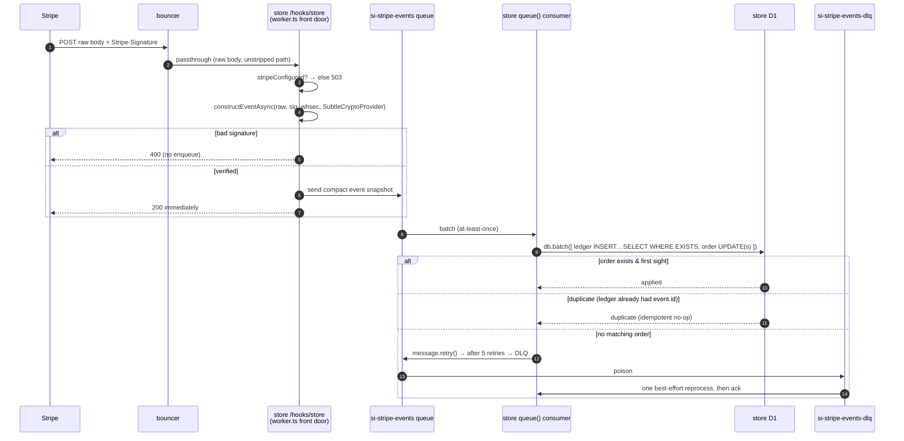

**The front door is dumb by design** (`workers/store/src/lib/stripe-webhook.ts`, `handleStoreStripeWebhook`). `worker.ts` short-circuits the path `STORE_STRIPE_WEBHOOK_PATH = "/hooks/store"` **before** SSR and before the analytics execution context, because signature verification needs the **raw** request body (`await request.text()`, never `.json()`). Order of checks and their status codes are load-bearing:

- not `stripeConfigured` → `503 { error: "stripe_unconfigured" }`.
- missing `stripe-signature` header → `400 { error: "missing_signature" }`.
- verify with `stripe.webhooks.constructEventAsync(raw, sig, whsec, undefined, Stripe.createSubtleCryptoProvider())` — the **async, WebCrypto** verifier (sync `constructEvent` uses Node crypto and won't run on Workers); any throw → `400 { error: "invalid_signature" }`.
- queue binding absent (e.g. a preview build with `queues` stripped) → `503 { error: "queue_unconfigured" }` — checked _after_ signature so unsigned requests still `400` first.
- enqueue then `200 { ok: true }`.

What gets enqueued is a **compact snapshot**, not the full event: `{ id, type, created, livemode, objectId?, payment_status? }`. Carrying `payment_status` lets the consumer settle the order **without a network re-fetch** in the common case.

## §7.2 Queue infrastructure

Store is the **only** worker that binds Cloudflare Queues. Per env (`workers/store/wrangler.jsonc`, staging top-level + `env.production`):

| role                  | binding / queue                            | dead-letter                  | max_retries |
| --------------------- | ------------------------------------------ | ---------------------------- | ----------- |
| producer              | `STRIPE_EVENTS` → `si-stripe-events-{env}` | —                            | —           |
| main consumer         | `si-stripe-events-{env}`                   | `si-stripe-events-dlq-{env}` | 5           |
| terminal DLQ consumer | `si-stripe-events-dlq-{env}`               | _(none)_                     | 0           |

Both the main queue and the DLQ point at the **same** worker's `queue()` handler; routing is by queue-name regex `DLQ_QUEUE_PATTERN = /-dlq-/` (`stripe-queue.ts`). The main consumer (`consumeStripeEventBatch`) fans out per-message with `Promise.all`, each wrapped in try/catch: `ok → message.ack()`, retryable → `message.retry()`, thrown → log + `retry()`. The terminal DLQ consumer (`processDlqBatch`) does one best-effort reprocess then **unconditionally acks** — a stuck event surfaces a triage log line (`stripe_dlq_reprocess_failed`) instead of silently ageing out.

## §7.3 Atomicity & idempotency

Both Stripe **and** Cloudflare Queues deliver **at-least-once**, so idempotency is enforced once, in the consumer, keyed on `event.id`. The ledger table `processed_stripe_event` (`event_id` PK, `event_type`, `processed_at`) and the order UPDATE(s) commit **together in one `db.batch(...)`** (a D1 batch is a single atomic transaction), so you can never record "processed" without applying, or apply without recording:

```ts
// EXISTS-gated ledger insert: only records the event when a matching order exists,
// so a no-match event records nothing and a later redelivery still applies.
const ledgerInsert = db
  .insert(processedStripeEvent)
  .select(
    sql`select ${message.id}, ${message.type}, ${Date.now()} where exists (
        select 1 from ${customerOrder}
        where ${customerOrder.stripeCheckoutSessionId} = ${objectId})`,
  )
  .onConflictDoNothing();

const results = await db.batch([ledgerInsert, ...mutations]);
```

Outcome is classified from each statement's `meta.changes` with **no extra round-trip** — a 4-way result `applied | duplicate | ignored | retryable`:

- `orderChanges === 0` → **retryable** (no order carries this session id — see §7.5).
- `ledgerChanges === 1` → **applied** (first sight).
- else → **duplicate** (order present, ledger already had `event.id`; the idempotent UPDATE re-ran harmlessly).
- unrecognized event type / wrong livemode → **ignored** (acked).

The event-type `switch` in `buildEventMutations` **is the allowlist** — recognition and dispatch are one path. Order-state guards live in SQL `CASE` expressions evaluated against pre-update values, so out-of-order terminal states are never clobbered (e.g. `checkout.session.completed` advances `payment_status` only `when payment_status = 'unpaid'`). Correctness-critical state is trusted from the snapshot's `payment_status`, matching Stripe's "don't trust a thin/stale payload" guidance for the fields that matter.

## §7.4 livemode gating

`expectedLivemode = env.ENVIRONMENT === "production"`. **Production processes only `livemode:true`; every other env (staging/dev/CI) only `livemode:false`.** A wrong-mode event is permanently inapplicable, so it is recorded in the ledger (to stop redelivery re-warnings) but **no order is touched**, and it returns `ignored`.

## §7.5 What is deferred (current state)

Checkout Session **creation** is not wired: a repo grep for `sessions.create` / `createCheckoutSession` in `workers/store/src` returns zero call sites. Storefront checkout runs the **manual pending→paid stub** (`placeOrder`). Because no order carries a `stripe_checkout_session_id`, the EXISTS gate never matches today, so every _real_ commerce event returns `retryable`, retries 5×, and drains to the DLQ. This is intentional and forward-compatible: no ledger row is written until an order matches, so once session-creation lands, Stripe redeliveries apply cleanly.

The **subscription** listener is likewise dormant. `packages/auth/src/server.ts` builds the `@better-auth/stripe` plugin **outside** the plugins array and spreads it in only when `opts.stripe` is set; `workers/guestlist/src/auth-config.ts`'s `buildStripeOptions(env)` returns `undefined` unless `stripeConfigured(...)`. With no env setting the secrets, the plugin **never enters the array** — auth behavior is byte-identical to a no-Stripe build.

## §7.6 The `@si/stripe` IaC package

`@si/stripe` is the dormant billing IaC + codegen package. `src/config.ts` is the product/price source of truth (one `member` product, one `member_monthly` price placeholder). Three scripts drive Stripe as code:

- **`scripts/fetch.ts`** (read-only) generates the gitignored `src/generated.ts` id map. **Without a key it writes a typed empty-string stub and exits 0 before importing the Stripe SDK** — this is what lets a keyless clone / CI typecheck.
- **`scripts/sync.ts`** is the write path: idempotently create/update products (matched by `metadata.config_key`, never by name), create prices (immutable), 5 s abort window on `sk_live_`.
- **`scripts/validate.ts`** is the CD drift-guard: reports missing resources, field drift, and **orphans** (managed in Stripe but absent from config, unless `archived`) — fatal, because Stripe products/prices are permanent (archive-only).

The codegen is a `vp` task-graph node (`packages/stripe/vite.config.ts`): the `typecheck` task chains `bun run fetch` before `tsgo --noEmit` so typecheck always sees a stub consistent with current config. Anything bundling code that imports `@si/stripe` depends on `@si/stripe#codegen`.

## §7.7 Invariants

- **INV — server-authoritative.** No client-reported amount or client-reported success mutates order state; only webhooks + server-side truth do.
- **INV — signature is the gate.** Every webhook (both listeners, all envs) is verified with `constructEventAsync` + the endpoint's `whsec` before any side effect.
- **INV — idempotent.** Replayed events (Stripe or Queues redelivery) cause no duplicate side effects, enforced on `event.id` in `processed_stripe_event`.
- **INV — decoupled.** No worker's boot, `bun run dev`, typecheck, test, or build depends on any Stripe key/secret/CLI existing. Enforced in CI, which has no Stripe.
- **INV — no new guestlist tables.** Only better-auth's own plugin tables (`subscription`, `user.stripeCustomerId`) are Stripe-related in guestlist; the store's commerce tables live in store's D1.

> **Provisioning gap (current state).** The queue infrastructure exists in code but has **no provisioning automation and no runbook** — `si-stripe-events-*` and the DLQs must be created out-of-band per env before store deploys (`scripts/provision/all.ts` is `tokens → d1 → r2 → access → email`, with no queue step). Store's Stripe secrets are also not seeded by `workers/store/scripts/env-init.ts`, so a fresh clone's `/hooks/store` is `503` locally. Both are tracked in `docs/ops/env-vars.md` "Known inconsistencies".

---

# §8 — Release engineering & CI/CD

CI/CD runs entirely on **RWX** (a dependency-graph CI runner) with **Captain** (test parsing + flaky-test retries), configured under `.rwx/` and `.captain/config.yml`. There is no GitHub Actions. Deploys are single-account Cloudflare, wrangler-driven.

**The fleet + the canonical deploy order** (identical in every lane and script):

```
promoter  roadie  guestlist  identity  store  bouncer   ← bouncer LAST
```

`promoter`/`roadie` are leaves (deploy first); `guestlist` binds them; `identity`/`store` bind guestlist; `bouncer` binds guestlist + identity + store and deploys **last** so the public router never points at an undeployed upstream (wrangler's binding-existence check would otherwise fail — CF error `10143`). The vendored `inbox` app is outside all lanes (manual `cd inbox && bun run deploy`).

## §8.1 The lanes

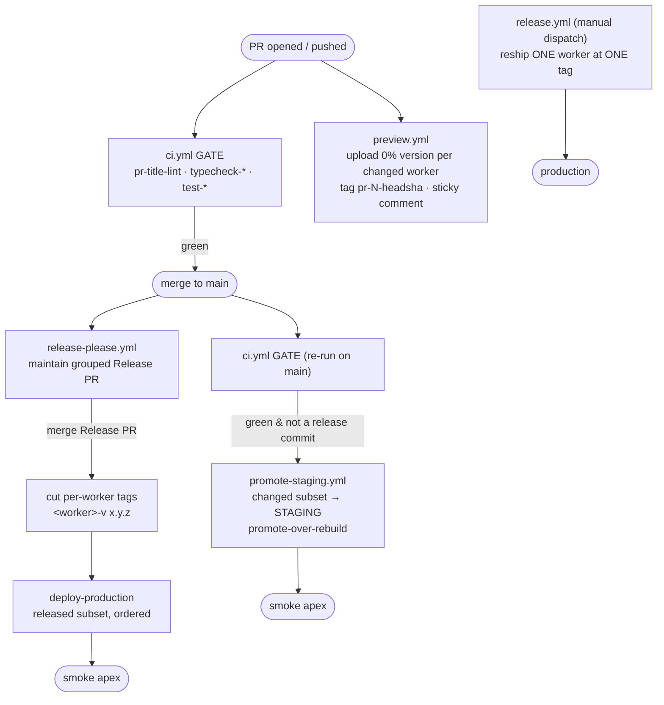

## §8.2 Gate — `.rwx/ci.yml`

One RWX graph does both the verification gate and (on push to main) the staging deploy. Triggers: `pull_request` (feature verification, sets `pr-title`), `push` to main only (post-merge verify + deploy), and `cli`. Setup tasks install a pinned toolchain (`git/clone`, `install-captain`, `bun-v1.3.11`, **node 24.16.0** — required because vitest-pool-workers deadlocks under bun and wrangler's bin no-ops under bun), then `install` (`bun install --frozen-lockfile --ignore-scripts`), `bootstrap` (`vp run -r env:init`), and `types` (`bun run types` → per-worker `worker-configuration.d.ts`).

Gate tasks, all content-cached via per-task `filter`:

- **`pr-title-lint`** (PRs only) — conventional-commit regex on the PR title. Squash-merge makes the title the main-branch commit message, and release-please silently drops commits it can't parse, so a non-conforming title fails the PR.
- **14 `typecheck-<pkg>` tasks** — each `use: types`, `cd <pkg> && bun run typecheck` (`tsgo --noEmit`). `typecheck-stripe` first runs `bun run fetch` to materialize the `@si/stripe` stub.
- **8 `test-<pkg>` tasks** — each `captain run si-<pkg> --print-summary`, emitting `.captain-out/<pkg>.rwx.json`. Workerd-pool suites (`bouncer`, `guestlist`, `roadie`, `store`) add `use: node`.
- **`gate`** — an aggregation node `after:` all typecheck + test tasks (the single "all green" edge the deploy hangs off).

The `filter` cache is the efficiency lever: change one app → only its 1–2 tasks re-run; change a shared package, `bun.lock`, or one of the RPC-producer workers (`guestlist`/`promoter`/`roadie`, which export types workspace-wide) → everything re-runs.

## §8.3 Staging on merge — `.rwx/promote-staging.yml`

Fires only on push-to-main, `after: gate`, and **skipped on release commits** (`chore: release …` — that app code already staged when the feature PRs merged). It computes the **changed subset**: `scripts/changed-workers.sh` reads the `git compare` file list (base = `event.github.push.before`) and maps files → workers in canonical order (a change under an RPC-producer worker or `packages/**`/lockfile fans out to the whole fleet; a docs/CI-only change touches nothing; unknown → conservative all).

**Promote-over-rebuild:** rather than rebuilding, `scripts/promote-staging.sh` reuses the exact version artifact `preview.yml` already uploaded on the PR and flips it to 100%. Per worker, in canonical order: (1) **migrate first** (`deploy-worker.sh migrate`); (2) if the worker's `wrangler.jsonc` changed → **full deploy** (config/binding/route changes can't ride a version); (3) else resolve the merged PR, build tag `pr-<n>-<pr_head_sha>`, find the newest matching uploaded version and `wrangler versions deploy <id>@100%`; (4) on any miss → fall back to full deploy. Then a GitHub Deployment record + `smoke-test.sh` against the apex.

## §8.4 Production — `.rwx/release-please.yml`

release-please runs in **manifest mode, one component per worker** (`release-please-config.json`, `release-type: simple`, `include-component-in-tag`, tags shaped `<worker>-v<x.y.z>`), producing **one grouped Release PR** titled `chore: release main`. The production deploy is folded into this same run (a single Release-PR merge can cut tags for several workers at once; per-tag deploy runs would race and break bouncer-LAST ordering). Four tasks:

1. `release-please-pr` — open/update the grouped Release PR from conventional commits.
2. `release-please-github-release` — on a merged Release PR, cut the per-worker `<worker>-v*` tags + GitHub Releases.
3. `released-components` — derive which workers were actually released, reading tags via the **strongly-consistent git-refs API** filtered to refs whose object sha equals the trigger sha (not a live HEAD re-read, which could race). **Loud fail-safe:** a release commit that yields an empty released set is a fatal exit, not a silent no-deploy.
4. `deploy-production` — iterate the canonical order, skip any worker not released, and run `deploy-worker.sh ship <w> production` (migrate-then-deploy) each, then smoke the apex.

## §8.5 Preview & single-worker reship

- **`.rwx/preview.yml`** — per-PR preview versions. For each changed worker, `scripts/generate-preview-tasks.sh` emits a dynamic `upload-<w>` task that builds (identity/store with `SI_BUILD=1`, guestlist via `vp run build` for `@si/stripe` codegen), **strips any `queues` binding** from the built config (the preview token lacks Queues:Write), and `wrangler versions upload --tag pr-<n>-<sha> --preview-alias pr-<n>` at 0% traffic. A sticky PR comment tabulates the preview URLs. **These uploaded versions double as the promote-on-merge artifacts** (§8.3). The `si_preview` vault token is scoped to Workers Scripts:Write + Account Settings:Read only.
- **`.rwx/release.yml`** — manual single-worker reship / rollback (`rwx dispatch si-reship-worker --param worker=… --param tag=…`). The deliberate act of naming worker + tag is the approval; a bare run deploys nothing (`reship-gate`). Serializes against production via a shared capacity-1 pool.

## §8.6 The deploy primitive, smoke, and Captain

`scripts/deploy-worker.sh` is the **single source of truth** for per-worker mechanics, shared by every lane. `migrate` runs a worker's `db:migrate:<env>` only if it exists (**no `|| true` — a migration failure is fatal**); `deploy` stamps `WORKER_VERSION` + `WORKER_COMMIT` vars (surfaced by `@si/kit/version`); `ship` = migrate **then** deploy — the migrate-before-code invariant, "so a freshly-deployed worker never reads a schema the database doesn't have yet."

`scripts/smoke-test.sh <url>` hits `<url>/` up to 5×; **PASS on any `1xx`–`4xx`** (a 302 to sign-in is a healthy router), **FAIL on 5xx or `000`**. Always hits the public apex, so a leaf-only release is smoke-tested through the un-redeployed router.

Captain (`.captain/config.yml`) defines one `si-<pkg>` suite per test-bearing package, parses vitest JSON, and **retries only the failed test** (`retries.attempts: 2`, templated `{{ file }}` / `{{ testNamePattern }}`). Workerd suites use `npx vp` (node); pure-node suites use `bunx vp`.

Secrets live in two RWX vaults: **`si_deploy`** (main-locked — `CLOUDFLARE_API_TOKEN`, account id, the `rwx-automation-si` GitHub App token) and **`si_preview`** (unlocked — the narrow preview token). Deploy secrets are never pushed by CI; operators run `bun run secrets <env>` (§9).

> **Activation status (current state).** These lanes are scaffolding until the RWX GitHub App is installed and the vaults exist (runbook `docs/ops/rwx-setup.md`). Until previews are enabled, promote-staging safely falls back to full deploys.

---

# §9 — DevOps & Infrastructure-as-Code

## §9.1 The wrangler config model

Each worker has **one checked-in `wrangler.jsonc`** (source, not generated): the **top level is staging**, and a single **`env.production`** block is production. There is no `env.staging`. Cloudflare named environments **do not inherit** bindings/vars, so each `env.production` block **re-declares everything** — `name`, vars, D1, queues, services, routes, observability. Load-bearing details, uniform across all six workers:

- **Explicit production `name`** (`si-<worker>-production`) is mandatory — without it wrangler derives `si-<worker>-staging-production` (top-level name + `-production`), a brand-new worker.
- `workers_dev` / `preview_urls` **must be re-set to `false`** in production (those two _are_ inherited from the top level, unlike bindings).
- `observability` and `account_id` (the literal `c735c5a53d864bee37400befb7f4c7f4`) are re-declared/hardcoded in each block.

`wrangler deploy` (no `--env`) ships staging; `wrangler deploy --env production` ships production; local dev runs the staging top level with `.dev.vars` overrides. After editing a `wrangler.jsonc` or `deploy.ts`, run `cd <service> && bun run types`.

**`packages/config/src/deploy.ts`** holds only the **code-consumed** deploy constants — `baseDomain` (`somewhatintelligent.ca`), `devDomain` (`somewhatintelligent.localhost`), `workerPrefix` (`si`), `cloudflareAccountId`. JSONC can't import, so these are **duplicated as literals** into each `wrangler.jsonc` (the `si-` prefix, the account id). `deploy.ts` exists for the importers that _can_ read it (`@si/secrets` manifest, provision scripts, the bouncer/guestlist vitest configs). Per-env resource ids (D1 UUIDs, queue names) live **only** in each wrangler config. `brand.ts` holds code-consumed brand/cookie/auth-provider constants (not referenced by wrangler).

## §9.2 Binding inventory

| worker    | D1 (`DB`)            | Queues                                         | R2 / cron                       | other bindings                                                                                    |
| --------- | -------------------- | ---------------------------------------------- | ------------------------------- | ------------------------------------------------------------------------------------------------- |
| bouncer   | —                    | —                                              | —                               | services `GUESTLIST`, `IDENTITY`, `STORE` (plain); `routes` (apex)                                |
| guestlist | `guestlist-<env>-db` | —                                              | —                               | `PROMOTER` (entrypoint `Promoter`), `ROADIE` (entrypoint `Roadie`, `props.callerApp:"guestlist"`) |
| identity  | —                    | —                                              | —                               | `GUESTLIST` (plain)                                                                               |
| store     | `store-<env>-db`     | producer `STRIPE_EVENTS` + main + DLQ consumer | —                               | `GUESTLIST` (plain), `ROADIE` (entrypoint `Roadie`, `props.callerApp:"store"`)                    |
| roadie    | `roadie-<env>-db`    | —                                              | R2 `BLOBS`; cron `*/15 * * * *` | — (RPC target only, no public route)                                                              |
| promoter  | —                    | —                                              | —                               | prod-only `send_email` binding `EMAIL` (staging uses Resend)                                      |

Three workers own D1 (**guestlist, store, roadie**). **Store is the only queue producer/consumer.** **No worker uses Durable Objects** — the only `migrations`/`migrations_dir` keys are D1 migration directories, not DO migration tags. Any worker binding `ROADIE` **must** set `entrypoint: "Roadie"` + `props.callerApp`, or roadie's `readCallerApp` throws on every call (reads and uploads) — the silent-killer runbook is `docs/runbooks/roadie-r2-provisioning.md`.

## §9.3 Provisioning — rendered vars vs manual per-env

**Rendered/committed** (already in each `wrangler.jsonc`, no per-env action): `ENVIRONMENT`, all URLs, `AUTH_DOMAIN`, `PUBLIC_BASE`, `BNC_ATT_KID`, `EMAIL_PROVIDER`/`EMAIL_FROM`, roadie's `R2_BUCKET`/`R2_ACCOUNT_ID`, bouncer's `ROUTES` table, `account_id`.

**Manual / out-of-band per env:**

- **Secrets** — never pushed by CD. Operators run `bun run secrets <env>` (`@si/secrets`; manifest `packages/secrets/src/manifest.ts`, values in gitignored `.secrets/<env>.env`; runbook `docs/runbooks/SECRETS.md`). Sources: `devDefault` / `generate` (`BETTER_AUTH_SECRET`, prod `BNC_ATT_PRIV`) / `provided` (Resend, OAuth, R2 keypair, Stripe).
- **D1 databases** — must exist before migrations (`scripts/provision/d1.ts` find-or-create, or `wrangler d1 create` + paste UUID + `bun run types`).
- **R2 (roadie)** — the account-scoped S3 keypair secret **and** the bucket CORS policy for browser-direct PUTs (`workers/roadie/scripts/setup-cors.ts`; automated by `scripts/provision/r2.ts`).
- **Queues** — **manual, no automation** (§7). `scripts/provision/all.ts` is `tokens → d1 → r2 → access → email`; there is no queue step and no queue runbook yet.

The provision suite (`scripts/provision/`): `tokens.ts` (mints the `si-deploy` / `si-preview` / `si-access-admin` CF tokens), `d1.ts`, `r2.ts`, `access.ts` (Cloudflare Zero Trust Access apps + the `si-smoke` service token), `email.ts`, orchestrated by `all.ts`; plus `seed-users.ts`. Per-worker `scripts/env-init.ts` seeds only the `.dev.vars` keys that must differ from the staging wrangler values for local correctness (attestation dev keypair, blank R2/OAuth/Stripe placeholders, dev URLs).

Runbooks under `docs/runbooks/`: **`PRODUCTION-DEPLOY.md`** (release-please manifest releases, deploy order, migrate-before-code, apex smoke, prereqs checklist), **`roadie-r2-provisioning.md`** (the ROADIE entrypoint+props requirement + R2 keypair/CORS), **`SECRETS.md`** (`@si/secrets` model). The env-var contract table is `docs/ops/env-vars.md` — one table per worker plus cross-cutting/CI/CD; a new env var "is not done until it has a row there."

---

# §10 — Testing strategy

The toolchain is **vite-plus** (`vp`, a VoidZero distribution — `vp test`, `vp run -r <task>`, `vp check`) and **tsgo** (`@typescript/native-preview`) for typecheck. Tests fall in two tiers.

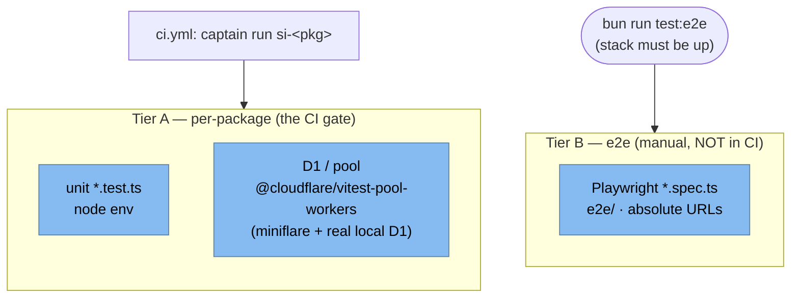

**Tier A — per-package unit + D1/pool.** Run by `vp test run` per package (root `bun run test` → `vp test`; CI → `captain run si-<pkg>`). D1 tests run inside **workerd via miniflare** against a **real local D1** using `@cloudflare/vitest-pool-workers`, with migrations read by `readD1Migrations(...)` and applied through `applyD1Migrations`. Two pool patterns coexist:

- **guestlist / roadie** wire `cloudflareTest(...)` **inline in `vite.config.ts`**, so their D1 tests are ordinary `*.test.ts` picked up by the default `vp test run` — and therefore **run in CI**.
- **store** uses a **separate `vitest.pool.config.ts`** with an `*.itest.ts` suffix and a `test:pool` script (its `wrangler.jsonc` carries service bindings miniflare can't boot, so the pool config declares bindings explicitly). Store's default `vite.config.ts` test block only globs `__tests__/**/*.test.ts`.

**Tier B — e2e.** Playwright specs (`*.spec.ts`) under `e2e/`, run by `bun run test:e2e`. **Not in CI** (no Playwright task in `.rwx/ci.yml`; `e2e/README.md` says so). Playwright starts nothing — the stack must be up (`bun run dev`); specs use **absolute URLs** (no `baseURL`) because the platform spans many subdomains. Real journeys live under `e2e/store/` (`browse-and-cart.spec.ts`, `checkout.spec.ts`, `admin.spec.ts`); `e2e/smoke.spec.ts` is a hermetic "is Chromium provisioned?" check.

**Naming keeps the runners from colliding:** vitest only ever globs `*.test.ts` (+ store's `*.itest.ts`); Playwright's `testDir` is `./e2e` and its specs are `*.spec.ts`, which vitest never sees.

**The typecheck gate.** `worker-configuration.d.ts` is generated by `wrangler types` per worker (deterministic — config-hash header, not a timestamp, so it cache-hits); CI runs a single `types` task then per-package `typecheck-<pkg>` (`use: types`). `vp run -r typecheck` is the workspace signal. Note the **per-file vs workspace `vp check` quirk**: the per-file checker reports ~50–250 phantom vitest-global errors inside `__tests__/`; workspace `bun run check` from root is the reference signal (worker configs also set `lint.ignorePatterns: ["__tests__/**/*"]`).

**Where new tests go** (lowest tier that can catch the bug):

- Pure Stripe logic (signature verify, event compaction, ack/retry dispatch) → Tier A unit — models already exist: `workers/store/__tests__/stripe-webhook.test.ts`, `stripe-queue.test.ts`, `stripe-dlq-consumer.test.ts`.
- Stripe behavior only provable against a real DB (idempotency ledger, atomic order mutation, livemode gate) → the D1/pool tier as `*.itest.ts` (`workers/store/__tests__/integration/stripe-events.itest.ts`).
- Analytics logic → Tier A unit in `packages/analytics/src/__tests__/` (`delivery.test.ts` mocks `posthog-node` + the execution-context ALS; `vendor-boundary.test.ts` enforces the single-import rule).
- Shared Stripe gating → `packages/stripe/__tests__/gate.test.ts`, `packages/auth/__tests__/stripe-gating.test.ts`.

> **CI-gate gap (current state).** The `si-store` Captain suite runs `vp test run --root workers/store` with **no `-c ./vitest.pool.config.ts`**, and nothing in `.rwx/ci.yml` / `.captain/config.yml` invokes `test:pool` or `.itest.ts`. So store's D1 pool tests (`place-order.itest.ts`, `stripe-events.itest.ts`, `constraints.itest.ts`) are a **locally-run tier, not part of the CI gate**. guestlist/roadie D1 tests _do_ gate in CI because they are plain `*.test.ts` in the single `vite.config.ts`. A claim of "all D1 constraints are gated in CI" holds for guestlist/roadie but not for store's `.itest.ts` suite.

---

# Appendix A — Topology decision matrix

When the platform is running, one of these topologies is in effect.

| Topology                                   | Where                                                                                     | What's in front of apps | Envelope present                            | Identity resolution                                                                                                                                          |
| ------------------------------------------ | ----------------------------------------------------------------------------------------- | ----------------------- | ------------------------------------------- | ------------------------------------------------------------------------------------------------------------------------------------------------------------ |
| **Production**                             | `<baseDomain>` (+ `www`) via CF Custom Domain, apps path-mounted (`/account`, `/shop`, …) | bouncer                 | always                                      | `getEnvelope()` = signed payload, no I/O. `getSession()` = guestlist service-binding RPC (cookies passed through bouncer). Verifier enforces.                |
| **Staging**                                | `staging.<baseDomain>` via CF Custom Domain (`workers_dev: false`), same path mounts      | bouncer                 | always                                      | same as prod (or dev fallback, see §4.1.4)                                                                                                                   |
| **Dev (full)**                             | `<devDomain>` via portless, same path mounts                                              | bouncer (run locally)   | always                                      | same as prod                                                                                                                                                 |
| **Dev-direct, no stamper** (e.g. identity) | `<host>.<devDomain>` via portless, or `127.0.0.1:<port>` via wrangler dev                 | nothing                 | never                                       | `getEnvelope()` returns `null` (verifier kind `missing` in dev). `getSession()` still hits guestlist over service binding via inbound cookies.               |
| **Dev-direct, with stamper**               | `<host>.<devDomain>` via portless                                                         | nothing                 | always (app self-mints at `fetch` boundary) | `createDevEnvelopeStamper` reads cookie → guestlist → signs with `LOCAL_BNC_ATT_PRIV`. Verifier accepts the dev-kid envelope just like prod; same code path. |

The `getEnvelope()` fast path costs nothing — JWS verify is sub-millisecond. The `getSession()` path costs one service-binding RPC, same in every topology that has a guestlist binding. The dev-stamper itself adds one guestlist RPC at the worker `fetch` boundary in dev only (no-op outside dev).

# Appendix B — Glossary

- **Guestlist** — the Worker that owns the user database and Better Auth. The sole authority on session validity.
- **Envelope** — the bouncer attestation, a JWS-compact value carried in `x-platform-att`. Signed with Ed25519. Lives 30 seconds. Payload: `{ actor, session, host, iat, exp, ... }` — narrow safe projection of the resolved BA session.
- **`EnvelopeData`** — the verified envelope's `{ actor, session }` pair, returned by `platform.getEnvelope()`. Narrow, signed, no I/O.
- **`PlatformSession`** — Better Auth's full plugin-inferred session, returned by `platform.getSession()` after a guestlist service-binding hop. Strict superset of `EnvelopeData`'s relevant fields.
- **Bouncer** — the single public-ingress Worker. Translates `cf-*` → `x-platform-*`. Mints envelopes.
- **Dev envelope stamper** — `createDevEnvelopeStamper` in `@si/kit/react-start`. Per-app opt-in factory that self-mints an envelope at the worker `fetch` boundary in dev-direct topology (hard no-op outside `ENVIRONMENT=development`). Identity doesn't need it.
- **Identity** (the app) — the reference TanStack Start app. Owns sign-in, sign-up, account, admin sessions surface.
- **Kid** — key id. A short string in the JWS header identifying which Ed25519 key signed the envelope. Allows key-set rotation. The well-known dev kid (`"dev"`) is committed alongside prod kids in `BOUNCER_ATTESTATION_KEYS`.
- **Platform contract** — the `x-platform-*` header family. The only privileged header set apps and services read.
- **Promoter** — the Worker that owns outbound email. Wraps Resend.
- **Roadie** — the Worker that owns blob storage. Wraps R2 with signed-URL minting.
- **Store** — the storefront + commerce TanStack Start app. Owns its own D1 and the only Cloudflare Queue infrastructure on the platform; hosts the Stripe commerce webhook pipeline (§7).
- **`/hooks/store`** — store's commerce webhook front door. Bouncer passthrough (raw body, unstripped path); verifies the Stripe signature, enqueues a compact event snapshot, returns 200.
- **`processed_stripe_event`** — store's idempotency ledger (`event_id` PK). Written atomically with the order UPDATE in one `db.batch(...)`; dedupes at-least-once redeliveries (§7.3).
- **DLQ** — dead-letter queue. `si-stripe-events-dlq-<env>`; a message that fails 5 main-queue retries lands here and gets one best-effort reprocess, then is acked. Routed by the name regex `/-dlq-/`.
- **`stripeConfigured`** — the single Stripe gate predicate (`@si/stripe/gate`): `Boolean(secretKey && webhookSecret)`. Absence branches to a no-Stripe fallback, never throws.
- **`@si/analytics`** — the only package that imports the PostHog SDKs; typed client + server capture, PostHog write token committed as a public `@si/config` constant (§4.8).
- **Execution-context flushing** — seeding Cloudflare's `ctx` into an ALS (`@si/kit/execution-context`, `runWithExecutionContext`) so `@si/analytics` can `ctx.waitUntil(captureImmediate)` the event without dropping it on isolate freeze or adding request latency (§4.8).
- **RWX / Captain** — the CI/CD runner (dependency-graph tasks in `.rwx/`) and the test-suite parser/retrier (`.captain/config.yml`). No GitHub Actions.
- **Promote-over-rebuild** — staging-on-merge reuses the exact `wrangler versions upload` artifact a PR's preview already built (tag `pr-<n>-<head-sha>`) and flips it to 100%, rather than rebuilding; full deploy is the fallback (§8.3).
- **release-please (manifest mode)** — per-worker components producing `<worker>-v<x.y.z>` tags from one grouped Release PR; merging it cuts tags and deploys the released subset in canonical order (§8.4).
- **vite-plus (`vp`) / vitest-pool-workers** — the test/build toolchain; the D1 test tier runs inside workerd+miniflare against a real local D1 (§10).
- **VMF** — virtual microfrontend; bouncer's `mode: "vmf"` rewrites HTML/CSS/Location/cookies when mounting an upstream app under a path prefix. `"passthrough"` (no rewriting) is used for mounts where the upstream is already prefix-aware, such as `/api` → guestlist. **Status:** implemented in `workers/bouncer/src/proxy.ts` and covered by `__tests__/routing.test.ts` + `__tests__/template-parity.test.ts`; the production route table uses `mode: "vmf"` for the `/account` (identity) and `/shop` (store) mounts.
