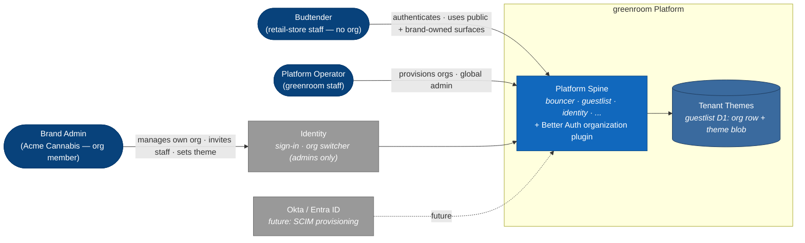
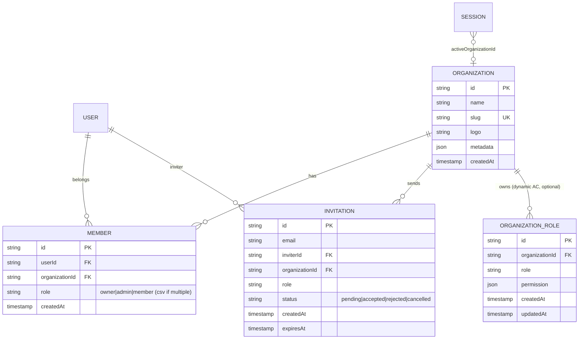
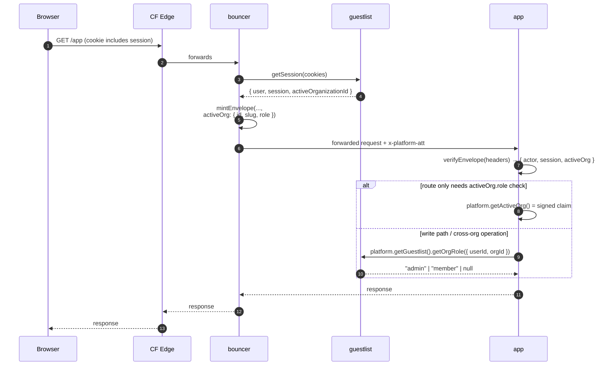
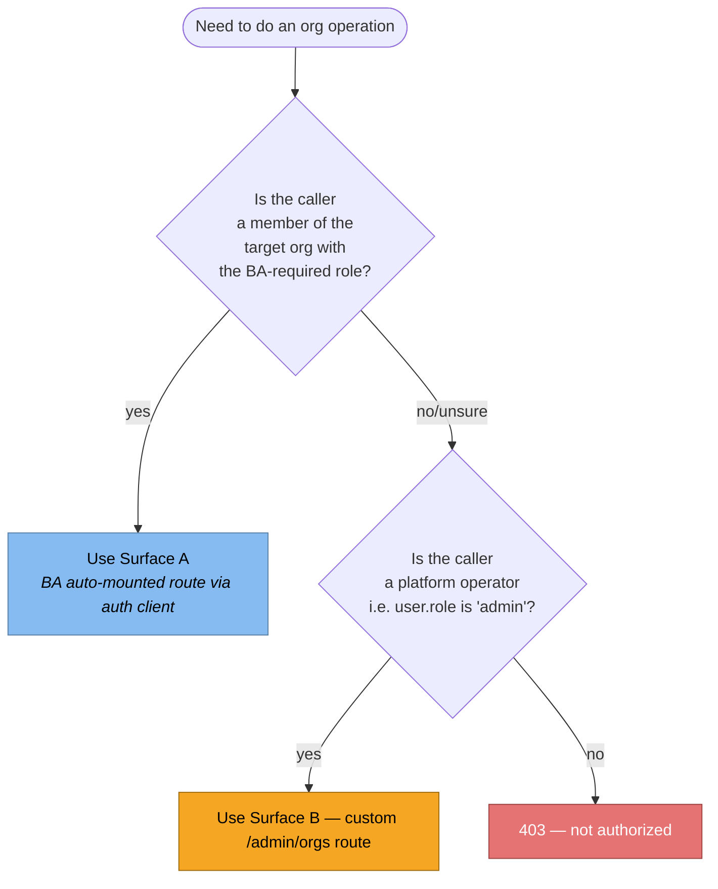
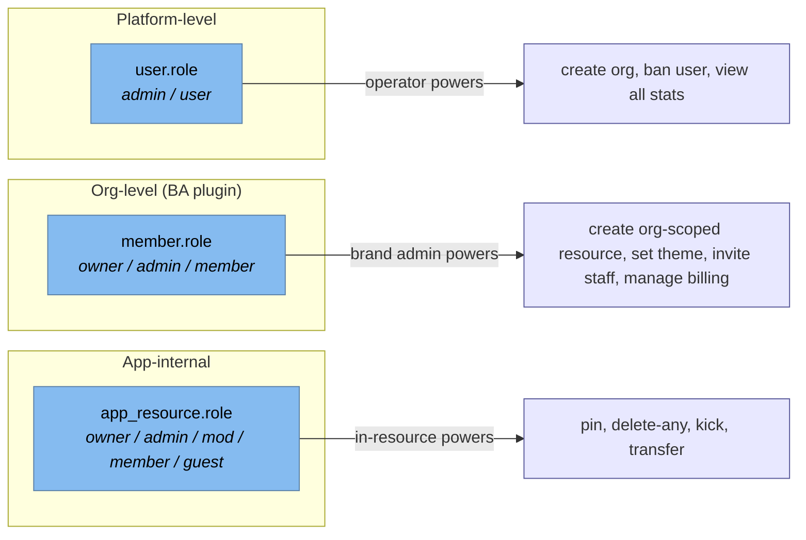
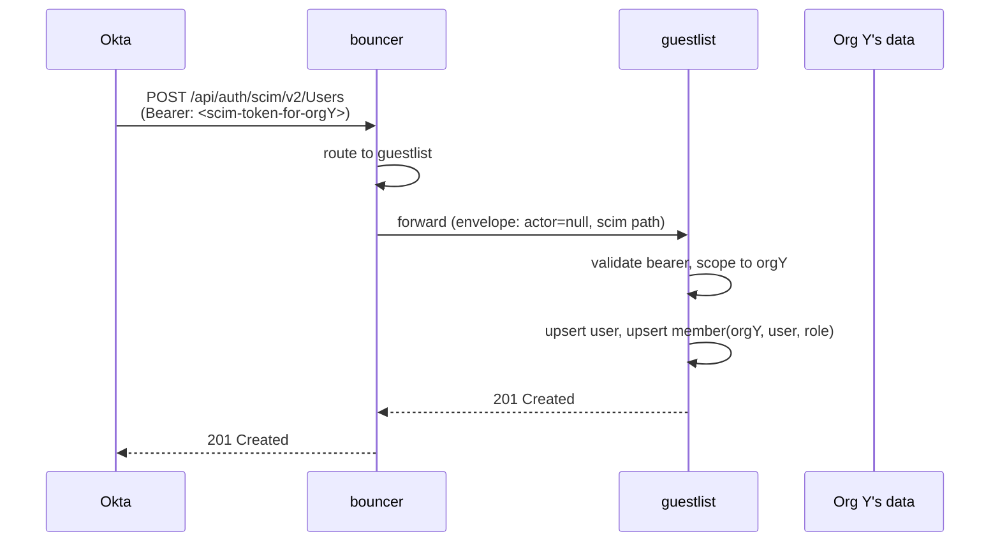

# Multi-Tenancy & White-Label

> **Status:** O-0 through O-11 shipped (multi-tenancy MVP).
> O-13 onward (theming, org logo, theme editor, OG, path-per-org bouncer,
> SCIM) is still target spec.

> **Amendment 2026-05-18** — implementation drifted from the original O-2
> and O-10 designs during the dedupe pass (commit `d030349`). Two surfaces
> were deleted as redundant with BA's native org plugin:
>
> - **O-2 `getOrgRole` guestlist sugar**: replaced by BA's native
>   `auth.organization.getActiveMemberRole({ query: { organizationId } })`,
>   exposed via the wired `organizationClient()` plugin in
>   `workers/guestlist/src/client/plugins.ts`.
> - **O-10 envelope shape**: originally `activeOrg: { id, slug, role } | null`
>   with a custom `/internal/active-org` route bouncer called on every
>   request. Cut to `activeOrgId: string | null` only. Bouncer reads
>   `session.activeOrganizationId` directly from BA's getSession response
>   (the org plugin enriches it). Slug + role are fetched on demand at the
>   point of use — server-fn authz via `getActiveMemberRole`, UI display
>   via an app-level `loadActiveOrgInfo` server fn called once per page
>   mount. Bouncer hot path no longer makes a second RPC.
>
> The sections below describe the **shipped** shape (post-cleanup).

The greenroom platform is **B2B2C**: cannabis brands pay for a presence
on the platform; budtenders (retail-store staff at dispensaries) are the
audience the brands are paying to reach. Cannabis advertising is heavily
regulated, so brands engage budtenders through SaaS-mediated relationships
rather than traditional ads.

- **Brand** = paying enterprise customer = an **organization**. Has its
  own admins, its own theme, eventually its own subdomain. A brand's
  staff are members of the brand's org.
- **Budtender** = ordinary platform user. Authenticates against guestlist
  the same way anyone else does, but **does not belong to any org**.
  Budtenders use the platform's public surfaces (DMs, account settings)
  and interact with brand-owned surfaces (brand-published content)
  without ever holding an org membership.
- A user can belong to **zero, one, or many** orgs. The dominant case is
  zero (budtenders are the majority); the paying case is one or many
  (brand staff). The platform operator runs the spine.

Retailers (dispensaries themselves, as opposed to the brands selling in
them) may become a second org type later — likely as a separate
`organizationType` discriminator on the same `organization` table, with a
different role set and a different relationship to budtenders (who work
for retailers). Out of scope for v1; pencilled in §14 as an open
question.

> **v1 scope.** Operator-driven onboarding, no custom RBAC. The platform
> admin (a single greenroom-staff user with `user.role === "admin"`)
> creates orgs and invites/adds the first members from identity's existing
> `/admin/*` surface. Org admins (`member.role === "admin" | "owner"`)
> can only configure their org's theme + members. Three BA built-in roles
> (`owner / admin / member`); no custom role definitions; no teams; no
> dynamic AC; no SCIM. Everything in §11, §13 (deferred parts), and
> §6.3–6.4 lands later. The goal is **a demo path the operator can drive
> manually** as fast as possible.

This doc covers four entangled concerns:

1. **Org identity** — Better Auth's `organization` plugin wired in
   `workers/guestlist/`. The data model, the API surface apps consume, the
   role model.
2. **Org context propagation** — how an "active org" reaches an app
   request: cookie → guestlist → envelope → app. What the bouncer attestation
   carries, what apps trust, what apps re-verify.
3. **Org-scoped data in apps** — app-owned rows tagged with `ownerOrgId`
   (future transfers/inventory/etc. apps following the same pattern). How
   an app asks "is this user an admin of this org?" without trusting the
   client.
4. **White-label** — per-org theme tokens, logo/wordmark, OG images,
   eventually per-org domains. The override layer lives over
   `packages/design/`'s token system; no per-fork code edits needed for a
   new brand.

SCIM is a fifth concern (enterprise identity sync from Okta/Entra). It's
out of scope for the first cut and pencilled in §11 as a follow-on plugin.

---

# §1 — Context



**What changes vs. `docs/ARCHITECTURE.md`.**

The platform's existing primitives — bouncer attestation envelope, guestlist
as session authority, app→guestlist service binding — remain unchanged. This
spec **layers on top**:

- Guestlist gains the BA `organization` plugin tables and routes.
- The bouncer envelope grows two optional fields: `activeOrgId` and
  `activeOrgRole`.
- Apps gain a `platform.getActiveOrg()` accessor analogous to
  `platform.getEnvelope()`.
- A new guestlist endpoint `/u/theme/:orgId` serves per-org theme overrides,
  consumed by every app's root layout the way `/u/avatar/:refId` is consumed
  by user-rendering code today.
- A new identity surface (`/orgs`, `/orgs/:slug/settings`, `/orgs/:slug/theme`)
  hosts org admin UI.

Everything else — auth flow, session refresh, envelope verification, log
correlation — is unchanged.

**What this is not.**

- Not row-level multi-tenancy in the database sense (no `tenant_id`
  prefix on every table). Orgs are a layer over user identity; apps that
  host org-scoped data tag their rows with `ownerOrgId` explicitly.
- Not full data isolation across orgs (no separate D1 per tenant). Plausible
  in a far-future "enterprise on-prem" tier; out of scope here.
- Not a fork-per-tenant model. One platform spine, many tenants, one
  release cadence.

---

# §2 — Concepts

## §2.1 Organization

A platform-level entity owned by a brand. Created either by a platform
operator (provisioning a new customer) or — once we trust the funnel — by
self-signup. Each org has:

| Field       | Meaning                                                                                                |
| ----------- | ------------------------------------------------------------------------------------------------------ |
| `id`        | ULID. Opaque, stable. Used everywhere downstream as `ownerOrgId`.                                      |
| `slug`      | URL-safe handle. Public-ish; appears in subdomain / path. Lowercased, dash-separated. Globally unique. |
| `name`      | Human-readable. Appears in invites, account switcher, OG titles.                                       |
| `logo`      | URL into roadie (same broker as user avatars). Optional.                                               |
| `metadata`  | JSON blob. Extension point — theme overrides live here in v1; promote out if it grows.                 |
| `createdAt` | When the org was provisioned.                                                                          |

`metadata` is the seam for everything we don't want to schema-migrate yet:
theme tokens, billing plan, feature flags, contact info. Promote any of
these into typed columns once they stabilize.

## §2.2 Membership

A user can belong to zero, one, or many orgs. Membership is a join row:
`(userId, organizationId, role)`. Role is one of `owner | admin | member`
(BA's built-in trio); v1 ships with these three only (no custom roles, no
dynamic AC — see §6.3 for the future story).

Importantly: **org membership ≠ app-internal role**. Org members are
exclusively brand staff. Budtenders are not org members — they interact
with brand-owned surfaces (e.g. an org-owned resource in some app) the
same way any authenticated user does, subject to that app's own
resource-level role table. Org membership only authorizes **brand-side
admin** operations on the brand's own org — configuring that brand's
theme, managing that brand's staff roster.

### §2.2.1 Users without orgs (the majority case)

A user with **zero memberships** is the _default_ user, not an edge case.
The platform is the union of three populations:

- **Budtenders** (zero memberships, `user.role === "user"`). The B2C
  audience. Sign up and use the platform's public and brand-owned
  surfaces. Quantitatively the majority of users; product gravity
  centers here.
- **Brand staff** (one or more memberships, `user.role === "user"`).
  The B2B revenue side. Members of one or more org rows. May hold
  `owner / admin / member` roles in their orgs.
- **Operators** (typically zero memberships, `user.role === "admin"`).
  Greenroom staff. Authority is platform-wide; orgs are resources they
  manage, not surfaces they belong to.

A user can transition between these populations:

- A budtender invited as brand staff gains a membership and becomes
  brand staff for that org (still also a budtender; the categories
  aren't exclusive).
- A brand admin removed from their org loses that membership and reverts
  to budtender for that brand's surfaces.

What this means in practice:

- `envelope.activeOrg` is `null` for zero-membership users; that's the
  signed claim, not an error. **The hot path is `activeOrg === null`** —
  apps must render correctly for that case first.
- Identity's UI gracefully degrades: the org switcher only appears when
  the user has memberships or pending invitations. For budtenders the
  header looks identical to a single-tenant app.
- App shells work fully without an active org. Only surfaces that are
  _inherently brand-scoped_ (creating an org-scoped resource, editing a
  brand's theme, the brand's admin surfaces) require one.
- Public surfaces (account settings, DMs) treat all authenticated users
  the same regardless of org status.

This shape — "user identity is universal, org membership is a layer over
it" — is what makes the B2B2C model fit the platform's existing
single-tenant primitives without contortions.

## §2.3 Active organization

A user with multiple memberships has, at any moment, one **active org** —
the org whose data they're currently looking at. This is per-session, not
per-user: tab 1 can have Acme active, tab 2 can have BetaCo active, both
from the same login.

Storage of `activeOrganizationId`:

- **Authoritative copy**: BA's `session` row (the plugin adds the column).
- **Bouncer envelope**: carries a copy as `activeOrgId` so apps can read it
  without a guestlist hop (§4).
- **No cookie**: switching active org goes through guestlist's
  `setActiveOrganization` endpoint, which writes the session row and the BA
  cookie cache; the next request reflects it.

Apps treat `activeOrgId` the same way they treat the actor: a signed,
short-lived claim from the envelope. Authoritative checks (am I really
an admin of this org?) still resolve through guestlist on the request
path that needs them.

## §2.4 Tenant theme

A small JSON blob of CSS custom-property overrides keyed by **shadcn
semantic token names** (`--color-primary`, `--color-background`, etc. —
see §8.1.3 for the full allowlist). Lives at `org.metadata.theme` in the
BA org table; cached in front by guestlist; served to apps as a CSS rule
at page render time.

Tenants do **not** override greenroom's internal palette names
(`--color-sprout`, `--color-stigma`, etc.) — those are an implementation
detail of greenroom's own default theme and may change between releases.
Tenants only ever speak shadcn's standardized semantic token surface,
which `packages/design/src/theme.css` already maps onto the internal
palette (§8.1.2).

A tenant theme has three pieces:

1. **Color override map** — `{ "--color-primary": "#7c3aed", ... }`.
   Sparse; any token not overridden falls through to the platform's own
   default theme (whatever the internal palette is at the time). Has
   parallel light/dark sub-maps. Keys validated against the
   shadcn allowlist.
2. **Logo asset** — roadie reference to an SVG/PNG logo. Replaces the
   greenroom wordmark in app chrome when an org is active and the
   surface is org-scoped (e.g. identity's org-settings page).
3. **Wordmark text** — short string (1-3 words). Replaces
   `platformConfig.brand.name` in the same places.

## §2.5 Domain strategy

Two viable options, picked at deploy time per fork. The platform supports
both shapes; only routing config differs.

| Strategy              | Public URL                      | Pros                                                                                                  | Cons                                                                                                                                                        |
| --------------------- | ------------------------------- | ----------------------------------------------------------------------------------------------------- | ----------------------------------------------------------------------------------------------------------------------------------------------------------- |
| **Subdomain per org** | `acme.greenroom.app`            | Cleanest brand feel. Each org gets a "site". Custom domains (e.g. `app.acme.com`) layer in naturally. | Bouncer ROUTES grows per-org. CF Custom Domains have a per-zone limit (~100 in standard plans; 1000+ for enterprise). DNS automation needed for self-serve. |
| **Path per org**      | `greenroom.app/o/acme/identity` | One CF Custom Domain. No DNS automation. Org switching is just a route change.                        | Cookies span all orgs (already the case, this is fine), but URLs look less branded. Custom domains require an extra layer.                                  |

**Recommendation: start with path-per-org for v1, design data and APIs to
be subdomain-ready.** Cutover to subdomain-per-org happens by changing
bouncer's `ROUTES` and registering CF Custom Domains; no app code changes
because nothing in app code parses the host for org identity (that role
belongs to the envelope's `activeOrgId`).

> Custom domain support (e.g. `app.acme.com` → bouncer → the target app,
> with Acme as activeOrg) is a separate concern handled in §10.3.

---

# §3 — Schema

The BA organization plugin defines the tables; we extend them in two
places: typed Drizzle mirrors in `workers/guestlist/src/schema.ts` for
our own queries, and additional `metadata` typing.

## §3.1 Tables added by the plugin



## §3.2 Modifications to existing tables

The plugin adds one column to `session`:

```sql
ALTER TABLE session ADD COLUMN active_organization_id TEXT;
```

If teams are enabled later (we are not enabling teams in v1; see §6.4),
a second column appears:

```sql
ALTER TABLE session ADD COLUMN active_team_id TEXT;
```

No changes to `user`, `account`, `twoFactor`, `passkey`, `apikey`, or the
oauth\_\* tables.

## §3.3 Metadata typing

```ts
// workers/guestlist/src/schema.ts (target — added next to existing tables)
export const organization = sqliteTable("organization", {
  id: text("id").primaryKey(),
  name: text("name").notNull(),
  slug: text("slug").notNull().unique(),
  logo: text("logo"),
  metadata: text("metadata", { mode: "json" }).$type<OrgMetadata>(),
  createdAt: integer("created_at", { mode: "timestamp_ms" }).notNull(),
});

export type OrgMetadata = {
  /** Per-org theme override. Null/missing = inherit platform default. */
  theme?: TenantTheme;
  /** Billing plan key. Null/missing = "trial". */
  plan?: "trial" | "starter" | "pro" | "enterprise";
  /** Feature flag overrides. Sparse. */
  flags?: Record<string, boolean>;
  /** Operator-internal notes. Never shown to org users. */
  operatorNotes?: string;
};

export type TenantTheme = {
  /**
   * Sparse map of shadcn semantic token name → CSS value, light mode.
   * Keys are restricted to SHADCN_TENANT_TOKEN_ALLOWLIST (see §8.1.3).
   * Tokens not in the allowlist are rejected by the editor and stripped
   * by `<OrgThemeStyle>` even if persisted.
   */
  light?: Partial<Record<ShadcnTenantToken, string>>;
  /** Same shape as `light`, applied under `[data-theme="dark"]`. */
  dark?: Partial<Record<ShadcnTenantToken, string>>;
  /** Roadie reference for the org's logo asset (SVG preferred). */
  logoRefId?: string;
  /** Wordmark text override. Defaults to organization.name when unset. */
  wordmark?: string;
  /**
   * Schema version. Bumps when the allowlist changes shape (e.g. shadcn
   * adds new semantic tokens, or we promote `--font-*` into the allowlist).
   * Migration scripts read this to rewrite stored tenant themes safely.
   */
  schemaVersion: 1;
};

export type ShadcnTenantToken =
  | "--color-background"
  | "--color-foreground"
  | "--color-card"
  | "--color-card-foreground"
  | "--color-popover"
  | "--color-popover-foreground"
  | "--color-primary"
  | "--color-primary-foreground"
  | "--color-secondary"
  | "--color-secondary-foreground"
  | "--color-muted"
  | "--color-muted-foreground"
  | "--color-accent"
  | "--color-accent-foreground"
  | "--color-destructive"
  | "--color-border"
  | "--color-input"
  | "--color-ring"
  | "--color-chart-1"
  | "--color-chart-2"
  | "--color-chart-3"
  | "--color-chart-4"
  | "--color-chart-5"
  | "--color-sidebar"
  | "--color-sidebar-foreground"
  | "--color-sidebar-primary"
  | "--color-sidebar-primary-foreground"
  | "--color-sidebar-accent"
  | "--color-sidebar-accent-foreground"
  | "--color-sidebar-border"
  | "--color-sidebar-ring"
  | "--radius";
```

Why store theme in `metadata` rather than its own table:

- We don't know the final shape yet. JSON blob in `metadata` lets the
  schema evolve without migrations.
- The theme is read on every page render. Storing alongside the org row
  means one D1 lookup, not a join.
- BA's plugin already exposes `metadata` reads/writes; we get the API for
  free.

Once theme stabilizes (after the first 2-3 paying orgs have configured
non-trivial themes), promote it to a `tenant_theme` table with a typed
schema. Migration is mechanical.

---

# §4 — Plugin wiring

The BA organization plugin lands in `packages/auth/src/server.ts`'s plugin
list (the canonical platform factory). Guestlist picks it up automatically
via `createPlatformAuth`; no per-service wiring.

## §4.1 Factory addition

```ts
// packages/auth/src/server.ts (target — added to the existing plugin array)
import { organization } from "better-auth/plugins";
import { createAccessControl } from "better-auth/plugins/access";
import {
  defaultStatements,
  adminAc,
  memberAc,
  ownerAc,
} from "better-auth/plugins/organization/access";

const orgStatement = {
  ...defaultStatements,
  // Brand-platform-specific resources. Apps reference these on their
  // server side as `await platform.getGuestlist().hasOrgPermission({
  //   permissions: { theme: ["update"] }
  // })`.
  theme: ["update"],
  billing: ["read", "update"],
  scim: ["read", "configure"],
} as const;

const ac = createAccessControl(orgStatement);

const memberRole = ac.newRole({ ...memberAc.statements });
const adminRole = ac.newRole({
  ...adminAc.statements,
  theme: ["update"],
  billing: ["read"],
});
const ownerRole = ac.newRole({
  ...ownerAc.statements,
  theme: ["update"],
  billing: ["read", "update"],
  scim: ["read", "configure"],
});

// ... inside the plugins array:
organization({
  ac,
  roles: {
    owner: ownerRole,
    admin: adminRole,
    member: memberRole,
  },
  creatorRole: "owner",
  // v1: operator-provisioned. End-users cannot create orgs from
  // identity's normal UI. The operator-only `/admin/orgs/new` route
  // bypasses this by calling the BA server API *without* session headers
  // and passing `userId` explicitly (see §4.5 — Operator provisioning).
  allowUserToCreateOrganization: false,
  // No invitationLimit; defaults (100) is fine.
  invitationExpiresIn: 60 * 60 * 24 * 7, // 7 days
  cancelPendingInvitationsOnReInvite: true,
  requireEmailVerificationOnInvitation: true,
  organizationHooks: {
    afterCreateOrganization: async ({ organization }) => {
      // Audit log entry. Defer to background tasks so org creation isn't
      // blocked by log write.
      opts.backgroundTasks?.handler?.(
        log.info("organization.created", {
          orgId: organization.id,
          slug: organization.slug,
        }),
      );
    },
    beforeCreateInvitation: async ({ invitation, organization }) => {
      // Stamp the org's name onto the invitation so promoter's templates
      // can render brand-aware copy without re-querying guestlist.
      return {
        data: { ...invitation, metadata: { orgName: organization.name } },
      };
    },
  },
  async sendInvitationEmail(data) {
    // promoter wires this; see §4.3.
  },
});
```

## §4.2 Active-org bootstrapping

The plugin docs note that `activeOrganizationId` defaults to `null` on
fresh sessions. For users who belong to exactly one org, we auto-set it on
session creation via a database hook — saves the round-trip to call
`setActive` after every sign-in:

```ts
// packages/auth/src/server.ts (added to createPlatformAuth's databaseHooks)
databaseHooks: {
  session: {
    create: {
      before: async (session) => {
        // Look up the user's memberships; if exactly one, set it active.
        // Done in BA's session-create transaction so it's atomic with the
        // session insert.
        const memberships = await opts.database
          .findMany({ model: "member", where: [["userId", session.userId]] })
          .catch(() => [] as Array<{ organizationId: string }>);
        if (memberships.length === 1) {
          return {
            data: { ...session, activeOrganizationId: memberships[0].organizationId },
          };
        }
        return { data: session };
      },
    },
  },
},
```

For users with multiple memberships, `activeOrganizationId` stays `null`
on first session and is set explicitly when the user picks an org in the
account switcher.

## §4.3 Invitation email path

Promoter (the platform's outbound email worker) gains a new template
`organization-invitation`. The signature mirrors existing kinds:

```ts
// workers/promoter/src/templates.ts (target — added to the existing union)
export type PromoterPayload =
  | /* ... existing kinds ... */
  | {
      kind: "organization-invitation";
      to: { email: string; name?: string };
      inviterName: string;
      inviterEmail: string;
      organizationName: string;
      inviteUrl: string;
      from: string;
    };
```

Guestlist's `sendInvitationEmail` callback packs the BA-supplied invitation
data into a promoter call:

```ts
async sendInvitationEmail(data) {
  await env.PROMOTER.send(
    {
      kind: "organization-invitation",
      to: { email: data.email },
      inviterName: data.inviter.user.name,
      inviterEmail: data.inviter.user.email,
      organizationName: data.organization.name,
      inviteUrl: `${env.IDENTITY_URL}/orgs/accept/${data.id}`,
      from: env.EMAIL_FROM,
    },
    promoterMeta(),
  );
},
```

## §4.4 Operator provisioning

The BA plugin has one critical quirk: `auth.api.createOrganization(...)`
attaches the org to the caller's session user unless you call it
**server-side without session headers** and pass `userId` explicitly. The
docs phrase it as:

> _"With session headers: The organization is created for the authenticated
> session user. The `userId` field is **silently ignored**."_

This is the seam the operator-creates-org-for-someone-else flow rides on
(see also the O-1 / O-4..O-7 operator checkpoints in §12). Identity's
operator-only `/admin/orgs/new` server function:

```ts
// workers/identity/src/routes/admin.orgs.new.tsx  (target)
import { createServerFn } from "@tanstack/react-start";
import { platform } from "@/lib/platform";

export const createOrgAsOperator = createServerFn({ method: "POST" })
  .validator((data: { name: string; slug: string; ownerUserId: string }) => data)
  .handler(async ({ data, context }) => {
    // Gate: operator only. `actor.role === "admin"` is the platform
    // admin role from BA's `admin()` plugin (already wired).
    const env = await platform.getEnvelope(context.request.headers);
    if (env?.actor?.role !== "admin") throw new Error("forbidden");

    // Call guestlist's underlying BA api directly via the service
    // binding, NOT through cookies. The Eden treaty client's `auth`
    // surface forwards cookies; we instead use guestlist's typed RPC
    // for "admin actions on behalf of a user" — call without cookies
    // and pass `userId`.
    const result = await platform.getGuestlist().createOrgAsOperator({
      name: data.name,
      slug: data.slug,
      ownerUserId: data.ownerUserId,
    });
    return result;
  });
```

The matching guestlist client helper (added in §6.2):

```ts
async createOrgAsOperator(args: { name: string; slug: string; ownerUserId: string }) {
  // Note: NOT using the cookie-forwarding `auth` client. The Eden API
  // surface lets us call guestlist's underlying BA api without session
  // headers, which makes the userId param meaningful.
  return await api.admin.orgs.create.post({
    name: args.name,
    slug: args.slug,
    ownerUserId: args.ownerUserId,
  });
},
```

And the guestlist endpoint:

```ts
// workers/guestlist/src/index.ts  (target — new operator route)
.post(
  "/admin/orgs/create",
  async ({ body }) => {
    return await auth.api.createOrganization({
      body: {
        name: body.name,
        slug: body.slug,
        userId: body.ownerUserId,  // becomes owner per `creatorRole: "owner"`
      },
      // intentionally no `headers:` — that's the trigger
    });
  },
  { admin: true /* uses the existing admin Elysia macro */ },
)
```

Two flows fall out of this:

1. **Operator creates org owned by an existing user.** The user already
   signed up (maybe via an out-of-band invitation, maybe via self-signup).
   Operator provides their `userId` (or email → user lookup) on the new-org
   form. New org is created with that user as `owner`. Operator can also
   be `admin` if desired (separate `addMember` call, same operator route).
2. **Operator creates org without a designated owner yet.** Operator
   passes their own `userId` as `ownerUserId`. Brand admin is added as
   `admin` once they sign up (via `addMember`), then promoted to `owner`
   when ready (via `updateMemberRole`). This is the path for "I have a
   new customer; they haven't created an account yet but I want to set
   up their org and invite them."

Same pattern for member adds: identity's `/admin/orgs/:id` view exposes
"Add member by email" → guestlist looks up `user.email`, calls
`auth.api.addMember({ body: { userId, organizationId, role }, /* no headers */ })`.
If the email matches no existing user, the operator uses "Invite by
email" instead, which goes through the standard BA invitation flow.

## §4.5 Codegen + migrations

After the plugin lands:

```sh
cd workers/guestlist
bun run db:generate      # drizzle-kit generate → migrations/
# review the generated migration; commit it
vp run db:migrate:local  # apply to local D1 (vp task, defined in vite.config.ts)
```

The same migration runs against staging / production D1 instances via the
worker's `db:migrate:staging` / `db:migrate:production` scripts (each a
`wrangler d1 migrations apply DB --remote` invocation).

---

# §5 — Session & envelope changes

The envelope (`docs/ARCHITECTURE.md` §4.1.2) is the spine's signed identity
claim. Adding org context to it lets apps gate behavior without an
extra guestlist hop on the read path.

## §5.1 New envelope fields

```ts
// packages/auth/src/envelope/types.ts (target — added to EnvelopePayload)
export type EnvelopePayload = {
  v: 1;
  iss: "bouncer";
  iat: number;
  exp: number; // iat + 30s
  host: string;
  actor: EnvelopeActorUser | null;
  session: EnvelopeSessionData | null;
  /**
   * Active org for this session, as resolved at envelope-mint time.
   * Null when:
   *   - the user has no memberships, or
   *   - the user has multiple memberships and hasn't picked one yet, or
   *   - actor is null (no session).
   * Invariant: `actor === null ⟹ activeOrg === null`.
   */
  activeOrg: EnvelopeActiveOrg | null;
};

export type EnvelopeActiveOrg = {
  id: string;
  slug: string;
  /** The user's role in this org, as BA computed it at envelope-mint time. */
  role: "owner" | "admin" | "member" | (string & {});
};
```

The minter (`workers/bouncer/src/envelope.ts`) fills these from the
session data returned by `guestlist.getSession()`. Guestlist's `getSession`
return shape already carries `activeOrganizationId` once the plugin lands;
projection into the envelope is a few extra lines in
`workers/bouncer/src/session.ts:toEnvelopeSession`.

Why role-in-envelope (not just id):

- Apps that need only "is this user an admin of their active org?" can
  short-circuit on the envelope. No guestlist RPC.
- The role is point-in-time. Like the rest of the envelope it has a 30s
  TTL; if the user is demoted mid-session, the envelope's claim becomes
  stale for up to 30 seconds, after which the refresh picks up the new
  role. Acceptable for read paths; write paths re-verify (§5.4).

## §5.2 Verifier output

```ts
// packages/auth/src/envelope/verify.ts (target — extended verifier return)
type EnvelopeResult =
  | {
      kind: "valid";
      actor: EnvelopeActorUser | null;
      session: EnvelopeSessionData | null;
      activeOrg: EnvelopeActiveOrg | null;
    }
  | { kind: "missing" }
  | { kind: "invalid"; reason: string };
```

The verifier enforces an additional cross-field invariant:
`actor === null ⟹ activeOrg === null` (rejected as
`invalid: "actor_org_mismatch"`).

## §5.3 App-side accessors

`createPlatformStartApp` (in `@greenroom/kit/react-start`) gains a third
accessor:

```ts
// Existing
platform.getEnvelope(headers): EnvelopeData | null
platform.getSession(headers): PlatformSession | null
// New
platform.getActiveOrg(headers): EnvelopeActiveOrg | null
```

`getActiveOrg` is equivalent to
`(await platform.getEnvelope(headers))?.activeOrg ?? null`; it's exposed
as its own method so route loaders and server functions can write
`const org = await platform.getActiveOrg(headers); if (!org) ...` without
unwrapping `null` actor.

## §5.4 Write-path verification

Reads trust the envelope. Writes that mutate org-scoped data (creating an
org-scoped resource, updating theme, inviting a member) **re-verify**
through guestlist:

```ts
async function createOrgResource({ orgId, title }, ctx) {
  const env = await platform.getEnvelope(ctx.headers);
  if (!env?.actor) throw new Error("unauthenticated");
  if (env.activeOrg?.id !== orgId) {
    // User is acting on an org that isn't their active one. Allowed —
    // we just don't trust the envelope's role for this org. Re-verify.
  }
  const role = await platform.getGuestlist().getOrgRole({
    userId: env.actor.id,
    orgId,
  });
  if (role !== "admin" && role !== "owner") throw new Error("forbidden");
  // ... proceed
}
```

In the common case (user is acting on their active org), the envelope's
`activeOrg.role` is enough and the guestlist call is skipped. For
admin-on-behalf-of and operator paths, the explicit `getOrgRole` check
holds.

## §5.5 Updated request lifecycle



The only new wire hop is guestlist computing `activeOrganizationId` on
`getSession`, which is already in BA's session row — zero extra DB queries
per envelope mint.

---

# §6 — Guestlist API surface

There are **two distinct API surfaces** apps consume, with a clean
decision rule for which to use. Confusing them is the easy mistake. This
section pins down what BA's plugin already gives us vs. what we build.

## §6.1 Surface A — auto-mounted by the BA org plugin

The moment we add `organization()` to the BA plugin list (O-0), the
plugin **automatically mounts a full set of routes** under
`/api/auth/organization/*`. We write zero lines of route code for these.
Identity and other apps consume them via the auth client returned by
`createGuestlistClient` (the existing pattern, `workers/guestlist/src/client/guestlist.ts`).

| BA-mounted endpoint                                 | Auth client call                                                         | Who can use it (default roles)                                      |
| --------------------------------------------------- | ------------------------------------------------------------------------ | ------------------------------------------------------------------- |
| `POST /api/auth/organization/create`                | `auth.organization.create({...})`                                        | Any authenticated user (subject to `allowUserToCreateOrganization`) |
| `GET  /api/auth/organization/list`                  | `auth.organization.list()`                                               | Any authenticated user (returns only their memberships)             |
| `GET  /api/auth/organization/get-full-organization` | `auth.organization.getFullOrganization({...})`                           | Members of the target org                                           |
| `POST /api/auth/organization/update`                | `auth.organization.update({ data: { name?, slug?, logo?, metadata? } })` | Owners/admins of the target org                                     |
| `POST /api/auth/organization/delete`                | `auth.organization.delete({...})`                                        | Owners                                                              |
| `GET  /api/auth/organization/check-slug`            | `auth.organization.checkSlug({ slug })`                                  | Any authenticated user                                              |
| `POST /api/auth/organization/set-active`            | `auth.organization.setActive({...})`                                     | Member of the target org                                            |
| `GET  /api/auth/organization/list-members`          | `auth.organization.listMembers({...})`                                   | Members of the target org                                           |
| `POST /api/auth/organization/add-member`            | `auth.organization.addMember({...})`                                     | Owners/admins (with session headers); operator path is §6.2         |
| `POST /api/auth/organization/remove-member`         | `auth.organization.removeMember({...})`                                  | Owners/admins (with session headers); operator path is §6.2         |
| `POST /api/auth/organization/update-member-role`    | `auth.organization.updateMemberRole({...})`                              | Owners/admins (with session headers); operator path is §6.2         |
| `POST /api/auth/organization/leave`                 | `auth.organization.leave({...})`                                         | Any member (of their own membership)                                |
| `POST /api/auth/organization/get-active-member`     | `auth.organization.getActiveMember()`                                    | Any authenticated user with an active org                           |
| `POST /api/auth/organization/invite-member`         | `auth.organization.inviteMember({...})`                                  | Owners/admins of the target org                                     |
| `POST /api/auth/organization/accept-invitation`     | `auth.organization.acceptInvitation({...})`                              | The invitee                                                         |
| `POST /api/auth/organization/reject-invitation`     | `auth.organization.rejectInvitation({...})`                              | The invitee                                                         |
| `POST /api/auth/organization/cancel-invitation`     | `auth.organization.cancelInvitation({...})`                              | Owners/admins of the org that sent it                               |
| `GET  /api/auth/organization/get-invitation`        | `auth.organization.getInvitation({...})`                                 | The invitee (matched by email)                                      |
| `GET  /api/auth/organization/list-invitations`      | `auth.organization.listInvitations({...})`                               | Members of the target org                                           |
| `GET  /api/auth/organization/list-user-invitations` | `auth.organization.listUserInvitations()`                                | The authenticated user (returns invites sent to them)               |
| `POST /api/auth/organization/has-permission`        | `auth.organization.hasPermission({ permissions })`                       | Any authenticated user                                              |

**Key property of all of these**: authority is derived from the session
cookies on the request. The plugin checks "is the caller a member of the
target org with the right role?" on every call. Operators **are not
automatically allowed** through this surface unless they happen to also
be members of the target org with the right role — which generally
they're not.

## §6.2 Surface B — custom operator routes we build

Operators (platform admins, `user.role === "admin"`) need to manage _any_
org regardless of membership. BA's plugin doesn't expose a "platform-admin
bypass" — it's strictly role-based on org membership. So we add a small
set of custom Elysia routes on guestlist, all under `/admin/orgs/*`, all
guarded by the existing `admin: true` Elysia macro
(`workers/guestlist/src/index.ts:159`), each one **calling the BA server
API without session headers** (and passing `userId` / `organizationId`
explicitly).

| Custom route                                            | Internal call                                                                                                                                                                                                                                                          | Added in CP |
| ------------------------------------------------------- | ---------------------------------------------------------------------------------------------------------------------------------------------------------------------------------------------------------------------------------------------------------------------- | ----------- |
| `GET  /admin/orgs`                                      | direct D1 select (BA has no "list all orgs" since it always scopes to caller's memberships)                                                                                                                                                                            | O-3         |
| `POST /admin/orgs/create`                               | `auth.api.createOrganization({ body: { ..., userId }, /* no headers */ })`                                                                                                                                                                                             | O-1         |
| `GET  /admin/orgs/:id`                                  | `auth.api.getFullOrganization({ query: { organizationId }, /* no headers */ })` if BA allows; else direct D1 select                                                                                                                                                    | O-5         |
| `POST /admin/orgs/:id/members`                          | `auth.api.addMember({ body: { userId, organizationId, role }, /* no headers */ })`                                                                                                                                                                                     | O-6         |
| `POST /admin/orgs/:id/members/:userId/update-role`      | `auth.api.updateMemberRole(...)` — passing role + member id; may need a temporary impersonation header if BA's server-side method requires session context (TBD at implementation; fallback is a direct D1 update with `beforeUpdateMemberRole` hook invoked manually) | O-7         |
| `POST /admin/orgs/:id/members/:userId/remove`           | `auth.api.removeMember(...)` (same caveat as update-role)                                                                                                                                                                                                              | O-7         |
| `POST /admin/orgs/:id/invitations`                      | `auth.api.createInvitation(...)` if it accepts the no-headers + caller-override pattern; else a direct insert into the `invitation` table followed by manually calling the configured `sendInvitationEmail` callback                                                   | O-6         |
| `POST /admin/orgs/:id/invitations/:invitationId/cancel` | `auth.api.cancelInvitation(...)` (same caveat)                                                                                                                                                                                                                         | O-7         |
| `GET  /admin/users/search?email=`                       | direct D1 select on `user.email` (not BA's concern — user lookup for the org-admin autocomplete)                                                                                                                                                                       | O-4         |

> **Implementation honesty — empirically verified.** Reading
> `node_modules/better-auth/dist/plugins/organization/routes/*.mjs` and
> exercising each endpoint from the operator routes (landed in commit
> `139ca18`):
>
> - **No-headers + `userId` works** for `createOrganization` and
>   `addMember`. BA's handlers call `getSessionFromCtx(ctx).catch(() => null)`
>   and read `body.userId` / `body.organizationId`. Operator routes O-1
>   and O-6's add-member path use these directly.
> - **No-headers refused** for `updateMemberRole`, `removeMember`,
>   `createInvitation`, `cancelInvitation` — these declare
>   `requireHeaders: true` (crud-members.mjs:208, :110;
>   crud-invites.mjs:29, :362). Operator routes O-7's role-update +
>   remove paths and O-6's invitation path fall back to **direct
>   Drizzle writes**.
>
> Implications of the Drizzle fallback:
>
> - `beforeUpdateMemberRole` / `afterUpdateMemberRole` /
>   `beforeRemoveMember` / `afterRemoveMember` / `beforeCreateInvitation` /
>   `afterCreateInvitation` hooks defined on the org plugin config **do
>   not fire** on operator paths. Brand-admin (Surface A) flows still
>   hit BA's handler so hooks fire there as normal.
> - The operator-issued invitation route does **not** trigger
>   `sendInvitationEmail` (which only fires from BA's handler). The v1
>   operator UI returns the invitation `id` and surfaces a copyable
>   accept URL; operator copies/pastes it. When a customer needs full
>   email delivery on operator-issued invites, the move is to call
>   promoter directly from the operator route handler — not to coerce
>   BA into accepting no-headers.
>
> If hook side-effects (audit logging, registration of derived data)
> ever need to fire on operator paths, the right move is to call into
> the same hook implementations directly from the operator route.

The operator UI in identity (`/admin/orgs/*` routes from O-3..O-7) calls
these via TSS server functions which hit the custom guestlist routes
through the service binding.

## §6.3 Decision rule — which surface to call



**The two surfaces never overlap.** A brand admin configuring their own
org always goes through Surface A. An operator configuring a customer's
org always goes through Surface B. The same operation (e.g. "add a
member") has two distinct call sites depending on which side the caller
is on:

- Brand admin alice (Acme owner) adds bob to Acme →
  `authClient.organization.addMember({ userId: bob, role: "member" })`
  → BA route → BA checks alice is owner → done. (Surface A.)
- Operator carol adds bob to Acme without being an Acme member →
  identity TSS server fn → guestlist `POST /admin/orgs/<acme>/members`
  → guestlist's route handler calls `auth.api.addMember({ body: {...}, /* no headers */ })`
  → done. (Surface B.)

## §6.4 Sugar helpers on `createGuestlistClient`

App server functions need `getOrgRole` as a typed wrapper. We add a small
helper set on the client returned by `createGuestlistClient`:

```ts
// workers/guestlist/src/client/guestlist.ts (target — added to the returned object)
return {
  api,
  auth,
  async getSession(): Promise<PlatformSession | null> {
    /* existing */
  },

  /**
   * Returns the caller's role in the given org, or `null` if they're not
   * a member. Authoritative: hits guestlist, never trusts envelope claim.
   * Used by app write-paths that need to verify admin authority before
   * mutating org-scoped data.
   */
  async getOrgRole(args: {
    userId: string;
    orgId: string;
  }): Promise<"owner" | "admin" | "member" | null> {
    const res = await auth.organization.listMembers({
      organizationId: args.orgId,
      filterField: "userId",
      filterOperator: "eq",
      filterValue: args.userId,
      limit: 1,
    });
    return res.data?.members[0]?.role ?? null;
  },

  /**
   * Fetches an org's theme metadata + logo, formatted for app consumption.
   * Cached at guestlist with a 60s TTL (theme changes are rare); apps
   * can re-render on theme update via a webhook (future, §11.4).
   */
  async getOrgTheme(args: { orgId: string }): Promise<TenantTheme | null> {
    const res = await auth.organization.getFullOrganization({
      organizationId: args.orgId,
    });
    return res.data?.organization.metadata?.theme ?? null;
  },

  /**
   * Server-side permission check. Wraps BA's `hasPermission` with the
   * caller's active org. Apps that need RBAC enforcement against the
   * platform's statement set call this.
   */
  async hasOrgPermission(args: {
    permissions: Record<string, string[]>;
    orgId?: string;
  }): Promise<boolean> {
    const res = await auth.organization.hasPermission({
      permissions: args.permissions,
      ...(args.orgId && { organizationId: args.orgId }),
    });
    return res.data?.success === true;
  },
};
```

## §6.5 Static vs dynamic access control

We start with **static roles** (the three built-ins + a small custom
statement set per §4.1). Dynamic AC — letting org admins define their own
roles at runtime — is a feature we'll ship when a customer asks. Enabling
it is one flag and one migration (`organizationRole` table), so the
deferral is genuinely cheap.

## §6.6 Teams

The plugin's teams sub-feature is **off** in v1. Adding teams later is the
same drill as dynamic AC: flag flip + migration (`team` + `teamMember`
tables + `activeTeamId` on session). No design decisions blocked by waiting.

The use case for teams in our context is brand sub-orgs (Acme retail vs
Acme wholesale). When that comes up, we enable teams and update §2.1's
domain model.

---

# §7 — Authorization model

Three role-bearing surfaces, each with a separate concern:



## §7.1 Platform role

Stored on `user.role` (`admin | user`). Driven by BA's `admin` plugin,
which is already wired. Platform admins (`role: "admin"`) are greenroom
staff. They can do anything an org admin can do, on any org, plus
operator-only things (create orgs, see all stats, ban users globally).

Apps check `envelope.actor.role === "admin"` for operator-only paths —
this is unchanged from today.

## §7.2 Org role

Stored on `member.role`. Driven by the BA org plugin (§4.1). Three
values: `owner`, `admin`, `member`. Custom statements:

| Statement                                         | Role granted by default |
| ------------------------------------------------- | ----------------------- |
| `organization:update`, `organization:delete`      | owner                   |
| `member:create`, `member:update`, `member:delete` | owner, admin            |
| `invitation:create`, `invitation:cancel`          | owner, admin            |
| `theme:update`                                    | owner, admin            |
| `billing:read`                                    | owner, admin            |
| `billing:update`                                  | owner                   |
| `scim:read`, `scim:configure`                     | owner                   |

App code checks org role via `platform.getActiveOrg()` (envelope claim) for
reads and `platform.getGuestlist().getOrgRole()` for writes (§5.4).

## §7.3 App-internal role

App-specific. An app's own resource-level roles (e.g. `owner / admin /
mod / member / guest` for a room- or resource-based app) live in that
app's own D1 and are managed by app code — they don't propagate back to
guestlist. Apps (transfers, inventory, etc.) define their own internal
role models this way.

The bridge between org role and app role is **bootstrap on first use**:
when a user with org-admin role connects to an org-owned resource, the
app auto-promotes them to resource-admin. Org admins get app-level admin
powers on first touch of org-owned resources, then those app roles are
persisted in the app's own DB.

## §7.4 The trust boundary table

| Question                                              | Where to ask                                              | Trust level                               |
| ----------------------------------------------------- | --------------------------------------------------------- | ----------------------------------------- |
| Who is the user?                                      | envelope `actor.id`                                       | Signed, 30s TTL, sufficient               |
| Is the user a platform admin?                         | envelope `actor.role === "admin"`                         | Signed, 30s TTL, sufficient               |
| What's the active org id?                             | envelope `activeOrg.id`                                   | Signed, 30s TTL, sufficient               |
| Is the user an admin **of their active org**?         | envelope `activeOrg.role === "admin"`                     | Signed, 30s TTL, **sufficient for reads** |
| Is the user an admin of org **X** (not their active)? | guestlist `getOrgRole({ userId, orgId: X })`              | Authoritative, required for writes        |
| Can the user perform action Y on org X?               | guestlist `hasOrgPermission({ permissions: ..., orgId })` | Authoritative, required for writes        |

Apps follow this rule: **envelope for reads, guestlist for
writes**. The envelope's 30s window is acceptable for "show the admin
menu" but not for "delete this resource".

---

# §8 — White-label

The platform's design system (`packages/design/`) is already CSS-variable
driven and theme-mode aware (`:root` + `[data-theme="dark"]` + system
preference, per the inventory below). Per-org theming is a **third layer**:
runtime overrides injected after the design-system defaults but before
component styles resolve.

## §8.1 Token surface — the tenant contract

The design system has **two layers** of CSS variables, and tenants only
touch one of them.

### §8.1.1 Internal palette (NOT tenant-overridable)

`packages/design/src/tokens/colors.ts` defines a private palette with
project-specific names (`--color-sprout`, `--color-stigma`, `--color-growth`,
`--color-pistil`, `--color-haze`, plus structural tokens like
`--color-bg`, `--color-surface`, `--color-text`). These names were
inherited from the platform-template's prior design system ("sprout") and
are an **implementation detail of greenroom's own default theme**. They
can be renamed, replaced, or thrown out wholesale in a future redesign;
no tenant code or theme override should reference them.

The platform's own components don't reference these directly either —
they consume the shadcn semantic layer below.

### §8.1.2 Shadcn semantic layer (the tenant contract)

`packages/design/src/theme.css` maps the standard shadcn semantic tokens
onto the internal palette (current mapping is informational only — the
RHS can change):

```css
@theme inline {
  --color-background:         var(--color-bg);
  --color-foreground:         var(--color-text);
  --color-card:               var(--color-surface-raised);
  --color-card-foreground:    var(--color-text);
  --color-popover:            var(--color-surface-raised);
  --color-popover-foreground: var(--color-text);
  --color-primary:            var(--color-sprout);
  --color-primary-foreground: var(--color-text-on-accent);
  --color-secondary:          var(--color-surface);
  --color-secondary-foreground: var(--color-text);
  --color-muted:              var(--color-surface-sunken);
  --color-muted-foreground:   var(--color-text-secondary);
  --color-accent:             var(--color-surface);
  --color-accent-foreground:  var(--color-text);
  --color-destructive:        var(--color-stigma);
  --color-border:             var(--color-border);
  --color-input:              var(--color-border-strong);
  --color-ring:               var(--color-sprout);
  --color-chart-{1..5}:       /* mapped to internal palette */
  --color-sidebar-*:          /* mapped to internal palette */
}
```

These shadcn token names are the **stable, universal contract** that
multi-tenant surfaces use. Every shadcn-generated component in
`packages/ui` already consumes them. A tenant theme overrides the
shadcn tokens — not the internal palette — and the override propagates
through every component without touching greenroom's own theme code.

### §8.1.3 The tenant-overridable allowlist

A tenant theme may set values for **these keys only**. Everything else is
rejected at the theme-editor server fn (validation) and stripped at
`<OrgThemeStyle>` render time (defense in depth, MT5):

| Group                 | Keys                                                                                                                                                                                                                              |
| --------------------- | --------------------------------------------------------------------------------------------------------------------------------------------------------------------------------------------------------------------------------- |
| Surfaces              | `--color-background`, `--color-foreground`                                                                                                                                                                                        |
| Cards                 | `--color-card`, `--color-card-foreground`                                                                                                                                                                                         |
| Popovers              | `--color-popover`, `--color-popover-foreground`                                                                                                                                                                                   |
| Primary               | `--color-primary`, `--color-primary-foreground`                                                                                                                                                                                   |
| Secondary             | `--color-secondary`, `--color-secondary-foreground`                                                                                                                                                                               |
| Muted                 | `--color-muted`, `--color-muted-foreground`                                                                                                                                                                                       |
| Accent                | `--color-accent`, `--color-accent-foreground`                                                                                                                                                                                     |
| Destructive           | `--color-destructive`                                                                                                                                                                                                             |
| Borders / focus       | `--color-border`, `--color-input`, `--color-ring`                                                                                                                                                                                 |
| Charts                | `--color-chart-1` … `--color-chart-5`                                                                                                                                                                                             |
| Sidebar               | `--color-sidebar`, `--color-sidebar-foreground`, `--color-sidebar-primary`, `--color-sidebar-primary-foreground`, `--color-sidebar-accent`, `--color-sidebar-accent-foreground`, `--color-sidebar-border`, `--color-sidebar-ring` |
| Radius (single value) | `--radius` (shadcn's base radius; the rest derive)                                                                                                                                                                                |

The allowlist is exported from `@greenroom/design` as a constant
(`SHADCN_TENANT_TOKEN_ALLOWLIST`) so the validator, the editor UI, and
the `<OrgThemeStyle>` sanitizer share one source of truth.

**Out of scope for v1**: per-org typography overrides (`--font-*`,
`--text-*`), per-org spacing/breakpoints/shadows. If a customer needs
a custom display font, we add `--font-sans` and `--font-heading` to the
allowlist with a font-file upload path — separate checkpoint, not
shipped initially. Per-org radii feel possible but underdemanded; add
when asked.

## §8.2 Override injection

Org theme reaches the browser as a small inline `<style>` block in the
document `<head>`, injected by the app's root layout. The pattern:

```tsx
// workers/<app>/src/routes/__root.tsx (target — adds OrgThemeStyle)
import { OrgThemeStyle } from "@greenroom/ui/components/org-theme-style";

export const Route = createRootRouteWithContext()({
  beforeLoad: async ({ context }) => {
    const activeOrg = await context.platform.getActiveOrg(getRequestHeaders());
    const theme = activeOrg
      ? await context.platform.getGuestlist().getOrgTheme({ orgId: activeOrg.id })
      : null;
    return { activeOrg, theme };
  },
  component: ({ context }) => (
    <RootDocument>
      <ThemeInitScript />
      <OrgThemeStyle theme={context.theme} />
      <Outlet />
    </RootDocument>
  ),
});
```

`OrgThemeStyle` renders something like:

```html
<style id="org-theme">
  :root {
    --color-primary: #7c3aed;
    --color-primary-foreground: #ffffff;
    --color-ring: #7c3aed;
    --color-destructive: #ef4444;
    /* ... only allowlisted shadcn keys the tenant overrode */
  }
  [data-theme="dark"] {
    --color-primary: #a78bfa;
    --color-primary-foreground: #0a0a0a;
    --color-ring: #a78bfa;
    /* ... */
  }
</style>
```

Order matters. The injection point is **after** `packages/design`'s
imported CSS (which defines defaults) and **before** any component CSS.
The existing `THEME_INIT_SCRIPT` (which sets `data-theme` from
`localStorage`) runs first to fix the mode; `OrgThemeStyle` then overlays
org-specific values for whichever mode wins.

For the operator-context view (no active org), `OrgThemeStyle` renders
nothing — platform defaults hold.

## §8.3 Logo and wordmark

The shared `Logo` component
(`packages/ui/src/components/ui/logo/logo.tsx`) currently pulls
`platformConfig.brand.name` at render time. Target: accept an optional
override from a context provider, fall back to platform default:

```tsx
// packages/ui/src/components/ui/logo/logo.tsx (target — context-aware)
import { useTenantBrand } from "@greenroom/ui/tenant-brand";

export function Logo(props: LogoProps) {
  const tenant = useTenantBrand();
  const wordmark = tenant?.wordmark ?? platformConfig.brand.name;
  const logoIcon = tenant?.logoRefId ? (
    
  ) : (
    <LogoIcon {...props} />
  );
  // ...
}
```

The `TenantBrand` context provider lives in `packages/ui/src/tenant-brand.tsx`
and is populated by each app's root layout from the active-org theme. Apps
that don't want per-org branding just don't wrap in the provider.

## §8.4 OG image rendering

Identity's OG image route
(`workers/identity/og/_brand.tsx`) is the trickier case — Satori doesn't run
the browser's CSS pipeline, so the OG renderer can't read CSS vars. Today
it inlines literal HSL values from the design tokens. Target: when
rendering an OG image for an org-scoped surface (e.g. an invite landing
page), accept an `orgId` query param, look up the org's theme via guestlist,
and inline the tenant's HSL values:

```tsx
// workers/identity/og/_brand.tsx (target — accepts org context)
export function OgBrand({ subtitle, orgId }: { subtitle?: string; orgId?: string }) {
  const tenantTheme = orgId ? useOrgThemeForOg(orgId) : null;
  const colors = tenantTheme ? resolveOgColorsFromTheme(tenantTheme) : DEFAULT_OG_COLORS;
  return (
    <div style={{ background: colors.bg, color: colors.text }}>
      <LogoIcon colorScheme="light" colors={colors.glyphColors} />
      <h1 style={{ color: colors.text }}>{tenantTheme?.wordmark ?? platformConfig.brand.name}</h1>
      {subtitle && <p style={{ color: colors.subtitle }}>{subtitle}</p>}
    </div>
  );
}
```

OG fetches happen out-of-request (Slack unfurl, Twitter card), so we
can't rely on cookies or envelope. The `orgId` is the URL param; the OG
renderer authenticates to guestlist via the existing service binding
(no user cookie needed for public org metadata).

## §8.5 Bouncer and the "asset broker" pattern

`packages/ui` and identity already use the `/u/avatar/:refId` pattern for
user avatars: a public, cacheable redirect through guestlist into roadie's
signed-URL flow. Org logos use the same shape at `/u/logo/:refId`:

- App renders `" />`.
- That URL resolves on the org's subdomain (or path-scoped), bouncer
  proxies `/u/*` to guestlist (same routing as avatars, per
  `docs/ARCHITECTURE.md` §3.2 Invariants).
- Guestlist returns a 302 to a short-lived presigned R2 URL from roadie.
- Browser caches the redirect for 5 min (shorter than the presign TTL).

This means: **no new infra**. Org logos reuse the avatar plumbing end to
end. Roadie's `application` field gets a new resource type:
`{ app: "guestlist", resourceType: "org-logo", resourceId: orgId }`.

## §8.6 Theme editor

Identity gains a route `/orgs/:slug/theme` with three views:

1. **Color editor** — token-name list, color pickers, live preview pane.
   Saves to `organization.metadata.theme.{light,dark}`.
2. **Logo uploader** — drag-drop SVG/PNG → registers in roadie via the
   existing avatar three-step flow (`register → PUT → confirm`) wired to
   `/api/org-logo/*` (new endpoints, mirror `/api/avatar/*`).
3. **Wordmark editor** — text input, saves to
   `organization.metadata.theme.wordmark`.

Role required: `theme:update` (granted to org admins and owners per §4.1).
Permission check via `auth.organization.hasPermission`.

---

# §9 — Dev/prod parity

The platform's dev story (`docs/ARCHITECTURE.md` §4.5) is "apps run alone,
service-bind to a local guestlist, envelope absent in dev". This holds for
multi-tenancy with one addition.

## §9.1 Seed orgs

`workers/guestlist/scripts/seed.ts` (run via root `bun run seed`) seeds
a couple of orgs in the local D1 so dev sessions have somewhere to live:

```ts
// scripts/seed-orgs.ts (target)
await db.insert(organization).values([
  {
    id: "org_dev_acme",
    slug: "acme",
    name: "Acme Cannabis",
    metadata: {
      theme: {
        schemaVersion: 1,
        light: {
          "--color-primary": "#7c3aed",
          "--color-primary-foreground": "#ffffff",
          "--color-ring": "#7c3aed",
        },
        dark: {
          "--color-primary": "#a78bfa",
          "--color-primary-foreground": "#0a0a0a",
          "--color-ring": "#a78bfa",
        },
        wordmark: "Acme",
      },
    },
    createdAt: Date.now(),
  },
  {
    id: "org_dev_beta",
    slug: "beta",
    name: "Beta Co",
    metadata: { theme: { wordmark: "Beta" } },
    createdAt: Date.now(),
  },
]);
// Plus a default member row tying any seeded user to org_dev_acme as owner.
```

The seed runs as part of `bun run bootstrap`, gated on `ENVIRONMENT === "development"`.

## §9.2 Multi-org dev flow

A dev signs in as the seeded user, picks their active org via the identity
switcher, and every app's chrome reflects the seeded theme. Switching to
the other org demonstrates the live re-theme.

Apps running standalone (no bouncer, no envelope — the dev-direct topology
from `docs/ARCHITECTURE.md` §4.5) get their active org from `getSession()`
instead of the envelope. The kit's `getActiveOrg(headers)` already
encapsulates this fallback: in dev it calls `getSession()`, in prod it
reads from the envelope. Apps never branch on `ENVIRONMENT`.

## §9.3 Test orgs

E2E tests need stable org fixtures. Pattern: create per-test orgs with
ULID slugs, seed memberships, tear down. Helper lives in
`packages/test-utils` (to be created when the third test file needs it).

---

# §10 — Domain strategy

§2.5 outlined the path-per-org vs subdomain-per-org tradeoff. Here's how
each is wired.

## §10.1 Path-per-org (v1 default)

```
greenroom.app/o/acme/identity     → bouncer → identity app
greenroom.app/o/acme/orgs/theme   → bouncer → identity app (theme editor)
```

Bouncer's `ROUTES` config has one rule per app, parameterized by the
`/o/:slug` prefix:

```ts
// workers/bouncer/wrangler.jsonc (target)
"vars": {
  "ROUTES": [
    { "match": "sproutportal.ca/o/:slug/*",          "binding": "IDENTITY", "mode": "passthrough" },
    { "match": "sproutportal.ca/*",                  "binding": "IDENTITY", "mode": "passthrough", "auth": { "require": "operator" } }
  ]
}
```

Bouncer **does not parse the slug for routing decisions** beyond picking
the binding. The slug → orgId resolution happens inside guestlist when the
app asks `getActiveOrg`. Bouncer just forwards the path; the app reads it.

The active-org resolution path:

1. User signs in. Default `activeOrganizationId` is set per §4.2.
2. User visits `greenroom.app/o/acme/identity`. App's root loader sees the
   URL slug.
3. App reconciles: if `envelope.activeOrg.slug !== "acme"`, app calls
   `auth.organization.setActive({ organizationSlug: "acme" })` (only if
   user is a member), which updates the session row. Next request's
   envelope reflects the new active org.
4. If user isn't a member of `acme`, app shows a "you don't have access"
   page.

The slug-in-URL is **a UX hint**, not the authority. The authority is the
session row, signed forward via the envelope.

## §10.2 Subdomain-per-org

```
acme.greenroom.app                → bouncer → identity
acme.greenroom.app/settings/theme → bouncer → identity
```

Bouncer `ROUTES` use host-match instead of path-prefix-match. The host's
first label is the slug; bouncer doesn't care, it just routes to the right
binding. App-side, the same `setActive` reconciliation happens against the
host instead of the path.

Cookies must scope to `*.greenroom.app` (already the case via
`AUTH_DOMAIN`'s leading-dot convention) so the session shares across
`acme.greenroom.app` and `beta.greenroom.app` without re-auth.

## §10.3 Custom domains

`app.acme.com` → bouncer → the target app (with activeOrg = Acme). Wiring:

1. Tenant adds a CNAME from `app.acme.com` to the platform's CF Custom
   Domain hostname.
2. Operator (or self-serve UI, future) registers `app.acme.com` as a CF
   Custom Domain on bouncer's Worker.
3. Operator (or self-serve UI) creates a `tenant_domain` row mapping
   `app.acme.com → orgId=acme`.
4. Bouncer's session-refresh stage, when minting the envelope, looks up the
   host in the `tenant_domain` table and stamps `activeOrg` from there
   instead of from the session row. (The cookie still authenticates the
   user; the domain pins the active org.)

This is the cleanest UX (no `/o/<slug>` in the URL, no
`acme.greenroom.app` "platform-y" feel) and the way enterprise customers
will want to deploy. Build the table and lookup in v1 even if we don't ship
the operator UI immediately — the bouncer code is small and isolation
matters once it's live.

---

# §11 — SCIM (deferred)

Enterprise customers will provision and deprovision their staff from
Okta/Entra/Azure AD via SCIM 2.0. Our take: a separate plugin in
`@greenroom/auth`'s plugin list, conditional on a per-org flag.

## §11.1 Surface

```
POST   /api/auth/scim/v2/Users           (provision user, attach to org)
GET    /api/auth/scim/v2/Users/:id
PATCH  /api/auth/scim/v2/Users/:id       (suspend, role change)
DELETE /api/auth/scim/v2/Users/:id       (deprovision)
POST   /api/auth/scim/v2/Groups          (mirror BA roles? deferred)
GET    /api/auth/scim/v2/ServiceProviderConfig
GET    /api/auth/scim/v2/Schemas
GET    /api/auth/scim/v2/ResourceTypes
```

Authentication: per-org SCIM bearer token (BA `apikey` plugin already
handles the token storage — we add a `scim` API-key scope). Each token is
scoped to one org; SCIM operations only touch that org's members.

## §11.2 Data flow



SCIM provisioning **does not invite via email**. It auto-creates the user
(no password — they'll sign in via the brand's IdP through guestlist's
`oauthProvider` or OIDC plugin), creates the member row directly, and
returns the SCIM-canonical user representation.

## §11.3 Identity binding

The provisioned user's email is the bridge. When the user signs in via the
brand's SSO, BA's account-linking (already enabled,
`packages/auth/src/server.ts:103`) attaches the SSO account to the existing
user row. The org membership pre-exists; the user is "ready to go" the
moment they sign in.

## §11.4 Build plan

Phase out:

1. **O-SCIM-1**: BA plugin scaffold. Bearer auth via apikey, JSON shape
   compliance, single-user CRUD against the existing `user` and `member`
   tables.
2. **O-SCIM-2**: Group mapping (Okta groups → org roles), if a customer
   needs it.
3. **O-SCIM-3**: Bulk operations, filters, pagination — required for full
   SCIM 2.0 conformance, often the gating item for Okta App Gallery
   listings.

None of this lands before a customer asks. The data model already
supports it (members + roles + apikeys); the gap is the SCIM-shape HTTP
adapter.

---

# §12 — Checkpoint plan

Small, demoable steps. Each step is one PR-sized chunk. Each one ends in
a **Verify** instruction the operator can actually run.

The first twelve checkpoints (O-0 … O-11) are the manual-onboarding MVP.
At O-9 the operator can sign in, provision a new org, invite a brand
admin by email, and have them accept. At O-11 the invited admin can see
their active org in the header switcher across all apps — no theme yet,
but the spine is real. O-13 onward adds theme, logo, and routing polish.
The far-future items (subdomain, custom domains, SCIM, dynamic AC, teams,
self-signup) live in Phase 7 §Deferred.

> ### Implementation status — 2026-05-17
>
> **✅ Landed on `worktree-organizations`** (manual-onboarding MVP):
> O-0, O-1, O-3, O-4, O-5, O-6, O-7, O-8, O-9. Full demo path works in
> local dev — sign in as admin, provision an org, add/invite members,
> have invitees accept. Backend has 24/24 guestlist org tests passing;
> all four migrations apply cleanly from a fresh D1.
>
> **🟡 Deferred** (not blocking the demo):
>
> - **O-4 owner-role radio** — the spec mentioned an initial-role picker
>   so the operator could create an org and assign the new user as
>   `admin` rather than `owner`. v1 always assigns `owner`; the operator
>   workaround is "create with my own userId, add the brand admin as
>   admin, optionally promote/transfer later" (still one extra click).
> - **Slug-availability live-check** in `/admin/orgs/new` — would need
>   the BA `organizationClient()` plugin registered in
>   `workers/guestlist/src/client/plugins.ts`. Currently the form
>   surfaces a server-side 409 on submit as an inline field error,
>   which is fine.
>
> **⬜ Pending** (next demo would unblock):
> O-10 (envelope `activeOrg`), O-11 (kit accessor + switcher),
> O-13..O-16 (theme + logo + editor),
> O-17 (OG), O-18 (path-per-org bouncer routes).
>
> **⬜ Far-deferred**: O-19..O-24 (subdomain, custom domains, SCIM,
> dynamic AC, teams, self-signup) — no near-term forcing function.

## Phase 1 — Plumbing only (no UI)

### O-0 ✅ — Add BA org plugin to `@greenroom/auth`

Smallest possible PR: add `organization()` to `createPlatformAuth`'s
plugin array. Just the three default roles, no custom AC yet, no hooks,
`allowUserToCreateOrganization: false`. No `sendInvitationEmail` callback
yet — wire to a no-op stub that throws "TODO" so invitations fail
loudly. **No identity UI changes.**

Generate the BA migration (`cd workers/guestlist && bun run db:generate`),
review it, commit it, apply locally (`vp run db:migrate:local`).

🔧 **Files**: `packages/auth/src/server.ts`,
`workers/guestlist/drizzle/<timestamp>_organization.sql` (generated),
`workers/guestlist/src/schema.ts` (regenerated mirror — do **not** type
`metadata` here yet; that lands in O-11 to keep this PR boring).
👀 **Verify**: `bun run check` clean; D1 has `organization`, `member`,
`invitation`, and the `session.active_organization_id` column;
`bun run dev` boots all services cleanly; sign-in still works.

### O-1 ✅ — Operator route in guestlist: `POST /admin/orgs/create`

**Surface B** (§6.2 — the first custom operator route). BA's auto-mounted
`POST /api/auth/organization/create` only creates orgs owned by the
calling user; for the "operator creates org owned by someone else" flow
we wrap `auth.api.createOrganization` with no session headers + explicit
`userId`. Add a single Elysia route guarded by the existing `admin: true`
macro. Pure server work; no identity UI yet.

🔧 **Files**: `workers/guestlist/src/index.ts`.
👀 **Verify**: `curl -X POST` with the operator session cookie creates an
org row owned by the specified `userId`. `select * from organization` in
local D1 shows the row.

## Phase 2 — Identity admin surface for operator-driven onboarding

### O-3 ✅ — Identity `/admin/orgs` list page

**Surface B** (§6.2). BA's `auth.organization.list()` scopes to the
caller's memberships; an operator needs to see _all_ orgs whether or
not they're a member. Adds `GET /admin/orgs` on guestlist (direct D1
select) and the identity admin-shell route. Operator-only. The existing
`/admin/*` routes share an admin shell (currently hosts `/admin/sessions`,
`/admin/api-keys`, `/admin/clients`). We add **Organizations** to that
shell as a new top-level nav entry.

On screen:

- Nav entry **Organizations** in the admin sidebar, between **Users** (if
  present) and **API keys**.
- Page header: "Organizations" with a primary button **+ New
  organization** linking to `/admin/orgs/new`.
- Table with columns: **Slug** (monospaced, link to detail page),
  **Name**, **Members** (count), **Created** (relative time), **Owner**
  (display name of the `owner`-role member, or "—" if none).
- Default sort: created desc.
- Pagination: 50/page, server-side via BA's `listOrganizations` (or a
  direct admin Elysia route on guestlist returning the join with member
  count if BA's pagination isn't ergonomic enough).
- Empty state: "No organizations yet. Onboard your first brand →"
  pointing at `/admin/orgs/new`.

🔧 **Files**: `workers/identity/src/routes/admin.orgs.tsx`,
`workers/identity/src/components/admin/admin-shell.tsx` (extend nav),
`workers/identity/src/lib/org-admin.functions.ts` (server fn:
`listOrgsForAdmin`).
👀 **Verify**: operator sees the empty state on a fresh DB. After O-1
creates an org via curl with two members, the table shows it with
**Members: 2** and the owner's display name.

### O-4 ✅ — Identity `/admin/orgs/new` create form

**Surface B** for org creation (reuses O-1's route), **plus a new
`GET /admin/users/search?email=` route** on guestlist for the owner
autocomplete (user-lookup, not part of BA's plugin scope). The slug
availability check uses BA's auto-mounted `auth.organization.checkSlug`
(Surface A) since it doesn't require membership. Operator-only.
Single-column form, full width of admin shell content area.

Fields:

- **Organization name** — text input, required, 2–60 chars. Pure
  human-readable string.
- **Slug** — text input, required, lowercase kebab-case
  (`/^[a-z0-9](?:[a-z0-9-]{1,38}[a-z0-9])?$/`). Below the input, a
  helper line shows the resulting URL form: `/o/<slug>/*`. Debounced
  live availability check via `auth.organization.checkSlug({ slug })`;
  inline status: "available" / "taken" / "invalid". Auto-suggest from
  name on first keystroke (kebab-case the name, dedupe).
- **Owner email** — email input + async autocomplete against `user.email`
  via a new server fn `searchUsersByEmail`. Only matches users that
  already exist in the DB. Selecting an entry pins the `userId`.
- **Initial role for owner** — radio: `owner` (default) | `admin`. (If
  operator wants to keep ownership themselves for v1 demos, they pick
  `admin` here and add themselves as `owner` separately. Either is fine.)

On submit calls the `createOrgAsOperator` server fn from §4.4:

- Success → toast "Created <name>" → navigate to `/admin/orgs/:id`.
- Slug collision → inline error on the slug field.
- Email not found → inline error on the owner-email field, with a link
  "Send them a sign-up invite instead" (which calls BA's
  `magicLink` / regular signup-link flow — pre-existing, just point at
  it).

🔧 **Files**: `workers/identity/src/routes/admin.orgs.new.tsx`,
`workers/identity/src/lib/org-admin.functions.ts`
(`createOrgAsOperator`, `searchUsersByEmail`),
`workers/guestlist/src/index.ts` (the underlying
`POST /admin/orgs/create` from O-1 already exists; add
`GET /admin/users/search?email=` for autocomplete).
👀 **Verify**: as operator, sign up two test users out-of-band; create
an org with one as `owner`; the org appears in `/admin/orgs`; the
`member` row in D1 has `role: "owner"` and the right `userId`.

### O-5 ✅ — Identity `/admin/orgs/:id` detail page (read-only)

**Surface B**. BA's `auth.organization.getFullOrganization` and
`listInvitations` both require membership, so we add
`GET /admin/orgs/:id` (operator-only) that internally calls them with
no session headers (or falls back to a direct D1 join if BA refuses
that path — see §6.2's implementation-honesty note). Operator-only.
Lands after O-4 and from clicking a slug in O-3's table. Pure read
view; mutation actions land in O-6 and O-7.

On screen:

- Page header: org **Name** with the **Slug** as a monospaced sub-label.
- Three card-style sections stacked vertically:
  1. **Overview** — created date, member count, plan (placeholder for
     v1 — always "trial"), theme presence indicator (a small swatch
     showing the org's `--color-primary` if set, "default" otherwise).
  2. **Members** — table: avatar + display name + email, role badge
     (`owner` / `admin` / `member`), joined date. Sort by role then name.
  3. **Pending invitations** — table: email, role, expires (relative
     time), invited by. Hidden entirely if list is empty.
- No buttons yet (actions land in O-6/O-7). The page is read-only.

🔧 **Files**: `workers/identity/src/routes/admin.orgs.$id.tsx`,
`workers/identity/src/lib/org-admin.functions.ts`
(`getOrgForAdmin({ orgId })` — wraps BA's `getFullOrganization` +
`listInvitations`).
👀 **Verify**: operator opens an org created in O-4; sees the owner
listed in Members; sees an empty Pending invitations table.

### O-6 ✅ — `/admin/orgs/:id` — add and invite members

**Surface B**. Two new operator routes: `POST /admin/orgs/:id/members`
(direct add, wraps `auth.api.addMember` no-headers) and
`POST /admin/orgs/:id/invitations` (operator-issued invitation —
implementation per §6.2's note: BA's `createInvitation` no-headers if
supported, else direct D1 insert + manual `sendInvitationEmail`
invocation). Operator-only. Extends O-5 with **two buttons in the
Members card header**:

- **+ Add member** — opens a modal with: email autocomplete (same as
  O-4, only matches existing users), role select (`member` / `admin` /
  `owner`). Calls a new server fn `addMemberAsOperator({ orgId, userId,
role })` which hits a new guestlist route `POST /admin/orgs/:id/members`
  that calls `auth.api.addMember({ body: { userId, organizationId, role },
/* no headers */ })`. Success → modal closes, members table refreshes,
  toast "Added <name>".
- **+ Invite by email** — opens a modal with: email input (free-form, no
  autocomplete; can target users who don't exist yet), role select. On
  submit calls `auth.organization.inviteMember(...)`. Until O-8 lands,
  this writes the invitation row but doesn't send email; the modal
  surfaces the raw invite link
  (`${IDENTITY_URL}/orgs/accept/<invitationId>`) so operator can copy/
  paste while we wait on the promoter wire-up. After O-8 the modal
  also says "Invitation email sent."

🔧 **Files**: `workers/identity/src/routes/admin.orgs.$id.tsx` (extend),
`workers/identity/src/components/admin/add-member-modal.tsx`,
`workers/identity/src/components/admin/invite-member-modal.tsx`,
`workers/identity/src/lib/org-admin.functions.ts` (extend),
`workers/guestlist/src/index.ts` (new
`POST /admin/orgs/:id/members`).
👀 **Verify**: add an existing user as `member` — they appear in the
table immediately. Invite a non-existent email as `admin` — the
invitation appears in Pending invitations, the modal shows a copyable
accept link.

### O-7 ✅ — `/admin/orgs/:id` — change role and remove member

**Surface B**. Three new operator routes:
`POST /admin/orgs/:id/members/:userId/update-role`,
`POST /admin/orgs/:id/members/:userId/remove`,
`POST /admin/orgs/:id/invitations/:invitationId/cancel` — all wrapping
the BA server API with no headers (or direct DB writes if BA refuses,
per §6.2). Operator-only. Extends the Members table from O-6 with
**per-row action menu** (`⋯`):

- **Change role** — submenu with `owner` / `admin` / `member`. Calls
  `auth.api.updateMemberRole({ body: { memberId, role }, /* no headers */ })`
  via a new operator route. Cannot demote the last owner (server-side
  check; client also disables the option). Optimistic update with
  rollback on error.
- **Remove from org** — confirmation modal ("Remove <name> from
  <orgName>? They'll lose access immediately."). Calls a new operator
  server fn → `POST /admin/orgs/:id/members/:userId/remove`
  → `auth.api.removeMember(...)`. On success the row disappears.
- The Pending invitations table from O-5 gets its own action menu:
  **Resend invitation** (calls `inviteMember` with `resend: true`),
  **Cancel** (calls `cancelInvitation`).

Cannot remove yourself if you're the operator (a UI guard; operator
auto-membership only matters if §4.4's "operator-as-owner" flow was used).

🔧 **Files**: `workers/identity/src/routes/admin.orgs.$id.tsx` (extend),
`workers/identity/src/components/admin/member-actions.tsx`,
`workers/identity/src/lib/org-admin.functions.ts` (extend),
`workers/guestlist/src/index.ts` (new
`POST /admin/orgs/:id/members/:userId/update-role` and `.../remove`).
👀 **Verify**: change a member's role; reload — sticks. Try to demote
the only `owner` — UI blocks; if you bypass via curl, server rejects.
Remove a member; refresh — gone from the table and from
`member` rows in D1.

### O-8 ✅ — Promoter `organization-invitation` template + BA wire-up

Add the `organization-invitation` kind to promoter's payload union and
template set (matches existing email kinds). Wire guestlist's
`sendInvitationEmail` callback to call `env.PROMOTER.send(...)`. Replace
the O-0 throwing stub with this. The O-6 invite modal stops surfacing
the raw link (or keeps it as a "Copy link" fallback for envs without
`RESEND_API_KEY`).

🔧 **Files**: `workers/promoter/src/templates.ts`,
`workers/promoter/src/index.ts`, `workers/guestlist/src/auth-config.ts`
(or `workers/guestlist/src/index.ts` depending on where
`sendInvitationEmail` lands cleanest),
`workers/identity/src/components/admin/invite-member-modal.tsx` (replace
raw-link with "Invitation sent" success state).
👀 **Verify**: invite a user by email via O-6's modal; they receive
the invitation email via Resend (or the local Resend stub); URL points
to `/orgs/accept/:invitationId`; the invitation in D1 shows
`status: "pending"`.

### O-9 ✅ — Identity `/orgs/accept/:invitationId` landing

**Surface A**. The invitee themselves is the caller, so we use BA's
auto-mounted `auth.organization.getInvitation` /
`acceptInvitation` / `rejectInvitation` directly via the auth client.
No new guestlist routes. Public route. The user lands here from an
invitation email.

UI flow:

- **Not signed in**: redirect to `/sign-in?returnTo=/orgs/accept/:id`.
  Sign-in / sign-up both work (BA's `requireEmailVerificationOnInvitation`
  from §4.1 keeps the security floor — invitee must verify email before
  accept proceeds).
- **Signed in, invitation valid + matches their email**: card centered
  on page. Title: "Join <orgName>?" Subhead: "<inviterName> invited you
  as <role>." Body: a brief "What this means" — three bullets covering
  what membership gives them (operator decides copy). Two buttons:
  **Accept invitation** (primary), **Decline** (secondary text button).
- **Signed in but invitation is for a different email**: error card —
  "This invitation was sent to <inviteeEmail>. You're signed in as
  <userEmail>. Sign out and sign in with the right account?" with a
  Sign-out button.
- **Invitation expired / cancelled / accepted**: error card with the
  appropriate message and a "Go to home" link.

Accept calls `auth.api.acceptInvitation`, which creates the member row
and (per BA's behavior) typically sets the new org as active for the
session. Redirect to `/` (or `/orgs/:slug` if we have one — placeholder
for now).

🔧 **Files**: `workers/identity/src/routes/orgs.accept.$invitationId.tsx`,
`workers/identity/src/components/invitation-accept-card.tsx`,
`workers/identity/src/lib/invitation.functions.ts`.
👀 **Verify**: full flow from O-8's invitation email through accept;
`member` row appears with `role` matching what operator chose;
`session.active_organization_id` is set to the new org's id.

> At this point the operator can manually onboard a new brand admin
> end-to-end. They still see no per-org chrome, no theme, no scoping —
> just a `/orgs/:slug` placeholder. The next phase makes the active org
> visible across apps.

## Phase 3 — Active org visible to all apps via the envelope

### O-10 ✅ (amended) — Envelope carries `activeOrgId`

**Shipped, then simplified in cleanup `d030349`.** Final envelope field is `activeOrgId: string | null` — just the id from `session.activeOrganizationId`. Bouncer projects it directly from BA's getSession response (the org plugin enriches the session row at the DB level); no second RPC, no `/internal/active-org` route. Slug + role are fetched on demand at the point of use, not denormalized.

Below is the original O-10 spec for historical reference.

Extend `EnvelopePayload` with `activeOrg: { id, slug, role } | null`.
Bouncer's `toEnvelopeSession` projection in `workers/bouncer/src/session.ts`
reads `session.activeOrganizationId` from the BA getSession response,
joins to `organization.slug` and the user's `member.role`. Verifier's
result type updates. **Existing apps don't have to consume it yet** —
the field is optional and missing on old envelopes is fine.

For dev: when `ENVIRONMENT === "development"` and no bouncer is in front
(dev-direct topology), the kit's `getActiveOrg()` falls back to calling
`getSession()` and reading the active org from there, same as
`getSession()` itself does in dev.

🔧 **Files**: `packages/auth/src/envelope/types.ts`,
`packages/auth/src/envelope/verify.ts`,
`workers/bouncer/src/session.ts`, `workers/bouncer/src/envelope.ts`.
👀 **Verify**: bouncer's canonical log line for a signed-in request shows
`active_org_id` and `active_org_role`. Decode the envelope's payload
manually (paste base64url chunks into `jq`); fields are present.

### O-11 ✅ (amended) — Kit accessor `platform.getActiveOrgId()` + identity org switcher

**Shipped, renamed in cleanup `d030349`.** Method is now `getActiveOrgId(headers): Promise<string | null>` (returns just the id, not the nested object). UI surfaces that need display info call an app-level `loadActiveOrgInfo` server fn on mount instead.

Below is the original O-11 spec for historical reference.

Surface the envelope's activeOrg as a first-class accessor on the object
returned by `createPlatformStartApp`. Identity's header gains a
**minimal org switcher**: a dropdown listing the user's memberships +
pending invitations, with a "Manage orgs" link to `/admin/orgs` for
operators. Hidden entirely for solo users (zero memberships, no pending
invites).

🔧 **Files**: `packages/kit/src/react-start/...` (the createPlatformStartApp
factory), `workers/identity/src/components/header/org-switcher.tsx`,
`workers/identity/src/components/header/site-header.tsx`.
👀 **Verify**: as a brand admin who is a member of two orgs (seed the
second via `/admin/orgs/new` as operator first), the switcher shows
both, picking one calls `setActive` and the header updates to reflect.
As a solo user (operator-only, no memberships), the switcher is hidden.

> **You can demo from here.** Sign in as operator; create org Acme with
> alice@acme.com as owner; invite bob@acme.com as member; alice and bob
> sign in and accept; they see Acme in their switcher. No theme yet, but
> the manual onboarding loop is complete.

## Phase 5 — White-label

### O-13 — Theme storage + `getOrgTheme` helper

Type the `organization.metadata` column as `OrgMetadata` (per §3.3) in
`workers/guestlist/src/schema.ts`. Add the `getOrgTheme` helper to
`createGuestlistClient`. **No editor UI yet** — operator can hand-edit
theme JSON in D1 to test the read path.

🔧 **Files**: `workers/guestlist/src/schema.ts`,
`workers/guestlist/src/client/guestlist.ts`.
👀 **Verify**: `UPDATE organization SET metadata = json_set(metadata, '$.theme.wordmark', 'Acme') WHERE slug = 'acme'`
in local D1; from an app server fn, `getOrgTheme({ orgId: 'org_acme' })`
returns the parsed object.

### O-14 — `OrgThemeStyle` component + app-root injection

The CSS-var override layer. New component
`packages/ui/src/components/org-theme-style.tsx` renders a `<style>` tag
with the org's color/typography overrides for `:root` and
`[data-theme="dark"]` scopes. App root layouts (identity) inject it
during `beforeLoad`. Theme values pass through a strict CSS-safe encoder
(MT5) — reject anything containing `;`, `}`, `/*`, `<`, etc.

Wordmark/logo override stays for O-15; this checkpoint is colors only.

🔧 **Files**: `packages/ui/src/components/org-theme-style.tsx`,
`packages/ui/src/lib/css-value-safe.ts`, identity's
`src/routes/__root.tsx`.
👀 **Verify**: hand-edit a `--color-primary` override into Acme's
metadata via `UPDATE organization ...`; sign in as alice; primary-colored
elements (buttons, focus rings) flip to the new color in both light and
dark mode; sign out and back in as a budtender with no Acme membership —
platform default returns.

### O-15 — Org logo via roadie

Mirror the avatar three-step flow. Roadie's `application.resourceType`
gets `"org-logo"`. Guestlist gains `/api/org-logo/register` +
`/api/org-logo/confirm` + the public `/u/logo/:refId` read broker. The
shared `Logo` component reads from a new `TenantBrandProvider`
(`packages/ui/src/tenant-brand.tsx`) populated by app root layouts from
the active org's theme.

🔧 **Files**: `workers/guestlist/src/index.ts` (mirror of the avatar
routes), `packages/ui/src/components/ui/logo/logo.tsx` (consume
provider), `packages/ui/src/tenant-brand.tsx`, identity's root layout.
👀 **Verify**: hand-edit `organization.metadata.theme.logoRefId` to a
real roadie reference (upload one out-of-band first); the header logo
swaps; users without an active org still see the greenroom default.

### O-16 — Theme editor UI in identity `/orgs/:slug/theme`

Org-admin route (gate: `member.role` ∈ `{admin, owner}`). Three
sections: color editor (token-name list + color pickers, live preview),
logo uploader (drag-drop SVG → registers via the O-15 routes), wordmark
text input. Save calls `auth.organization.update({ data: { metadata } })`.

🔧 **Files**: `workers/identity/src/routes/orgs.$slug.theme.tsx`,
`workers/identity/src/lib/theme-editor.functions.ts`.
👀 **Verify**: as alice (Acme owner), pick a color, save; reload; new
color sticks. As bob (Acme member, no theme:update), the route shows
a "forbidden" empty state.

## Phase 6 — Polish & routing

### O-17 — OG images respect tenant theme

`OgBrand` accepts `orgId`. Invite landing pages, org-scoped marketing
surfaces render brand-aware OG cards. OG renderer authenticates to
guestlist via service binding (no cookies; per MT9).

🔧 **Files**: `workers/identity/og/_brand.tsx`,
`workers/identity/og/opengraph.og.tsx` (and analogous for twitter, icon).
👀 **Verify**: paste an Acme invite URL into Slack; unfurl shows Acme's
wordmark and colors, not greenroom defaults.

### O-18 — Path-per-org bouncer routes

`workers/bouncer/wrangler.jsonc` `ROUTES` gains `/o/:slug/...`
rules. Apps' root layouts reconcile the URL slug against
`envelope.activeOrg.slug`; on mismatch, call `setActive` (only if user
is a member of the URL's org; otherwise show a 403 page).

🔧 **Files**: `workers/bouncer/wrangler.jsonc`, identity's
`src/routes/__root.tsx`.
👀 **Verify**: as alice with active=Beta, visit `/o/acme/identity`; the
URL flips the active org to Acme; the page renders with Acme chrome.

> **End-state at O-18**: operator-driven org provisioning, full
> white-label across all apps, OG image branding, path-based org URLs.
> Demo-ready for a paying customer. Subdomain/custom domain/SCIM are
> still ahead but not required to ship.

## Phase 7 — Deferred

The items below have clean specs (§10.2, §10.3, §11, §6.3, §6.4) but no
near-term forcing function. None blocks anything in O-0..O-18.

### O-19 (deferred) — Subdomain-per-org

CF Custom Domain registration plumbing. Bouncer host-match rules. Cookie
domain scoping verification. Migration runbook: from path to subdomain
URLs.

### O-20 (deferred) — Custom domains

`tenant_domain` table + bouncer lookup at envelope mint. Operator UI
for registering domains. CF Custom Domain provisioning automation.

### O-21 (deferred) — SCIM

Per §11.4 (O-SCIM-1..3).

### O-22 (deferred) — Dynamic AC

Flag-flip the BA plugin's `dynamicAccessControl.enabled`. Run the
`organizationRole` migration. Add a UI in identity for org admins to
define roles.

### O-23 (deferred) — Teams

Flag-flip the plugin's `teams.enabled`. Migration. UI in identity for
managing teams. Update §2 to incorporate teams into the domain model.

### O-24 (deferred) — Self-signup for orgs

Flip `allowUserToCreateOrganization` to a function gating on a
feature-flag or plan. UI in identity for self-provisioning. Billing
integration if applicable.

---

# §13 — Invariants

The checks every multi-tenant code path is expected to honor. Numbered so
test names and code comments can reference them stably.

| #        | Invariant                                                                                                                                                           | Enforced at                                                                   |
| -------- | ------------------------------------------------------------------------------------------------------------------------------------------------------------------- | ----------------------------------------------------------------------------- |
| **MT1**  | `envelope.actor === null ⟹ envelope.activeOrg === null`                                                                                                             | bouncer minter; envelope verifier                                             |
| **MT2**  | `envelope.activeOrg.id`, when present, refers to an org the actor is a member of                                                                                    | bouncer minter (sources from session row, which BA's plugin keeps consistent) |
| **MT3**  | Org-admin writes re-verify role via guestlist `getOrgRole`; envelope role claim is **never** trusted for writes                                                     | every server fn that mutates org-scoped data                                  |
| **MT4**  | `member.role` ⟂ app-internal roles. An org admin has no implicit app-resource admin (must be bootstrapped per-app)                                                  | each app's authz model                                                        |
| **MT5**  | Theme overrides cannot reach raw HTML (XSS via CSS-value injection). All values pass through a CSS-safe encoder before serializing into `<style>` blocks            | `OrgThemeStyle` component; theme editor server fn                             |
| **MT6**  | A user can only set `activeOrganizationId` to an org they are a member of                                                                                           | BA org plugin's built-in check; double-checked by identity's switcher route   |
| **MT7**  | SCIM bearer tokens are scoped to one org; SCIM operations only see and mutate that org's data                                                                       | guestlist SCIM handler (when shipped)                                         |
| **MT8**  | Custom domain → org binding (`tenant_domain` table) is operator-only to set, immutable by org admins (prevents takeover)                                            | guestlist `tenant_domain` write path (operator role required)                 |
| **MT9**  | OG image rendering for org-scoped pages fetches theme via service binding, not via cookies (no per-request auth context available)                                  | `workers/identity/og/_brand.tsx` and analogous OG routes                         |
| **MT10** | Invite emails are sent through promoter, never directly from guestlist to Resend; `RESEND_API_KEY` stays single-holder                                              | guestlist `sendInvitationEmail` callback                                      |
| **MT11** | A new org's theme inherits platform defaults until an admin explicitly overrides a token (no automatic theme generation)                                            | `organization.metadata.theme` is sparse; missing keys mean "inherit"          |
| **MT12** | Org metadata writes pass through BA's `update` API (which fires `beforeUpdateOrganization` hooks), never direct DB writes — so audit hooks fire and validation runs | every server fn that touches `organization.metadata`                          |

---

# §14 — Open questions

Decisions to make before the corresponding checkpoint:

| Q                                                                                              | Where it surfaces                     | Default to assume until resolved                                                                                                                                                                                                                                                                                                                                                   |
| ---------------------------------------------------------------------------------------------- | ------------------------------------- | ---------------------------------------------------------------------------------------------------------------------------------------------------------------------------------------------------------------------------------------------------------------------------------------------------------------------------------------------------------------------------------- |
| Self-signup for orgs, or operator-only?                                                        | O-1 (`allowUserToCreateOrganization`) | Operator-only in v1. Self-signup behind a feature flag later.                                                                                                                                                                                                                                                                                                                      |
| One org per user vs many? Cap on memberships?                                                  | O-1 / O-2                             | Many. No cap. Org switcher always present.                                                                                                                                                                                                                                                                                                                                         |
| Theme overrides validated against a strict allowlist or accept any CSS token?                  | O-14                                  | Strict allowlist = shadcn semantic token surface only (§8.1.3). Reject unknown keys. Reject values that aren't valid CSS color/length tokens. Greenroom's internal palette names are intentionally **not** on the allowlist.                                                                                                                                                       |
| Theme version pinning (so a shadcn token rename breaks gracefully)?                            | O-13                                  | `organization.metadata.theme.schemaVersion: 1` (required field on `TenantTheme`). Migrations on bump rewrite stored blobs.                                                                                                                                                                                                                                                         |
| Cross-org notifications (an org admin gets an event in another org)?                           | O-4                                   | Not in v1. Each app's notification surface is org-scoped.                                                                                                                                                                                                                                                                                                                          |
| Custom domain → org binding stored where? Separate table or `organization.metadata.domains[]`? | O-20                                  | Separate `tenant_domain` table with FK to org. Easier to index and enforce uniqueness.                                                                                                                                                                                                                                                                                             |
| Operator audit log (who created which org, who flipped which theme)?                           | O-1+                                  | Reuse the existing canonical-log infrastructure with structured events; promote to a dedicated `audit_log` table when retention requirements appear.                                                                                                                                                                                                                               |
| Retailers as a second org type? Same `organization` table or separate?                         | Future (post-v1)                      | Same table, add `organizationType: "brand" \| "retailer"` discriminator on `organization`. Retailers get a different role set (retailer-owner, store-manager, budtender-staff?) and a different relationship to org-scoped app resources (e.g. retailer-owned resources scoped to a store's staff). v1 ignores this entirely; the schema choice is so additive it won't constrain. |

---

# §15 — Threat model snapshot

Higher-fidelity threat modeling is per-feature (the SCIM rollout will get
its own STRIDE pass); this is the cross-cutting set every contributor
should keep in mind.

1. **Cross-org data leak via envelope misuse** — apps that trust
   `envelope.activeOrg.role` for writes give a user 30s of stale-admin
   power on demotion. Mitigation: MT3. Apps that mutate **always**
   re-verify.

2. **Theme XSS** — tenant supplies `--color-primary: red; } body {
display: none; --: ` in the metadata. `OrgThemeStyle` must encode
   values strictly. Mitigation: MT5. Theme editor's server-side
   validation also rejects values containing `;`, `}`, `/*`, or
   non-CSS-token characters, and rejects keys not on the
   `SHADCN_TENANT_TOKEN_ALLOWLIST` (§8.1.3).

3. **Custom-domain takeover** — attacker registers `app.victim.com` as
   their CF Custom Domain. Mitigation: MT8 + manual operator approval on
   custom-domain provisioning until automated DNS verification is in
   place.

4. **SCIM token leak** — token leaked from a tenant's Okta config grants
   create/delete on all their members. Mitigation: per-org scoping (MT7) +
   rate limiting (BA `apikey` plugin handles per-key rate limits) + per-key
   audit log.

5. **Invite email spoofing** — attacker triggers a flood of legitimate
   invites to embarrass a tenant. Mitigation: `invitationLimit` per
   inviter; `cancelPendingInvitationsOnReInvite` prevents accumulation;
   per-org rate limit on `inviteMember` (BA plugin supports via
   `beforeCreateInvitation` hook throwing on overrate).

6. **Wordmark / logo for phishing** — tenant uploads "Bank of America"
   wordmark, sends invites. Out-of-band: T&S review on org provisioning,
   takedown process via the operator UI. Not a code-level mitigation.

---

# Appendix A — Migration plan

Going from "single-tenant" to "org-aware" is small if done in order.

1. **PR 1** — Add org plugin and migration. No app consumes it yet. Plugin
   tables exist in D1; the bouncer envelope is unchanged. Safe to ship
   independently.
2. **PR 2** — Add bouncer envelope's `activeOrg` field. Verifier accepts
   both shapes (old envelopes have no `activeOrg`; verifier defaults to
   `null`). Bouncer mints with `activeOrg: null` until guestlist returns a
   session with `activeOrganizationId` — which only happens once the
   plugin is querying live data.
3. **PR 3** — Identity's org switcher + admin UI. Seeded orgs for dev.
   Both Acme and Beta exist in local D1; the same dev user is a member of
   both.
4. **PR 4** — Tenant theme override path (`OrgThemeStyle`, theme editor,
   org logo via roadie).
5. **PR 5** — OG images consume tenant theme.
6. **PR 6** — Bouncer ROUTES adds path-per-org rules. Identity reconciles
   slug → setActive.

Each PR is independently rollback-safe; nothing in flight depends on the
next.

# Appendix B — Glossary

- **Active organization** — the org currently in scope for a session.
  Stored on the BA `session.activeOrganizationId` column; mirrored into
  the bouncer envelope as `activeOrg`. Per-session, not per-user.
- **Member** — the BA org plugin's join row tying a user to an org with a
  role. Distinct from app-internal membership (e.g. a resource-level
  membership inside a specific app).
- **OrgMetadata** — typed shape of `organization.metadata` in our schema.
  Carries `theme`, `plan`, `flags`, `operatorNotes`. Extension point.
- **Operator** — greenroom platform staff. Identified by
  `user.role === "admin"`. Has powers over all orgs; orgs have no power
  over operators.
- **Path-per-org** — URL strategy `greenroom.app/o/<slug>/...`. v1 default.
- **SCIM** — System for Cross-domain Identity Management. The protocol
  enterprise IdPs (Okta, Entra) use to provision and deprovision users on
  third-party SaaS.
- **Subdomain-per-org** — URL strategy `<slug>.greenroom.app/...`.
  Designed-for but not v1 default.
- **TenantTheme** — typed shape of `organization.metadata.theme`. Light/dark
  CSS variable overrides + logo ref + wordmark.
- **`tenant_domain`** — (future) table mapping custom domain → orgId.
  Powers per-org custom-domain deployments (e.g. `app.acme.com`).
- **White-label** — the ability for a brand to present greenroom as their
  own product to their staff: their colors, their logo, their wordmark,
  optionally their domain.
