# Request Flow & Trust Architecture

## 0. Why this document exists

Identity, session-state, attestation, and per-request trust are currently spread across half a dozen files with overlapping responsibilities. The wiring works, but the data-flow story isn't written down anywhere, so every refactor touches multiple "right" answers and we keep relitigating the same design choices.

This document is the canonical map. It defines:

- **where trust is established** (exactly once per request, at exactly one boundary)
- **what the envelope is**, what it carries, what it does not
- **how each topology produces a valid envelope** (prod, staging, local-dev-with-bouncer, local-dev-portless)
- **how each request shape flows end-to-end** (anon, authed user, service-to-service, webhook, WebSocket)
- **where downstream code is allowed to fetch more** (and where it absolutely must not)

If a future change can't be slotted into one of the patterns below, the patterns are wrong, not the change. Update this doc.

---

## 1. The four invariants

These are non-negotiable. Every flow below is a corollary of these four.

### INV-1: Trust is established exactly once per request, at the edge.

The edge means: whichever worker first receives the public-internet request. In prod that's **bouncer**. In local-dev-portless that's **the app's own Worker entry** (acting as a stand-in). It is _never_ the TSS request handler, never a server function, never a route's `beforeLoad`.

### INV-2: The envelope is the only in-cluster identity token.

Downstream workers (apps, services other than guestlist) never re-read the session cookie, never re-call guestlist to ask "who is this?" They verify the envelope's Ed25519 signature against a committed public-key set and trust its claims for the request's lifetime.

### INV-3: Guestlist is the only worker that holds session secrets.

`BETTER_AUTH_SECRET` lives in guestlist alone. Nothing else can verify the session cookie. This is a deliberate posture, not an accident — secret broadcast is rejected.

### INV-4: Side effects of session validation flow back transparently.

When BA refreshes its session-cache cookie during validation, the resulting `Set-Cookie` header must reach the browser. The mechanism is "capture at the edge, propagate on the response," not "skip the cache" or "make the app re-validate."

---

## 2. Topology

There are three deployable topologies. All four invariants hold in all three.

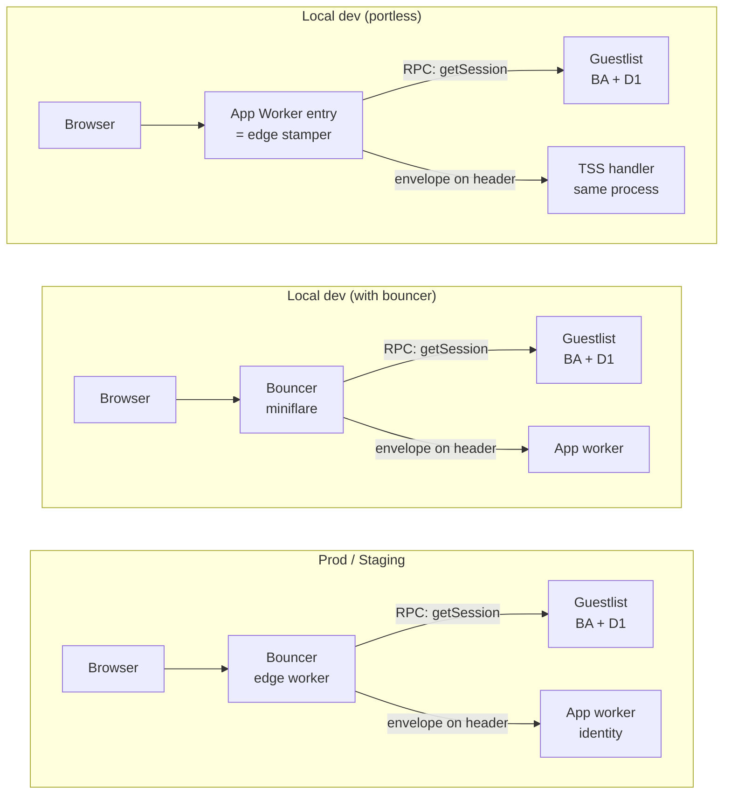

The portless topology is the one that's structurally different — there is no bouncer worker. The app's own Worker entry takes on bouncer's responsibility (mint the envelope) _before_ TSS sees the request. From TSS's perspective the request looks identical to a bouncer-routed prod request. **The minting code is shared** — both bouncer and the dev stamper instantiate the same `createEnvelopeStamper`, parameterised by signing key + bindings.

---

## 3. The envelope

### 3.1 What it is

A JWS-compact value (`base64url(header).base64url(payload).base64url(sig)`) signed with **Ed25519**, carried on the internal `x-platform-att` header. The verifier hardcodes `alg: EdDSA` — there is no algorithm negotiation; `alg: none` and HS256 confusion attacks are rejected at the parse step.

### 3.2 What the payload carries

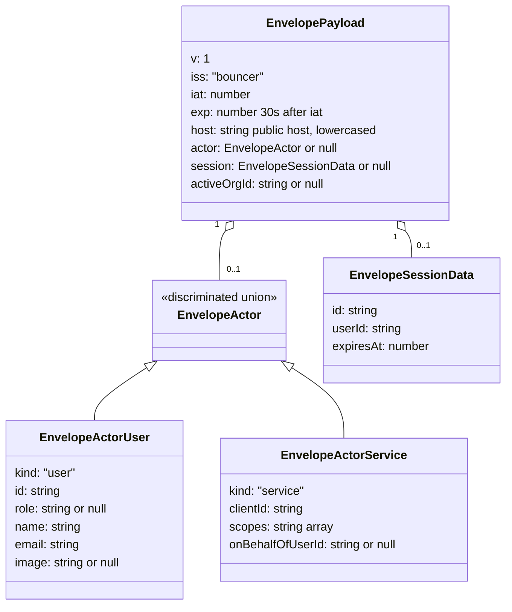

### 3.3 What it does NOT carry

Deliberately excluded — apps that need these must opt into a guestlist RPC at the call site:

- **`session.token`** — that's literally the cookie. Don't double-ship secrets.
- **`session.ipAddress` / `session.userAgent`** — stale by verify time. Apps read live values from `cf-connecting-ip` / `user-agent`.
- **Plugin-extended user fields** (`twoFactorEnabled`, `createdAt`, full org rows, etc.) — fetched on demand for the rare callsites that need them.
- **Org role.** Carried implicitly via `activeOrgId`; the role itself is fetched at the authz decision point so revocations propagate in <5min (no envelope TTL waiting).

### 3.4 Replay & forgery resistance

- **`host`**: lowercased public host bouncer routed. Verifier rejects on mismatch — an envelope minted for `app.example.com` won't verify on `admin.example.com`.
- **`iat`/`exp`**: 30s window with 5s clock skew. Captured envelopes go cold quickly.
- **Signature**: Ed25519. Forgery requires the private key (lives only on bouncer). The kid registry is committed (`packages/config/src/bouncer-attestation.ts`); rotation is a PR + a single `wrangler secret put`.

### 3.5 Payload archetypes — active set

Today there are exactly two active archetypes. The discriminated `actor` union exists so additional kinds can be added without breaking consumers; non-user variants are documented in §6.8 as forward-compatibility, not as immediate work.

| Archetype          | `actor`             | `session`             | `activeOrgId`      | When                                  |
| ------------------ | ------------------- | --------------------- | ------------------ | ------------------------------------- |
| Anonymous          | `null`              | `null`                | `null`             | No session cookie (or invalid cookie) |
| Authenticated user | `EnvelopeActorUser` | `EnvelopeSessionData` | `string` or `null` | Valid BA session                      |

The verifier enforces the cross-field invariant `actor.kind === "user"  ⇒  session !== null`. The anonymous case is first-class — an "empty" envelope (`actor=null`) is still signed and valid; public pages depend on this. Apps must not treat the anonymous archetype as a degenerate "no auth" branch — it's the explicit "public traffic" case.

---

## 4. Where data is established (the trust layer cake)

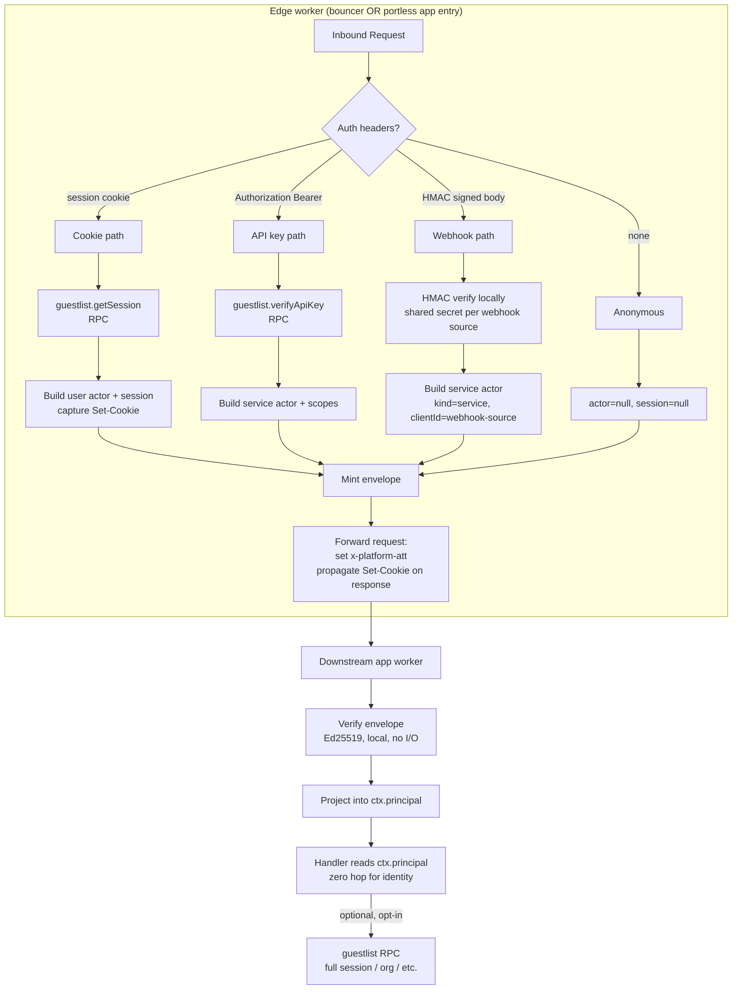

The "edge worker" box is the only place trust is established. Everything below the dashed boundary trusts the envelope and only the envelope.

---

## 5. Guestlist: what `getSession` actually does

This is the most-misunderstood part of the current system, so it gets its own section.

`auth.api.getSession()` (which is what `guestlist.getSession()` resolves to over the service binding) is **already a multi-tier cache**:

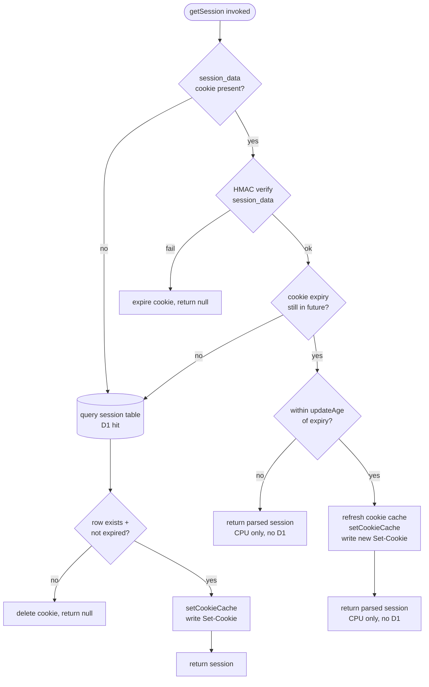

**Implication:** in steady state for an active user, `getSession` does **zero D1 reads** for at least `cookieCache.maxAge` (default 300s). It HMAC-verifies the signed `session_data` cookie locally and returns the parsed claims. D1 is touched only on:

1. First request after sign-in (no cookie cache yet)
2. After `cookieCache.maxAge` expires (default 5 min)
3. When the signed cookie fails HMAC (tampering / secret rotation)
4. When the user signed out elsewhere and `session_token` is unknown to D1

So **bouncer calling guestlist.getSession() on every request is not a 376-D1-queries-per-session problem**. It's a 376-cross-worker-RPCs problem with the actual DB work amortised across 5-minute windows.

This matters because it changes the optimization target. We do **not** need a separate "session reader" entrypoint or a local HS256 verifier in bouncer. We need to make sure:

- bouncer keeps doing this once per request (cheap when warm)
- apps never duplicate it
- the BA-emitted `Set-Cookie` from cache refresh reaches the browser

---

## 6. Per-request flows

Each flow assumes prod topology unless labeled otherwise. Local-dev-with-bouncer is identical to prod; portless differs only at step 1 (the edge is the app's own worker entry).

### 6.1 Anonymous user, HTTP

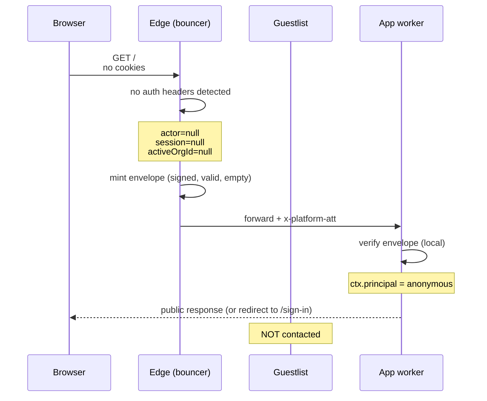

**Key**: an "empty" envelope (`actor=null`) is still signed and valid. Anon pages get the same trust-establishment story as authed pages. Apps don't branch on "envelope missing" — that's a configuration error in prod, not a normal state.

### 6.2 Authenticated user, HTTP

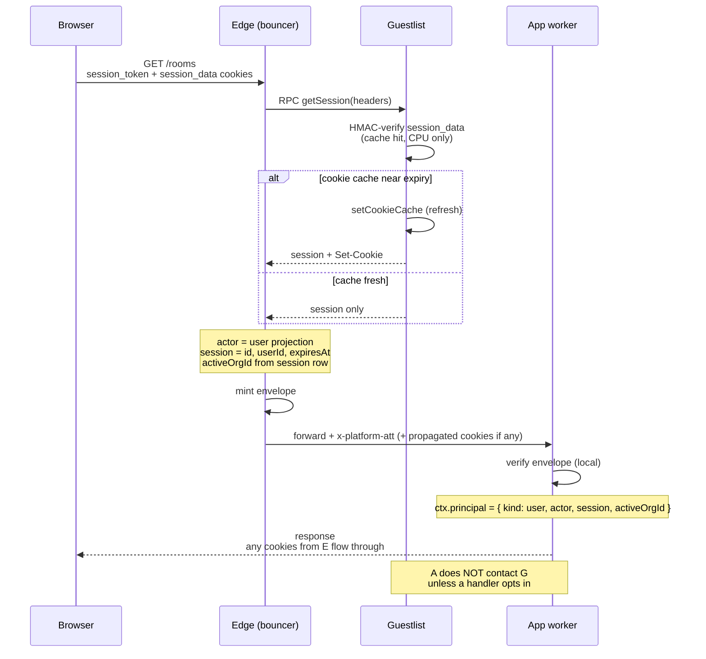

The `Set-Cookie` capture-and-forward path is load-bearing. If `getSession` refreshes the cookie and the response doesn't carry it back, the next request reverts to the slow path (cache miss → D1).

### 6.3 Authenticated user, mutation that needs plugin-extended data

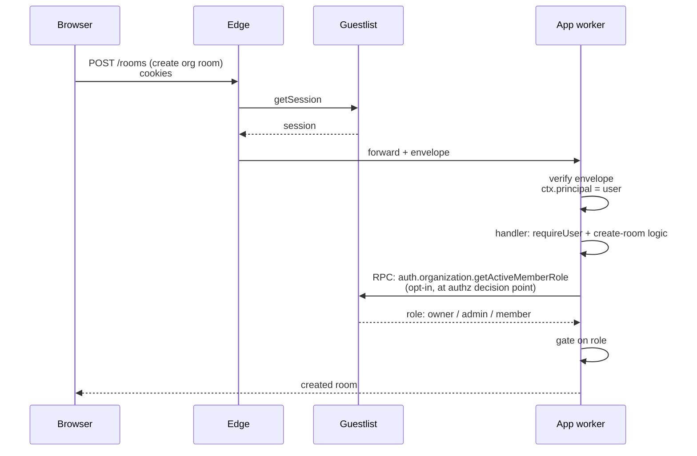

The opt-in RPC happens **at the authz decision point inside the handler**, not in middleware. This is rule 4 from the live conversation: global middleware reads envelope only; mutations that need extra data RPC explicitly.

### 6.4 WebSocket upgrade, authenticated user

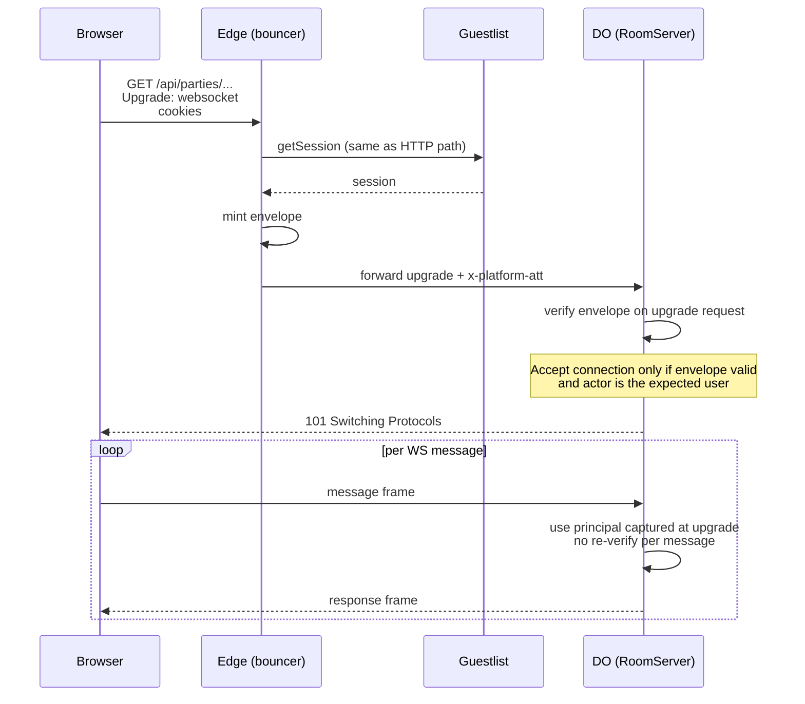

**The upgrade carries the envelope.** Once the WS is open, the connection itself is trusted (the upgrade was authenticated). Messages don't re-verify — the DO holds the principal in memory for the connection lifetime.

If a long-lived connection needs fresh actor state (e.g. session expired, role changed), the DO can periodically (or on demand) call back to guestlist; that's a per-connection choice, not a per-message one.

### 6.5 Local dev portless — anything

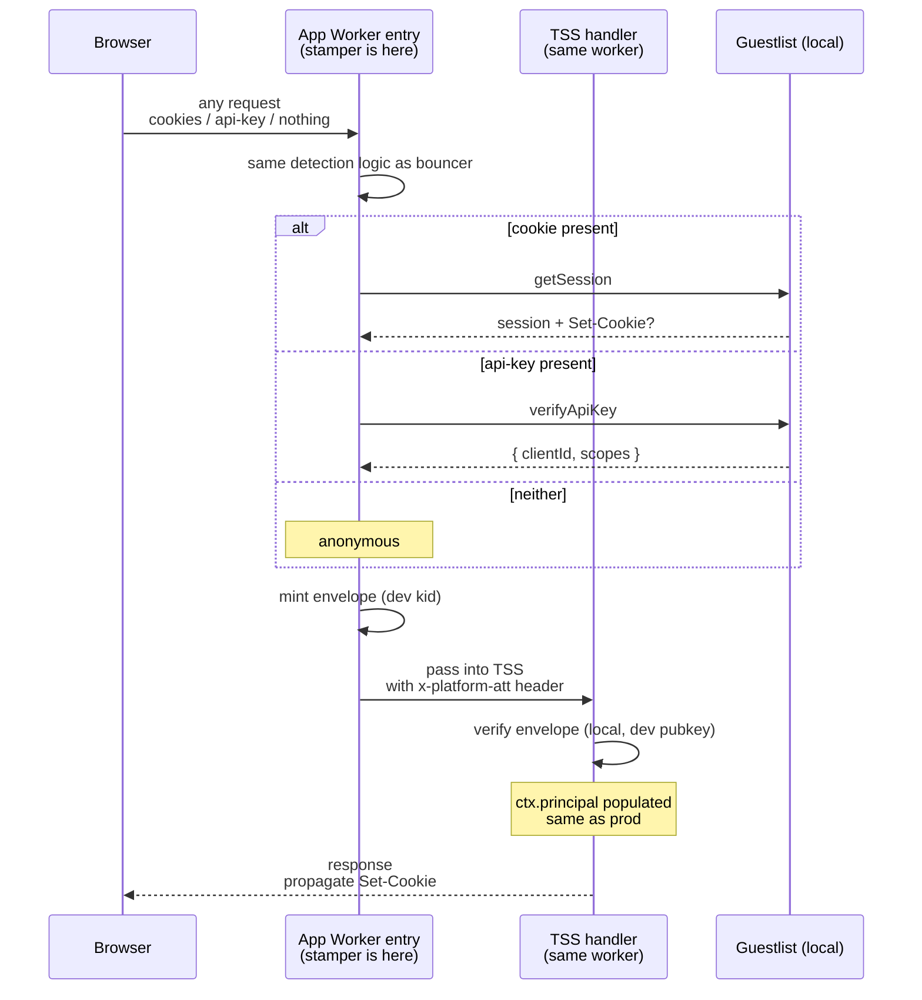

Portless dev is structurally bouncer-in-process. The app's worker entry runs the same `createEnvelopeStamper` code bouncer uses, signs with the dev key, and hands the augmented request to TSS. TSS doesn't know the difference.

The stamper is **gated on `ENVIRONMENT === "development"`**. In staging/prod the same code is a hard no-op — apps can't mint envelopes for themselves because they don't have a real signing key. This is enforced by configuration, not just by intent.

### 6.6 Future extensibility — non-browser callers

These flows are **not implemented in the initial cut**. They live here to document where they'd slot in, so the shape decisions today (discriminated `actor` union, edge-as-trust-establishment) don't accidentally box future work out.

#### 6.6.1 Service-to-service (API key)

When an api-key caller eventually needs to hit the platform, the edge gains a branch alongside the cookie path: detect `Authorization: Bearer`, resolve via guestlist's BA api-key plugin, mint an envelope with `actor: { kind: "service", clientId, scopes, ... }`. App-side gates become `requireService` / `requireUserOrService`. The envelope shape and the `Principal` discriminated union are designed to accept this with no breaking change.

#### 6.6.2 Webhook (HMAC-signed by external system)

External systems that sign payloads with HMAC (Stripe, GitHub, etc.) would terminate at the edge: bouncer holds the per-source HMAC secret as a Cloudflare wrangler secret, verifies locally (no guestlist involvement — webhooks aren't BA identities), and mints a service envelope with a well-known `clientId` prefix (`webhook:*`). Apps gate on the prefix or scopes.

#### 6.6.3 The shape constraint these impose today

- `EnvelopePayload.actor` must be a **discriminated union**, not `EnvelopeActorUser | null` flat. Even if `EnvelopeActorUser` is the only variant we mint today, the type-level union means consumers branch on `actor.kind` and stay forward-compatible.
- Bouncer's stamper must not assume "cookie path or anonymous" — its detection step is structured as "for each known auth signal, try to resolve; if none, anonymous." Adding a signal (api-key, HMAC) is an additive branch, not a rewrite.
- App-side gates must compose by predicate, not bake in "user-or-redirect-to-sign-in" — that's an app-specific gate built on top of a generic `requireKind("user")`. Future gates (`requireKind("service")`, `requireAnyAuthenticated`) slot in the same way.

That's the entirety of the "leave the door open" work. Implementation of any non-user kind is deferred until a real caller exists.

---

## 7. Trust boundary summary

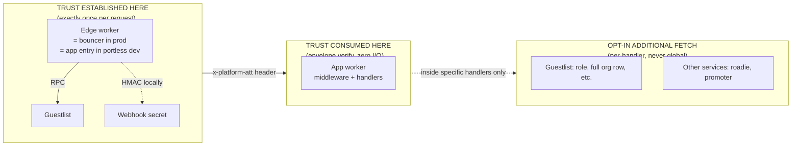

| Layer                            | What's allowed                                                                                                                            | What's forbidden                                                               |
| -------------------------------- | ----------------------------------------------------------------------------------------------------------------------------------------- | ------------------------------------------------------------------------------ |
| Edge                             | Read cookies / api-key headers, call guestlist, call BA api-key verify, HMAC-verify webhook payloads, mint envelope, propagate Set-Cookie | Skipping the mint step. Trusting client-sent identity claims.                  |
| App middleware (global)          | Verify envelope, project to ctx.principal, gate on principal                                                                              | Calling guestlist. Calling any service binding. Re-reading the session cookie. |
| App handlers (per-route, per-fn) | Read ctx.principal, optionally RPC guestlist for plugin-extended data, optionally RPC other services                                      | Implementing identity logic. Re-verifying the envelope. Bypassing the gate.    |

---

## 8. The Principal type (server-side ctx surface)

This is what server-side handlers see on `ctx.principal` after the global envelope middleware runs. The discriminated union mirrors the envelope payload's actor variants in a "ready to use" projection.

```text
Principal =
  | { kind: "user"
    , actor: EnvelopeActorUser
    , session: EnvelopeSessionData
    , activeOrgId: string | null
    }
  | { kind: "anonymous" }
```

A `service` variant slots in later (§6.6.3) without breaking handlers that exhaustively match on `kind`.

**Why a discriminated `Principal` and not `session: PlatformSession | null`:** the `session: PlatformSession | null` shape forces every handler to null-check + drill into `session.user.id`, and it ships fields the envelope doesn't carry (so populating it would require an RPC). The discriminated union makes the two cases explicit, narrows correctly per gate, and stays envelope-shaped — zero RPC.

**`PlatformSession` doesn't disappear.** It remains:

- The shape on the **client-side** auth surface (`loadSession()` server fn, `createReactStartAuthProvider`, `useAuth()`) — **unchanged**. The client-side machinery already works and is out of scope for this refactor.
- The return type of an explicit, opt-in `getFullSession()` server-fn-level middleware for the rare server handler that needs plugin-extended BA fields. Not the default surface.

The split is: **`Principal` is the server-side request-context surface for handlers/middleware; `PlatformSession` continues to be the client-side AuthProvider's data shape.** Both can exist; they don't compete because they live at different layers.

---

## 9. What changes vs the current state

The work is **server-side only**. Client-side machinery (`loadSession`, `createReactStartAuthProvider`, `useAuth`, the `RouterContext.session: PlatformSession | null` shape) is **explicitly out of scope** for this refactor — it works, it's not the problem, and we're not touching it now.

The actual problem being fixed: today every TSS request that hits an app worker re-RPCs guestlist for a `PlatformSession`, even though bouncer already established trust at the edge and the envelope already carries every field the request-handling layer reads. This refactor takes the envelope at face value on the server side, eliminating the per-request RPC.

### 9.1 The principle (read carefully)

The bug being fixed is **not** "apps call `guestlist.getSession()`." It is "apps call `guestlist.getSession()` _unconditionally on every TSS request_ via a global middleware that doesn't even know why it wants the data."

Two RPC patterns, only one of which is wrong:

| Pattern                                                                                                           | Frequency                                                     | Status                                                            |
| ----------------------------------------------------------------------------------------------------------------- | ------------------------------------------------------------- | ----------------------------------------------------------------- |
| Global middleware in `start.ts` RPCs guestlist on every request through TSS                                       | per HTTP request (SSR + every server fn + every server route) | ❌ the bug                                                        |
| `__root.tsx beforeLoad` calls `loadSession()` to seed `AuthProvider`                                              | per **navigation** (initial SSR + each client-side nav)       | ✅ fine                                                           |
| A specific server fn calls `getGuestlist().auth.organization.getActiveMemberRole(...)` at an authz decision point | per **mutation that needs it**                                | ✅ fine                                                           |
| A specific server fn calls `getGuestlist().getSession()` because it genuinely needs plugin-extended BA fields     | per **handler invocation that needs it**                      | ✅ fine, prefer the future `fullSessionMiddleware` so it composes |

The rule of thumb: **a guestlist RPC has to be justified by a specific need at a specific callsite.** If the answer to "why does this RPC fire?" is "because there's a middleware that fires on every request," that's the bug. If the answer is "because this beforeLoad seeds the AuthProvider for the page" or "because this handler is about to make an authz decision that needs role," that's fine.

This distinction is what makes the refactor non-destructive to the client-side surface. `loadSession` keeps doing exactly what it does today — it just stops being the consequence of a global middleware that fires on every request whether anything needs it or not.

### 9.2 Phased delivery

The phases are sequenced so each lands as a self-contained PR with no regressions. Phases 1–3 are foundation work with no behavior change visible to apps.

#### Phase 1 — Shape extensibility (additive, no behavior change)

- **`packages/auth/src/envelope/types.ts`**: define `EnvelopeActor` as a discriminated union with `EnvelopeActorUser` as today's only variant. Widen `EnvelopePayload.actor` from `EnvelopeActorUser | null` to `EnvelopeActor | null`. (Forward-compat per §6.6.3; non-user variants not minted yet.)
- Verifier already discriminates on `actor.kind` correctly; no changes needed in `verify.ts`.
- Tests: add a type-level test asserting future-variant additions don't break existing consumers.

#### Phase 2 — Stamper extraction (pure refactor)

- **New file** `packages/auth/src/envelope/stamper.ts` exporting `createEnvelopeStamper(opts)`. Opts: a session resolver (calls guestlist.getSession + captures Set-Cookie), a signing config, a host resolver. **No api-key or HMAC path yet** — those slot in when §6.6 work is picked up.
- **`workers/bouncer/src/index.ts` + `session.ts`**: rewire onto the extracted stamper. Behavior identical. Mint output byte-equal to current implementation (verify in a snapshot test).
- **`packages/kit/src/react-start/dev-envelope.ts`**: switch to the extracted stamper. Pick up the missing `Set-Cookie` propagation on the response in passing (currently dropped — INV-4 violation in dev-direct only).
- After this phase, bouncer + portless dev mint via identical code with topology-specific bindings.

#### Phase 3 — Kit envelope-driven middleware (new surface, old surface untouched)

- **New** `createEnvelopeMiddleware(opts)` in `@si/kit/react-start`. Request-type middleware. Local Ed25519 verify. Projects to `ctx.principal` (the §8 discriminated union). Zero RPC.
- **New** `createPrincipalGate({ envelope, predicate, onReject })` factory. Composes by reference on the singleton envelope middleware. TSS dedupes by reference — verified against `flattenMiddlewares` in `@tanstack/start-client-core/dist/esm/createServerFn.js:147` — so attaching a gate to a server fn does not double-run envelope verification.
- **(Optional, defer if not needed)** `createFullSessionMiddleware({ envelope, getGuestlist })` — function-type middleware that composes on envelope and adds `ctx.fullSession` for the rare handler that wants plugin-extended BA fields. Not used by anything today; ship only when there's a caller.
- **`platform.getSession`, `platform.getActiveOrgId` dev fallback both stay** — they back the client-side `loadSession` path (§9). (`createSessionMiddleware`/`createGateMiddleware`, once slated to stay alongside them, have since been removed from `@si/kit` entirely — they had zero real consumers.)

#### Phase 4 — Identity server-side migration

Identity's `workers/identity/src/start.ts` already uses the singleton `envelopeMiddleware`, the same migration pattern established in Phases 1–3. `sessionMiddleware` itself has since been removed from `@si/kit` entirely (zero real consumers), so there's no longer a legacy global path to swap away from.

#### Phase 5 — Production key registry

Required before this fork is shippable to prod. Independent of phases 1–4 (could land first, last, or in parallel).

- **`packages/config/src/bouncer-attestation.ts`**: add the real per-fork production `kid` + base64-SPKI public key. The `dev` kid stays in the map for local-dev verification.
- **Bouncer secrets**: `wrangler secret put BNC_ATT_PRIV` with the corresponding Ed25519 private key. `BNC_ATT_KID` var set to the new kid.
- **Runbook**: update `docs/secrets.md` if the rotation steps need clarification. The file already documents the pattern (see `bouncer-attestation.ts:18-24`).
- Without this phase, a prod deploy either accepts forgeable envelopes (`BNC_ATT_KID=dev`) or 403s everything (real kid, public half not registered).

### 9.3 What is explicitly deferred

These were considered and ruled out for this refactor. Re-open only with a concrete driver.

- **Implementing service/webhook actor kinds.** Shape is open (§6.6.3); no implementation. Defer until a real non-browser caller exists.
- **`SessionReaderEntrypoint` on guestlist** (the "RPC reader returning getCookieCache result" pattern proposed and rejected mid-conversation). Redundant with what `auth.api.getSession` already does internally per §5. Adds complexity, no perf win.
- **Pushing `BETTER_AUTH_SECRET` to bouncer or apps for local cookie verification.** Violates INV-3. We migrated away from this posture and we're not going back.
- **Client-side migration to `Principal`.** Out of scope per §9. Server-side `ctx.principal` lives alongside client-side `PlatformSession` indefinitely; revisit only if/when client-side `loadSession` becomes a perf concern (it isn't today — it's called once per navigation, not once per request).
- **WS-message-level envelope re-verification.** The upgrade carries the envelope; the connection is trusted for its lifetime. Stale-principal handling for long WS sessions is a separate concern (§10.2).

---

## 10. Non-goals and open questions

### 10.1 Explicitly out of scope

- **No local cookie verification in apps.** INV-3. We don't ship `BETTER_AUTH_SECRET` to bouncer or apps. Apps verify envelopes (asymmetric, public key only), not cookies.
- **No "session reader entrypoint" on guestlist.** Earlier proposal; rejected. `auth.api.getSession` already does the cache-hit fast path (§5). A separate entrypoint would be redundant complexity.
- **No per-request envelope re-mint.** Envelope lives for the request's lifetime. Long-lived connections (WebSockets, SSE) hold the principal captured at handshake.
- **No envelope on the response.** Bouncer strips `x-platform-att` from upstream responses defensively. The envelope is internal-only.
- **No client-side `Principal` migration.** Client-side auth surface stays on `PlatformSession` via `loadSession` + `AuthProvider`. Server-side gets `ctx.principal`. They coexist.
- **No service/webhook implementation.** Forward-compatibility only; non-user actor kinds aren't minted yet.

### 10.2 Open questions

- **WS reconnect with refreshed session.** If a user's session refreshes mid-WS-connection, the captured principal goes stale. Options: (a) periodic re-verify against guestlist from the DO, (b) reconnect-on-refresh signaled from the bouncer/app layer, (c) ignore given today's staleness windows. Current implicit answer is (c) — revisit when we have a use case where stale auth matters (admin actions inside a WS session, for example).
- **Cross-app envelope reuse.** An envelope is bound to a `host`. A request originating at `app.example.com` whose handler wants to RPC `roadie.example.com` should mint a fresh envelope for that hop or use a service-binding bypass. Today this is handled via service bindings (no public-host hop), so the question is theoretical until we expose roadie/promoter publicly.
- **Whether `loadSession`'s per-navigation RPC eventually needs the same treatment.** Today it runs once per navigation (not once per request), which is acceptable. If the AuthProvider's freshness needs change — e.g. a longer-lived shell that wants to avoid the per-navigation hop — we'd revisit by either driving AuthProvider's initial seed from `ctx.principal` projection or by caching `loadSession`'s result client-side. Not a current problem.

---

## 11. Quick reference: handler author cheat sheet

If you're writing a new server fn or route handler, here's the decision tree. (Today only `user` and `anonymous` kinds exist — service is shown dashed as forward-compat.)

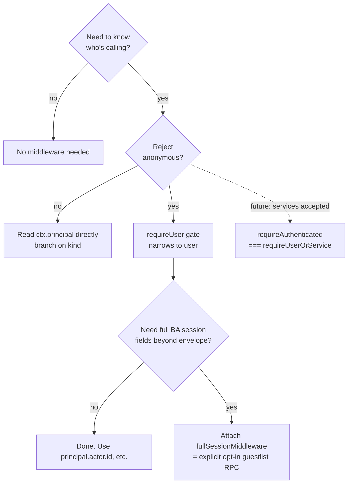

The "no middleware needed" path exists for genuinely public surfaces (sign-in page, public room landing, healthcheck). Everything else goes through a gate; the composition handles `ctx.principal` narrowing automatically.

If you find yourself calling `guestlist.getSession()` inside a server fn handler — stop. Either the data you need is already on the envelope (use `ctx.principal`), or it isn't (use `fullSessionMiddleware`). The middleware tracks dependency correctly and dedupes; the ad-hoc RPC does not.

(Note: this guidance is server-side. On the client, keep using `useAuth()` from the existing `AuthProvider`; that surface is unchanged.)
