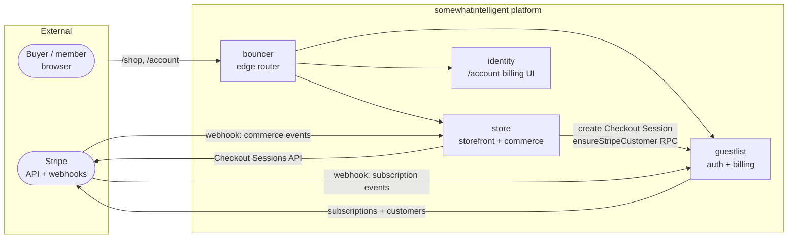
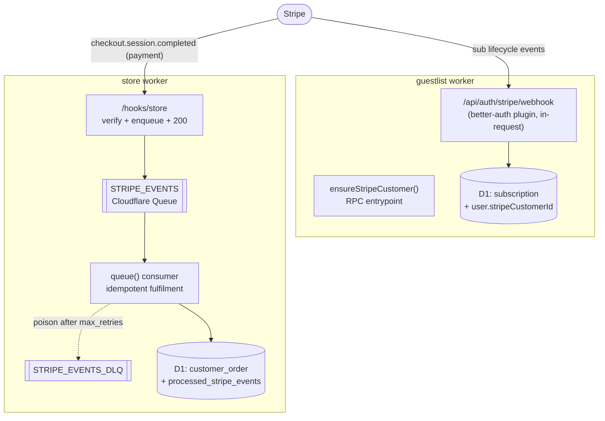
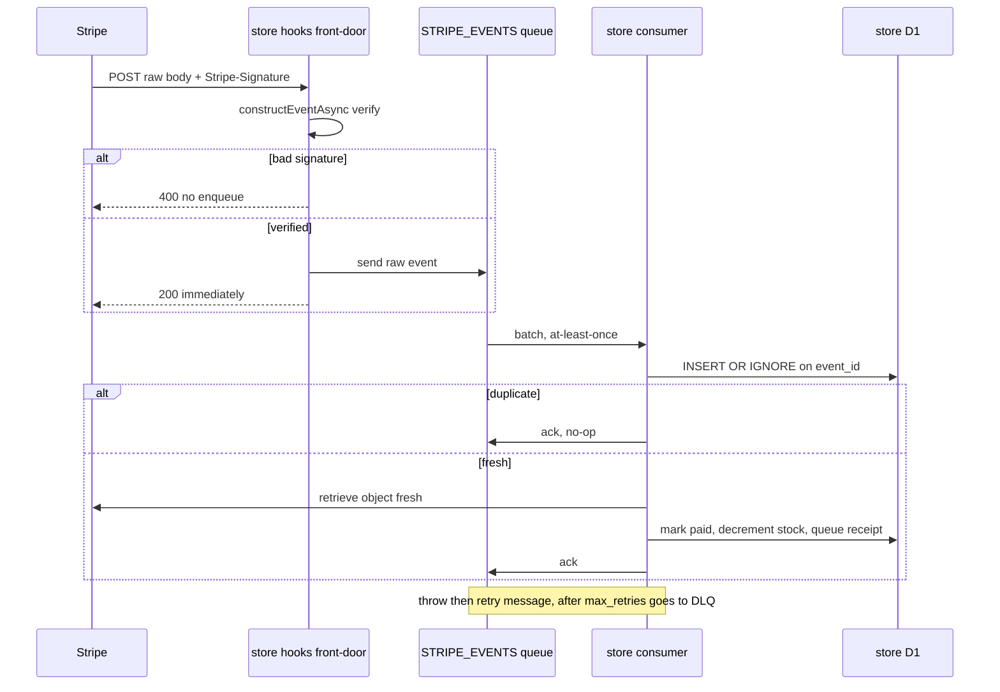
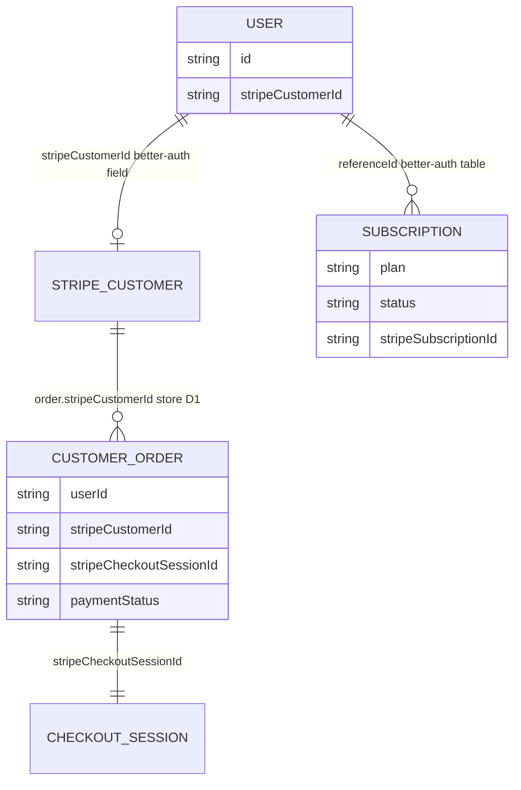
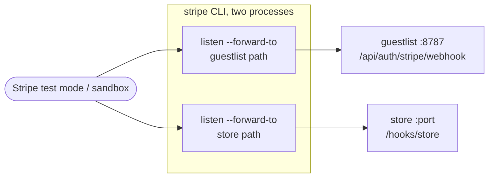
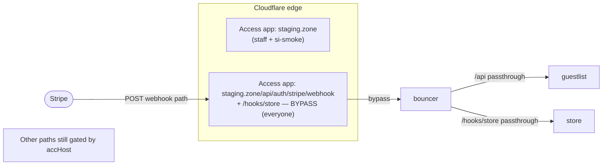
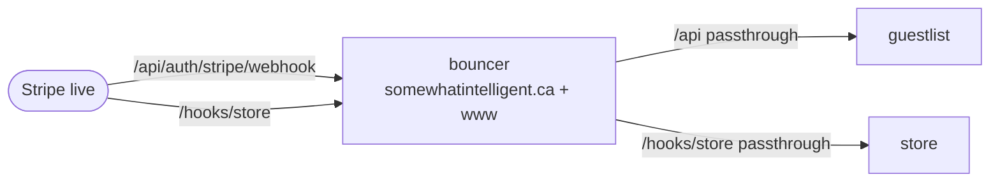
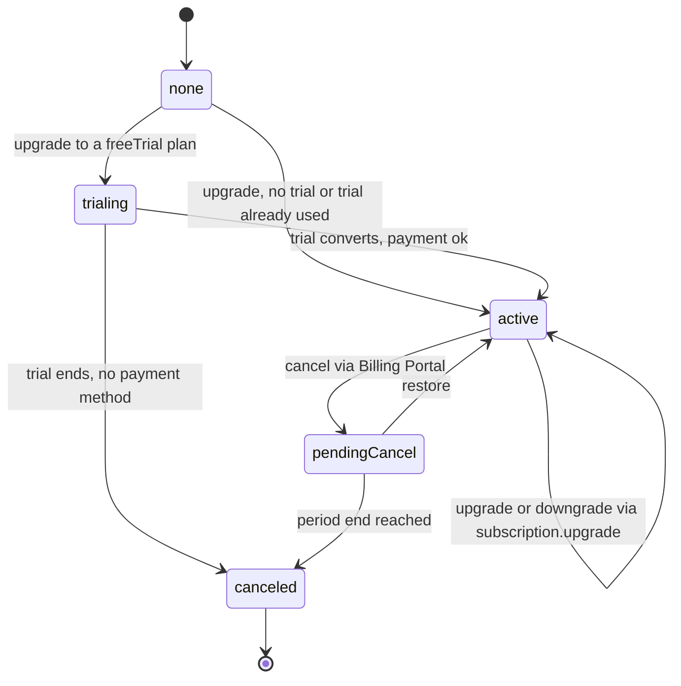

# 0002 — Stripe billing infrastructure

Status: DRAFT (spec only — no code, no Stripe resources, no products/prices/tiers defined)
Started: 2026-07-07
Base: builds on 0001 Track B — the dormant `@si/stripe` IaC + the gated-off
`@better-auth/stripe` plugin. 0001 decision 3 / B6 handed storefront↔Stripe
wiring to "a later track"; this is that track's **infrastructure** half.

## Why

We have no product, no prices, and nothing live. What must exist **before**
any tier/price/feature is decided is the reliable **plumbing**: how a Stripe
webhook is delivered, verified, and durably processed across local / staging /
production; how users map to Stripe customers and how one-time orders (which
never touch the subscription plugin) associate to them; and how the
permanent-resource IaC is guarded in CD. This plan specifies that plumbing and
nothing above it — notably it leaves the subscription→feature gating _mechanism_
undecided (see [C]).

**Explicit non-goals (deferred to a later plan, once the infra is proven with
throwaway test-mode data):**

- No subscription tier list, no prices, no `member_monthly` amount.
- No subscription→feature gating mechanism. Whether that mapping ends up in
  code, config, a DB, or Stripe's (immutable, Stripe-bound) Entitlements is
  deliberately **left open** here — we don't need gating yet, so we don't
  prematurely bind it to anything permanent. [C]
- No checkout UI _polish_ and no in-page subscription **Elements** (hosted
  Checkout is fine for the card step). The subscription **management** mechanics
  (upgrade / downgrade / cancel / trial) are specced below, but plan definitions
  - visual design are deferred.
- No org-level billing (user-level only for v1).

Deciding those changes nothing about the infrastructure below, which is why it
comes first.

## Target state

- **Payment surface = Checkout Sessions API**, not low-level PaymentIntents.
  `ui_mode: 'elements'` for the custom, in-page, branded storefront checkout
  (Session owns pricing/tax/state; our D1 catalog rides ad-hoc `price_data`
  line items). Subscriptions reuse the same primitive via better-auth. [B]
- **Two webhook listeners** (two Stripe event destinations, two signing
  secrets):
  1. **Identity/billing** → `/api/auth/stripe/webhook` on **guestlist**,
     processed **in-request** by the `@better-auth/stripe` plugin (subscription
     lifecycle). [A1]
  2. **Commerce** → `/hooks/store` on the **store** worker, which **verifies →
     enqueues to Cloudflare Queues → returns 200 immediately**; an async
     consumer fulfils orders **idempotently** with a dead-letter queue. [A2]
- **Customer + order data model**: better-auth owns `user.stripeCustomerId`;
  the store resolves it at checkout via a guestlist RPC (`ensureStripeCustomer`)
  — never from the envelope — and stamps it on the order. [D]
- **Subscription gating is deferred** — this plan does _not_ choose the mapping
  mechanism. It only guarantees the substrate (subscription state via
  better-auth + a webhook pipeline that can carry whatever events a future
  mechanism needs) and records the constraints the eventual choice must
  satisfy. [C]
- **Environment delivery**: local = `stripe listen --forward-to`; staging =
  path-scoped Cloudflare Access **bypass** apps on the webhook paths (signature
  is the authenticator); production = public via bouncer passthrough. [E]
- **Idempotent in-repo provisioning** for the Stripe webhook endpoints
  themselves _and_ the Access bypass apps, mirroring `scripts/provision/*`. [F]
- **CD drift-guard**: `validate.ts` orphan detection made fatal (with an
  `archived` escape hatch); `STRIPE_SECRET_KEY` into the `si_deploy` vault; a
  `stripe-validate` gate task; `@si/stripe` wired into CI. [G]

---

## Decoupling — Stripe is optional infrastructure

**Nothing couples to Stripe existing.** Every worker must boot, typecheck, test,
and build with **zero** Stripe — no CLI, no API key, no webhook secret. That is
the normal state of a **remote Claude Code session**, an **ephemeral CI
container**, and any **fresh clone**. Stripe is purely _additive_: when its
config is present a surface lights up; when absent the surface degrades to a
no-Stripe fallback **that already exists**.

This is not new machinery — it extends 0001's gating property (the better-auth
plugin stays out of the plugins array unless both secrets are set; `@si/stripe`
writes an **offline stub** with empty ids when there's no key, so a keyless
clone typechecks). This plan holds every _new_ surface to the same bar.

Behavior when Stripe config is absent:

| Surface                            | With Stripe                 | Without Stripe (no CLI / key / secret)                                                                 |
| ---------------------------------- | --------------------------- | ------------------------------------------------------------------------------------------------------ |
| store checkout                     | Checkout Session (Elements) | **falls back to the existing manual pending→paid stub** (`placeOrder`, 0001) — storefront fully usable |
| store `/hooks/store` + queue       | verify → enqueue → fulfil   | route returns 503 / unregistered; no queue traffic; consumer idle                                      |
| guestlist subscriptions            | better-auth plugin active   | plugin dormant (0001 gating) — auth byte-identical to no-Stripe                                        |
| `/account` billing                 | management surface          | hidden ("billing unavailable")                                                                         |
| `@si/stripe` codegen               | real ids                    | offline stub, empty ids — typechecks clean                                                             |
| local `stripe listen`              | forwards events             | skipped; payments run in stub mode                                                                     |
| CI · `vp check` / `test` / `build` | —                           | **all green with no Stripe anywhere**                                                                  |

**Mechanism:** one predicate per worker — `stripeConfigured(env)` =
`!!env.STRIPE_SECRET_KEY && !!<webhook-secret>` — is the single gate. Server fns
and routes branch on it; the client hides Stripe UI when a server-derived
`stripeEnabled` flag is false. No import, binding, or code path _requires_ a
Stripe key to exist — **absence is a branch, never a throw**. (See INV-8.)

**Local dev is never blocked by Stripe — for any worker.** `bun run dev` (or any
worker subset) runs the full fleet with no CLI and no keys, because the two
seams that could otherwise abort it are made inert:

- The `env:init` Stripe seed is **best-effort and never non-zero** — any failure
  (no CLI, not logged in, offline) is caught, falls back to the empty
  placeholder, and exits **0**. `dev-stack.ts` aborts the stack if prep returns
  non-zero, so the seed must not — and doesn't.
- The `dev-stack` Stripe listener child is **teardown-exempt** — spawned only
  when the CLI is detected; if it's absent, fails to start, or dies, dev-stack
  logs it and keeps every worker running. (Worker children tear the stack down
  on exit; the Stripe child explicitly does not.)

---

## Architecture

### System context (C4 L1)

### Container view (C4 L2) — the two listeners + async pipeline

Subscription **gating** (reading subscription/entitlement state to unlock
features) is a downstream concern deliberately left out of this diagram — its
mechanism is deferred (see [C]). The two-listener pipeline above is the
substrate any chosen mechanism plugs into.

**Why two listeners, not one.** better-auth's plugin **owns** its subscription
events end-to-end — it verifies the signature internally (`constructEventAsync`)
and mutates its own `subscription` table **in-request**, and its docs warn:
_"Don't stand up a second webhook route consuming the same subscription
events."_ [ba-stripe] That work is fast, self-contained, and low-volume
(bursty only at renewal, absorbed by a single D1 upsert), so Stripe's own 3-day
exponential-backoff retry [stripe-webhooks] is sufficient durability — a queue
buys nothing there. Our **commerce** fulfilment is the opposite: heavier,
multi-step (order state + stock + receipt email via promoter), and burst-prone
— exactly the case Stripe names for an async queue: _"process incoming events
with an asynchronous queue… a large spike in webhook deliveries might overwhelm
your endpoint hosts."_ [stripe-webhooks] So it fast-acks and offloads. Two
Stripe endpoints subscribe to **disjoint** event sets so neither double-handles
the other's.

### Commerce webhook pipeline (sequence)

**Idempotency is enforced once, in the consumer**, keyed on `event.id` via
`INSERT OR IGNORE` on `processed_stripe_events` — because **both** Stripe and
Cloudflare Queues deliver at-least-once [stripe-webhooks][cf-queues-delivery].
The `fetch` front door stays dumb (verify + enqueue only). Correctness-critical
state is re-fetched from Stripe rather than trusted from the (possibly stale /
thin) payload. [stripe-thin]

### Data model (C4-ish) — customer sync + order association

**The rule: one Stripe Customer per platform user, carrying both their
subscriptions (via better-auth) and their one-time orders (via store Checkout
Sessions attached to the same customer).** Concretely:

- **User → Customer.** better-auth's `createCustomerOnSignUp: true` creates the
  Stripe Customer at sign-up and writes `user.stripeCustomerId`. [ba-stripe]
  This is a **better-auth plugin field on the existing user table** — allowed;
  it is _not_ a new hand-rolled guestlist table.
- **Existing (pre-Stripe) users have no customer** — `createCustomerOnSignUp`
  fires only at sign-up, and better-auth documents **no** get-or-create for
  existing users. [ba-stripe] So guestlist gains a small RPC,
  **`ensureStripeCustomer()`**: read `user.stripeCustomerId`; if null,
  `stripeClient.customers.create(...)` + persist; return the id. This is the
  one deliberate extension beyond the plugin.
- **Orders bypass the plugin.** The store's `create-checkout-session` server fn
  takes the authenticated `userId` from the verified envelope actor, then
  **calls guestlist `ensureStripeCustomer()` over the existing `GUESTLIST`
  service binding** — _not_ the envelope (decision: keep the envelope lean; it
  already carries id/role/name/email/image/activeOrgId). It creates the Checkout
  Session with `customer: <id>` + `metadata.orderId`, and stamps
  `stripeCustomerId` + `stripeCheckoutSessionId` + `paymentStatus` onto the
  `customer_order` row. The commerce webhook reconciles by `metadata.orderId`.
- **Guest checkout** (no session/actor): no customer; pass `customer_email`;
  Stripe creates a guest customer; the order stores the email only.

New store D1 surface (store owns its own D1 — adding tables/columns there is not
a guestlist concern): `customer_order` gains `stripeCustomerId`,
`stripeCheckoutSessionId`, `paymentStatus` (`pending → processing → paid /
failed`); new `processed_stripe_events(event_id PK, type, received_at)` for the
idempotency ledger.

---

## Environment topologies

The one hard problem is **webhook ingress**: Stripe must reach an HTTPS endpoint,
send an unauthenticated POST (no custom headers, no login), and have the
**signature** be the sole authenticator. That plays out differently per env.

### Local (dev-direct, no bouncer)

**This is wired into the existing lifecycle — no dev runs raw `stripe`
commands.** The dev loop is already `bun run dev` → `scripts/dev-stack.ts`
(cached `vp run -r env:init` + local migrations, then one supervised child per
worker with group-teardown). Stripe slots into exactly those seams, and every
seam is **CLI-gated so a Stripe-less box just runs the storefront on the manual
stub** (see Decoupling):

- **Seed — inside `vp env:init`.** guestlist's and store's `scripts/env-init.ts`
  gain a Stripe step in the existing `env:init` task: _if_ the CLI is present +
  logged in (`command -v stripe` + a cheap auth probe), run
  `stripe listen --print-secret` (prints the secret and exits; the CLI secret is
  **stable per login and shared across all `listen` processes**) and
  `writeDevVarsIfMissing` the whsec into both workers — `STRIPE_WEBHOOK_SECRET`
  for guestlist (the exact name better-auth reads) and
  `STRIPE_WEBHOOK_SIGNING_SECRET` for store; _else_ — or on **any** error (no
  CLI, not logged in, offline) — write today's empty placeholder. **Best-effort:
  the step always exits 0**, so `vp env:init` (and thus `bun run dev`) never
  aborts because of Stripe. Idempotent + cached like every other `env:init`. [stripe-cli]
- **Forward — a supervised child in `dev-stack.ts`.** `dev-stack` gains an
  optional `stripe` child alongside the workers: when the CLI is present +
  logged in it spawns the **two** `stripe listen --forward-to` processes (one
  per endpoint — `--forward-to` is single-URL) under the same process-group as
  the workers; when absent it logs one line ("Stripe CLI not found — payments
  run in stub mode") and continues. This child is **teardown-exempt** — unlike a
  worker child, its failure or exit never tears the fleet down. `bun run dev
--no-stripe` / `--stripe` forces it. So `bun run dev` stays one command
  everywhere. [stripe-cli]
- **Report — in `dev-doctor`.** `dev:doctor` prints Stripe status
  informationally (CLI present? logged in? whsec seeded? stub vs live) — never a
  failure, since Stripe-less is a valid state.

The commands those tasks run, for reference (not steps a dev types): `stripe
login --project-name si-dev` (pairs the sandbox once); per endpoint `stripe
listen --project-name si-dev --skip-verify --events <types> --forward-to <url>`
(`--skip-verify` for the self-signed `*.localhost` hosts; port form drops it);
and for tests `stripe trigger checkout.session.completed --add
"checkout_session:metadata.orderId=ORD-123"` to exercise the store path.
[stripe-cli]

### Staging (behind Cloudflare Access)

`staging.somewhatintelligent.ca` and every `*-staging.workers.dev` host are
gated by self-hosted Access apps (`scripts/provision/access.ts`). Stripe can
neither present the `si-smoke` service-token headers nor log in — so each
webhook **path** gets a more-specific **bypass** app.

- Cloudflare's supported mechanism: a **path-scoped Access application** whose
  `domain` includes the exact webhook path, carrying a policy with
  **`decision: "bypass"`, include Everyone**. "The Bypass action disables any
  Access enforcement… to enable applications that require specific endpoints to
  be public"; bypass "does not support identity-based rule types." [cf-access]
  Precedence is most-specific-path-wins, so the `/hooks/store` bypass app
  overrides the host-wide `staging.zone` app for that path only. [cf-app-paths]
- **Signature is the authenticator** once the path is public — verify every
  event with `constructEventAsync` + the endpoint's `whsec` before acting. This
  is Stripe's standard model (endpoints are "publicly accessible… secured by the
  signature"). [stripe-webhooks] Optionally tighten the bypass include to
  Stripe's published webhook egress IP ranges as defense-in-depth. [stripe-ips]

### Production (public, bouncer passthrough)

- No Access on the prod apex — the two paths are public by default.
- `/api/auth/stripe/webhook` already routes via the existing `/api` → guestlist
  **passthrough** mount. `/hooks/store` is a **new passthrough mount → STORE**
  (raw body + unmodified path; `vmf` would strip the mount and rewrite the body,
  so passthrough is mandatory). Added to `bouncer` `vars.ROUTES` for the
  staging top-level **and** `env.production` apex + www sets.

---

## Subscription lifecycle (`/account`)

These are `@better-auth/stripe` **plugin mechanics** — tier-agnostic, so they
belong here even though the plan list and prices are deferred (non-goals). The
plugin gives us a genuinely custom `/account` billing surface: every flow is an
`authClient.subscription.*` call (client) or `auth.api.*Subscription` (server),
gated by `authorizeReference` when `referenceId` is an org. **Only two flows
force a Stripe-hosted hand-off** (cancel, and payment-method/invoice
management); the card-capture step for a _new_ subscription is hosted Checkout.
[ba-stripe]

| Flow                      | Call                                                                      | Timing                                                      | Surface                                                            |
| ------------------------- | ------------------------------------------------------------------------- | ----------------------------------------------------------- | ------------------------------------------------------------------ |
| Upgrade                   | `subscription.upgrade({ plan, subscriptionId, … })`                       | immediate (default) or period-end via `scheduleAtPeriodEnd` | custom UI; hosted Checkout only for the card step of a **new** sub |
| Downgrade                 | **same** `subscription.upgrade({ plan, subscriptionId, … })` (lower plan) | same                                                        | custom UI                                                          |
| Cancel                    | `subscription.cancel({ subscriptionId, returnUrl })`                      | at period end (`cancelAtPeriodEnd`)                         | **portal-only** (302 to Billing Portal)                            |
| Restore                   | `subscription.restore({ subscriptionId })`                                | undoes a pending cancel                                     | custom UI (pure API)                                               |
| Trial                     | per-plan `freeTrial: { days, … }`, consumed on first upgrade              | `trialing → active` at `trialEnd`                           | custom UI (no portal to start)                                     |
| Payment method / invoices | `subscription.billingPortal({ returnUrl })`                               | —                                                           | **portal-only**                                                    |
| Read state                | `subscription.list({ referenceId })`                                      | —                                                           | custom UI                                                          |

**Upgrade / downgrade** are the _same_ call — a downgrade is an `upgrade` to a
cheaper `plan`. The hard rule: **if the user already has an active subscription
you MUST pass `subscriptionId`, or the plugin creates a second subscription and
double-bills.** No `subscriptionId` → a fresh Stripe Checkout (hence the
required `successUrl`/`cancelUrl`); with `subscriptionId` → an in-place Stripe
subscription update. In-place changes **prorate to the second by Stripe's
default**; `scheduleAtPeriodEnd: true` defers the change to the period boundary.
[ba-stripe][stripe-prorations]

**Trial** is per-plan (`freeTrial.days` + `onTrialStart/End/Expired` hooks).
better-auth enforces **one trial per account across all plans** automatically and
non-overridably, and a subscription-level `requireEmailVerification` can gate
upgrades. Stripe fires `customer.subscription.trial_will_end` ~3 days out; the
`trialing → active` transition rides `customer.subscription.updated`. [ba-stripe]

**Cancel** hands off to the **Stripe Customer Portal** (this plugin does not
cancel via API from your own button), defaulting to cancel-at-period-end with
`restore` available until `periodEnd`. **Payment-method updates and invoice
history are also portal-only** (`billingPortal`); what the portal permits
(switchable plans, cancel behavior, proration) is configured in the **Stripe
Dashboard**, not in code. [ba-stripe]

**Escape hatches** (only if a hard requirement emerges — not v1): a fully
in-app cancel button or a specific `proration_behavior` (e.g. `none` on
downgrade, `always_invoice` on upgrade) both require driving `stripeClient`
directly, since the plugin exposes neither. [ba-stripe][stripe-prorations]

What stays deferred: the actual plan list / prices / `freeTrial.days`, the plan
cards' visual design, and whether we ever build the in-app cancel escape hatch.
The **mechanics** above are what this plan commits to.

---

## Decision log

| #   | Decision                                                                                                   | Why                                                                                                                                                                                                                                                                   |
| --- | ---------------------------------------------------------------------------------------------------------- | --------------------------------------------------------------------------------------------------------------------------------------------------------------------------------------------------------------------------------------------------------------------- |
| 1   | Infrastructure-first: this plan specifies plumbing only; tiers/prices/features/UI are a later plan         | We have no product; the plumbing is invariant to what we eventually sell. Deciding prices now would be guessing at immutable resources.                                                                                                                               |
| 2   | Payment surface = **Checkout Sessions API** (`ui_mode:'elements'`), not PaymentIntents                     | Stripe's documented recommendation: Checkout Sessions "is the recommended API for most developers… PaymentIntents requires significantly more code and ongoing maintenance." In-page + branded via Appearance API, Session owns pricing/tax/state. [stripe-compare]   |
| 3   | One Stripe Customer per user, shared by subscriptions + one-time orders                                    | Unified billing history; a single `stripeCustomerId` keys both better-auth subscriptions and store orders.                                                                                                                                                            |
| 4   | **Defer** the subscription→feature gating mechanism; do not bind it to Stripe's immutable Entitlements now | We don't need gating yet, and Stripe products/prices/features are permanent — creating them prematurely is a liability, not a feature. The mapping may end up in code, config, a DB, or Stripe; this plan keeps that open and only records the constraints (see [C]). |
| 5   | Stripe is **optional, additive** infrastructure — nothing couples to it existing                           | Remote Claude sessions, ephemeral CI, and fresh clones have no CLI/keys; every surface degrades to a no-Stripe fallback, extending 0001's gating. See the Decoupling section + INV-8.                                                                                 |

### Track A — webhook listeners

| #   | Decision                                                                                                                               | Why                                                                                                                                                                                                                                                                                     |
| --- | -------------------------------------------------------------------------------------------------------------------------------------- | --------------------------------------------------------------------------------------------------------------------------------------------------------------------------------------------------------------------------------------------------------------------------------------- |
| A1  | Subscription events → `/api/auth/stripe/webhook` on guestlist, **in-request** via the better-auth plugin                               | The plugin owns + verifies + writes subscription rows in-request and forbids a second consumer of its events. [ba-stripe] The plugin's `onEvent` hook is the reserved seam if a future gating mechanism ever needs Stripe events here — but no such handling is committed in this plan. |
| A2  | All commerce (one-time order) events → `/hooks/store` on the store worker, **verify → enqueue → 200**, async idempotent consumer + DLQ | Heavier, burst-prone fulfilment is exactly Stripe's async-queue case; DLQ isolates poison. [stripe-webhooks][cf-queues]                                                                                                                                                                 |
| A3  | Two Stripe endpoints subscribe to **disjoint** event sets                                                                              | Prevents double-handling; the store consumer only acts on `payment`-mode sessions carrying our `metadata.orderId`.                                                                                                                                                                      |
| A4  | Idempotency enforced in the consumer on `event.id` (`INSERT OR IGNORE`)                                                                | Stripe **and** Queues are both at-least-once. [stripe-webhooks][cf-queues-delivery]                                                                                                                                                                                                     |
| A5  | Consumer re-fetches the object from Stripe for correctness-critical state                                                              | Payloads can be stale/thin; Stripe steers toward fetch-fresh. [stripe-thin]                                                                                                                                                                                                             |

### Track B — payment surface

| #   | Decision                                                                                                                                                                                                                                 | Why                                                                                                                                                                                                                                   |
| --- | ---------------------------------------------------------------------------------------------------------------------------------------------------------------------------------------------------------------------------------------- | ------------------------------------------------------------------------------------------------------------------------------------------------------------------------------------------------------------------------------------- |
| B1  | Store catalog + prices stay in **store D1**; Checkout Sessions use ad-hoc `price_data` line items                                                                                                                                        | Physical goods with mutable pricing; `price_data` (currency + unit_amount + product_data.name) needs no Stripe Product. Keeps the permanent Stripe product space (and the CD guard) scoped to subscriptions. [stripe-sessions-create] |
| B2  | Amounts resolved **server-side** from D1 at Session-create time                                                                                                                                                                          | Never trust a client-reported price (mirrors today's `placeOrder` re-price).                                                                                                                                                          |
| B3  | Fulfil on the webhook (`checkout.session.completed`, `async_payment_*`), idempotent, keyed on session id; the `return_url` page is UX only                                                                                               | "Webhooks are required… customers aren't guaranteed to visit that page." [stripe-fulfillment]                                                                                                                                         |
| B4  | Subscriptions run through the better-auth plugin: a custom `/account` management UI (upgrade / downgrade / restore / read) + hosted Checkout for the new-sub card step + Billing Portal for cancel and payment-method/invoice management | See the Subscription lifecycle section for the full flow set. Replacing the hosted-Checkout card step with in-page subscription _Elements_ is a later-plan follow-on. [ba-stripe]                                                     |
| B5  | Use the Stripe SDK's fetch/REST client + `constructEventAsync` on Workers                                                                                                                                                                | Sync `constructEvent` uses Node crypto and won't run on Workers. [stripe-webhooks]                                                                                                                                                    |

### Track C — subscription gating (mechanism deferred)

| #   | Decision                                                                                                                                                                                                                   | Why                                                                                                                             |
| --- | -------------------------------------------------------------------------------------------------------------------------------------------------------------------------------------------------------------------------- | ------------------------------------------------------------------------------------------------------------------------------- |
| C1  | The subscription→feature mapping mechanism is **not decided in this plan**                                                                                                                                                 | We don't need gating yet; deciding now would commit to an approach (and possibly to permanent Stripe resources) for no benefit. |
| C2  | Whatever mechanism is later chosen must satisfy two owner constraints: the mapping can **change over time** (not a frozen matrix), and it must **not add non-plugin tables to guestlist**                                  | Carried from prior direction; constrains the future choice without making it.                                                   |
| C3  | The infra in this plan is a sufficient substrate for any choice: better-auth already exposes subscription state (`subscription` table + status), and the two-listener pipeline can carry whatever events a mechanism needs | Keeps the door open to code-based, config-based, DB-based, or Stripe-Entitlements-based gating without rework.                  |
| C4  | Enforcement, when built, is a server-fn middleware at the gate point (shape mirrors `requireAdminMiddleware`); its data source is TBD                                                                                      | The enforcement seam is cheap to reserve; the source behind it is the deferred decision.                                        |

Candidate mechanisms (for the later decision, **not** chosen here): a
code/config map from plan → features; a small customer-keyed entitlement store
(Workers KV or a Durable Object); or **Stripe Entitlements**
(Feature / ProductFeature / ActiveEntitlement resolved at runtime — dynamic but
permanent and Stripe-bound). [stripe-entitlements] is one option to weigh, not a
decision.

### Track D — customer + order data model

| #   | Decision                                                                                                                                 | Why                                                                                                                      |
| --- | ---------------------------------------------------------------------------------------------------------------------------------------- | ------------------------------------------------------------------------------------------------------------------------ |
| D1  | `user.stripeCustomerId` (better-auth field) is the single source of truth; store resolves it via a guestlist **RPC**, never the envelope | Keeps customer-creation in one place (guestlist owns the field) and the signed envelope lean.                            |
| D2  | guestlist gains `ensureStripeCustomer()` (get-or-create)                                                                                 | better-auth has no documented get-or-create for pre-Stripe users; storefront must serve all logged-in users. [ba-stripe] |
| D3  | Store `customer_order` gains `stripeCustomerId` / `stripeCheckoutSessionId` / `paymentStatus`; new `processed_stripe_events` ledger      | Reconciliation + idempotency; store owns its D1.                                                                         |
| D4  | Guest checkout uses `customer_email`, no customer                                                                                        | No account to attach; order carries email only.                                                                          |

### Track E — environment delivery

| #   | Decision                                                                                                                                                                                                    | Why                                                                                                                                      |
| --- | ----------------------------------------------------------------------------------------------------------------------------------------------------------------------------------------------------------- | ---------------------------------------------------------------------------------------------------------------------------------------- |
| E1  | Local: `stripe listen --forward-to`, shared per-login `whsec`, `--skip-verify` for portless HTTPS, `stripe trigger` for tests                                                                               | Standard Stripe CLI local loop. [stripe-cli]                                                                                             |
| E2  | Staging: path-scoped Access **bypass** app per webhook path (include Everyone, optional Stripe-IP tighten); signature is the authenticator                                                                  | Only supported way to make one path public while the host stays gated. [cf-access][cf-app-paths]                                         |
| E3  | Production: public via a new bouncer `/hooks/store` **passthrough** mount (+ existing `/api` for the billing hook)                                                                                          | Passthrough preserves raw body + unmodified path for signature verification; `vmf` cannot.                                               |
| E4  | Local Stripe is **task-graph integrated, not manual**: seed inside `vp env:init` (CLI-gated, else placeholder); forwarders a supervised `dev-stack.ts` child (CLI-gated, auto-skip); status in `dev-doctor` | No dev runs raw `stripe` commands; `bun run dev` stays one command, and a Stripe-less box runs the storefront on the stub automatically. |

### Track F — idempotent provisioning

| #   | Decision                                                                                                                                                                                                                          | Why                                                                                                                                                                                                                 |
| --- | --------------------------------------------------------------------------------------------------------------------------------------------------------------------------------------------------------------------------------- | ------------------------------------------------------------------------------------------------------------------------------------------------------------------------------------------------------------------- |
| F1  | New `scripts/provision/stripe-webhooks.ts`: find-or-create the two Stripe endpoints per env, keyed on `metadata { managed_by:"si", role }`, reconcile url/events drift, **persist the create-only `whsec`** into the secret store | The signing secret is returned **only at creation** and cannot be read back; list has no server-side metadata filter (list-and-filter). [stripe-webhook-obj][stripe-webhook-list]                                   |
| F2  | Extend `scripts/provision/access.ts`: add path-scoped bypass Access apps for the two webhook paths (staging only)                                                                                                                 | Idempotent (exact `domain`+path match); refactor `ensureApp` to take a per-target policy list so the bypass app carries **only** the bypass policy.                                                                 |
| F3  | Pin the Stripe `api_version` on each endpoint explicitly                                                                                                                                                                          | Payload shape is fixed at event creation and `api_version` is immutable on update; pinning decouples us from a Dashboard default bump and makes version upgrades a parallel-endpoint migration. [stripe-versioning] |
| F4  | Classic `/v1/webhook_endpoints` (snapshot events), not v2 `event_destinations`                                                                                                                                                    | Standard signed HTTPS webhook over v1 resources; v2/thin-events only if we later need EventBridge/org-level/thin payloads. [stripe-event-destinations]                                                              |

### Track G — CD drift-guard + secrets

| #   | Decision                                                                                                                                                                                                                     | Why                                                                                                                                                                                                                         |
| --- | ---------------------------------------------------------------------------------------------------------------------------------------------------------------------------------------------------------------------------- | --------------------------------------------------------------------------------------------------------------------------------------------------------------------------------------------------------------------------- |
| G1  | Make `validate.ts` orphan detection **fatal** (today `hasWarnings`→exit 0 at lines 81/140), with a config `archived: true` escape hatch; extend to Features                                                                  | Stripe products/prices/features are permanent (archive-only); a `config_key` deleted while the resource is live orphans it. The detection already exists — flip severity. Retiring = mark `archived`, never delete the key. |
| G2  | Add `STRIPE_SECRET_KEY` (sandbox + live, env-scoped) to the **`si_deploy` vault**; new `cache:false` `stripe-validate` RWX task gating `deploy-staging` (sandbox) + `deploy-production` (live), mirroring `migrate`→`deploy` | No Stripe key exists in any vault; the guard needs live API access and must run per-account on the pre-deploy path, not the secret-less PR gate.                                                                            |
| G3  | Wire `@si/stripe` into CI (typecheck + `test-stripe` Captain suite)                                                                                                                                                          | It is currently absent from the gate; its config-invariant + stub tests never run.                                                                                                                                          |
| G4  | Add `store` to `packages/secrets` `ServiceName`/`SERVICE_DIR`; both Stripe secrets now target guestlist **and** store per env                                                                                                | store is a new Stripe consumer; the manifest is the single source the dev-vars writer + `wrangler secret put` flow from.                                                                                                    |
| G5  | Two webhook signing secrets per env (guestlist `STRIPE_WEBHOOK_SECRET`, store `STRIPE_WEBHOOK_SIGNING_SECRET`), sandbox key for local+staging, live for prod                                                                 | Distinct endpoints → distinct secrets; a leak on one surface doesn't compromise the other.                                                                                                                                  |

### Track H — subscription lifecycle (`/account`)

| #   | Decision                                                                                                                                        | Why                                                                                                                                                                                                         |
| --- | ----------------------------------------------------------------------------------------------------------------------------------------------- | ----------------------------------------------------------------------------------------------------------------------------------------------------------------------------------------------------------- |
| H1  | Upgrade **and** downgrade via `subscription.upgrade`, always passing `subscriptionId` for an existing sub                                       | Same call; omitting `subscriptionId` creates a second subscription and double-bills. [ba-stripe]                                                                                                            |
| H2  | Immediate by default; `scheduleAtPeriodEnd` for deferred changes; accept Stripe's default (prorate-to-the-second) proration for v1              | The plugin exposes `scheduleAtPeriodEnd` but not `proration_behavior`; the default is fine for v1. Custom proration = drive `stripeClient` directly (deferred escape hatch). [ba-stripe][stripe-prorations] |
| H3  | Cancel + payment-method + invoices via the Stripe **Billing Portal** (`billingPortal`); custom `/account` UI for upgrade/downgrade/restore/read | The plugin's cancel is portal-only; the portal is the least-effort PCI-safe path for card/invoice management. A fully in-app cancel is a deferred escape hatch. [ba-stripe]                                 |
| H4  | Trials are per-plan `freeTrial`; rely on better-auth's automatic one-trial-per-account; gate upgrades with `requireEmailVerification`           | No custom trial-abuse logic to build; the verification gate blocks throwaway-email trials. [ba-stripe]                                                                                                      |
| H5  | Org-vs-user subscription management gated by `authorizeReference`                                                                               | Ties billing management to org owners/admins when `referenceId` is an org; user-level for v1. [ba-stripe]                                                                                                   |

---

## Idempotent provisioning (the scripts)

Both provisioners are **find-or-create, safe to re-run**, matching the existing
`scripts/provision/*` style.

1. **`scripts/provision/stripe-webhooks.ts`** — for a given env's account
   (sandbox / live), `ensureWebhookEndpoint({ url, events, role })` per
   listener:
   - list endpoints, match on `metadata.managed_by="si"` + `metadata.role`
     (`"billing"` | `"commerce"`);
   - absent → create with pinned `api_version`, **capture the returned
     `whsec`**, write it into `.secrets/<env>.env`
     (`STRIPE_WEBHOOK_SECRET` for guestlist, `STRIPE_WEBHOOK_SIGNING_SECRET` for
     store) so `bun run secrets <env>` pushes it via `wrangler secret put`;
   - present → reconcile `url` / `enabled_events` drift, else no-op.
   - The create-only secret means a re-run cannot re-derive `whsec`; the secret
     store is the source of truth. "Endpoint exists but secret missing" is a
     manual roll (Workbench), not something the script heals. [stripe-webhook-obj]
2. **`scripts/provision/access.ts` (extended)** — add a path-bearing target per
   webhook path (`staging.<zone>/api/auth/stripe/webhook`,
   `staging.<zone>/hooks/store`) and a reusable **bypass** policy
   (`decision:"bypass"`, `include:[{ everyone:{} }]`); attach only the bypass
   policy to those apps. Idempotent on exact `domain` match (path is part of
   `domain`).

Both slot behind the existing `bun run secrets <env>` / provisioning entry
points; neither runs in the ordinary PR gate (they need account credentials).

---

## Invariants

- **INV-1** — Server-authoritative: no client-reported amount or client-reported
  success ever mutates order / subscription / entitlement state; only webhooks +
  server-side retrieves do.
- **INV-2** — Signature is the gate: every webhook (both listeners, all envs) is
  verified with `constructEventAsync` + the endpoint's `whsec` before any side
  effect; a public Access bypass never weakens this.
- **INV-3** — Idempotent processing: replayed events (Stripe or Queues
  redelivery) cause no duplicate side effects, enforced on `event.id`.
- **INV-4** — Gating preserved: a worker's Stripe surface activates only when its
  key **and** its webhook signing secret are both present; absence is
  byte-identical to a no-Stripe build (carries forward 0001 B-gating to store).
- **INV-5** — Permanence guard: every `managed_by=si` product / price / feature
  live in a target account has a matching (possibly `archived`) `config_key`;
  a missing key fails CD.
- **INV-6** — No new guestlist tables: only better-auth's own plugin tables
  (`subscription`, `user.stripeCustomerId`) are added to guestlist. Any future
  gating store lives outside guestlist's D1.
- **INV-7** — One customer per user: subscriptions and one-time orders share a
  single `stripeCustomerId`, resolved via `ensureStripeCustomer`.
- **INV-8** — Decoupled: no worker's boot, `bun run dev` (any subset),
  typecheck, test, or build depends on any Stripe key, secret, CLI, or live
  endpoint existing. The `env:init` Stripe seed is best-effort (never non-zero);
  the `dev-stack` listener child is teardown-exempt; every Stripe surface
  degrades to a documented no-Stripe fallback (see Decoupling). Enforced in CI,
  which has no Stripe.

## Phases

- **P0** — Foundations (no Stripe traffic yet): add `store` to the secrets
  manifest + `ServiceName`; add `STRIPE_SECRET_KEY` to `si_deploy`; flip
  `validate.ts` orphans fatal + `archived`; wire `@si/stripe` into CI; write
  the two provisioners (dry-run against sandbox); land the `stripeConfigured`
  gate + stub fallbacks + the best-effort `env:init` seed + teardown-exempt
  `dev-stack` child. (done when: a scratch config-drop fails `stripe-validate`,
  **and** `bun run check|test|build` + `bun run dev` are all green on a box with
  zero Stripe config — no key, no CLI)
- **P1** — Ingestion skeleton on staging/sandbox: store `/hooks/store` (verify +
  enqueue + 200), `STRIPE_EVENTS` queue + DLQ + `processed_stripe_events`; new
  bouncer `/hooks/store` passthrough; staging Access bypass apps; provision the
  two sandbox endpoints. Prove delivery with `stripe trigger` + a no-op
  consumer. (done when: a triggered event traverses edge→bouncer→queue→consumer
  and acks, idempotently)
- **P2** — Customer + commerce path: `ensureStripeCustomer` RPC; store
  `create-checkout-session` server fn + Elements checkout; order schema
  migration; consumer fulfils orders (paid + stock + receipt). (done when: a
  test card buys a shirt on staging and the order flips paid via the webhook)
- **P3** — Subscription path: better-auth plugin enabled on guestlist (both
  secrets present); a custom `/account` surface driving upgrade / downgrade /
  restore / read + trial on a test plan; billing portal wired for cancel +
  payment-method/invoice management (see Subscription lifecycle). Subscription
  **state** is observable end-to-end; the gating _mechanism_ on top of it is out
  of scope here (deferred — see [C]). (done when: a sandbox subscription is
  created, upgraded, and cancellable via the portal, all reflected in
  `subscription`)
- **P4** — Production cutover: live account, live secrets, live endpoints via
  the provisioners, guardrail against live, deploy. (done when: a real card
  buys a shirt and a subscription in prod)

## Test scenarios

- **Unit**: `validate` orphan→fatal + `archived` escape; provisioner
  find-or-create (absent→create, drift→update, clean→no-op); consumer dedup
  logic; server-side re-price equals Session amount.
- **D1 / pool**: order payment state transitions; webhook idempotency (replayed
  `event.id` no-ops); stock decrement only on paid; `processed_stripe_events`
  ledger.
- **e2e**: Elements checkout with `4242…` → order paid via webhook; declined
  card leaves order unpaid + stock intact; subscription upgrade reflected in
  `subscription` state; cancel reflected. (Gating enforcement is deferred — no
  entitlement e2e in this plan.)
- **Delivery**: local `stripe trigger` reaches both endpoints; staging bypass
  path returns 200 from the worker (not an Access login) for an unauthenticated
  POST; signature failure → 400.
- **CD**: scratch PR removing a synced `config_key` fails `stripe-validate`;
  marking it `archived` passes.
- **Decoupling** (INV-8): with no Stripe key/secret/CLI, every worker boots,
  `bun run dev` runs the full fleet (stub mode), the storefront checks out via
  the manual stub, and `vp check|test|build` are green — asserted in CI, which
  has no Stripe.

## Scope — acceptable vs blocking reductions

Per `docs/definition-of-done.md`:

- **Acceptable for v1**: better-auth hosted Checkout for subscriptions (not
  custom Elements); user-level (not org-level) billing; app-middleware gating
  (not bouncer-edge); manual Workbench secret-roll (no programmatic rotation).
- **Blocking**: signature verification on both endpoints (INV-2); consumer
  idempotency + DLQ (INV-3); the CD permanence guard (INV-5); no new guestlist
  tables (INV-6); server-authoritative state (INV-1).

## Non-negotiable axes (definition-of-done)

Auth through guestlist/better-auth exclusively; authz via grant tables (plus a
gating middleware once the deferred mechanism lands); transactional email
(receipts / dunning)
through promoter; observability wired (webhook verify outcomes, queue depth,
DLQ alarms, consumer failures logged); a `docs/runbooks/stripe.md` exists.

## Commit conventions (release-please)

Scope per touched worker (`store` for commerce + checkout, `guestlist` for
subscriptions/customer RPC/entitlements, `identity` for billing UI, `bouncer`
for the new mount) per `docs/ops/commit-scoping.md`; `@si/stripe` and
`packages/secrets` changes ride the consuming worker's release. `pr-title-lint`
requires `type(scope): description`.

## Open decisions

1. **Store commerce webhook path** — `/hooks/store` (proposed) vs another
   reserved prefix; must not collide with the `/api` (guestlist) or `/_sfn/*`
   mounts.
2. **Subscription→feature gating mechanism** (deferred to a later plan) —
   code/config map vs a customer-keyed entitlement store (KV/DO) vs Stripe
   Entitlements. Must support a mapping that changes over time and add no
   guestlist tables. Not chosen here.
3. **Local webhook secrets** — one shared per-login `whsec` for both workers
   (simplest) vs per-worker `--project-name` secrets.
4. **Staging bypass breadth** — bypass `Everyone` (signature-only) vs bypass
   scoped to Stripe's published webhook IP ranges (defense-in-depth, needs a
   refresh mechanism for the IP list).

---

## References

- [stripe-webhooks] https://docs.stripe.com/webhooks — 2xx-fast, async queue,
  duplicate events, retry window, raw body.
- [stripe-compare] https://docs.stripe.com/payments/checkout-sessions-and-payment-intents-comparison
- [stripe-sessions-create] https://docs.stripe.com/api/checkout/sessions/create — `price_data` line items.
- [stripe-fulfillment] https://docs.stripe.com/checkout/fulfillment
- [stripe-thin] https://docs.stripe.com/webhooks/migrate-snapshot-to-thin-events
- [stripe-entitlements] https://docs.stripe.com/billing/entitlements
- [stripe-prorations] https://docs.stripe.com/billing/subscriptions/prorations
- [stripe-cli] https://docs.stripe.com/cli/listen · https://docs.stripe.com/cli/trigger
- [stripe-ips] https://docs.stripe.com/ips
- [stripe-webhook-obj] https://docs.stripe.com/api/webhook_endpoints/object — secret create-only.
- [stripe-webhook-list] https://docs.stripe.com/api/webhook_endpoints/list
- [stripe-versioning] https://docs.stripe.com/webhooks/versioning
- [stripe-event-destinations] https://docs.stripe.com/event-destinations
- [cf-queues] https://developers.cloudflare.com/queues/configuration/javascript-apis/
- [cf-queues-delivery] https://developers.cloudflare.com/queues/reference/delivery-guarantees/
- [cf-access] https://developers.cloudflare.com/cloudflare-one/policies/access/
- [cf-app-paths] https://developers.cloudflare.com/cloudflare-one/access-controls/policies/app-paths/
- [ba-stripe] https://www.better-auth.com/docs/plugins/stripe
