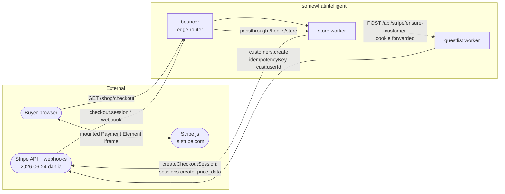
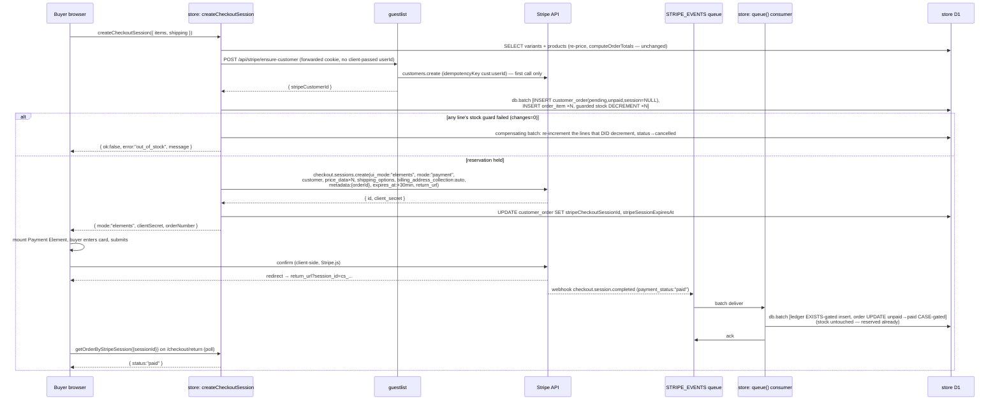
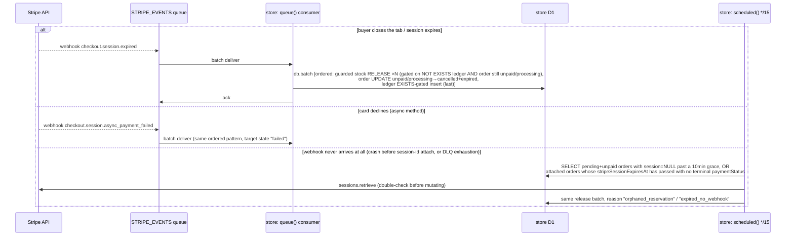

# 0003 — Store checkout: embedded Payment Element (Checkout Sessions, `ui_mode: "elements"`)

Status: DRAFT (spec only — no code)
Started: 2026-07-08
Base: extends [0002 — Stripe billing infrastructure](./0002-stripe-billing-infrastructure.md)
Track B (payment surface) and Track D (customer/order model). 0002 shipped the
**ingestion half** of commerce Stripe (webhook verify → queue → idempotent
consumer, `processed_stripe_event` ledger, the `customer_order` Stripe columns)
but explicitly deferred the piece that makes any of it fire for a real
purchase: "store checkout … Checkout Session (Elements) [B, P2]" is listed in
0002's current-state table as unbuilt, and its own P2 phase ("a real test card
buys a shirt on sandbox") was never reached. This plan is that P2 — it is the
checkout half 0002 deferred, and it is scoped **narrowly to checkout**: it does
not touch subscriptions, gating, tax, or the CD/provisioning tracks, all of
which 0002 already covers.

## Why

Today the storefront has exactly one checkout path — `placeOrder`
(`workers/store/src/lib/orders.functions.ts:63`) — a manual stub: it re-prices
from D1 (`computeOrderTotals`, `workers/store/src/lib/pricing.ts`), writes the
order `pending`/`unpaid`, decrements stock unconditionally, and never touches
Stripe. No card is ever collected. Meanwhile the commerce webhook pipeline
shipped in 0002 is fully built and tested — `/hooks/store` verifies +
enqueues (`workers/store/src/lib/stripe-webhook.ts`), the queue consumer
processes events idempotently (`workers/store/src/lib/stripe-events.ts`,
`stripe-queue.ts`), and `workers/store/__tests__/integration/stripe-events.itest.ts`
proves the logic — **against synthetic events for orders that were seeded
directly in the test DB**, because no code path ever writes a real Stripe
Checkout Session id onto a `customer_order` row. Test (a) in that file says it
plainly: _"no matching order → retryable"_ is the outcome for **every real
Stripe event today**, because `createCheckoutSession` does not exist. The
pipeline is dormant by construction, not by configuration. This plan makes it
receive events that actually match orders, and closes the two gaps 0002 named
but didn't solve: the order↔session linkage, and stock reservation (0002 has
no stock-handling story at all — its reference `queue()` sketch never
mutates `product_variant`).

## Goals

- Real payment: an authenticated buyer pays with a card (or any Stripe
  dynamic payment method) via an embedded Payment Element, backed by a
  Checkout Session created and priced entirely server-side from `product`/
  `product_variant` D1 rows.
- The order↔session linkage 0002 deferred: a `customer_order` row exists and
  carries `stripeCheckoutSessionId` **before** the client can drive Stripe to
  send any webhook for that session, so the already-shipped consumer's match
  succeeds on the first delivery, not after N retries.
- A stock reservation model: stock is decremented once, atomically, and
  guarded against oversell, at the moment a checkout attempt reserves it; it
  is released exactly once if the attempt never completes (expired / failed),
  with a backstop reconciliation sweep for the cases no webhook can ever
  cover (crash before the session id is attached; a webhook that drains to
  the DLQ).
- Extend the existing consumer (`buildEventMutations` in `stripe-events.ts`)
  to handle `checkout.session.expired` (currently unhandled) and to make
  `checkout.session.async_payment_failed` release stock (currently it only
  flips `paymentStatus`).
- A Stripe Customer per buyer, resolved via a new guestlist route, reusing
  the `user.stripeCustomerId` field 0002's better-auth plugin already owns.
- The manual `placeOrder` stub keeps working, unmodified in its public
  contract, for as long as Stripe is unconfigured (INV-7) — this plan is
  additive.

## Non-goals

- **Guest (unauthenticated) checkout.** `placeOrder` today is `requireAuthMiddleware`-gated end to end; there is no unauthenticated order path anywhere in the storefront. Introducing one is a separate, larger decision (order-ownership model, abandoned-cart email, etc.) — `createCheckoutSession` stays auth-required, matching `placeOrder`.
- **Subscriptions, gating, tax, CD provisioning, staging Access bypass apps, RAK rotation execution.** All owned by 0002; this plan only extends 0002's data model and consumer, and only where checkout needs it.
- **Retrying the same order with a second Checkout Session.** An expired/failed session cancels its order; a new attempt is a new cart → a new order → a new session (Track G). Session-reuse-on-retry is deferred (OQ-3).
- **Refunds, disputes, chargebacks.** 0002 already scopes these to a future plan (its Compliance section); unchanged here.
- **Promoter-branded receipt emails.** v1 delegates payment receipts to Stripe (Dashboard email-receipt toggle, Track A8); the fulfillment path enqueues no promoter email.
- **A store-side CSP.** None exists in this repo today (verified: no `Content-Security-Policy` header anywhere under `workers/`). Not introducing one is out of scope; if one is added later it must allow `https://js.stripe.com` (script) and Stripe's frame origins — noted in Security, not blocking here.
- **Wiring `stripe listen` into `bun run dev` / `dev-stack.ts`.** 0002's Track E4 (`env:init` seed, teardown-exempt listener child, `dev-doctor` status) is still unbuilt — `.dev.vars` already carries real test-mode keys and the manual command (`stripe listen --skip-verify --forward-to .../hooks/store`), which this plan's E2E tier relies on directly. Automating that invocation is 0002's scope, not this plan's.

## Current-state assessment

| #   | Area                              | Today                                                                                                                                                                                                                                                                                                                                                                                          | Gap → fix                                                                                                                                                        | Anchor                                                                                                                                                   |
| --- | --------------------------------- | ---------------------------------------------------------------------------------------------------------------------------------------------------------------------------------------------------------------------------------------------------------------------------------------------------------------------------------------------------------------------------------------------- | ---------------------------------------------------------------------------------------------------------------------------------------------------------------- | -------------------------------------------------------------------------------------------------------------------------------------------------------- |
| 1   | Order↔session linkage             | `customer_order.stripeCheckoutSessionId` column exists (0002) but is **always NULL** — nothing ever writes it                                                                                                                                                                                                                                                                                  | Attach it synchronously after `sessions.create` returns, before the client is handed a `client_secret`                                                           | `workers/store/src/db/schema.ts:95`, `orders.functions.ts` (no Stripe call anywhere)                                                                     |
| 2   | Webhook consumer coverage         | Handles `checkout.session.completed`, `async_payment_succeeded`, `async_payment_failed`; **`checkout.session.expired` is unhandled** (falls to `default: return null` → `ignored`, no ledger row); `async_payment_failed` only sets `paymentStatus:"failed"`, no stock/status change                                                                                                           | Add an `expired` case; extend `async_payment_failed` to release stock + cancel                                                                                   | `workers/store/src/lib/stripe-events.ts:30-71`                                                                                                           |
| 3   | Stock accounting                  | Decremented exactly once, **unconditionally**, only inside `placeOrder`, from a JS-computed value (`Math.max(0, v.stock - line.quantity)`) read in an earlier `SELECT` — no SQL guard, so two concurrent `placeOrder` calls against the last unit of a variant can both succeed (a pre-existing oversell bug, not introduced by this plan but shared by any new path touching the same column) | Guarded conditional `UPDATE … WHERE stock >= quantity`, shared by `placeOrder` **and** the new reservation path, with post-batch compensation on partial failure | `workers/store/src/lib/orders.functions.ts:144-150`, `pricing.ts:48-90`                                                                                  |
| 4   | Customer resolution               | Nothing exists: no RPC, no route. `user.stripeCustomerId` (0002, better-auth plugin field) is only ever populated by the plugin's `createCustomerOnSignUp` at **sign-up time**, for whichever env has the plugin active; every pre-existing user has no customer                                                                                                                               | New guestlist route, `POST /api/stripe/ensure-customer`, get-or-create                                                                                           | `workers/guestlist/src/schema.ts:28`, `packages/auth/src/server.ts:172` (`createCustomerOnSignUp: true`, no get-or-create documented for existing users) |
| 5   | Cross-worker call mechanism       | **No RPC/`WorkerEntrypoint` exists on guestlist.** Every store↔guestlist call today is `env.GUESTLIST.fetch(new Request(...))` — a plain HTTP fetch over the service binding, session derived from a forwarded `cookie` header (identity does the same for org endpoints)                                                                                                                      | `ensureStripeCustomer` follows the **same** fetch+forwarded-cookie pattern — no new infra                                                                        | `workers/identity/src/lib/invitation.functions.ts:64-76`, `workers/store/src/lib/guestlist.ts`                                                           |
| 6   | Checkout UI                       | Manual shipping-only form; submits straight to `placeOrder`; zero Stripe.js on the page                                                                                                                                                                                                                                                                                                        | Add an embedded-Element branch, gated on a server-derived `stripeEnabled` flag                                                                                   | `workers/store/src/routes/_app/checkout.tsx`                                                                                                             |
| 7   | Client Stripe deps                | None — `@stripe/stripe-js` is not a dependency; `STRIPE_PUBLISHABLE_KEY` is set in `.dev.vars` but **not** in `vite.config.ts`'s `CLIENT_VARS` allowlist (the `.dev.vars` comment says so explicitly: "not consumed yet")                                                                                                                                                                      | Add the dependency + allowlist the var                                                                                                                           | `workers/store/package.json`, `workers/store/vite.config.ts:70-77`, `.dev.vars`                                                                          |
| 8   | Stripe API version pin            | `new Stripe(env.STRIPE_SECRET_KEY)` in `stripe-webhook.ts:47` is constructed with **no explicit `apiVersion`** — it floats on the SDK's baked-in default, not the `2026-06-24.dahlia` version this plan (and the Dashboard-configured endpoint, per 0002 F3) targets                                                                                                                           | Pin `apiVersion` explicitly on every `Stripe` client construction touched by this plan                                                                           | `workers/store/src/lib/stripe-webhook.ts:47`                                                                                                             |
| 9   | Key scope                         | `STRIPE_SECRET_KEY` is a full secret key (`sk_test_…`) in both store's and guestlist's `.dev.vars`                                                                                                                                                                                                                                                                                             | Recommend a Restricted API Key for store, scoped to Checkout Sessions write only (store never calls any other Stripe resource)                                   | `workers/store/.dev.vars`, [security.md]                                                                                                                 |
| 10  | Reconciliation / cron             | Store has no `scheduled()` export and no `triggers.crons` at all; roadie already has this exact pattern (`*/15 * * * *`, a `pendingReap` job)                                                                                                                                                                                                                                                  | Add a `scheduled()` handler + cron trigger, mirroring roadie                                                                                                     | `workers/roadie/wrangler.jsonc:36-38`, `workers/roadie/src/index.ts:148-158`                                                                             |
| 11  | `status` vs `paymentStatus` split | Deliberate, already documented in code: `ORDER_STATUSES` (`pending\|paid\|shipped\|delivered\|cancelled`) is the coarse fulfillment lifecycle; `paymentStatus` (free-text) carries the granular Stripe lifecycle (`unpaid\|processing\|paid\|failed`)                                                                                                                                          | **Preserved, not changed.** `expired`/failed-terminal reuses the existing `cancelled` status member — no schema enum change                                      | `workers/store/src/lib/config.ts:45-46`, comment at `stripe-events.ts:17-23`                                                                             |

## Target state

- `workers/store/src/lib/checkout.functions.ts` (new): `createCheckoutSession`
  — re-prices the cart from D1 (reuses `computeOrderTotals` unchanged),
  resolves the buyer's Stripe Customer via guestlist, atomically reserves
  stock + writes the order, creates a Checkout Session
  (`ui_mode: "elements"`, `mode: "payment"`, ad-hoc `price_data`,
  `metadata: { orderId }`), attaches the session id back onto the order, and
  returns a `client_secret` to the client — or `{ mode: "stub" }` when Stripe
  is unconfigured.
- `workers/store/src/lib/reservation.ts` (new): `reserveStock` /
  `releaseStock` — the guarded, compensating helper shared by
  `createCheckoutSession` **and** (retrofit) `placeOrder`, so both paths
  contend for the same stock pool safely.
- `workers/store/src/lib/stripe-events.ts` (extend): `checkout.session.expired`
  handled; `async_payment_failed` releases stock; the message payload widens
  to carry `mode` and `metadataOrderId` for defense-in-depth.
- `workers/store/src/lib/reconcile.ts` (new) + a `scheduled()` export on
  `worker.ts`: a `*/15 * * * *` sweep that releases orphaned/undelivered
  reservations.
- `workers/guestlist/src/index.ts` (extend): `POST /api/stripe/ensure-customer`
  — cookie-authenticated get-or-create, direct Drizzle write (mirrors the
  file's existing BA-fallback idiom for surfaces BA doesn't expose).
  Migration: `customer_order` gains one nullable column,
  `stripe_session_expires_at`.
- `workers/store/src/routes/_app/checkout.tsx` (extend) +
  `routes/_app/checkout.return.tsx` (new): an embedded Payment Element branch
  alongside the existing manual form; a return-page that polls order status.

## Architecture

### System context



### Sequence — happy path (cart → paid)



### Sequence — abandoned/failed path (release)



## Decision log

### Track A — Payment surface

| #   | Decision                                                                                                                                      | Why                                                                                                                                                                                                                                                                                                                                                                                                                                                                                                                                                                                   |
| --- | --------------------------------------------------------------------------------------------------------------------------------------------- | ------------------------------------------------------------------------------------------------------------------------------------------------------------------------------------------------------------------------------------------------------------------------------------------------------------------------------------------------------------------------------------------------------------------------------------------------------------------------------------------------------------------------------------------------------------------------------------- |
| A1  | `ui_mode: "elements"` (**not** `"custom"`, `"hosted_page"`, or `"embedded_page"`) — a fully custom in-page form backed by the Payment Element | This repo pins API version `2026-06-24.dahlia`. Stripe's [changelog dated 2026-03-25.dahlia] **renamed** the `ui_mode` enum: `custom`→`elements`, `hosted`→`hosted_page`, `embedded`→`embedded_page`; the old values are rejected on `2026-03-25.dahlia`+. `elements` is the current, correct value for "build your own UI with the Payment Element" — 0002's draft reference code already wrote `ui_mode: "elements"`, which reads as a typo against the _older_ naming but is in fact correct for the version this repo targets. Confirmed against the live changelog, not assumed. |
| A2  | Never pass `payment_method_types` on `sessions.create`                                                                                        | [payments.md]: omitting it is what enables Stripe's dynamic payment-method selection (100+ signals); hardcoding `["card"]` is explicitly called out as a trap to avoid. Payment methods are managed from the Stripe Dashboard, not in code.                                                                                                                                                                                                                                                                                                                                           |
| A3  | Payment Element only — **not** Stripe's Contact/Shipping/Billing Address Elements                                                             | The storefront already collects and snapshots shipping (`ship*` columns on `customer_order`, filled by the existing form in `checkout.tsx`) before `createCheckoutSession` is ever called. Adding Stripe's own address elements would collect the same data twice. `shipping_address_collection` stays unset on the Session; only payment-method entry moves to Stripe.js.                                                                                                                                                                                                            |
| A4  | `expires_at` set explicitly to 30 minutes past creation (Stripe's documented minimum), not the 24h default                                    | Bounds the reservation window (Track D) to something a buyer will actually finish an in-page checkout within, shrinking the "stock held but nobody's paying" surface. [stripe-sessions-create]                                                                                                                                                                                                                                                                                                                                                                                        |
| A5  | Store's API key should be migrated to a **Restricted API Key** (`rk_`) scoped to Checkout Sessions: Write only                                | [security.md]: prefer RAKs over secret keys; store never calls any other Stripe resource (customer creation lives on guestlist; webhook signature verification uses the webhook secret, not the API key, at all). Least-privilege blast radius. Not blocking for test-mode/staging; called out as a pre-production gate in Rollout.                                                                                                                                                                                                                                                   |
| A6  | Pin `apiVersion: "2026-06-24.dahlia"` explicitly on every `Stripe` client this plan constructs or touches                                     | Today's `new Stripe(env.STRIPE_SECRET_KEY)` (`stripe-webhook.ts:47`) floats on the SDK default. 0002's F3 already decided endpoints should pin their `api_version`; the code should match what the endpoint is configured for.                                                                                                                                                                                                                                                                                                                                                        |

| A7 | Set `billing_address_collection: "auto"` on every Session from day one | Costs nothing now and is the prerequisite for Stripe Tax (0002 open decision 5): the eventual tax flip becomes Dashboard-only (register jurisdictions → `automatic_tax: { enabled: true }`), no checkout redesign. |
| A8 | v1 payment receipts are Stripe's own email receipts (Dashboard "Successful payments" toggle), not promoter | Delegates a whole email surface to Stripe for zero code; the consumer's fulfillment path enqueues no promoter email. Branded receipts via promoter are a later, additive consumer change (0002's registry already reserves the seam). |

### Track B — Pricing source of truth

| #   | Decision                                                                                                                                                                                               | Why                                                                                                                                                                                                                                                                                                                                                                                       |
| --- | ------------------------------------------------------------------------------------------------------------------------------------------------------------------------------------------------------ | ----------------------------------------------------------------------------------------------------------------------------------------------------------------------------------------------------------------------------------------------------------------------------------------------------------------------------------------------------------------------------------------- |
| B1  | Reuse `computeOrderTotals` (`pricing.ts`) **unmodified** as the pricing core for `createCheckoutSession`                                                                                               | It is already pure, unit-tested, and the single place price-from-product + stock/availability validation happens. No client-reported price or quantity total ever reaches `sessions.create`.                                                                                                                                                                                              |
| B2  | Line items stay ad-hoc `price_data` (currency + `unit_amount` + `product_data.name`), no Stripe Price objects for storefront goods                                                                     | Unchanged from 0002 B1: physical goods with mutable D1 pricing don't need a permanent Stripe Product; keeps `@si/stripe`'s managed-resource CD guard scoped to the subscription tier only.                                                                                                                                                                                                |
| B3  | Shipping rides the Session's `shipping_options` — one server-picked `shipping_rate_data` (`display_name`, `fixed_amount: { amount: shippingCents, currency: "cad" }`) — never a `price_data` line item | `calculateShipping` (`lib/config.ts`) stays the single shipping-cost authority — the server computes the one rate at session-create (threshold logic never moves to Stripe). `shipping_rate_data` renders as shipping on Stripe receipts and is taxed under shipping rules when Stripe Tax is later enabled; a "Shipping" line item would be taxed as a product under a default tax code. |

### Track C — Order↔session linkage

| #   | Decision                                                                                                                                                                                                                                            | Why                                                                                                                                                                                                                                                                                                                                                                                              |
| --- | --------------------------------------------------------------------------------------------------------------------------------------------------------------------------------------------------------------------------------------------------- | ------------------------------------------------------------------------------------------------------------------------------------------------------------------------------------------------------------------------------------------------------------------------------------------------------------------------------------------------------------------------------------------------ |
| C1  | The `customer_order` (+ `order_item`) rows are written, and stock reserved, **before** `sessions.create` is called; the row's `stripeCheckoutSessionId` is attached in a follow-up single-row `UPDATE` immediately after Stripe returns the session | We need an `orderId` to stamp into `metadata.orderId` _before_ the Session exists, so the row must exist first. This is the one place this plan intentionally is not atomic across the D1↔Stripe boundary (Stripe is an external call, can't join a `db.batch`) — the gap it opens (reservation exists, no session id yet) is covered by INV-2 / INV-6 and the reconciliation cron, not ignored. |
| C2  | `metadata.orderId` is set on the Session in addition to the `stripeCheckoutSessionId` D1 column                                                                                                                                                     | Defense-in-depth match key + the human-debuggable link Stripe Dashboard search needs; the **authoritative** match the consumer uses remains `stripeCheckoutSessionId` (unchanged from 0002).                                                                                                                                                                                                     |
| C3  | If `sessions.create` throws, the reservation is reversed **synchronously, in the same request** (not left for the cron)                                                                                                                             | We're already in the request path; one more D1 round trip before returning an error to the buyer is cheap and gives an immediate, honest failure instead of a silent stuck reservation.                                                                                                                                                                                                          |
| C4  | `return_url` uses `env.STORE_URL` directly, unmodified, with the `{CHECKOUT_SESSION_ID}` template token                                                                                                                                             | Verified in `wrangler.jsonc`: `STORE_URL` already includes the `/shop` mount prefix in staging (`https://staging.somewhatintelligent.ca/shop`) and production (`https://somewhatintelligent.ca/shop`), and is mount-free in dev-direct. No extra basepath logic needed — `${env.STORE_URL}/checkout/return?session_id={CHECKOUT_SESSION_ID}` is already correct in every environment.            |

### Track D — Stock reservation (the hard part)

| #   | Decision                                                                                                                                                                                                                                                                                                                                                                                                                                                                                                                                                   | Why                                                                                                                                                                                                                                                                                                                                                                                                                                                                                                                                      |
| --- | ---------------------------------------------------------------------------------------------------------------------------------------------------------------------------------------------------------------------------------------------------------------------------------------------------------------------------------------------------------------------------------------------------------------------------------------------------------------------------------------------------------------------------------------------------------- | ---------------------------------------------------------------------------------------------------------------------------------------------------------------------------------------------------------------------------------------------------------------------------------------------------------------------------------------------------------------------------------------------------------------------------------------------------------------------------------------------------------------------------------------- |
| D1  | Reserve = a **SQL-guarded conditional `UPDATE`**, not a JS-computed decrement                                                                                                                                                                                                                                                                                                                                                                                                                                                                              | Today's `placeOrder` computes `Math.max(0, v.stock - line.quantity)` from a `SELECT` taken moments earlier and writes that literal value — two concurrent requests against the last unit of a variant can both read `stock=1`, both compute `0`, both "succeed": an oversell. The fix is `UPDATE product_variant SET stock = stock - :qty WHERE id = :variantId AND stock >= :qty`, whose `meta.changes` (0 or 1) is the _only_ trustworthy signal a line actually reserved.                                                             |
| D2  | D1's `db.batch` has **no cross-statement abort**: an `UPDATE` matching zero rows is not a SQL error, so a batch with one failing guard among several lines still commits the successful lines + the order insert unless the caller explicitly compensates                                                                                                                                                                                                                                                                                                  | Verified against how `db.batch` is used everywhere else in this codebase (`stripe-events.ts` inspects `meta.changes` _after_ the batch resolves — never before). `createCheckoutSession` must do the same: run the reservation batch, inspect every line's `meta.changes`, and if any is `0`, issue a **second, compensating** batch that re-increments the lines that _did_ succeed and cancels the order, before returning `out_of_stock` to the caller.                                                                               |
| D3  | `reserveStock`/`releaseStock` are extracted into a shared helper (`lib/reservation.ts`) and **`placeOrder`'s existing decrement is retrofitted to use it**                                                                                                                                                                                                                                                                                                                                                                                                 | Both paths contend for the same `product_variant.stock` pool. Fixing only the new path leaves the old bug live on the other side of the same race — a stub-mode buyer could still oversell against a Stripe-mode buyer's in-flight reservation. This is the one change to `orders.functions.ts` this plan makes to an otherwise-untouched file, and it is a straight bug fix (`placeOrder`'s public contract — inputs/outputs — is unchanged), not a behavior change.                                                                    |
| D4  | Release (webhook path) is made idempotent by **statement ordering inside one `db.batch`**: the stock-release `UPDATE`s run _before_ the ledger insert, each gated on `NOT EXISTS (SELECT 1 FROM processed_stripe_event WHERE event_id = :eventId)` **and** `EXISTS (SELECT 1 FROM customer_order WHERE id = :orderId AND payment_status IN ('unpaid','processing'))`; the order-status `UPDATE` and the ledger insert follow, exactly mirroring the existing CASE-gated / EXISTS-gated idioms already in `buildEventMutations` / `processStoreStripeEvent` | D1/SQLite batch statements execute sequentially inside one transaction, so a later statement sees an earlier statement's writes — but the _guard_ subquery must reference table state as it was **before this event's own writes**, so the release/guard statements must run first, and the ledger insert (which is what makes a redelivery's `NOT EXISTS` become false) must run last. Getting this order backwards silently breaks idempotency. This is the direct extension of 0002 A4/A5's own idempotency mechanism, not a new one. |
| D5  | A `*/15 * * * *` reconciliation sweep is the backstop for the two failure classes no webhook can cover: (a) reservation held but `sessions.create`/session-id-attach never completed (C1's gap, worker crash), (b) a session that _did_ get attached but whose webhook was lost/DLQ'd (`max_retries` exhausted per 0002's queue config)                                                                                                                                                                                                                    | Neither is reachable by "just handle more webhook types" — (a) has no live Stripe object to fire an event at all in some crash windows, and (b) is exactly what a DLQ is for (evidence, not auto-recovery). Mirrors roadie's existing `pendingReap` cron pattern exactly — same cadence, same shape.                                                                                                                                                                                                                                     |
| D6  | The cron double-checks via `stripe.checkout.sessions.retrieve` before releasing an _attached_ (case b) order, but releases _orphaned_ (case a) orders on D1 state alone                                                                                                                                                                                                                                                                                                                                                                                    | An attached session might still be actively completing (a slow async payment method) even past its nominal `expires_at` clock skew; a live re-check avoids racing a webhook that's about to land. An orphaned reservation has no live Stripe object to check against — D1's own `createdAt` + a generous grace window (10 minutes, comfortably longer than any Stripe API round trip) is the only signal available.                                                                                                                      |

### Track E — Customer resolution

| #   | Decision                                                                                                                                                                                                                                          | Why                                                                                                                                                                                                                                                                                                                                                                                                                                                                                                  |
| --- | ------------------------------------------------------------------------------------------------------------------------------------------------------------------------------------------------------------------------------------------------- | ---------------------------------------------------------------------------------------------------------------------------------------------------------------------------------------------------------------------------------------------------------------------------------------------------------------------------------------------------------------------------------------------------------------------------------------------------------------------------------------------------- |
| E1  | New guestlist route `POST /api/stripe/ensure-customer`, using the file's existing Elysia `{ auth: true }` macro (session derived from `auth.api.getSession({ headers })`, i.e. the request's cookie) — **never** a client-supplied `userId`       | Mirrors every other authenticated route already in `workers/guestlist/src/index.ts` (`/api/users/search`, `/api/avatar/register`, …). A route that trusted a body-supplied `userId` would let anyone mint or read _another_ user's Stripe Customer id by guessing/enumerating ids — this route is reachable through bouncer's public `/api` passthrough mount like every other guestlist route, so the service binding is **not** a trust boundary here; the cookie-derived session is the only one. |
| E2  | Persist via a **direct Drizzle `UPDATE user SET stripe_customer_id = …`**, not a better-auth API call                                                                                                                                             | Better-auth's `stripe` plugin has no documented get-or-create surface for pre-existing users (0002 D2's own finding, unchanged) and no `updateUser`-style field for this. Direct-write-when-BA-doesn't-expose-it is this exact file's established fallback idiom (see `update-role`/`remove-member`/`invitations/cancel`, all direct Drizzle with an inline comment citing the BA limitation).                                                                                                       |
| E3  | Store calls it exactly the way `workers/identity/src/lib/invitation.functions.ts` calls guestlist today: `env.GUESTLIST.fetch(new Request(url, { headers: forwardHeaders() }))`, forwarding the inbound request's `cookie` (and `origin`) headers | No new cross-worker mechanism. The browser's session cookie is apex-domain-scoped (CLAUDE.md's cross-subdomain cookie note) and already reaches store on every request; store just relays it. This is true in dev-direct too — `lib/platform.ts`'s `devEnvelopeGuestlist` already parses cookies off the inbound request for the exact same reason.                                                                                                                                                  |
| E4  | `ensureStripeCustomer(request)` is `idempotent`: repeat calls for the same user return the same id, either because it's already persisted or because Stripe's own `idempotencyKey: cust:<userId>` de-dupes a concurrent `create`                  | INV-8.                                                                                                                                                                                                                                                                                                                                                                                                                                                                                               |

### Track F — Payment/order status mapping

| #   | Decision                                                                                                                                                             | Why                                                                                                                                                                                                                                                                              |
| --- | -------------------------------------------------------------------------------------------------------------------------------------------------------------------- | -------------------------------------------------------------------------------------------------------------------------------------------------------------------------------------------------------------------------------------------------------------------------------- |
| F1  | `checkout.session.expired` → `paymentStatus: "expired"`, `status: "cancelled"` (CASE-gated: only from `unpaid`/`processing`), stock released                         | Reuses the existing `ORDER_STATUSES` enum (no new member) — matches decision 11 in Current-state. A cancelled order with `paymentStatus: "expired"` is unambiguous in the admin UI's existing status filter.                                                                     |
| F2  | `checkout.session.async_payment_failed` extended to also set `status: "cancelled"` (currently only `paymentStatus: "failed"`) and release stock                      | Today's handler leaves `status` at `"pending"` forever with dead stock still decremented once payment fails — matches neither "still purchasable" nor "resolved." Cancelling + releasing gives the buyer a clean state to retry from (a new cart → new order, Track G non-goal). |
| F3  | `checkout.session.completed`/`async_payment_succeeded` (the success paths) are **unchanged** from 0002 — they still only touch `paymentStatus`/`status`, never stock | INV-3: stock moved once, at reservation.                                                                                                                                                                                                                                         |

### Track G — Rollout / scope

| #   | Decision                                                                                                                                                                                                         | Why                                                                                                                                                                                                                                                            |
| --- | ---------------------------------------------------------------------------------------------------------------------------------------------------------------------------------------------------------------- | -------------------------------------------------------------------------------------------------------------------------------------------------------------------------------------------------------------------------------------------------------------- |
| G1  | `createCheckoutSession` returns `{ ok: true, mode: "stub" }` (zero D1 writes, zero Stripe calls) whenever `stripeConfigured(...)` is false; the client falls back to the existing `placeOrder` button unchanged  | Carries forward 0002 INV-4/INV-8 (decoupling) — this plan must not make any worker's boot/`bun run dev`/typecheck/test/build depend on Stripe.                                                                                                                 |
| G2  | An expired/failed session **cancels its order**; a retry is a brand-new `createCheckoutSession` call from the (still-populated, since `clear()` only fires on success) cart, producing a new order + new session | Keeps `stripeCheckoutSessionId`'s UNIQUE constraint simple (no session reuse/overwrite semantics to design) and matches the current UI's existing "resubmit" affordance (the form doesn't clear on failure today). Session-per-order reuse is deferred — OQ-3. |

## Invariants

- **INV-1** — Server-authoritative pricing: every Checkout Session line item's `unit_amount` is computed server-side by `computeOrderTotals` from `product.priceCents`; no client-supplied price or quantity total ever reaches `sessions.create`. Scope: per-request. Enforced: `checkout.functions.ts` calls the same `pricing.ts` core `placeOrder` uses; no cart field but `variantId`/`quantity` crosses the wire. Test: unit test asserting a forged cart price is ignored (mirrors `pricing.test.ts`). Failure mode: a buyer underpays for the full order total.
- **INV-2** — An order carries a matchable Stripe identifier before any webhook can act on it: `customer_order.stripeCheckoutSessionId` is set via a dedicated `UPDATE` immediately after `sessions.create` returns, before the response (and thus the `client_secret` capable of driving Stripe to send events) reaches the buyer. Scope: per-order. Enforced: code ordering in `createCheckoutSession` (Track C1). Test: `.itest.ts` — a webhook for a session with no matching order is `retryable`, never silently dropped (already covered by `stripe-events.itest.ts` test (a); extended to prove the _new_ creation path always satisfies it before any Stripe call the buyer can trigger). Failure mode without it: every real event permanently drains to the DLQ (today's actual state).
- **INV-3** — Stock moves exactly once, at reservation time (`createCheckoutSession` or `placeOrder`), never again on payment success. Scope: per-order-item. Enforced: `buildEventMutations`'s success cases (`completed`, `async_payment_succeeded`) touch only `paymentStatus`/`status`. Test: `.itest.ts` asserting `product_variant.stock` is unchanged across a completed→paid event sequence for a reservation-created order.
- **INV-4** — Stock is never oversold: a reservation only commits per line if `stock >= quantity` at write time (SQL-guarded `UPDATE`, `meta.changes` inspected, not a JS-computed value); if any line in a batch fails its guard, the whole reservation is reversed before the caller sees a result. Scope: per-variant. Enforced: `reserveStock()` (Track D1/D2), shared by `placeOrder` and `createCheckoutSession`. Test: `.itest.ts` simulating two concurrent reservations against a `stock:1` variant, asserting exactly one succeeds and the loser gets `out_of_stock`. Failure mode: an oversold item — a fulfillment/refund incident, not just a bug.
- **INV-5** — Stock is released exactly once per terminal non-payment outcome (`expired`, `async_payment_failed`), gated on the order's pre-event `paymentStatus` being `unpaid`/`processing` **and** the event not already in the ledger, both evaluated with the release statements ordered before the ledger insert inside one `db.batch`. Scope: per-order, per-event. Enforced: extended `buildEventMutations`/`processStoreStripeEvent` (Track D4). Test: `.itest.ts` — a redelivered `expired` event does not double-increment stock; an `expired` arriving after a `paid` transition (out-of-order delivery) never touches stock (mirrors the existing "terminal state not clobbered" test already in the suite).
- **INV-6** — No reservation is stuck forever: any `pending`/`unpaid` (or `processing`) order is resolved by a webhook within its session's `expires_at` window, or released by the `*/15 * * * *` sweep within roughly 15–25 minutes of expiry/orphaning. Scope: global. Enforced: `reconcilePendingReservations` (Track D5/D6). Test: `.itest.ts` seeding an orphaned (no session id) and a stale-attached (past `stripeSessionExpiresAt`, no terminal state) order and asserting the sweep releases both.
- **INV-7** — Decoupled: `createCheckoutSession` degrades to `{ ok: true, mode: "stub" }` with zero D1 writes and zero Stripe calls whenever `stripeConfigured(...)` is false. Scope: global. Enforced: the same `@si/stripe/gate` predicate the webhook route already uses (carries forward 0002 INV-4/INV-8, not renumbered). Test: keyless unit test.
- **INV-8** — Every mutating Stripe write this plan introduces (`customers.create`, `sessions.create`) carries an `Idempotency-Key` derived from a stable id (`cust:<userId>`, `checkout:<orderId>`), so a Worker-level retry never double-creates a customer or a session. Scope: per-call. Enforced: code at each call site. Test: mocked-client unit test asserting the key value and that a retried call with the same key is a no-op (mirrors 0002 INV-10).
- **INV-9** — `POST /api/stripe/ensure-customer` derives the acting user exclusively from the request's session cookie, never from a body/query field. Scope: per-request. Enforced: Elysia `{ auth: true }` macro (Track E1). Test: integration test — a request with no/foreign cookie gets 401, never 200 with someone else's `stripeCustomerId`.
- **INV-10** — `customer_order.stripeCheckoutSessionId` keeps its existing UNIQUE constraint; a cancelled order's session id is never reused by a later order. Scope: per-session. Enforced: existing DB constraint (schema.ts:95, unchanged) + Track G2 (no session reuse). Test: DB-constraint test (insert-conflict) already implicitly covered by the existing unique index; no new test needed, called out for completeness.
- **INV-11** — A Stripe-path order is distinguishable from a manual-stub (`placeOrder`) order at all times: `createCheckoutSession` sets `stripeCustomerId` (from `ensureStripeCustomer`) in the same statement that writes the reservation, **before** `sessions.create`; `placeOrder` never sets it. So `stripeCustomerId IS NOT NULL` cleanly selects Stripe-path orders and the reconciliation sweep's orphan query (`stripeCheckoutSessionId IS NULL AND stripeCustomerId IS NOT NULL AND status='pending'`) never touches a manual order. Scope: per-order. Enforced: write ordering in `createCheckoutSession` (Resolved-decision 4). Test: `.itest.ts` seeding one `placeOrder` row and one orphaned Stripe row, asserting the sweep releases only the latter.

## Data model changes

One migration, `workers/store/migrations/0002_checkout_reservation.sql`
(next after `0001_stripe_ingestion.sql`; exact filename is whatever
`drizzle-kit generate` picks — this is the intended diff):

```sql
ALTER TABLE `customer_order` ADD `stripe_session_expires_at` integer;
```

Schema (`workers/store/src/db/schema.ts`) delta on `customerOrder`:

```ts
// Set alongside stripeCheckoutSessionId, immediately after Stripe returns the
// Session. Mirrors the Session's own `expires_at` (epoch seconds → ms here).
// Used by the reconciliation cron (Track D5/D6) to find stale-attached
// reservations without an unbounded Stripe API scan.
stripeSessionExpiresAt: integer("stripe_session_expires_at", { mode: "timestamp_ms" }),
```

No other table changes. `product_variant.stock` is reused as-is (Track D1);
`order_item` (already snapshotting `variantId`/`quantity` per line) is the
source of truth for how much to release — no new reservation-ledger table is
needed, because "reserved" and "sold" are the same decrement, and the release
amount is always exactly what was decremented (Track D3).

**Rollback**: the column is nullable and additive; dropping it (SQLite:
rebuild-and-copy, per drizzle-kit's usual down-migration shape) is safe as
long as no in-flight reservation's release depends on it — i.e., roll back
only after draining the queue and running the reconciliation sweep once more
by hand. **Forward/backward compat window**: the column is written by new
code only; old code (pre-this-plan) never reads or writes it, so a rolling
deploy where old and new store instances briefly coexist is safe (old
instances simply never populate it, meaning `placeOrder`-only orders always
have `stripeSessionExpiresAt: NULL`, which the cron's orphan query already
treats as "not a Stripe reservation" via the `stripeCheckoutSessionId IS NULL`

- `status = 'pending'` combination — see OQ-4 for the one sharp edge this
  raises).

## API surface

```ts
// workers/store/src/lib/checkout.functions.ts

export type CreateCheckoutSessionResult =
  | { ok: true; mode: "stub" }
  | { ok: true; mode: "elements"; clientSecret: string; orderNumber: string }
  | {
      ok: false;
      error:
        | "empty_cart"
        | "variant_not_found"
        | "product_unavailable"
        | "out_of_stock"
        | "stripe_customer_failed"
        | "stripe_session_failed";
      message?: string;
    };

export const createCheckoutSession = createServerFn({ method: "POST" })
  .middleware([requireAuthMiddleware])
  .inputValidator((data: typeof placeOrderInput.infer) => placeOrderInput.assert(data))
  .handler(async ({ data, context }): Promise<CreateCheckoutSessionResult> => {
    /* … */
  });
```

- **Preconditions**: caller has a valid platform session (`requireAuthMiddleware`
  — same gate as `placeOrder`); `data` validates against the existing
  `placeOrderInput` arktype schema (`items[]`, `shipping`) unchanged.
- **Postconditions, success (`mode: "stub"`)**: no D1 writes, no Stripe calls.
  Client must fall back to calling `placeOrder` exactly as it does today.
- **Postconditions, success (`mode: "elements"`)**: exactly one new
  `customer_order` row (`status: "pending"`, `paymentStatus: "unpaid"`,
  `stripeCheckoutSessionId` and `stripeSessionExpiresAt` populated); exactly
  one `order_item` row per cart line; `product_variant.stock` decremented by
  `quantity` for every line, atomically (INV-4); exactly one live Stripe
  Checkout Session, carrying `metadata.orderId`.
- **Postconditions, failure (`empty_cart`/`variant_not_found`/`product_unavailable`/`out_of_stock` from the pricing pre-check)**: zero D1 writes — identical failure semantics to `placeOrder` today (reuses `computeOrderTotals`'s existing error taxonomy).
- **Postconditions, failure (`out_of_stock` from the _reservation_ guard, i.e. the pricing pre-check passed but a concurrent request won the race)**: the reservation is fully reversed (Track C3/D2) before returning — no stuck partial state.
- **Postconditions, failure (`stripe_customer_failed`/`stripe_session_failed`)**: same — any reservation already made is synchronously reversed (Track C3) before returning.
- **Error contract**: no thrown errors on the validation/business-logic paths (all are `{ ok: false }` returns, matching `PlaceOrderResult`'s existing shape); `UnauthorizedError` (401) only via `requireAuthMiddleware` on a missing session.
- **Idempotency**: **non-idempotent** — each call reserves new stock, creates a new order, and a new Stripe Session. A client-side double-submit (double-click) double-reserves. Mitigated client-side (disable-on-submit, the existing `SubmitButton` loading state already does this for `placeOrder`); **not** server-enforced via a client-supplied idempotency key in v1 — see OQ-1.
- **Side effects**: D1 writes as above; two Stripe API calls (`customers.create` via guestlist, `sessions.create`); one analytics event (extend `checkout_started`'s existing capture site, or add `checkout_session_created` — implementer's choice, not load-bearing).

```ts
export type OrderByStripeSessionResult =
  | { ok: true; orderNumber: string; status: OrderStatus; paymentStatus: string }
  | { ok: false; error: "not_found" | "forbidden" };

export const getOrderByStripeSession = createServerFn({ method: "GET" })
  .middleware([requireAuthMiddleware])
  .inputValidator((data: { sessionId: string }) => type({ sessionId: "string" }).assert(data))
  .handler(async ({ data, context }): Promise<OrderByStripeSessionResult> => {
    /* … */
  });
```

- **Preconditions**: caller has a valid session (checkout is auth-only,
  Non-goals); `sessionId` is the opaque Stripe `cs_…` id read off the
  `return_url`'s `session_id` query param.
- **Postconditions, success**: returns the **current** `status`/`paymentStatus`
  for the `/checkout/return` page to poll (order may still be `"unpaid"` /
  `"processing"` if the webhook hasn't landed yet — the return page is UX
  only, per Stripe's own fulfillment guidance [stripe-fulfillment], unchanged
  from 0002 B3).
- **Postconditions, failure**: `not_found` if no order carries that session id
  (also covers the ID's format being wrong); `forbidden` if the order exists
  but `order.userId !== context.session.user.id` (a stranger cannot view
  someone else's order by guessing/observing a session id in a shared URL).
- **Idempotency**: idempotent (pure read).
- **Side effects**: none.

```ts
// workers/store/src/lib/reservation.ts

export type ReserveResult = { ok: true } | { ok: false; error: "out_of_stock"; message: string };

export async function reserveStock(
  db: Db,
  lines: readonly OrderLine[], // from pricing.ts — already priced/validated
): Promise<ReserveResult>;

export async function releaseStock(
  db: Db,
  orderId: string, // reads order_item rows for the release amounts
): Promise<void>;
```

- **`reserveStock`**: runs the guarded `UPDATE … WHERE stock >= quantity` per
  line inside a `db.batch`; inspects every statement's `meta.changes`; on any
  `0`, issues a compensating batch (re-increment the successful lines) and
  returns `{ ok: false, error: "out_of_stock", message: <first failing line's title+size> }`.
  Non-idempotent (each call decrements); callers own not calling it twice for
  the same intent.
- **`releaseStock`**: used **only** from the webhook consumer and the cron —
  not called directly by `createCheckoutSession`'s own failure path (Track C3
  uses `reserveStock`'s own compensation, which is cheaper — it already knows
  exactly which lines succeeded, no extra `SELECT`).

```ts
// POST /api/stripe/ensure-customer  — workers/guestlist/src/index.ts
//   { auth: true } macro — user derived from auth.api.getSession({ headers }),
//   never a request field.
// Request body: none.
// 200 → { stripeCustomerId: string }
// 401 → session missing/invalid
// 503 → { error: "stripe_unconfigured" }   (stripeConfigured(...) false)
// 502 → { error: "stripe_customer_create_failed" }
```

## Webhook / consumer mapping (updated from 0002)

| Event                                                   | Handler today                                                     | This plan                                                                                        |
| ------------------------------------------------------- | ----------------------------------------------------------------- | ------------------------------------------------------------------------------------------------ |
| `checkout.session.completed` (paid/no_payment_required) | `paymentStatus→paid`, `status→paid` (CASE-gated)                  | **Unchanged.** No stock action (INV-3).                                                          |
| `checkout.session.completed` (unpaid, async pending)    | `paymentStatus→processing`                                        | **Unchanged.**                                                                                   |
| `checkout.session.async_payment_succeeded`              | `paymentStatus→paid`, `status→paid`                               | **Unchanged.** No stock action.                                                                  |
| `checkout.session.async_payment_failed`                 | `paymentStatus→failed` only                                       | **Extended**: `status→cancelled` (CASE-gated from pending) + release stock (Track F2, D4).       |
| `checkout.session.expired`                              | **Unhandled** (`default: return null` → `ignored`, no ledger row) | **New**: `paymentStatus→expired`, `status→cancelled` (CASE-gated), release stock (Track F1, D4). |

`StoreStripeEventMessage` (`stripe-webhook.ts`) widens by two optional fields
for defense-in-depth (the _authoritative_ match stays
`stripeCheckoutSessionId`, unchanged):

```ts
export type StoreStripeEventMessage = {
  id: string;
  type: string;
  created: number;
  livemode: boolean;
  objectId?: string;
  payment_status?: string;
  mode?: string; // NEW — "payment" expected; guards against an
  // endpoint misconfiguration ever routing a
  // subscription-mode session here
  metadataOrderId?: string; // NEW — cross-check against the order looked
  // up by stripeCheckoutSessionId
};
```

## Test requirements

Test framework: Vitest via `vp test` (`workers/store/package.json`'s
`"test": "vp test run"`, `globals: true` in `vite.config.ts` — no explicit
`describe`/`it`/`expect` imports needed). D1-backed logic runs in the pool
tier (`"test:pool": "vp test run -c ./vitest.pool.config.ts"`, files named
`__tests__/integration/*.itest.ts`, using `@cloudflare/vitest-pool-workers`'s
`cloudflare:test` — mirrors `stripe-events.itest.ts`/`place-order.itest.ts`
exactly, per the write-tests skill's tier guidance). Both are wired into CI
today (`.rwx/ci.yml` `test-store` → `captain run si-store`).

- **Unit** (`__tests__/reservation.test.ts`, new):
  - `reserveStock` commits all lines when every guard passes.
  - `reserveStock` compensates (re-increments) the successful lines and
    returns `out_of_stock` when one line's guard fails mid-batch.
  - `computeOrderTotals` reuse: a forged client `unitPriceCents` is ignored
    (extends existing `pricing.test.ts` coverage to the new call site — same
    assertions, not new logic).
- **D1 / pool** (`__tests__/integration/checkout-session.itest.ts`, new):
  - `createCheckoutSession` (mocked `stripe.checkout.sessions.create`):
    happy path writes order+items+reserved stock and attaches the session id
    (INV-2).
  - Two concurrent `reserveStock` calls against a `stock: 1` variant: exactly
    one succeeds (INV-4) — the concrete oversell regression test.
  - `stripe_session_failed` (mocked `sessions.create` throws): reservation is
    fully reversed, stock back to its pre-call value, order `status:"cancelled"`.
  - `placeOrder` retrofit: existing `place-order.itest.ts` cases still pass
    unmodified (contract-preserving refactor, Track D3).
- **D1 / pool** (`__tests__/integration/stripe-events.itest.ts`, extend
  existing file):
  - `checkout.session.expired` → `paymentStatus:"expired"`, `status:"cancelled"`,
    stock released back to pre-reservation value (INV-5).
  - `checkout.session.async_payment_failed` → same status/stock assertions
    (extends the file's existing "(f) async payment lifecycle" describe
    block).
  - Redelivery of `expired` after release: stock is **not** incremented a
    second time (idempotent release, INV-5) — same shape as the file's
    existing duplicate-event test (c).
  - Out-of-order `expired` arriving after `paid`: stock/status untouched
    (terminal-state-not-clobbered, mirrors the file's existing test for
    `async_payment_failed`-after-`paid`).
- **D1 / pool** (`__tests__/integration/reconcile.itest.ts`, new):
  - Orphaned reservation (no `stripeCheckoutSessionId`, `createdAt` past the
    grace window) is released by `reconcilePendingReservations` (INV-6).
  - Stale-attached reservation (`stripeSessionExpiresAt` past, no terminal
    `paymentStatus`) is released **after** a mocked `sessions.retrieve`
    confirms `expired`/`unpaid` (Track D6) — and **not** released if the mock
    reports still-processing.
  - A fresh (not-yet-expired) reservation is left untouched by the sweep.
- **Integration — guestlist** (`workers/guestlist/__tests__/…`, new/extend):
  - `POST /api/stripe/ensure-customer` with a valid cookie + no prior
    `stripeCustomerId`: creates (mocked `customers.create`), persists,
    returns the id (INV-9).
  - Same, with a prior `stripeCustomerId`: no Stripe call, returns the
    existing id (idempotent, INV-8).
  - No/foreign cookie: 401, never leaks another user's id.
  - `stripeConfigured` false: 503.
- **Security**:
  - Signature verification is unchanged (already covered by 0002's
    `stripe-webhook.test.ts` / `stripe-webhook-route-parity.test.ts`) — no
    new coverage needed there, called out for completeness.
  - `getOrderByStripeSession` cross-user: session A's owner cannot read
    session B's order by supplying B's `sessionId` — `forbidden`, not
    `not_found` (distinguishing the two would leak existence; **decide this
    in implementation** — see OQ-2).
- **E2E** (`e2e/store/checkout-stripe.spec.ts`, new; mirrors the existing
  `e2e/store/checkout.spec.ts` env-gated skip pattern): requires the full
  local stack **and** a manually-run `stripe listen --skip-verify
--forward-to https://store.somewhatintelligent.localhost/hooks/store` (per
  the command already documented in `workers/store/.dev.vars` — not yet
  automated, Non-goals). Drives the real embedded Payment Element with
  Stripe's test card `4242 4242 4242 4242`:
  1. Add to cart → checkout → fill shipping → the Payment Element renders
     (not the manual "Place order" button) because `stripeEnabled` is true.
  2. Submit with the test card → redirected to `/checkout/return` →
     eventually shows "paid" (poll `getOrderByStripeSession`, webhook
     delivered via the running `stripe listen` forwarder).
  3. Assert the purchased variant's stock decreased by the ordered quantity
     exactly once (query the admin order/product view, or a seeded-data
     check).
  4. A second scenario with a declined test card
     (`4000 0000 0000 0002`) asserts the order lands `cancelled`/`failed`
     and the stock is back to its pre-checkout value.
     Skips (like the existing spec) when `STORE_E2E_URL`/`STORE_E2E_EMAIL`/
     `STORE_E2E_PASSWORD` are unset — not wired into CI (mirrors 0002's own
     Stripe E2E, `[needs-cli]` tagged).

## Security

- **Key scope**: store's `STRIPE_SECRET_KEY` should become a Restricted API
  Key scoped to Checkout Sessions: Write only (Track A5) — store makes no
  other live Stripe API call (webhook verification uses the webhook secret,
  not the key, per `stripe.webhooks.constructEventAsync`'s signature — the
  `Stripe` client instance there exists only to reach the `.webhooks`
  namespace helper). Recommended before production, not blocking for
  test-mode/staging — flagged in Rollout as a pre-production gate, per
  [security.md]'s RAK migration steps (review request logs → create a
  matching-scope RAK in test mode → swap → confirm no 403s → live RAK →
  rotate the old key).
- **No client-trusted amounts**: INV-1. Every `unit_amount` in `price_data`
  is server-computed; the client never sends a price.
- **Webhook verification**: unchanged from 0002 — signature verified via
  `constructEventAsync` + `env.STRIPE_WEBHOOK_SIGNING_SECRET` before any
  enqueue (`stripe-webhook.ts`). This plan adds no new webhook ingress path.
- **`ensure-customer` authorization** (INV-9): the route is reachable
  publicly through bouncer's `/api` passthrough mount, exactly like every
  other guestlist route — the Cloudflare service binding is **not** an
  additional trust boundary here (guestlist serves the same code path
  whether hit via `env.GUESTLIST.fetch()` or a public browser request). The
  session-cookie-derived `auth.api.getSession` check is the entire
  authorization control; a design that trusted a body-supplied `userId`
  would let any caller mint/read another user's Stripe Customer id.
- **PCI SAQ-A** (unchanged from 0002): card data enters Stripe.js-hosted
  iframes and never reaches this Worker. Stripe.js loads only from
  `https://js.stripe.com` (never bundled/self-hosted — breaks SAQ-A
  eligibility). No PAN, CVC, or full card number is ever logged, stored, or
  proxied by this plan's code.
- **CSP**: none exists in this repo today (verified — no
  `Content-Security-Policy` header set anywhere under `workers/`). Not
  introducing one is explicitly out of scope here; if one is added later it
  must allow `script-src https://js.stripe.com` and Stripe's `frame-src`
  origins, or the Payment Element fails to mount.
- **Idempotency keys** (INV-8): `cust:<userId>` and `checkout:<orderId>` on
  every mutating Stripe create this plan introduces, consistent with 0002's
  own INV-10.
- **SCA / 3-D Secure**: unchanged from 0002 — the Payment Element and
  Checkout Sessions handle dynamic 3DS automatically; fulfillment still
  happens only on the webhook (`payment_status !== "unpaid"`), never on the
  client-side `confirm()` return value or the `return_url` page.
- **Guest checkout is out of scope** (Non-goals) — every order this plan
  creates has a real, authenticated `userId`; there is no email-only /
  capability-token order-viewing surface to design defenses for.

## Rollout stages

Each stage is independently shippable and revertible; the manual `placeOrder`
stub remains fully functional throughout (Track G1 / INV-7).

- **Stage 0 — Schema + shared helper (offline).** Migration
  `0002_checkout_reservation.sql`; `reservation.ts` (`reserveStock`/
  `releaseStock`); retrofit `placeOrder`'s decrement to use `reserveStock`
  (Track D3 — a contract-preserving bug fix, existing tests must still pass
  unmodified). **Revert**: drop the column, revert the retrofit commit —
  `placeOrder`'s external behavior is unchanged either way.
- **Stage 1 — Customer resolution.** `POST /api/stripe/ensure-customer` on
  guestlist; store's `guestlist.ts` gains the fetch wrapper. No checkout
  code calls it yet. **Revert**: delete the route; nothing depends on it.
- **Stage 2 — `createCheckoutSession` (server-only).** New server fn, gated
  on `stripeConfigured`; no UI wiring yet — exercised only by tests
  (`.itest.ts` + a manual `curl`/Playwright API-only check). **Revert**:
  delete the file; unreferenced.
- **Stage 3 — Consumer extension.** `checkout.session.expired` handling,
  `async_payment_failed` release, widened message payload, `apiVersion` pin.
  **Revert**: revert the `stripe-events.ts`/`stripe-webhook.ts` diff — the
  already-shipped 0002 behavior is untouched by a revert since these are
  additive `switch` cases plus new optional message fields.
- **Stage 4 — Reconciliation cron.** `reconcile.ts`, `scheduled()` export,
  `triggers.crons` in `wrangler.jsonc` (staging + production). **Revert**:
  remove the trigger + handler; no other code depends on the sweep having
  run (INV-6 degrades to "eventually stuck" without it, not "broken now").
- **Stage 5 — Client wiring.** `@stripe/stripe-js` dependency,
  `STRIPE_PUBLISHABLE_KEY` added to `CLIENT_VARS`, the Payment Element branch
  in `checkout.tsx`, the new `checkout.return.tsx` route. **Gate**: the exact
  Stripe.js client API for `ui_mode:"elements"` custom checkout must be
  confirmed against the pinned `@stripe/stripe-js`/`@stripe/react-stripe-js`
  versions before this stage starts (OQ-1) — this is the one stage that
  cannot proceed on assumption. **Revert**: the manual form is untouched
  markup in the same file; deleting the new branch fully restores today's
  UI.
- **Stage 6 — Production cutover.** Restricted API key for store (Track A5),
  live webhook endpoint provisioning (0002 F1, unchanged), a real card buys a
  shirt in production. **Gate**: stages 0–5 green on sandbox first.

## Operational concerns

- **Logs**: the consumer already logs `store.stripe_event.process_failed`
  (`stripe-queue.ts`) and `stripe_dlq_reprocess_failed` — extend with a
  `store.stripe_reservation.released` line (reason: `webhook_expired` /
  `webhook_failed` / `cron_orphaned` / `cron_stale_attached`) so a released
  reservation is greppable without diffing D1 state by hand.
  `createCheckoutSession` failures (`stripe_session_failed`) should log the
  Stripe error code, never the request body (INV: no card data ever reaches
  this Worker to log in the first place).
- **Metrics/alerts**: reservation-release rate (a sudden spike suggests
  either a Stripe outage or a broken checkout form nobody can complete);
  DLQ depth on `si-stripe-events-dlq-{env}` (already implied by 0002's
  queue config, not newly introduced here — but now meaningfully non-zero
  activity is expected once this plan ships, whereas today it should be
  empty).
- **Runbook**: extend (or create, if 0002 hasn't yet) `docs/runbooks/stripe.md`
  with: how to manually run the reconciliation sweep out-of-band (e.g. via a
  one-off `wrangler` invocation) if the cron is suspected stuck; how to read
  a `processed_stripe_event` row back to the Stripe Dashboard event; the
  `stripe listen`/`stripe trigger` commands for local repro (already
  documented in `.dev.vars`, worth centralizing).
- **Cost**: one extra D1 round trip per checkout attempt (the compensating
  batch, only on the failure path) and one extra scheduled-worker invocation
  every 15 minutes reading a small (`status='pending'`) slice of
  `customer_order` — negligible at this store's scale (a T-shirt shop, not a
  high-volume marketplace).

## Scope — acceptable vs blocking reductions

Per `docs/definition-of-done.md`:

- **Acceptable for v1**: no client-side idempotency key on double-submit
  (mitigated by disable-on-submit only, OQ-1); `forbidden` vs `not_found`
  distinction on `getOrderByStripeSession` left to implementation judgment
  (OQ-2); no same-order checkout retry (Track G2); no guest checkout
  (Non-goals); RAK migration deferred to the production-cutover gate (Track
  A5/Stage 6), not required for sandbox/staging.
- **Blocking**: server-authoritative pricing (INV-1); order↔session linkage
  before any webhook can match (INV-2); no stock double-decrement on success
  (INV-3); no oversell (INV-4); idempotent, ordering-correct stock release
  (INV-5); no permanently-stuck reservation (INV-6, requires the cron to
  actually ship in Stage 4, not be deferred); the decoupling gate (INV-7);
  idempotency keys on Stripe writes (INV-8); `ensure-customer` cookie-only
  auth (INV-9).

## Resolved decisions

_All five prior open questions are resolved (2026-07-08). OQ1/OQ4/OQ5
settled during this pass; OQ2/OQ3 are owner calls, taken as the defaults
below (reversible)._

1. **Client API for `ui_mode:"elements"` — RESOLVED** (Stripe docs, verified
   via the Stripe MCP against the live `dahlia` docs). This is Stripe's
   **Custom Checkout / Elements-with-Checkout-Sessions** flow, NOT the
   classic `stripe.elements({clientSecret})` + PaymentIntent path:
   - **Packages** (add to the root catalog): `@stripe/stripe-js` (loader,
     **≥ 8.0.0**) + `@stripe/react-stripe-js` (**≥ 5.0.0**). Import the
     checkout pieces from the **`@stripe/react-stripe-js/checkout`** subpath.
   - **Server** (`createCheckoutSession`): `stripe.checkout.sessions.create({
ui_mode: "elements", line_items: [{ price_data … }], return_url,
… })` → return its **`client_secret`** to the client. `return_url`
     takes the `{CHECKOUT_SESSION_ID}` placeholder.
   - **Client (React)**: `loadStripe(publishableKey)` →
     `<CheckoutElementsProvider stripe={stripe} options={{ clientSecret }}>`
     → inside it mount `<PaymentElement />` (+ `<ContactDetailsElement />`
     for the buyer email, which a Session _requires_ — or prefill via
     `customer_email`/`customer` on create) → `const checkout =
useCheckoutElements()` → on pay-button submit `await checkout.confirm()`
     → Stripe redirects to `return_url`; the return route retrieves the
     Session and branches on `status` (`complete` → success page, `open` →
     remount to retry). Load Stripe.js from `js.stripe.com` (do **not**
     bundle/self-host — PCI); the npm loader handles this.
   - **Naming caveat (1-minute check, not a design risk):** the docs show
     both `CheckoutProvider`/`useCheckout` and
     `CheckoutElementsProvider`/`useCheckoutElements`; the current `dahlia`
     LLM-guidance uses **`CheckoutElementsProvider` + `useCheckoutElements` +
     `checkout.confirm`** from `@stripe/react-stripe-js/checkout`. Confirm the
     exact exported identifiers against the installed package's `.d.ts` at
     Stage 5. The shape is settled; only the casing needs eyeballing.
   - Keep server `stripe` at the pinned `^20.4.1` only if its types accept
     `ui_mode: "elements"` + API `2026-06-24.dahlia`; bump if not.
2. **`forbidden` vs `not_found` on cross-user `getOrderByStripeSession` —
   RESOLVED → `not_found`.** Do not confirm a session id maps to _someone's_
   order (enumeration hardening). Cheap, reversible; overrides the earlier
   `forbidden` placeholder — update INV/Track B/§API surface accordingly.
3. **Same-order checkout retry — RESOLVED → new order per attempt (v1).**
   Every checkout attempt creates a fresh `customer_order`;
   `stripeCheckoutSessionId` stays UNIQUE. Same-order retry (latest-session-
   wins) stays deferred (Track G2) as a later UX improvement — do not
   complicate the linkage model now.
4. **Cron orphan predicate — RESOLVED → discriminate on `stripeCustomerId
IS NOT NULL`.** `createCheckoutSession` writes `stripeCustomerId` (from
   `ensureStripeCustomer`) onto the order row **at creation, before**
   `sessions.create`; `placeOrder` never sets it. So a Stripe-path order is
   always distinguishable from a manual-stub order. The sweep's orphan query
   is: `stripeCheckoutSessionId IS NULL AND stripeCustomerId IS NOT NULL AND
status = 'pending' AND createdAt < now − grace`. **New invariant (INV-11):**
   a Stripe-path order carries a non-null `stripeCustomerId` before its row
   is committed — the reservation write and the customer-id set happen in the
   same statement, so the discriminator can never be half-set.
5. **Restricted API key — RESOLVED (owner): not needed for this plan.**
   Preprod + local run entirely in **test mode** on the existing
   `sk_test_…` / `pk_test_…` already wired into `.dev.vars`. A restricted key
   (`rk_`) is a **production-cutover** concern only (Stage 6) and is out of
   scope for the build/verify work here, which never touches a live key.

## References

- [stripe-changelog-uimode] https://docs.stripe.com/changelog/dahlia/2026-03-25/updates-available-checkout-session-ui-modes — `ui_mode` rename (`custom`→`elements`, `hosted`→`hosted_page`, `embedded`→`embedded_page`), effective `2026-03-25.dahlia`+.
- [stripe-sessions-create] https://docs.stripe.com/api/checkout/sessions/create — `price_data` line items; `expires_at` bounds (30min–24h from creation, default 24h); `metadata`.
- [stripe-fulfillment] https://docs.stripe.com/checkout/fulfillment — webhook-driven fulfillment, `return_url` is UX only.
- [payments.md] `~/.claude/plugins/cache/claude-plugins-official/stripe/0.2.5/skills/stripe-best-practices/references/payments.md` — Checkout Sessions API hierarchy, Payment Element via `ui_mode`, never `payment_method_types`, PCI note.
- [security.md] `~/.claude/plugins/cache/claude-plugins-official/stripe/0.2.5/skills/stripe-best-practices/references/security.md` — Restricted API Keys, webhook signature verification.
- 0002 — [Stripe billing infrastructure](./0002-stripe-billing-infrastructure.md) — the webhook/queue/consumer pipeline, `customer_order` Stripe columns, `stripeConfigured` gate, `@si/stripe/gate`, decoupling invariants this plan carries forward without renumbering.

## Change record

- 2026-07-08 — Initial draft.
- 2026-07-08 — Resolved all five open questions (client API verified against
  live Stripe `dahlia` docs via the Stripe MCP; `not_found` for cross-user
  lookup; new-order-per-attempt for v1; `stripeCustomerId IS NOT NULL` orphan
  discriminator + INV-11; RAK deferred to prod cutover — test keys suffice
  for preprod/local). Section renamed Open questions → Resolved decisions.
- 2026-07-12 — Pre-implementation amendments (delegate-to-Stripe pass):
  shipping moves off the line-item model onto `shipping_options.shipping_rate_data`
  (tax- and receipt-correct; B3 rewritten); `billing_address_collection: "auto"`
  on every Session (new A7, makes the future Stripe Tax flip Dashboard-only);
  v1 receipt emails delegated to Stripe's Dashboard toggle instead of promoter
  (new A8 + non-goal).
