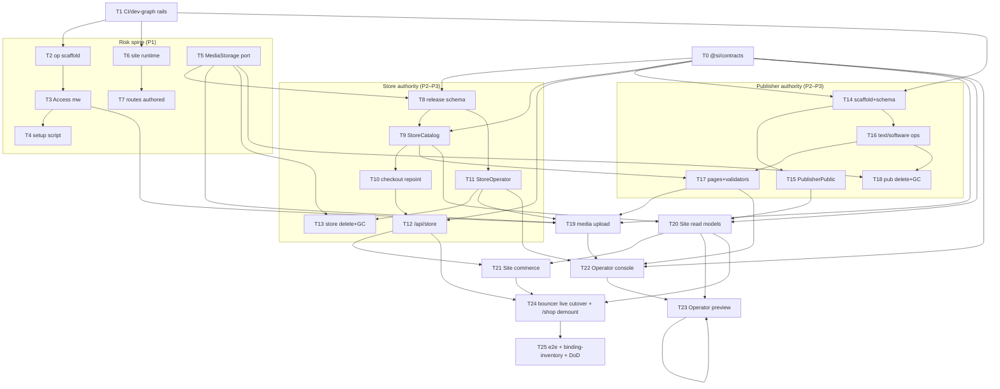

# 0004 — Unified publishing and commerce control plane

Status: COMPLETE
Started: 2026-07-19
Completed: 2026-07-20
RFC: [`docs/rfc/0001-unified-publishing-commerce-control-plane.md`](../../rfc/0001-unified-publishing-commerce-control-plane.md) (draft)
Base: `main` — site is a static Astro build; storefront is a vmf SPA at `/shop`
Owner: Apostoli

## Why

RFC-0001 defines the target architecture directly: one Access-protected
**Operator** console for texts, software records, pages, products, media,
orders, and fulfillment; a focused greenfield **Publisher** service; a Store
demoted from a `/shop` SPA to a headless commerce authority with public read
(`StoreCatalog`) and operator-mutation (`StoreOperator`) RPC entrypoints plus a
stable `/api/store` HTTP surface; and a **Site** promoted from a static build to
an on-demand Astro Worker that renders current published records. Media becomes
domain-owned and storage-neutral, releases become immutable-while-retained and
explicitly deletable, and the public route table gets one final owner per path.

That is a large, multi-worker change touching every surface. This plan is the
**orchestration layer**: it turns the RFC's decisions (D1–D14), invariants
(INV-\*), and test requirements into an ordered set of **tracks** and **phases**
with explicit dependencies, entry/exit gates, and a coverage map, so the work
can be built incrementally without a big-bang cutover and without ever taking
the live storefront dark.

This plan decides **sequence and ownership**, not architecture — the RFC is
authoritative on _what_ is built and _why_. Where this plan resolves something
the RFC leaves open (contract-package home, Astro island framework, the preview
mechanism), it is called out under **Open decisions** with a recommendation, not
silently assumed.

## How this plan was produced

Provenance, so a reader can trust the current-state claims and the ordering:

1. A grounded, read-only **survey** of the repository — one reader per subsystem
   (site, store, bouncer, roadie/media, operator+Access donor, guestlist buyer
   envelope, greenfield Publisher), each citing real files and symbols and
   separating "exists today" from "RFC requires."
2. **Three independent decompositions** of the full build by different staff
   engineers, each with a distinct ordering bias — _backend-authorities-first_,
   _vertical-slice-first_, and _risk-first_.
3. A **judge panel** and a **completeness critic** against every RFC decision,
   invariant, test tier, and definition-of-done item.

The two judges split productively: risk-first best matches where this RFC's
danger actually lives (Access failing open, the route cutover, media
neutrality), while backend-authorities-first was the only decomposition that
sequenced the bouncer route cutover **after** `StoreCatalog` and `/api/store`
exist — so the storefront is never dark. This plan takes the **risk-first spine
with the backend-authorities cutover-gating correction**, and folds in the
critic's gap-closing additions (operator preview, Site-side render safety and
SEO, binding-inventory tests, media-route disambiguation, `product_release_image`
snapshotting). The config/env-docs and release/CI survey slices were completed
directly against source (`release-please-config.json`, `packages/config`,
`docs/ops/*`) rather than through the survey agents.

## Current-state assessment

Grounded per subsystem. "Delta" is what RFC-0001 requires that does not exist
today.

| Subsystem                        | Exists today                                                                                                                                                                                                                                                                                                                                                                                                                                | Delta (net-new vs refactor)                                                                                                                                                                                                                                                                                                                                                                           |
| -------------------------------- | ------------------------------------------------------------------------------------------------------------------------------------------------------------------------------------------------------------------------------------------------------------------------------------------------------------------------------------------------------------------------------------------------------------------------------------------- | ----------------------------------------------------------------------------------------------------------------------------------------------------------------------------------------------------------------------------------------------------------------------------------------------------------------------------------------------------------------------------------------------------- |
| `workers/site`                   | Static Astro 7.0.9 (`output: "static"`), **no `wrangler.jsonc`**, hardcoded pages (`/`, `/shop`, `/shop/friend-001`, `/software`, `/software/system-001`, `/writing`, `/about`), build-time image imports from `docs/design/...`. `@si/design` consumed **CSS-only**; single `data-theme="dark"`; fixed-count 100dvh grids. Absent from bouncer routes and `scripts/dev-stack.ts`.                                                          | **Refactor to on-demand SSR Worker** (`output: "server"` + `@astrojs/cloudflare`, new `wrangler.jsonc`, read bindings). **Net-new** dynamic `/shop/:slug`, `/writing/:slug`, `/software/:slug`, `/cart`, `/checkout`, `/checkout/return`, `/orders/:number`, `/media/:mediaId`; typed loaders; cart/checkout islands; SEO from page docs; render-safety on the markdown path.                         |
| `workers/store`                  | TanStack Start SPA at `/shop` (vmf) using server **functions** (`*.functions.ts`) — **no `WorkerEntrypoint`/RPC class**, **no `/api/store` JSON API** (only `routes/api/img.$refId.ts`). Flat `product` row (no drafts/releases/SemVer). `order_item` already snapshots title/size/price with **no catalog FK**. Guarded stock reservation, Stripe elements checkout, DLQ + reconcile cron all present. Webhook constant is `/hooks/store`. | **Net-new** `StoreCatalog` + `StoreOperator` RPC entrypoints, `/api/store` HTTP surface, `MediaStorage` port, release-model schema (`product_draft` / immutable `product_release` / `product_release_image` / `store_operator_event` / deletion-intent / `store_media_gc_outbox`). **Refactor** pricing to source from the active release; keep every existing checkout/stock/Stripe/order invariant. |
| `workers/bouncer`                | Single `src/index.ts`; ROUTES in `wrangler.jsonc` (staging top-level + `env.production`). Modes passthrough / vmf / redirect; `/`→308→`/shop`; `/shop`→STORE vmf; `/account`→IDENTITY vmf; per-app `/_sfn/*` passthrough. No SITE binding.                                                                                                                                                                                                  | **Add** `/api/store/*` (passthrough, longest-prefix ahead of `/api`), `/hooks/store/*`, a `SITE` binding + root `/*` passthrough to Site; **remove** the `/`→`/shop` redirect and the `/shop` vmf mount. Operator is **not** in bouncer (own `desk.*` host + Access).                                                                                                                                 |
| Media (`workers/roadie` + store) | Browser-direct **register → presigned PUT (single/multipart) → finalize** keyed by `referenceId`, served by **signed-URL 302** (`/api/img/$refId`, no eligibility check). `ROADIE` binding **requires** `entrypoint:"Roadie"` + `props.callerApp`; `readCallerApp` throws otherwise. Server-side `roadie.put` (stream-through) exists but caps at **100 MB, no multipart**.                                                                 | Hide the entire lifecycle behind a private `MediaStorage {put/read/delete}` port (one adapter per backend, initially wrapping Roadie). **Net-new** domain media IDs distinct from `referenceId`; eligibility-checked public reads; logical-first delete + `media_gc_outbox`. No register/finalize/signed-URL/referenceId concept may cross a DTO/URL/schema/RPC boundary.                             |
| Operator + Access                | **No `workers/operator`.** Donor exists: `inbox/scripts/setup-access.mjs` (idempotent self-hosted Access app + reusable policy). `workers/identity` is a usable TanStack Start template.                                                                                                                                                                                                                                                    | **Greenfield** TanStack Start worker on `desk.somewhatintelligent.ca` (prod) / `desk.staging.somewhatintelligent.ca` (staging), outside bouncer, behind self-hosted Access. Fail-closed JWT middleware → `OperatorActor`; idempotent setup script writing `POLICY_AUD`/`TEAM_DOMAIN`; `DEV_OPERATOR` dev-only; `workers_dev:false`/`preview_urls:false` deployed.                                     |
| Publisher                        | **Does not exist.** `workers/guestlist` is a structural template (D1 + RPC entrypoint). No `@si/contracts`.                                                                                                                                                                                                                                                                                                                                 | **Greenfield** D1 worker: ~18 tables (texts/text_release, software_draft/publication, page/page_release, tags, links, media + `media_gc_outbox`, `operator_event`), `PublisherPublic` (read) + `PublisherOperator` (mutation) entrypoints, 5 fixed-page discriminated-union documents + validators, plan/confirm delete, donor-adapted editor primitives.                                             |
| Release / CI / config            | `release-please-config.json` components: bouncer, guestlist, promoter, roadie, identity, store. Scopes table in `docs/ops/commit-scoping.md` matches. `dev-stack.ts` `DEFAULT_WORKERS = [guestlist, identity, roadie, store]`. Workers deploy as `si-<service>-<env>` (`deploy.ts`). `docs/ops/env-vars.md` is a strict contract.                                                                                                           | **Add** `workers/publisher` + `workers/site` as release-please components + manifest entries (Operator is inbox-style manual — a scope with **no** component/CI lane); **add** `publisher`/`operator`/`site` commit scopes; wire the three into the dev graph; add env-var rows; new `@si/contracts` package.                                                                                         |

## Target state

The RFC's [D12 route table](../../rfc/0001-unified-publishing-commerce-control-plane.md#d12--the-route-table-has-one-final-owner-per-public-path)
is the north star:

| Host / path                                        | Owner     | Bouncer mode                      |
| -------------------------------------------------- | --------- | --------------------------------- |
| `…/api/store/*`                                    | Store     | passthrough                       |
| `…/hooks/store/*`                                  | Store     | passthrough                       |
| `…/api/*`                                          | Guestlist | passthrough                       |
| `…/account`, `…/_sfn/account`, `…/_assets/account` | Identity  | vmf / passthrough                 |
| `…/*` (root)                                       | Site      | passthrough                       |
| `desk.somewhatintelligent.ca/*`                    | Operator  | **direct + Access** (not bouncer) |

Reached when: one Access-protected Operator manages texts / software / pages /
products / stock / media / orders / fulfillment with impact-preview hard-delete;
Publisher and Store expose the declared separate public-read and
operator-mutation entrypoints; Astro renders every public route from those read
models; content/catalog changes require no code edit or deploy; Account stays on
Identity; Store stays the commerce authority; media bytes stay behind a
replaceable adapter; and no public route or Site binding can read drafts or
invoke operator mutations.

## Strategy — risk-first spine, authority-gated cutover

Two ideas drive the ordering.

**1. Front-load what is hard to reverse or silent-until-late.** Three failure
modes are expensive to unwind once code depends on them, so they land first,
before broad feature build:

- **Access failing open (D6).** A `workers.dev`/preview leak or a build-time
  dev-skip silently exposes the all-powerful Operator. The fail-closed
  middleware, the `ENVIRONMENT`-gated `DEV_OPERATOR`, and the idempotent
  setup-script **dry-run** are proven before the console is built on them.
- **Media reference leaking into a public contract (D10).** `roadieReferenceId`
  is a public URL segment today (`/api/img/$refId`). The private
  `MediaStorage {put/read/delete}` port shape is **frozen first**, so Store and
  Publisher schemas compile against a storage-neutral contract instead of baking
  a Roadie id into a column or DTO.
- **The route-table cutover (D12).** Removing `/shop` vmf and the `/`→`/shop`
  redirect and giving Site the apex is an all-hosts change. The route change is
  **authored and stub-tested early** but the **live cutover is deferred** (see
  rule 2).

Two foundation tracks precede the spine: a shared **`@si/contracts`** package
(nothing typed-links four workers without it) and the **release/CI/dev-graph/
env-docs rails** for the three new deployable workers (finished work cannot ship
without them).

**2. Never take the storefront dark — gate the live cutover on consumer
readiness.** This is the correction the judge panel demanded of a pure
risk-first plan. The bouncer **live** flip and the Store `/shop` **demount**
(T24) are gated on Site actually rendering `/shop` (T20) + the commerce islands
(T21) + `/api/store` answering (T12). The old vmf `/shop` SPA keeps serving
until its replacement is live. On greenfield **staging** there is an accepted,
staging-only window where Site owns `/` with placeholder copy before the loaders
land; production never cuts over until the replacement renders.

Everything else follows the natural dependency order: contracts → domain
authorities (schemas, RPC entrypoints, contract-tested) → HTTP/media wiring →
presentation + console → live cutover → end-to-end verification.

## Build dependency graph

## Tracks

Each track is owned by exactly one worker/package (cross-cutting tracks name the
lead). `D=` lists the RFC decisions it satisfies; `INV=` the invariants it must
prove. Every D1–D14 and every INV-\* is owned by exactly one track — see the
coverage maps below.

### Foundations

- **T0 — Shared contract package (`@si/contracts`).** Owner: `packages/contracts`
  (new). Deps: none. Deliverables: `OperatorActor`/`OperatorMeta`/`OperatorCall`/
  `OperatorCommandInput`, `DomainResult`, `DeletionImpact`/`DeletionPlan`/
  `ConfirmDeletionInput`/`DeletionError`, all public + operator DTOs, `CartV1` +
  `CART_STORAGE_KEY = "si:store:cart:v1"`, `PageDocumentByKey` union types, and
  runtime validators shared by write/read boundaries. `D=D7,D8,D9,D11`.
  `INV=INV-CART-1,INV-DOM-1,INV-SW-1`.
- **T1 — Release / CI / dev-graph / env-docs rails.** Owner: repo. Deps: T2/T6/T14
  scaffolds exist. Deliverables: add `workers/publisher` and `workers/site` to
  `release-please-config.json` + `.release-please-manifest.json`; add
  `publisher`/`operator`/`site` rows to `docs/ops/commit-scoping.md` (Operator is
  a valid scope but, like `inbox`, has **no** release-please component and **no**
  CI deploy lane — it deploys manually on its own `desk.*` hostname); add the
  three to `scripts/dev-stack.ts` selectable workers (Site + Publisher into the
  default graph; Operator selectable); add `docs/ops/env-vars.md` rows; RWX CI
  lanes. `D=D1,D12`.

### Risk spine

- **T2 — Operator scaffold.** Owner: `workers/operator`. Deps: T1. Deliverables:
  TanStack Start console shell (donor: `workers/identity`), `wrangler.jsonc`
  (staging + `env.production`, `si-operator-<env>`, `desk.*` custom domain,
  `workers_dev:false`/`preview_urls:false` deployed), **no** D1/R2/Stripe/
  Guestlist bindings. `D=D1`. `INV=INV-OP-2`.
- **T3 — Operator Access middleware.** Owner: `workers/operator`. Deps: T2.
  Deliverables: fail-closed middleware validating `Cf-Access-Jwt-Assertion`
  (team JWKS, issuer, audience, expiry) → `OperatorActor{sub,email}`;
  `ENVIRONMENT`-gated `DEV_OPERATOR`; missing-config outside dev → 500.
  `D=D6,D7`. `INV=INV-ACCESS-1,INV-ACCESS-2,INV-OP-1`.
- **T4 — Idempotent Access setup script.** Owner: `workers/operator`. Deps: T3.
  Deliverables: two-env script (donor: `inbox/scripts/setup-access.mjs`) that
  resolves/creates the reusable Allow policy + self-hosted app per hostname,
  reads audience + team domain, writes `POLICY_AUD`/`TEAM_DOMAIN` worker secrets,
  and offers a **dry-run** proving intended writes without mutating Cloudflare.
  `D=D6`. `INV=INV-ACCESS-1`.
- **T5 — `MediaStorage` port + Roadie adapter.** Owner: `workers/store` +
  `workers/publisher` + `workers/roadie`. Deps: T0. Deliverables: the frozen
  `MediaStorage {put/read/delete}` interface + `StorageResult`; one adapter
  module per backend wrapping Roadie (`roadie.put` stream-through for writes,
  `getReadUrl`→`Response` for reads, `removeReference` for deletes); a resolved
  key↔referenceId reconciliation. `D=D10`. `INV=INV-MEDIA-1,INV-DEL-4`.
- **T6 — Site runtime conversion.** Owner: `workers/site`. Deps: T1. Deliverables:
  `output:"server"` + `@astrojs/cloudflare`; new `wrangler.jsonc` (read bindings
  `PUBLISHER→PublisherPublic`, `STORE→StoreCatalog`; **no** custom domain/routes —
  bound by bouncer); `env.d.ts` runtime typing; `bun run types`. Keeps serving
  the current hardcoded pages until T20 loaders land. `D=D4`. `INV=INV-SITE-1`.
- **T7 — Bouncer route table (authored).** Owner: `workers/bouncer`. Deps: T6.
  Deliverables: add `/api/store`, `/hooks/store`, `SITE` binding + root `/*`
  passthrough; remove `/`→`/shop` redirect + `/shop` vmf mount **in a reviewed
  change that is stub-tested but only made live in T24**; the RFC routing tests.
  `D=D5,D11,D12`. `INV=INV-ROUTE-1,INV-AUTH-1`.

### Store authority

- **T8 — Store release-model schema migration.** Owner: `workers/store`. Deps:
  T0, T5. Deliverables: thin `product` (`id, slug, status incl. 'unavailable',
active_release_id, created_by_sub`), `product_draft`, immutable `product_release`
  (`UNIQUE(product_id, version)`), `product_release_image`, storage-neutral
  `product_image` (`storage_key`/`sha256`/`content_type`/`size`/`role`/`state`),
  `store_operator_event` (`UNIQUE(idempotency_key, action)` + `response_json`),
  `store_operator_deletion_intent`, `store_media_gc_outbox`. **Keep `product_variant`
  as-is** (its non-negative + unique constraints stay). No data migration.
  `D=D8,D10,D13`. `INV=INV-REL-1,INV-ORDER-1,INV-DEL-2,INV-DOM-1`.
- **T9 — `StoreCatalog` read RPC.** Owner: `workers/store`. Deps: T8. Deliverables:
  Site-bound read-only entrypoint (`listProducts`/`getProductBySlug`/`getProductById`/
  `openProductMedia`); active-release DTOs with `version`/`availability`/`coverMediaId`/
  `PublicMediaRef`; availability from live variant stock; `openProductMedia`
  eligibility gate. `D=D3,D4`. `INV=INV-DOM-1,INV-MEDIA-1`.
- **T10 — Checkout repointed to active release.** Owner: `workers/store`. Deps:
  T8, T9. Deliverables: price/title sourced from `product_release` (not the flat
  row), variant stock from `product_variant`; preserve `reserveStockAndWrite`,
  `computeOrderTotals`, Stripe idempotency, `order_item` snapshots. `D=D8`.
  `INV=INV-CHK-1,INV-CART-1,INV-STOCK-1,INV-PAY-1,INV-ORDER-1`.
- **T11 — `StoreOperator` mutation RPC.** Owner: `workers/store`. Deps: T8, T5.
  Deliverables: Operator-bound entrypoint (product draft/publish/status, variant,
  `adjustStock(delta,reason)`, media reorder, orders/fulfillment); `idempotencyKey
= :<action>:<commandId>` + `store_operator_event` per mutation; **publish
  snapshots current ready images into `product_release_image` in the same batch**;
  requires ≥1 ready image + ≥1 variant to publish. `D=D3,D8,D13`.
  `INV=INV-OP-1,INV-STOCK-1,INV-AUDIT-1,INV-REL-1`.
- **T12 — Store `/api/store` HTTP API.** Owner: `workers/store`. Deps: T0, T10,
  T7 (authored). Deliverables: `GET /config`, `POST /checkout-sessions`, `GET
/checkout-sessions/:id`, `GET /orders/:number`, `PATCH /orders/:number/shipping`,
  `GET /media/:mediaId` wrapping existing cores; `CartV1` normalization
  (≤50 lines, qty 1–10, dedupe); buyer resolution via the bouncer envelope +
  Guestlist session (verify the envelope is minted on the `/api/store` mount);
  webhook path `/hooks/store`→`/hooks/store/stripe`. `D=D11`.
  `INV=INV-CART-1,INV-CHK-1,INV-PAY-1,INV-MEDIA-1`.
- **T13 — Store hard-delete + media GC.** Owner: `workers/store`. Deps: T11, T5.
  Deliverables: plan/confirm for product / release / variant / product-media
  (bound `confirmationToken`, current-dependency re-check, tombstone audit);
  active-release deletion clears or moves to a named replacement in one
  transaction; `store_media_gc_outbox` drain handler alongside the reconcile cron.
  `D=D8,D10`. `INV=INV-DEL-1,INV-DEL-2,INV-DEL-3,INV-DEL-4`.

### Publisher authority (greenfield)

- **T14 — Publisher scaffold + D1 schema.** Owner: `workers/publisher`. Deps: T0,
  T1. Deliverables: worker scaffold (donor: `workers/guestlist`), ~18-table D1
  migration, local-dev wiring, seed of the five fixed-page draft documents (no
  fake texts/software/products). `D=D2,D8,D10`. `INV=INV-REL-1,INV-DOM-1`.
- **T15 — `PublisherPublic` read RPC.** Owner: `workers/publisher`. Deps: T14, T5.
  Deliverables: Site-bound read-only entrypoint over active release pointers +
  `software_publication`; no draft method; `openPublishedMedia` eligibility gate.
  `D=D3,D4,D9,D9.1`. `INV=INV-PUB-1,INV-MEDIA-1`.
- **T16 — `PublisherOperator` text + software lifecycles.** Owner: `workers/publisher`.
  Deps: T14, T0. Deliverables: text drafts/releases (+ tags, wikilinks) and
  software drafts/publications; immutable release publish with the audit event in
  the **same D1 batch**; software publish replaces one snapshot + bumps public
  `updatedAt`. `D=D8,D9.1,D13`. `INV=INV-REL-1,INV-SW-1,INV-SW-2,INV-AUDIT-1`.
- **T17 — `PublisherOperator` pages + document validators.** Owner: `workers/publisher`.
  Deps: T14, T16, **T9** (real `StoreCatalog` for page-reference validation).
  Deliverables: page draft/release for the five documents; runtime validators
  rejecting unknown component/HTML/style/script fields; publish-time validation
  of Store/media references against a real `StoreCatalog` (not a stub). `D=D9`.
  `INV=INV-PAGE-1,INV-DOM-1`.
- **T18 — Publisher hard-delete + media GC.** Owner: `workers/publisher`. Deps:
  T16, T17, T5. Deliverables: plan/confirm for text / text-release / software /
  page / page-release / tag / media; compact tombstone (no bodies/blobs); logical
  delete before `media_gc_outbox` drain. `D=D8,D10`.
  `INV=INV-DEL-1,INV-DEL-3,INV-DEL-4`.

### Media upload flow

- **T19 — Operator same-origin media upload.** Owner: `workers/operator` +
  `workers/store` + `workers/publisher`. Deps: T3, T5, T11, T17. Deliverables:
  Access-protected `POST /_operator/media/store/products/:productId` and
  `POST /_operator/media/publisher/:ownerType/:ownerId` (`multipart/form-data`),
  streaming to a private backend ingest surface (not an RPC method); returns the
  completed media DTO; **no** register/finalize/signed-URL crosses the boundary.
  `D=D10`. `INV=INV-MEDIA-1,INV-OP-2`.

### Presentation & console

- **T20 — Site read models.** Owner: `workers/site`. Deps: T6, T9, T15.
  Deliverables: typed page loaders + read clients; dynamic `/shop/:slug`,
  `/writing/:slug`, `/software/:slug`; page documents rendered into the committed
  grids (adapted for variable-length lists); **SEO/head from the `seo` block**
  (title/description/OpenGraph, `og:image` via the media route); **render-safety**
  — public markdown renderer disables raw HTML/MDX, CSP header emitted. `D=D4,D9,D9.1,D14`.
  `INV=INV-SITE-1,INV-PUB-1,INV-PAGE-1`.
- **T21 — Site commerce islands.** Owner: `workers/site`. Deps: T20, T12, T7.
  Deliverables: cart island (client `CartV1` storage), Stripe Payment Element
  checkout island (`@stripe/stripe-js`), live cart count, `/cart` `/checkout`
  `/checkout/return` `/orders/:number`, eligibility-checked `/media/:mediaId`
  delivery, bounded shared cache in deployed envs. `D=D4,D10,D11`.
  `INV=INV-CART-1,INV-MEDIA-1,INV-SITE-1`.
- **T22 — Operator 8-module console.** Owner: `workers/operator`. Deps: T3, T11,
  T17, T18, T19, T0. Deliverables: server-fn factory (require actor → validate
  input → build `OperatorMeta` server-side → one owning RPC); Overview / Objects /
  Texts / Software / Pages / Orders / Media / Settings modules; deletion two-step
  (impact → confirm) UI; donor-adapted editor primitives (Markdown, debounced
  autosave, tags, wikilinks — copy-owned from the external Apostoli.ca thoughts
  app, **not imported**); strict-Origin / no-permissive-CORS on server fns.
  `D=D1,D7,D8,D13,D14`. `INV=INV-OP-1,INV-AUDIT-1,INV-DEL-1`.
- **T23 — Operator preview (D14).** Owner: `workers/operator` + `workers/site`.
  Deps: T20, T22. Deliverables: resolve the **draft-read tension** (Site binds
  only draft-free reads per INV-SITE-1/INV-PUB-1) with an Access-gated Site
  preview route fed the rendered draft document by Operator (recommended over a
  preview-only draft binding); operator preview frames; a "preview shows draft,
  public route still shows prior release" test. `D=D14`. (Gap surfaced by the
  completeness critic — unbuilt in all three source decompositions.)

### Cutover & verification

- **T24 — Bouncer live cutover + Store `/shop` demount.** Owner: `workers/bouncer`
  - `workers/store`. Deps: **T12, T20, T21** (gate). Deliverables: make the T7
    route change live (Site owns `/`, `/api/store`+`/hooks/store` to Store,
    redirect/`/shop`-vmf removed); remove the Store `/shop` SPA routes; Store becomes
    headless. Never executed until the replacement renders. `D=D12`.
    `INV=INV-OP-1,INV-AUTH-1,INV-ROUTE-1`.
- **T25 — End-to-end + binding inventory + DoD.** Owner: repo + `e2e`. Deps: T24,
  T22, T23, T4, T13, T18. Deliverables: RFC browser tests 1–14 (incl. #14
  desktop+mobile screenshots) run against the real local Worker graph;
  **binding-inventory config-snapshot tests** proving Operator has no D1/R2/Stripe/
  Guestlist binding (INV-OP-2) and Site has only read-only entrypoints
  (INV-SITE-1); Access dry-run proof; docs updates (`docs/ARCHITECTURE.md` route/
  container model, `CLAUDE.md` route table, the RFC-0001 decision log). `D=D1,D4,D5,D6,D10,D11,D12,D13`.
  `INV=INV-ROUTE-1,INV-AUTH-1,INV-SITE-1,INV-OP-2,INV-ACCESS-1,INV-MEDIA-1`.

## Phases

Phases are sequenced; tracks inside a phase run in parallel subject to their
deps. Each phase has a hard exit gate.

| Phase                          | Tracks                               | Entry                                | Exit gate                                                                                                                                                                                                                                                                                                                              |
| ------------------------------ | ------------------------------------ | ------------------------------------ | -------------------------------------------------------------------------------------------------------------------------------------------------------------------------------------------------------------------------------------------------------------------------------------------------------------------------------------- |
| **P0 Foundations**             | T0, T1                               | RFC accepted                         | `@si/contracts` compiles and is imported by a stub in each of the four workers; three new workers appear in release-please + dev-graph.                                                                                                                                                                                                |
| **P1 Risk spine**              | T2, T3, T4, T5, T6, T7               | P0                                   | Access middleware fails closed on absent/expired/wrong-aud tokens and the setup dry-run proves the intended writes; `MediaStorage` port shape frozen; Site deploys as a Worker (still serving current pages); bouncer route change authored + stub-tested (**not live**).                                                              |
| **P2 Domain authorities**      | T8, T9, T10, T11, T14, T15, T16, T17 | P1                                   | Both authorities **fully contract-tested** (RPC union fixtures + Publisher/Store integration suites) **before any consumer binds real (non-stub) bindings**. Publisher page-ref validation exercises a real `StoreCatalog`.                                                                                                            |
| **P3 HTTP + media + deletion** | T12, T13, T18, T19                   | P2                                   | `/api/store` answers with buyer resolution verified on the mount; media flows browser→Operator→backend with no lifecycle leak; deletion plan/confirm + GC drains pass. **Vertical smoke checkpoint:** create→autosave→publish `1.0.0` a text → `PublisherPublic` → a temporary Site `/writing/:slug` render proves the full seam once. |
| **P4 Presentation + console**  | T20, T21, T22, T23                   | P3                                   | Site renders every public route from read models (incl. `/shop`), commerce islands work against `/api/store`, Operator console drives all eight modules, preview shows drafts. **Per-phase browser walk** on each increment.                                                                                                           |
| **P5 Live cutover**            | T24                                  | P4 (Site renders `/shop` + T12 live) | Route table flipped, `/shop` SPA removed, storefront served by Site with **zero dark window** in production.                                                                                                                                                                                                                           |
| **P6 Integration & DoD**       | T25                                  | P5                                   | RFC browser tests 1–14 + binding-inventory tests + Access dry-run pass; `bun run check` green; docs updated.                                                                                                                                                                                                                           |

## Critical path & parallelism

Longest chain: **T0 → T8 → T9 → T10 → T12 → T21 → T24 → T25**, with the Publisher
chain **T14 → T16 → T17** (T17 gated on T9) and the Operator chain **T2 → T3 →
T19/T22 → T23** running in parallel. `T5` (media port) is an early cross-cutting
prerequisite for T8/T9/T11/T19/T13/T18 and must not slip. Publisher text/software
lifecycles (T16) parallelize with Store because only **page** publish (T17) needs
`StoreCatalog` — keep that one read edge is the only Publisher→Store coupling.

## Cross-cutting rules (invariants of the plan itself)

1. **Never-dark storefront.** The old serving path is never removed until the new
   one renders. T24 is gated on T20+T21+T12. (Accepted exception: a staging-only
   apex-shell window created by the P1 authored route change; production never
   cuts over early.)
2. **Publish-batch ordering.** For text **and** page publish, the D1 batch (not a
   transaction) must insert the release **before** moving the active pointer and
   include the `operator_event` in the **same** batch, or INV-REL-1/INV-AUDIT-1
   silently break. Product publish snapshots ready images into
   `product_release_image` in the same batch.
3. **Contract SSOT.** Site, Operator, Publisher, and Store all import DTOs/envelopes
   from `@si/contracts`; no divergent copies. `CART_STORAGE_KEY` is `"si:store:cart:v1"`
   (today's store uses `si.store.cart.v1` — reconcile in T0/T21).
4. **Media neutrality is frozen before schemas.** No `roadieReferenceId`/register/
   finalize/signed-URL concept appears in any DTO, public URL, D1 column exposed
   to a consumer, or RPC method. Domain media IDs are distinct from storage keys.
5. **Binding inventory.** Operator ships with only `STORE_OPERATOR`/`PUBLISHER_OPERATOR`
   bindings; Site ships with only `StoreCatalog`/`PublisherPublic`. A config-snapshot
   test enforces the absence of forbidden bindings (INV-OP-2 / INV-SITE-1).
6. **Preview respects the read boundary.** Operator preview does not give Site a
   draft-read binding; the draft document is rendered by pushing it into an
   Access-gated Site preview route (T23).

## Decision coverage map

| Decision                                             | Track(s)                                   |
| ---------------------------------------------------- | ------------------------------------------ |
| D1 One operator app / distributed authorities        | T2, T22                                    |
| D2 Focused Publisher, not a general CMS              | T14, T22 (editor donors)                   |
| D3 Domain ownership distributed                      | T8/T9/T11 (store), T15/T16/T17 (publisher) |
| D4 Astro is sole public presentation                 | T6, T20, T21                               |
| D5 Account remains its own worker                    | T7, T24 (route table keeps `/account`)     |
| D6 Operator matches Agentic Inbox Access             | T3, T4                                     |
| D7 Operator server fns wrap domain RPCs              | T0, T22                                    |
| D8 Immutable-while-retained, deletable releases      | T8, T11, T13, T16, T17, T18                |
| D9 / D9.1 Typed page documents / software record     | T17, T15, T20                              |
| D10 Media domain-owned + storage-neutral             | T5, T9, T13, T15, T18, T19, T21            |
| D11 Checkout is `/api/store` consumed by islands     | T12, T21                                   |
| D12 One final owner per public path                  | T7, T24                                    |
| D13 Every operator mutation auditable                | T11, T16, T22                              |
| D14 Design system shared, not route code (+ preview) | T20, T23                                   |

## Invariant ownership map

| Invariant                                     | Owning track                                    |
| --------------------------------------------- | ----------------------------------------------- |
| INV-OP-1, INV-OP-2                            | T3 / T2 + T19 + T25 (config test)               |
| INV-ACCESS-1, INV-ACCESS-2                    | T3, T4                                          |
| INV-AUTH-1, INV-ROUTE-1                       | T7, T24                                         |
| INV-DOM-1                                     | T8, T17                                         |
| INV-PUB-1                                     | T15, T20                                        |
| INV-SW-1, INV-SW-2                            | T16                                             |
| INV-REL-1                                     | T8, T11, T16                                    |
| INV-DEL-1…4                                   | T13, T18 (INV-DEL-2 also T8; INV-DEL-4 also T5) |
| INV-PAGE-1                                    | T17 (validators) + T20 (Site render-safety)     |
| INV-SITE-1                                    | T6, T20, T25 (config test)                      |
| INV-CART-1, INV-CHK-1, INV-STOCK-1, INV-PAY-1 | T10, T12                                        |
| INV-ORDER-1                                   | T8, T10                                         |
| INV-MEDIA-1                                   | T5, T9, T15, T19, T21                           |
| INV-AUDIT-1                                   | T11, T16                                        |

## Test strategy

Maps the RFC's [Test requirements](../../rfc/0001-unified-publishing-commerce-control-plane.md#test-requirements)
onto tracks, plus the gaps the critic surfaced.

- **Contract tests** (RPC input/result validation; SemVer accept/reject; page
  document variants; `CartV1`) → T0, and each RPC track.
- **Publisher integration** (draft revision, `revision_conflict`, immutable
  publish + one-batch audit, draft-invisible public reads, tags/wikilinks,
  page-ref validation, software snapshot, deletion tombstones, GC retry) → T14–T18.
- **Store integration** (preserve all existing pricing/stock/Stripe/DLQ/order
  tests; draft concurrency; publish requires media+variant; releases never mutate
  stock; explicit deletion preserves order/ledger/fulfillment; forged-price
  rejection; one idempotent event per mutation) → T8–T13.
- **Access tests** (dev resolves only `DEV_OPERATOR`; missing secrets fail closed;
  bad tokens 403 before any domain call; setup dry-run) → T3, T4.
- **Bouncer routing tests** (`/writing/x` reaches Site unchanged; `/account/security`
  → Identity as `/security`; Site gets no vmf rewrite; `/api/store`/`/hooks/store`/
  `/_sfn/account` win over the root catch-all) → T7, T24.
- **Browser tests 1–14** against the real local Worker graph, incl. #14
  desktop+mobile screenshots → T25, with **per-phase browser walks** in P4.
- **Added by the critic:** binding-inventory config-snapshot tests (INV-OP-2/
  INV-SITE-1) → T25; Site-side render-inert test for script/HTML fixtures in a
  published body (INV-PAGE-1) → T20; preview-vs-public test → T23.

The reference signal is root `bun run check`; narrow worker tests + Astro
type/build checks run before it.

## Build split — offline vs live-wiring

Distinguishes what is testable locally against miniflare/stubs from what needs a
live Cloudflare/Stripe/Access account:

- **Offline (miniflare + `.dev.vars`, no live account):** `@si/contracts`, all
  D1 schemas + migrations, both authorities' RPC + integration suites, the
  `MediaStorage` port against a local Roadie sim, Site SSR + loaders against local
  bindings, Operator with `DEV_OPERATOR`, bouncer routing tests, the Stripe-stub
  checkout path, the full browser journey via the dev graph.
- **Live-wiring (per env, operator-run, out-of-band — the RWX deploy pipeline
  does not push worker secrets):** the Cloudflare Access application + reusable
  policy + `POLICY_AUD`/`TEAM_DOMAIN` secrets (T4); Publisher R2 provisioning
  (per-env account-scoped S3 keypair for Roadie's server-side R2; browser-PUT CORS
  is likely **no longer required** since uploads stream through Operator, not a
  browser-direct PUT — verify against the read-redirect path); the Stripe
  dashboard webhook URL change to `/hooks/store/stripe`; DNS for `desk.*` and the
  Site apex; `workers_dev:false`/`preview_urls:false` verification.

## New-worker wiring checklist

For each of `publisher`, `operator`, `site` (see `docs/adding-an-app.md`):

- [ ] Workspace entry + `package.json` (version `0.0.0`) + `tsconfig`.
- [ ] `wrangler.jsonc`: staging top-level + single `env.production`, name
      `si-<svc>-<env>`, `account_id`, `compatibility_date`, `nodejs_compat`. Site +
      Publisher are bound by bouncer (**no** `routes`/`custom_domain`); Operator
      declares its own `desk.*` custom domain and `workers_dev:false`/`preview_urls:false`.
- [ ] `release-please-config.json` component + `.release-please-manifest.json`
      entry — **`publisher` and `site` only**. Operator is inbox-style: no
      release-please component and no CI deploy lane; it deploys manually.
- [ ] `docs/ops/commit-scoping.md` scope row.
- [ ] `scripts/dev-stack.ts`: Site + Publisher into `DEFAULT_WORKERS`; Operator
      selectable.
- [ ] `docs/ops/env-vars.md` rows (below).
- [ ] `bun run types` after every wrangler edit.
- [ ] RWX CI/CD lane (or explicit note if manual, like `inbox`).

## Environment & config additions

New `docs/ops/env-vars.md` rows (RFC "Required environment contract additions"):

| Variable        | Consumer                     | Dev                 | Staging / production                                                                  |
| --------------- | ---------------------------- | ------------------- | ------------------------------------------------------------------------------------- |
| `OPERATOR_URL`  | Operator / bouncer docs      | local URL           | `https://desk.staging.somewhatintelligent.ca` / `https://desk.somewhatintelligent.ca` |
| `POLICY_AUD`    | Operator                     | omitted (dev actor) | Wrangler **secret**, required                                                         |
| `TEAM_DOMAIN`   | Operator                     | omitted (dev actor) | Wrangler **secret**, required                                                         |
| `DEV_OPERATOR`  | Operator (dev only)          | fixed dev actor     | absent                                                                                |
| `SITE_URL`      | Site / Store checkout return | Astro local URL     | public apex                                                                           |
| `PUBLISHER_URL` | Publisher diagnostics only   | local URL           | worker URL if a diagnostic route exists                                               |

Config notes: workers already deploy as `si-<service>-<env>` from
`packages/config/src/deploy.ts` (`workerPrefix:"si"`, `baseDomain:"somewhatintelligent.ca"`).
`STORE_URL` must stay apex-pinned because `/api/store` buyer resolution compares
the bouncer-stamped host to `new URL(STORE_URL).hostname`. Confirm whether
`deploy.ts` needs a code-consumed value for the `desk.*` subdomain or whether it
stays wrangler-only (recommended: wrangler-only). New workers read brand from
`@si/config`; Operator (TanStack Start) additionally consumes `@si/design` +
semantic `@si/ui` and may carry its own `app-brand`, mirroring `workers/identity`.

## Open decisions

Resolve each before the phase it gates; recommendations in **bold**.

1. **Contract home** (gates P0): **new `packages/contracts` (`@si/contracts`)** vs
   exporting from the Publisher package like Roadie's `./client`. A standalone
   package avoids Site/Operator depending on a Publisher build.
2. **Astro island framework** (gates T21): `@astrojs/react` (pulls react/react-dom
   into a zero-JS worker) vs **vanilla `<script>` islands** + `@stripe/stripe-js`.
   `@stripe/stripe-js` is required either way for the Payment Element.
   **Resolved (2026-07-19):** vanilla `<script>` islands — `workers/site/package.json`
   carries `@stripe/stripe-js` and no `react`/`react-dom`/`@astrojs/react` dependency.
3. **`@astrojs/cloudflare` version** (gates T6): pick one compatible with pinned
   Astro `7.0.9` — no adapter exists in the repo today.
   **Resolved (2026-07-19):** `@astrojs/cloudflare` `^14.1.3` (`workers/site/package.json`).
4. **`MediaStorage` key ↔ Roadie referenceId** (gates T5): **store the referenceId
   as the private `storage_key`** vs maintain a key→referenceId map. Note
   `roadie.put` caps at 100 MB with no multipart, while the old browser-direct
   presign path did 10 GB — accept the 100 MB ceiling for product/text imagery, or
   build server-side multipart in the adapter.
   **Resolved (2026-07-19):** the Roadie `referenceId` IS the private `storage_key`,
   no key→referenceId map — `workers/store/src/lib/media-storage-roadie.ts` threads the
   caller's logical key in as Roadie's `resourceId` and returns the referenceId as the key.
5. **Preview mechanism** (gates T23): **Resolved — Operator POSTs the draft
   document to a POST-only Site `/__preview` route, HMAC-authenticated.** A
   preview-only draft binding on Site is rejected (violates INV-SITE-1). Site
   holds no SITE-side draft binding and Operator holds no SITE binding (INV-OP-2);
   the draft travels in the request body, signed with a shared
   `PREVIEW_SIGNING_SECRET` (HMAC-SHA256 over `${expiresAt}.${payloadJson}`,
   base64url, ~120s TTL) that only the Access-protected Operator can mint. Site
   verifies over the exact transmitted bytes (constant-time), re-validates page
   documents with the contract validator, then renders the draft through the SAME
   view components / markdown pipeline / layout / CSS as the public routes, with
   `noindex` (meta + `X-Robots-Tag`), `Cache-Control: no-store`, and the CSP
   middleware relaxing only `frame-ancestors` to the Operator origin for that
   path. Supported kinds: text, software, page (all five page keys).
6. **Media-route disambiguation** (gates T20/T21): how Site `/media/:mediaId`
   routes a bare id to Publisher vs Store, and which canonical `href` each DTO
   emits (`/media/:id` vs `/api/store/media/:id`). **Resolved (T20/T21) as
   route-prefix disambiguation, not id-namespacing.** Publisher owns the bare
   `/media/:id` prefix — every `PublicMediaRef.href` from `PublisherPublic`
   emits `/media/:id`, and Site's `GET /media/:mediaId` APIRoute forwards
   straight to `PublisherPublic.openPublishedMedia`. Store owns
   `/api/store/media/:id` (served by Store through bouncer's `/api/store` mount,
   never by Site). The owner is decided by the path prefix, so a bare id is
   always Publisher's and no shared id namespace is required.
7. **Webhook path migration** (gates T12): `/hooks/store` → `/hooks/store/stripe`
   must change in lockstep across the Store constant, `worker.ts` exact-match, and
   the Stripe dashboard endpoint.
   **Resolved (2026-07-19):** the constant is `/hooks/store/stripe`
   (`workers/store/src/lib/stripe-webhook.ts`), forwarded under bouncer's
   `/hooks/store` passthrough mount (`workers/bouncer/wrangler.jsonc`).
8. **Bouncer envelope scope** (gates T12): per-`(host,upstream)` vs per-mount is
   unverified on disk — verify the `/api/store` mount inherits the customer
   envelope before trusting buyer auth.
   **Resolved (2026-07-19):** the `/api/store` mount carries the buyer envelope —
   `workers/store/src/api/store-api.ts` resolves the buyer from the bouncer Ed25519
   envelope + guestlist RPC, host-compared against the apex-pinned `STORE_URL` (T12).
9. **Deletion engine shape** (gates T13/T18): shared helper across Store+Publisher
   vs per-worker copies (schemas differ). **Recommend a shared `@si/contracts`
   helper for the plan/confirm token + impact math, per-worker execution.**
   **Resolved (2026-07-19):** per-worker copies — `@si/contracts` exports only the
   deletion DTOs (`packages/contracts/src/deletion.ts`); Store
   (`workers/store/src/lib/operator.ts`) and Publisher
   (`workers/publisher/src/operator/writes.ts`) each own token hashing + impact-drift
   rejection, since the two schemas differ.

## Risks & mitigations

| Risk                                             | Mitigation                                                                                                                                               |
| ------------------------------------------------ | -------------------------------------------------------------------------------------------------------------------------------------------------------- |
| Access fails open (silent, catastrophic)         | Fail-closed middleware + `ENVIRONMENT`-gated dev actor + setup dry-run land in P1 before the console (T3/T4); binding-inventory test in T25.             |
| Storefront goes dark during cutover              | Never-dark rule; T24 gated on T12+T20+T21; old `/shop` kept live until replacement renders.                                                              |
| Roadie referenceId leaks into a public contract  | `MediaStorage` port frozen in P1 before schemas (T5); domain media IDs distinct from keys; T25 render/URL audits.                                        |
| Checkout regression when repricing off releases  | T10 preserves `reserveStockAndWrite`/`computeOrderTotals`/Stripe idempotency; keep all existing Store tests green (RFC "preserve all existing … tests"). |
| Publish batch mis-ordered → broken pointer/audit | Cross-cutting rule 2; contract + integration tests assert release-before-pointer + same-batch event.                                                     |
| `product_release_image` snapshot forgotten       | Named explicitly in T11 deliverables; browser test #6 covers publish→`/shop/:slug`.                                                                      |
| `@astrojs/cloudflare`/island choices block Site  | Resolved in P1 open decisions before T6/T20 build.                                                                                                       |

## Definition of done

The RFC DoD, plus the proofs the critic added:

- One Access-protected Operator manages texts / software / pages / products /
  stock / media / orders / fulfillment, with impact-preview hard-delete that
  never erases transaction history.
- Publisher and Store expose the declared separate public-read and
  operator-mutation entrypoints; Astro renders every public route (incl.
  `/software/:slug`) from those read models.
- Content/catalog changes require no code edit or site deploy; Account stays on
  Identity; Store stays the checkout/order/payment/fulfillment authority; media
  bytes stay behind a replaceable adapter.
- The HTTP, RPC, D1, invariant, Access, and browser test tiers pass.
- **No public route or Site binding can read drafts or invoke operator mutations —
  proven by binding-inventory config-snapshot tests (INV-OP-2 / INV-SITE-1).**
- **Operator can preview the exact public presentation of a draft before
  publication (D14), and the public route still shows the prior release.**
- Root `bun run check` is green; `docs/ARCHITECTURE.md`, `CLAUDE.md`, and the
  RFC-0001 decision log reflect the new topology.

## Commit conventions

PR titles are conventional commits `type(scope): description` (squash merges
become the main-branch commit; release-please versions each worker). New valid
scopes introduced by this plan: **`publisher`**, **`operator`**, **`site`**
(added to `docs/ops/commit-scoping.md` in T1). `publisher` and `site` are also
release-please components; **`operator` is a scope only** — like `inbox` it has
no release-please component and no CI deploy lane, and deploys manually.
Package changes are scoped by the worker whose version must bump; `@si/contracts`
changes scope to the consuming worker most affected. Use multi-scope
(`feat(store,publisher): …`) when a change genuinely bumps more than one.

## References

- RFC-0001 — [`docs/rfc/0001-unified-publishing-commerce-control-plane.md`](../../rfc/0001-unified-publishing-commerce-control-plane.md)
- Prior exec-plans (format + commerce donors): [`0002-stripe-billing-infrastructure.md`](0002-stripe-billing-infrastructure.md), [`../completed/0003-store-checkout-elements.md`](../completed/0003-store-checkout-elements.md), [`../completed/0001-greenfield-bootstrap.md`](../completed/0001-greenfield-bootstrap.md)
- Access donor — `inbox/scripts/setup-access.mjs`
- Media provisioning — [`docs/runbooks/roadie-r2-provisioning.md`](../../runbooks/roadie-r2-provisioning.md)
- Adding a worker — [`docs/adding-an-app.md`](../../adding-an-app.md); env contract — [`docs/ops/env-vars.md`](../../ops/env-vars.md); scoping — [`docs/ops/commit-scoping.md`](../../ops/commit-scoping.md)
