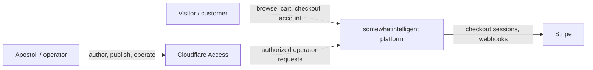
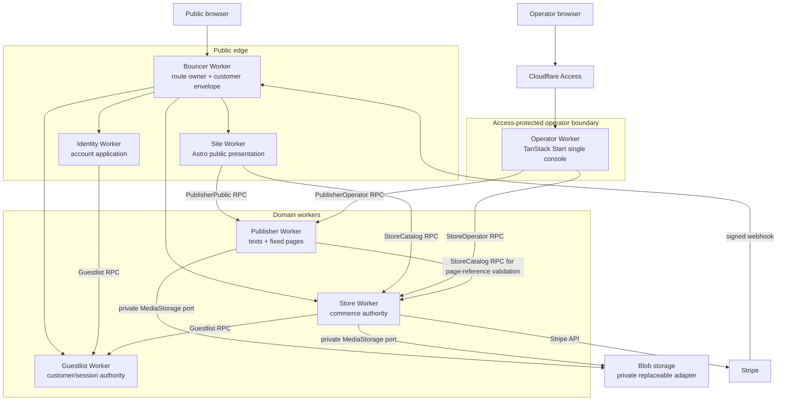
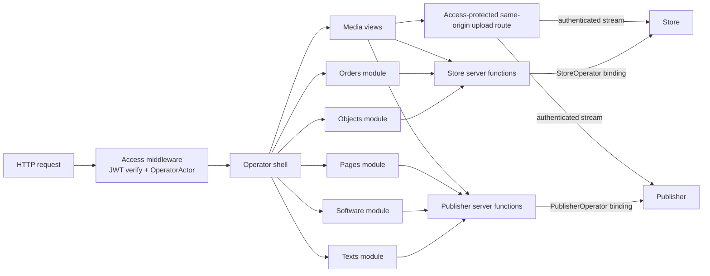
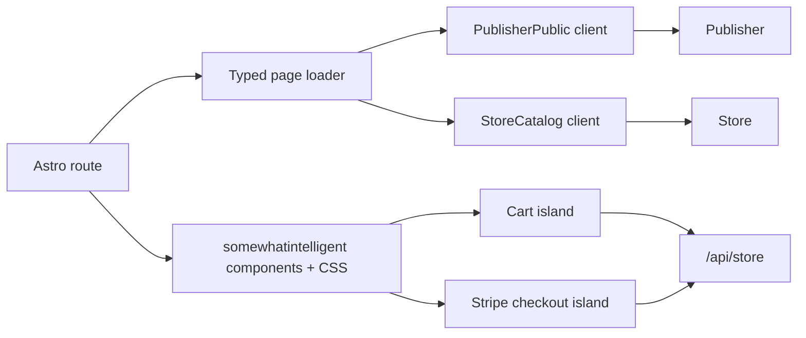

# RFC-0001 — Unified publishing and commerce control plane

## Why

The somewhatintelligent public site is visually established, but it is not yet
an operable publishing system. `workers/site` is an Astro 7 static build whose
products, text placeholders, page copy, and featured sections are authored in
source files. Changing public content therefore requires a code edit and a new
deployment.

The existing platform already owns the difficult operational state:

- Store D1 owns products, variants, stock, carts, orders, Stripe checkout, and
  fulfillment.
- Store and Publisher own their logical media records. Blob persistence is an
  internal storage adapter currently backed by Roadie/R2 and is not a platform
  interface.
- Guestlist owns customer users, sessions, and Stripe customer identity.
- Identity owns the account application mounted at `/account`.
- Bouncer owns the public route table and establishes customer identity for
  platform applications.

The missing capability is a single operator application where Apostoli can:

- create, revise, version, publish, and retire texts;
- create, publish, update, retire, and delete software catalog records that
  point to internal or external work;
- explicitly hard-delete texts, software records, pages, releases, products,
  variants, and media;
- edit the fixed public pages and select featured material;
- create products, publish product releases, manage variants, inventory, and
  product media;
- inspect and fulfill orders; and
- preview the exact public Astro presentation before publication.

That console must remain usable independently of Guestlist and Identity. An
operator must not need a platform session to repair or operate the platform.
The public account application must nevertheless remain a separate worker and
continue using the existing customer identity system.

This RFC defines the target architecture directly. There is no staged data
migration: the store has no meaningful live catalog to preserve and the
external Apostoli.ca Thoughts application is only an implementation reference,
not a somewhatintelligent route or data source.

## Goals

1. One operator-facing application for texts, software records, pages,
   products, media, orders, and fulfillment.
2. No code modification or site deployment for ordinary content and catalog
   operations.
3. One authoritative owner for every piece of domain state.
4. An Astro public site that renders current published records while preserving
   the committed visual system.
5. Operator authentication independent of Guestlist/Identity and protected by
   Cloudflare Access.
6. Explicit typed RPC, HTTP, persistence, and route contracts.
7. Preserve the existing checkout, payment, inventory, order, and media
   invariants.
8. Give the operator explicit, auditable destructive-delete authority over
   authored content and catalog records.

## Decisions

### D1 — One operator application, many domain authorities

`workers/operator` is the only operator-facing application. It is a TanStack
Start application because the product editor, order controls, and the reusable
parts of the Apostoli.ca Thoughts editor are React interfaces with substantial
client state.

The console contains these modules in one navigation shell:

- Overview
- Objects
- Texts
- Software
- Pages
- Orders
- Media
- Settings

Operator does not bind D1, R2, Stripe, or Guestlist. Its server functions call
the owning services through named Worker RPC entrypoints. Store and Publisher
are backend authorities, not additional admin applications.

Rejected: separate product and writing admin applications. They reproduce the
present fragmentation and make cross-domain page curation awkward.

Rejected: a single operator-owned database. It would bypass Store's transaction
and inventory rules, duplicate domain media metadata, and turn the console into the
source of truth for domains it does not own.

### D2 — Build a focused Publisher service; do not adopt a general CMS

`workers/publisher` is a Cloudflare Worker with D1 and named RPC entrypoints.
It implements only the content capabilities somewhatintelligent needs: text
drafts and releases, software catalog drafts and publications, fixed-page
drafts and releases, tags, links, media references, publication state, and
audit records.

This is not equivalent to implementing every editor primitive from scratch.
The Markdown editor, debounced autosave behavior, tag controls, wikilink
support, and workspace navigation from
`/Users/stoli/Desktop/devel/personal/active/Apostoli.ca/apps/thoughts` are
copy-owned implementation donors. Their Guestlist authorization, routes,
schema, and persistence functions are not imported.

Alternatives considered:

- **Payload CMS** is technically viable on Cloudflare D1 and R2, but it brings
  a second authentication system, collection authority, admin application, and
  Next.js runtime. Making it the one operator console would require adapting
  Store operations into Payload-specific custom views and hooks; using it only
  for texts would recreate two admin systems. Its Cloudflare capability is not
  the issue—the conflicting authority and application model is.
- **Keystatic** integrates with Astro, but its production collaboration mode
  writes content through GitHub and authenticates through repository access.
  That turns publication back into repository mutation and deployment rather
  than runtime operation.
- **Astro content collections** remain useful as a typed read abstraction, but
  they do not provide the operator application or own publication mutations.

The CMS decision must be revisited only if multi-author editorial workflow,
localization, approval queues, or hundreds of independently-shaped content
types become real requirements.

References:

- [Payload D1 adapter](https://payloadcms.com/docs/database/sqlite#d1-database)
- [Payload R2 storage](https://payloadcms.com/docs/upload/storage-adapters#r2-storage)
- [Keystatic GitHub mode](https://keystatic.com/docs/github-mode)
- [Astro live content collections](https://docs.astro.build/en/guides/content-collections/#live-content-collections)

### D3 — Domain ownership remains distributed

| Domain                                                                  | Authoritative owner     | Operator capability                                                       |
| ----------------------------------------------------------------------- | ----------------------- | ------------------------------------------------------------------------- |
| Product identity, copy, release, price, variants, stock, product media  | Store D1                | `StoreOperator`                                                           |
| Cart, checkout, orders, payment, fulfillment                            | Store D1                | `StoreOperator` for administration; public Store HTTP API for buyers      |
| Texts, text releases, tags, links                                       | Publisher D1            | `PublisherOperator`                                                       |
| Software catalog records, outbound destinations, and presentation media | Publisher D1            | `PublisherOperator`                                                       |
| Editable fixed-page documents and placements                            | Publisher D1            | `PublisherOperator`                                                       |
| Product media identity, metadata, eligibility, and deletion             | Store D1                | `StoreOperator`; bytes hidden behind Store's private storage port         |
| Text/page media identity, metadata, eligibility, and deletion           | Publisher D1            | `PublisherOperator`; bytes hidden behind Publisher's private storage port |
| Blob persistence implementation                                         | Private backend adapter | not addressable by Site, Operator UI, or any public/domain contract       |
| Customer users, sessions, billing customer identity                     | Guestlist               | unchanged; not an Operator dependency                                     |
| Account UI                                                              | Identity worker         | unchanged at `/account`                                                   |
| Public presentation                                                     | Astro Site worker       | read-only                                                                 |
| Human operator identity                                                 | Cloudflare Access       | verified by Operator only                                                 |

Product presentation is not split between Store and Publisher. Store owns the
complete product aggregate, including title, description, price, release
version, and product images. Publisher may hold a page placement that refers to
a Store product ID, but it never overrides the product record.

### D4 — Astro is the sole public editorial and storefront presentation

`workers/site` moves from static output to Cloudflare-backed on-demand Astro
rendering. It retains the exact somewhatintelligent components and CSS, but
loads current published records on the server:

- `StoreCatalog` supplies active product releases and live availability.
- `PublisherPublic` supplies published text releases, software records, and
  fixed-page documents.

Site receives only read-only service bindings. It cannot create drafts, mutate
products, alter inventory, fulfill orders, or access unpublished data.

Interactive cart and embedded Stripe checkout behavior is implemented as
small client islands inside the Astro pages. Those islands call the stable
same-origin Store HTTP API through Bouncer; they do not call D1, Publisher, or
operator RPCs.

Pages begin uncached in development and use a short bounded shared cache in
deployed environments. Checkout always re-prices and re-checks stock in Store,
so cached presentation can never authorize a stale transaction.

### D5 — Account remains its own worker

Identity continues to own the `/account` application and its client/server
assets. Site links to `/account`; it does not render, embed, proxy, or absorb
account-management routes.

Guestlist remains the user/session/billing-customer authority. This RFC does
not move customer authentication into Astro, Publisher, or Operator.

Operator authentication is deliberately separate. Passing Cloudflare Access
does not create a Guestlist user or platform session, and a platform admin role
does not grant access to Operator.

### D6 — Operator matches the Agentic Inbox Access pattern

Operator deploys directly on `desk.somewhatintelligent.ca` in production and
`desk.staging.somewhatintelligent.ca` in staging, outside Bouncer. Each hostname
has a self-hosted Cloudflare Access application whose reusable Allow policy
contains the configured operator email addresses. Operator disables
`workers.dev` and preview URLs in both deployed environments, so an alternate
unprotected hostname cannot bypass Access.

The repository adopts the proven Agentic Inbox setup shape:

1. An idempotent setup script resolves or creates the reusable Access policy.
2. It resolves or creates the self-hosted Access application for the operator
   hostname.
3. It reads the application audience and Zero Trust team domain.
4. It writes `POLICY_AUD` and `TEAM_DOMAIN` as Worker secrets using Wrangler's
   authenticated Worker write path.
5. Operator validates `Cf-Access-Jwt-Assertion` with the team JWKS, issuer, and
   audience on every non-development request.
6. Missing configuration or an invalid token fails closed outside local
   development.

This follows Cloudflare's current recommendation that a Worker behind Access
validate the application token rather than trust the presence of a header or
cookie alone:
[Validate Access JWTs](https://developers.cloudflare.com/cloudflare-one/access-controls/applications/http-apps/authorization-cookie/validating-json/).

Local development uses an explicit fixed `DEV_OPERATOR`; it is available only
when `ENVIRONMENT === "development"`. Staging and production never fall back
to it.

Gateway/WARP device posture is optional defense in depth and is not required by
this RFC.

### D7 — Operator server functions wrap domain RPCs

The browser calls same-origin Operator server functions. Each server function:

1. requires an authenticated `OperatorActor` from Access middleware;
2. validates its browser-supplied input;
3. creates `OperatorMeta` server-side;
4. calls exactly one owning service RPC method; and
5. returns the typed result without exposing the service binding.

The browser cannot supply or override `actor`, `requestId`, or
`idempotencyKey`. A mutation UI supplies an opaque UUID `commandId`; Operator
derives `idempotencyKey = <actor.sub>:<action>:<commandId>`. Retrying the same
UI command therefore remains stable without allowing the browser to assert an
identity.

Store and Publisher accept the asserted actor for attribution and audit. Their
machine-authorization boundary is the named service binding granted to
Operator. Neither exposes operator mutations through public HTTP.

### D8 — Releases are immutable while retained, and explicitly deletable

Texts, fixed pages, and products have mutable drafts and immutable releases.
Publishing copies the validated draft into a new release identified by an
operator-supplied semantic version such as `1.0.0`, then atomically moves the
aggregate's public pointer to that release.

There is no update-in-place release operation. A correction normally produces a
new version, and retirement clears public eligibility without destroying
release history. Immutability is provenance behavior, not a restriction on the
operator's authority: Operator also exposes explicit hard-delete commands for
an individual release or an entire aggregate.

Deleting the active release atomically clears the public pointer unless the
command names a retained replacement release. Deleting an aggregate removes
its draft, releases, domain-owned references, variants, and media records in a
deliberate domain transaction. Cross-domain page references are not part of
that transaction; they become safe dangling references that Site renders as an
empty state until the page is edited. Store order items are value snapshots without
catalog foreign keys, so product deletion never erases or rewrites historical
orders, payment ledgers, or fulfillment facts.

Every destructive command first returns an impact summary and requires a
separate confirmation token bound to the operator, action, target, and current
revision. Execution is idempotent and records a compact audit event containing
identifiers and counts, never the deleted body or blob. This is protection
against accidental deletion, not a soft-delete substitute.

When an active release is deleted without replacement, Store marks the product
`unavailable`, Publisher returns the text to `draft`, and a fixed page has no
public document until it is republished. Deleting a variant makes stale
browser-local carts fail normal checkout availability validation. A deleted
version may be published again later; it is a new immutable release with a new
release ID and timestamp.

Inventory, availability, payment, access, and fulfillment remain their real
domain states and are not encoded into the release version.

### D9 — Public pages are typed documents, not a page builder

Publisher stores fixed-page documents for `home`, `shop`, `writing`,
`software`, and `about`. Each document is a versioned discriminated union
validated at write and read boundaries.

The operator can edit copy, choose media, select featured records, and control
ordering within the declared slots. It cannot enter arbitrary Astro component
names, CSS, JavaScript, JSX, or raw HTML.

This keeps ordinary content operations code-free while preserving the exact
design and preventing the public site from becoming a generic block grid.

### D9.1 — Software is a publishing record, not an entitlement model

Publisher owns a software catalog whose records may describe software hosted
inside somewhatintelligent, external projects, or work to which Apostoli
contributed. A record is presentation content only. It contains a slug, title,
short blurb, longer "what it is" copy, one outbound destination, an action
label, and presentation media.

Software records have mutable drafts and a single replaceable published
snapshot. Publishing copies the current draft into that snapshot and sets its
public `updatedAt` timestamp. They do not require SemVer, release history,
pricing, subscriptions, capability keys, customer entitlements, access rules,
changelogs, hosting state, or responsible-person metadata. Those concerns, if
they exist, belong to the linked application and require a future domain RFC
before somewhatintelligent models them.

The public `/software` route lists published records and
`/software/:slug` renders one record. The `Open system` action is the only
destination control; the page does not repeat the URL as content. The
right-edge intimate office image is a Site-owned compositional constant for
the initial template, not an authored field. The record's primary system image
is authored media.

### D10 — Media is domain-owned and storage-neutral

No Operator, Site, Store RPC, Publisher RPC, DTO, database relationship, or
public URL exposes Roadie's registration, multipart, finalize, reference-ID,
signed-URL, or garbage-collection lifecycle.

The browser uploads to an Access-protected, same-origin Operator endpoint.
Operator authenticates the request and streams the file to the owning Store or
Publisher service. That backend validates it, creates the logical media record,
and writes the bytes through a private `MediaStorage` port. The response is the
completed domain media DTO; there is no browser-visible register/finalize
protocol.

The initial private adapter may translate `MediaStorage.put/read/delete` into
Roadie's current calls. All such translation is confined to one adapter module
per backend. Replacing that adapter with a direct R2 implementation changes no
Operator route, Astro component, RPC method, DTO, public media URL, or D1
relationship.

Public routes resolve a domain media ID only after verifying that its owning
product, text/page release, or software publication is public. They return an
ordinary HTTP representation or redirect chosen by the backend; consumers do
not depend on which one it is.

### D11 — Checkout is an explicit Store HTTP API consumed by Astro islands

Store exposes stable, same-origin HTTP endpoints under `/api/store`. Bouncer
routes that longest prefix to Store before the existing `/api` Guestlist route.
Store resolves the buyer using the established Bouncer envelope and Guestlist
session path.

The cart persists in browser storage using the shared `CartV1` contract. It
contains only variant IDs and quantities. Display prices are projections; Store
loads authoritative product releases and prices at checkout.

Stripe webhook ingestion remains Store-owned under `/hooks/store/stripe` and is
not routed through Site or Operator.

### D12 — The route table has one final owner per public path

| Host/path                                | Owner     | Bouncer mode    | Purpose                       |
| ---------------------------------------- | --------- | --------------- | ----------------------------- |
| `somewhatintelligent.ca/api/store/*`     | Store     | passthrough     | buyer checkout/order HTTP API |
| `somewhatintelligent.ca/hooks/store/*`   | Store     | passthrough     | Stripe webhook ingress        |
| `somewhatintelligent.ca/api/*`           | Guestlist | passthrough     | customer auth/session API     |
| `somewhatintelligent.ca/account`         | Identity  | vmf             | account application           |
| `somewhatintelligent.ca/_sfn/account`    | Identity  | passthrough     | Identity server functions     |
| `somewhatintelligent.ca/_assets/account` | Identity  | passthrough     | Identity client assets        |
| `somewhatintelligent.ca/*`               | Site      | passthrough     | Astro public pages and assets |
| `desk.somewhatintelligent.ca/*`          | Operator  | direct + Access | unified operator application  |

The public apex no longer redirects to `/shop`. Site owns `/`, `/shop`,
`/shop/:slug`, `/cart`, `/checkout`, `/checkout/return`, `/orders/:number`,
`/writing`, `/writing/:slug`, `/software`, `/software/:slug`, `/about`, and the
eligibility-checked `/media/:mediaId` delivery route.

Site and Identity are together a path-composed vertical microfrontend on the
same apex. They do not need the same Bouncer mode. `vmf` is specifically the
rewrite protocol for a mount-naive application served below a non-root prefix:
Identity needs it because Bouncer strips `/account` and rewrites its assets,
redirects, cookies, and mount metadata. Site owns the root mount, so there is no
prefix to strip or restore; `passthrough` is intentional. Setting root Site to
`vmf` would run a mostly no-op HTML/CSS/cookie transformation without making
the composition more microfrontend-like.

### D13 — Every operator mutation is auditable

Each owning D1 records an `operator_event` in the same database as the mutation
or in the same application-controlled batch where possible. The event contains
the Access subject, email, action, target, request ID, idempotency key, outcome,
and timestamp. Sensitive request bodies and secrets are never copied into the
event. `response_json` stores only the narrow successful domain result required
to return the same response when an idempotency key is replayed; it never stores
signed URLs, secrets, checkout client secrets, or full content bodies.

Canonical application logs carry the same identifiers for cross-worker
correlation.

### D14 — Site and Operator share the design system, not route code

Site remains Astro and Operator remains TanStack Start. Both consume
`@si/design` and semantic `@si/ui` primitives where the rendering environment
allows it. The public brand composition is not reimplemented inside Operator;
preview frames load protected Site preview routes instead.

Reusable editor primitives copied from Apostoli.ca are adapted to
somewhatintelligent's packages and tokens. No runtime or workspace dependency
is introduced on the Apostoli.ca repository.

## C4 architecture

### Level 1 — System context



### Level 2 — Containers



### Level 3 — Operator components



### Level 3 — Site components



## Contracts

### Shared operator call contract

```ts
export interface OperatorActor {
  /** Stable Cloudflare Access subject. */
  sub: string;
  /** Verified Access email claim. */
  email: string;
}

export interface OperatorMeta {
  actor: OperatorActor;
  requestId: string;
  idempotencyKey: string;
}

export interface OperatorCall<T> {
  input: T;
  meta: OperatorMeta;
}

/** Browser-to-Operator mutation shape. */
export interface OperatorCommandInput<T> {
  commandId: string;
  input: T;
}

export type DomainResult<T, E extends string> =
  | { ok: true; value: T }
  | { ok: false; error: E; message?: string };

export interface DeletionImpact {
  targetType:
    | "product"
    | "product_release"
    | "text"
    | "text_release"
    | "software"
    | "product_variant"
    | "page"
    | "page_release"
    | "tag"
    | "media";
  targetId: string;
  label: string;
  activeReleaseAffected: boolean;
  deleteCounts: Record<string, number>;
  retainedCounts: Record<string, number>;
  warnings: string[];
}

export interface DeletionPlan {
  impact: DeletionImpact;
  confirmationToken: string;
  expiresAt: number;
}

export interface ConfirmDeletionInput {
  confirmationToken: string;
}

export type DeletionError =
  | "not_found"
  | "deletion_plan_expired"
  | "deletion_plan_mismatch"
  | "deletion_already_executed";
```

`OperatorMeta` is constructed by Operator server code after Access validation.
No browser input schema contains a `meta` or `actor` property. The browser's
`commandId` must be a UUID and is namespaced by actor and action before it
becomes a domain idempotency key.

### Access configuration contract

```ts
export interface OperatorAccessConfig {
  /** Example: https://team.cloudflareaccess.com */
  teamDomain: string;
  /** Access application AUD tag. */
  policyAud: string;
}

export interface OperatorEnv {
  ENVIRONMENT: "development" | "staging" | "production";
  POLICY_AUD?: string;
  TEAM_DOMAIN?: string;
}
```

Preconditions:

- Development may use `DEV_OPERATOR` without Access configuration.
- Staging and production require both secrets and a valid
  `Cf-Access-Jwt-Assertion`.

Postconditions:

- A successful protected request carries one immutable `OperatorActor` for its
  lifetime.
- A missing, expired, wrong-issuer, or wrong-audience token returns `403`.
- Missing Access configuration outside development returns `500` and fails
  closed before route handling or RPC invocation.
- Production and staging have no `workers.dev` or preview URL that could expose
  Operator outside the Access-protected custom hostnames.

### StoreCatalog RPC

`StoreCatalog` is bound only to Site and contains no mutation methods.

```ts
export interface PublicMediaRef {
  id: string;
  href: string;
  alt: string;
  role: string;
  position: number;
  contentType: string;
  width: number | null;
  height: number | null;
}

export interface ProductCardDTO {
  id: string;
  slug: string;
  version: string;
  title: string;
  descriptionExcerpt: string | null;
  priceCents: number;
  currency: "CAD";
  coverMediaId: string | null;
  availability: "available" | "sold_out" | "unavailable";
  totalStock: number;
}

export interface ProductVariantDTO {
  id: string;
  size: string;
  sku: string;
  stock: number;
  available: boolean;
}

export interface ProductDetailDTO extends ProductCardDTO {
  descriptionMarkdown: string | null;
  media: PublicMediaRef[];
  variants: ProductVariantDTO[];
}

export interface StoreCatalogEntrypoint {
  listProducts(input: { limit?: number; cursor?: string }): Promise<
    DomainResult<
      {
        products: ProductCardDTO[];
        nextCursor: string | null;
      },
      "invalid_cursor"
    >
  >;

  getProductBySlug(input: { slug: string }): Promise<DomainResult<ProductDetailDTO, "not_found">>;

  getProductById(input: {
    productId: string;
  }): Promise<DomainResult<ProductDetailDTO, "not_found">>;

  openProductMedia(input: { mediaId: string }): Promise<DomainResult<Response, "not_found">>;
}
```

Postconditions:

- Only products with `status = 'active'` and an active immutable release are
  returned.
- Draft fields and operator metadata never appear.
- Availability is calculated from current variant stock, not release data.

### StoreOperator RPC

```ts
export type ProductStatus = "draft" | "active" | "unavailable" | "archived";

export interface ProductDraftDTO {
  productId: string;
  slug: string;
  revision: number;
  title: string;
  descriptionMarkdown: string | null;
  priceCents: number;
  status: ProductStatus;
  activeVersion: string | null;
  updatedAt: number;
}

export interface StoreOperatorEntrypoint {
  listProducts(
    call: OperatorCall<{
      status?: ProductStatus | "all";
      limit?: number;
      cursor?: string;
    }>,
  ): Promise<
    DomainResult<
      {
        products: ProductDraftDTO[];
        nextCursor: string | null;
      },
      "invalid_cursor"
    >
  >;

  getProduct(
    call: OperatorCall<{
      productId: string;
    }>,
  ): Promise<
    DomainResult<
      {
        draft: ProductDraftDTO;
        releases: Array<{ id: string; version: string; publishedAt: number }>;
        variants: ProductVariantDTO[];
        media: ProductMediaDTO[];
      },
      "not_found"
    >
  >;

  createProduct(
    call: OperatorCall<{
      slug: string;
      title: string;
      descriptionMarkdown?: string | null;
      priceCents: number;
    }>,
  ): Promise<
    DomainResult<
      {
        productId: string;
        revision: 1;
      },
      "slug_taken" | "invalid_price"
    >
  >;

  saveProductDraft(
    call: OperatorCall<{
      productId: string;
      expectedRevision: number;
      title?: string;
      descriptionMarkdown?: string | null;
      priceCents?: number;
      slug?: string;
    }>,
  ): Promise<
    DomainResult<
      {
        revision: number;
        updatedAt: number;
      },
      "not_found" | "revision_conflict" | "slug_taken" | "invalid_price"
    >
  >;

  publishProduct(
    call: OperatorCall<{
      productId: string;
      expectedRevision: number;
      version: string;
    }>,
  ): Promise<
    DomainResult<
      {
        releaseId: string;
        version: string;
        publishedAt: number;
      },
      | "not_found"
      | "revision_conflict"
      | "invalid_version"
      | "version_exists"
      | "missing_media"
      | "missing_variant"
    >
  >;

  setProductStatus(
    call: OperatorCall<{
      productId: string;
      status: ProductStatus;
    }>,
  ): Promise<DomainResult<{ status: ProductStatus }, "not_found" | "no_release">>;

  planProductReleaseDeletion(
    call: OperatorCall<{
      productId: string;
      releaseId: string;
      replacementReleaseId?: string | null;
    }>,
  ): Promise<DomainResult<DeletionPlan, "not_found" | "invalid_replacement">>;
  deleteProductRelease(
    call: OperatorCall<ConfirmDeletionInput>,
  ): Promise<DomainResult<{ deleted: true; activeVersion: string | null }, DeletionError>>;

  planProductDeletion(
    call: OperatorCall<{
      productId: string;
    }>,
  ): Promise<DomainResult<DeletionPlan, "not_found">>;
  deleteProduct(
    call: OperatorCall<ConfirmDeletionInput>,
  ): Promise<DomainResult<{ deleted: true }, DeletionError>>;

  putVariant(
    call: OperatorCall<{
      productId: string;
      variantId?: string;
      size: string;
      sku: string;
      stock: number;
    }>,
  ): Promise<
    DomainResult<{ variantId: string }, "not_found" | "sku_taken" | "size_taken" | "invalid_stock">
  >;

  adjustStock(
    call: OperatorCall<{
      variantId: string;
      delta: number;
      reason: string;
    }>,
  ): Promise<DomainResult<{ stock: number }, "not_found" | "negative_stock">>;

  planVariantDeletion(
    call: OperatorCall<{
      productId: string;
      variantId: string;
    }>,
  ): Promise<DomainResult<DeletionPlan, "not_found">>;
  deleteVariant(
    call: OperatorCall<ConfirmDeletionInput>,
  ): Promise<DomainResult<{ deleted: true }, DeletionError>>;

  reorderProductMedia(
    call: OperatorCall<{
      productId: string;
      mediaIds: string[];
    }>,
  ): Promise<DomainResult<{ ok: true }, "not_found" | "invalid_order">>;
  planProductMediaDeletion(
    call: OperatorCall<{
      productId: string;
      mediaId: string;
    }>,
  ): Promise<DomainResult<DeletionPlan, "not_found">>;
  deleteProductMedia(
    call: OperatorCall<ConfirmDeletionInput>,
  ): Promise<DomainResult<{ deleted: true; productStatus: ProductStatus }, DeletionError>>;

  listOrders(
    call: OperatorCall<OrderListInput>,
  ): Promise<DomainResult<OrderListResult, "invalid_cursor">>;
  getOrder(
    call: OperatorCall<{ orderNumber: string }>,
  ): Promise<DomainResult<OrderDetailDTO, "not_found">>;
  setOrderStatus(
    call: OperatorCall<SetOrderStatusInput>,
  ): Promise<DomainResult<OrderDetailDTO, OrderMutationError>>;
  fulfillOrder(
    call: OperatorCall<FulfillOrderInput>,
  ): Promise<DomainResult<OrderDetailDTO, OrderMutationError>>;
  markDelivered(
    call: OperatorCall<{ orderNumber: string }>,
  ): Promise<DomainResult<OrderDetailDTO, OrderMutationError>>;
}
```

Mutation preconditions:

- `expectedRevision` equals the current draft revision where present.
- Prices and stock are non-negative integers.
- `version` is valid SemVer and unique per product.
- Only a product with at least one ready image and one variant may publish.
- Fulfillment transitions follow Store's declared order state machine.

Mutation postconditions:

- Each success produces exactly one domain mutation and one `operator_event`.
- Repeating the same idempotency key returns the prior result without repeating
  the mutation.
- Product publication never changes stock.
- Product edits never rewrite an existing order item snapshot.
- Product or product-release deletion never deletes an order, order-item
  snapshot, Stripe ledger record, or fulfillment fact.
- Deleting the active product release clears it or moves it to the replacement
  named in the deletion plan in the same transaction.

### Media contracts

```ts
export type MediaMutationError =
  | "not_found"
  | "unsupported_type"
  | "invalid_size"
  | "invalid_role"
  | "storage_unavailable";

export interface ProductMediaDTO {
  id: string;
  productId: string;
  alt: string;
  role: "cover" | "gallery" | "evidence";
  position: number;
  state: "ready" | "failed";
  href: string | null;
  contentType: string;
  size: number;
  sha256: string;
  width: number | null;
  height: number | null;
}
```

Operator exposes these storage-neutral, Access-protected endpoints:

| Method/path                                           | Body                                                      | Owning operation                       |
| ----------------------------------------------------- | --------------------------------------------------------- | -------------------------------------- |
| `POST /_operator/media/store/products/:productId`     | `multipart/form-data`: `file`, `alt`, `role`, `commandId` | authenticate, then stream to Store     |
| `POST /_operator/media/publisher/:ownerType/:ownerId` | `multipart/form-data`: `file`, `alt`, `role`, `commandId` | authenticate, then stream to Publisher |

Success returns the completed `ProductMediaDTO` or `PublisherMediaDTO` with
`201`. Validation errors return `400`; a storage failure returns `503`. The
entire request is same-origin and no storage-provider URL, upload identifier,
part receipt, required header, or finalize operation crosses the Operator
boundary.

Store and Publisher each implement this private port behind their domain
handler. It is not exported from either RPC entrypoint:

```ts
interface MediaStorage {
  put(input: {
    key: string;
    body: ReadableStream<Uint8Array>;
    contentType: string;
    size: number;
    sha256: string;
  }): Promise<StorageResult<{ key: string }>>;
  read(input: { key: string }): Promise<StorageResult<Response>>;
  delete(input: { key: string }): Promise<StorageResult<void>>;
}

type StorageResult<T> = { ok: true; value: T } | { ok: false; error: "unavailable" | "not_found" };
```

The `key` and any adapter-specific locator remain private persistence details.
The current Roadie adapter may perform registration, multipart work,
finalization, signed reads, and reference release internally; none of those
concepts appear above it.

### Order operator contracts

```ts
export type OrderStatus = "pending" | "paid" | "shipped" | "delivered" | "cancelled";

export interface OrderListInput {
  status?: OrderStatus | "all";
  limit?: number;
  cursor?: string;
}

export interface OrderListResult {
  orders: Array<{
    orderNumber: string;
    email: string;
    shipName: string | null;
    totalCents: number;
    status: OrderStatus;
    paymentStatus: string;
    createdAt: number;
  }>;
  nextCursor: string | null;
}

export interface OrderDetailDTO {
  orderNumber: string;
  customerId: string;
  email: string;
  status: OrderStatus;
  paymentStatus: string;
  subtotalCents: number;
  shippingCents: number;
  totalCents: number;
  shipping: ShippingAddress | null;
  carrier: string | null;
  trackingNumber: string | null;
  fulfillmentNote: string | null;
  shippedAt: number | null;
  deliveredAt: number | null;
  items: Array<{
    productId: string;
    variantId: string;
    title: string;
    size: string;
    unitPriceCents: number;
    quantity: number;
  }>;
}

export interface SetOrderStatusInput {
  orderNumber: string;
  status: "paid" | "cancelled";
}

export interface FulfillOrderInput {
  orderNumber: string;
  carrier: string;
  trackingNumber: string;
  note?: string;
}

export type OrderMutationError =
  | "not_found"
  | "invalid_transition"
  | "payment_incomplete"
  | "already_fulfilled";
```

Store continues to enforce the existing lifecycle. In particular, an operator
cannot mark an unpaid order shipped, a cancelled order cannot re-enter the
fulfillment path, and marking an order paid does not decrement stock a second
time.

### PublisherPublic RPC

`PublisherPublic` is bound only to Site and cannot return drafts.

```ts
export interface PublishedTextSummaryDTO {
  id: string;
  slug: string;
  version: string;
  title: string;
  deck: string | null;
  excerpt: string;
  publishedAt: number;
  tags: string[];
  heroMedia: PublicMediaRef | null;
}

export interface PublishedTextDTO extends PublishedTextSummaryDTO {
  bodyMarkdown: string;
  media: PublicMediaRef[];
}

export interface PublishedSoftwareSummaryDTO {
  id: string;
  slug: string;
  title: string;
  deck: string;
  primaryMedia: PublicMediaRef | null;
  updatedAt: number;
}

export interface PublishedSoftwareDTO extends PublishedSoftwareSummaryDTO {
  whatItIsMarkdown: string;
  destinationUrl: string;
  actionLabel: string;
  media: PublicMediaRef[];
}

export type PageKey = "home" | "shop" | "writing" | "software" | "about";

export interface PublishedPageDTO<K extends PageKey = PageKey> {
  key: K;
  version: string;
  document: PageDocumentByKey[K];
  publishedAt: number;
}

export interface PublisherPublicEntrypoint {
  listTexts(input: { tag?: string; limit?: number; cursor?: string }): Promise<
    DomainResult<
      {
        texts: PublishedTextSummaryDTO[];
        nextCursor: string | null;
      },
      "invalid_cursor"
    >
  >;

  getTextBySlug(input: { slug: string }): Promise<DomainResult<PublishedTextDTO, "not_found">>;

  listSoftware(input: { limit?: number; cursor?: string }): Promise<
    DomainResult<
      {
        software: PublishedSoftwareSummaryDTO[];
        nextCursor: string | null;
      },
      "invalid_cursor"
    >
  >;

  getSoftwareBySlug(input: {
    slug: string;
  }): Promise<DomainResult<PublishedSoftwareDTO, "not_found">>;

  getPage<K extends PageKey>(input: {
    key: K;
  }): Promise<DomainResult<PublishedPageDTO<K>, "not_found">>;

  openPublishedMedia(input: { mediaId: string }): Promise<DomainResult<Response, "not_found">>;
}
```

`openPublishedMedia` succeeds only when the media ID is snapshotted by the
active release of a published text or page, or by a published software record.
Site exposes it through
`GET /media/:mediaId` and forwards the returned HTTP response. That response
may be streamed, cached, or redirected without changing the public contract.

### PublisherOperator RPC

```ts
export interface TextDraftDTO {
  textId: string;
  slug: string;
  revision: number;
  title: string;
  deck: string | null;
  bodyMarkdown: string;
  tags: string[];
  activeVersion: string | null;
  state: "draft" | "published" | "retired";
  updatedAt: number;
}

export interface SoftwareDraftDTO {
  softwareId: string;
  slug: string;
  revision: number;
  title: string;
  deck: string;
  whatItIsMarkdown: string;
  destinationUrl: string;
  actionLabel: string;
  primaryMediaId: string | null;
  state: "draft" | "published" | "retired";
  publishedUpdatedAt: number | null;
  updatedAt: number;
}

export interface PageDraftDTO<K extends PageKey = PageKey> {
  pageId: string;
  key: K;
  revision: number;
  document: PageDocumentByKey[K];
  activeVersion: string | null;
  updatedAt: number;
}

export interface PublisherOperatorEntrypoint {
  listTexts(
    call: OperatorCall<{
      state?: "draft" | "published" | "retired" | "all";
      limit?: number;
      cursor?: string;
    }>,
  ): Promise<
    DomainResult<
      {
        texts: TextDraftDTO[];
        nextCursor: string | null;
      },
      "invalid_cursor"
    >
  >;

  getText(
    call: OperatorCall<{
      textId: string;
    }>,
  ): Promise<
    DomainResult<
      {
        draft: TextDraftDTO;
        releases: Array<{ id: string; version: string; publishedAt: number }>;
        media: PublisherMediaDTO[];
      },
      "not_found"
    >
  >;

  createText(
    call: OperatorCall<{
      slug: string;
      title: string;
    }>,
  ): Promise<
    DomainResult<
      {
        textId: string;
        revision: 1;
      },
      "slug_taken"
    >
  >;

  saveTextDraft(
    call: OperatorCall<{
      textId: string;
      expectedRevision: number;
      slug?: string;
      title?: string;
      deck?: string | null;
      bodyMarkdown?: string;
      tags?: string[];
    }>,
  ): Promise<
    DomainResult<
      {
        revision: number;
        updatedAt: number;
      },
      "not_found" | "revision_conflict" | "slug_taken"
    >
  >;

  publishText(
    call: OperatorCall<{
      textId: string;
      expectedRevision: number;
      version: string;
    }>,
  ): Promise<
    DomainResult<
      {
        releaseId: string;
        version: string;
        publishedAt: number;
      },
      "not_found" | "revision_conflict" | "invalid_version" | "version_exists"
    >
  >;

  retireText(
    call: OperatorCall<{
      textId: string;
    }>,
  ): Promise<DomainResult<{ state: "retired" }, "not_found">>;

  planTextReleaseDeletion(
    call: OperatorCall<{
      textId: string;
      releaseId: string;
      replacementReleaseId?: string | null;
    }>,
  ): Promise<DomainResult<DeletionPlan, "not_found" | "invalid_replacement">>;
  deleteTextRelease(
    call: OperatorCall<ConfirmDeletionInput>,
  ): Promise<DomainResult<{ deleted: true; activeVersion: string | null }, DeletionError>>;

  planTextDeletion(
    call: OperatorCall<{
      textId: string;
    }>,
  ): Promise<DomainResult<DeletionPlan, "not_found">>;
  deleteText(
    call: OperatorCall<ConfirmDeletionInput>,
  ): Promise<DomainResult<{ deleted: true }, DeletionError>>;

  listSoftware(
    call: OperatorCall<{
      state?: "draft" | "published" | "retired" | "all";
      limit?: number;
      cursor?: string;
    }>,
  ): Promise<
    DomainResult<
      {
        software: SoftwareDraftDTO[];
        nextCursor: string | null;
      },
      "invalid_cursor"
    >
  >;

  getSoftware(
    call: OperatorCall<{
      softwareId: string;
    }>,
  ): Promise<
    DomainResult<
      {
        draft: SoftwareDraftDTO;
        published: PublishedSoftwareDTO | null;
        media: PublisherMediaDTO[];
      },
      "not_found"
    >
  >;

  createSoftware(
    call: OperatorCall<{
      slug: string;
      title: string;
    }>,
  ): Promise<
    DomainResult<
      {
        softwareId: string;
        revision: 1;
      },
      "slug_taken"
    >
  >;

  saveSoftwareDraft(
    call: OperatorCall<{
      softwareId: string;
      expectedRevision: number;
      slug?: string;
      title?: string;
      deck?: string;
      whatItIsMarkdown?: string;
      destinationUrl?: string;
      actionLabel?: string;
      primaryMediaId?: string | null;
    }>,
  ): Promise<
    DomainResult<
      {
        revision: number;
        updatedAt: number;
      },
      "not_found" | "revision_conflict" | "slug_taken" | "invalid_destination" | "invalid_media"
    >
  >;

  publishSoftware(
    call: OperatorCall<{
      softwareId: string;
      expectedRevision: number;
    }>,
  ): Promise<
    DomainResult<
      {
        publishedAt: number;
        updatedAt: number;
      },
      "not_found" | "revision_conflict" | "invalid_destination" | "missing_media"
    >
  >;

  retireSoftware(
    call: OperatorCall<{
      softwareId: string;
    }>,
  ): Promise<DomainResult<{ state: "retired" }, "not_found">>;

  planSoftwareDeletion(
    call: OperatorCall<{
      softwareId: string;
    }>,
  ): Promise<DomainResult<DeletionPlan, "not_found">>;
  deleteSoftware(
    call: OperatorCall<ConfirmDeletionInput>,
  ): Promise<DomainResult<{ deleted: true }, DeletionError>>;

  planTagDeletion(
    call: OperatorCall<{
      tagId: string;
    }>,
  ): Promise<DomainResult<DeletionPlan, "not_found">>;
  deleteTag(
    call: OperatorCall<ConfirmDeletionInput>,
  ): Promise<DomainResult<{ deleted: true }, DeletionError>>;

  getPage<K extends PageKey>(
    call: OperatorCall<{
      key: K;
    }>,
  ): Promise<DomainResult<PageDraftDTO<K>, "not_found">>;

  createPage<K extends PageKey>(
    call: OperatorCall<{
      key: K;
      document: PageDocumentByKey[K];
    }>,
  ): Promise<DomainResult<PageDraftDTO<K>, "page_exists" | "invalid_document">>;

  savePageDraft<K extends PageKey>(
    call: OperatorCall<{
      key: K;
      expectedRevision: number;
      document: PageDocumentByKey[K];
    }>,
  ): Promise<
    DomainResult<
      {
        revision: number;
        updatedAt: number;
      },
      "not_found" | "revision_conflict" | "invalid_document"
    >
  >;

  publishPage(
    call: OperatorCall<{
      key: PageKey;
      expectedRevision: number;
      version: string;
    }>,
  ): Promise<
    DomainResult<
      {
        releaseId: string;
        version: string;
        publishedAt: number;
      },
      "not_found" | "revision_conflict" | "invalid_version" | "version_exists" | "invalid_reference"
    >
  >;

  planPageReleaseDeletion(
    call: OperatorCall<{
      key: PageKey;
      releaseId: string;
      replacementReleaseId?: string | null;
    }>,
  ): Promise<DomainResult<DeletionPlan, "not_found" | "invalid_replacement">>;
  deletePageRelease(
    call: OperatorCall<ConfirmDeletionInput>,
  ): Promise<DomainResult<{ deleted: true; activeVersion: string | null }, DeletionError>>;

  planPageDeletion(
    call: OperatorCall<{
      key: PageKey;
    }>,
  ): Promise<DomainResult<DeletionPlan, "not_found">>;
  deletePage(
    call: OperatorCall<ConfirmDeletionInput>,
  ): Promise<DomainResult<{ deleted: true }, DeletionError>>;

  planMediaDeletion(
    call: OperatorCall<{
      mediaId: string;
    }>,
  ): Promise<DomainResult<DeletionPlan, "not_found">>;
  deleteMedia(
    call: OperatorCall<ConfirmDeletionInput>,
  ): Promise<DomainResult<{ deleted: true }, DeletionError>>;
}

export interface PublisherMediaDTO {
  id: string;
  ownerType: "text" | "software" | "page";
  ownerId: string;
  role: string;
  alt: string;
  position: number;
  state: "ready" | "failed";
  href: string | null;
  contentType: string;
  size: number;
  sha256: string;
  width: number | null;
  height: number | null;
}
```

Draft saves use optimistic concurrency even though Apostoli is initially the
only operator. Two browser tabs must not silently overwrite one another.

Software destination URLs must use `https:` in deployed environments. Local
development additionally permits loopback `http:` URLs. Publisher treats the
destination as inert authored data and never fetches it, derives access state
from it, or follows it during publication. `actionLabel` is plain text with a
short maximum length; the initial default is `Open system`.

### Fixed page document contracts

```ts
interface PageDocumentBase<K extends PageKey> {
  schemaVersion: 1;
  key: K;
  seo: {
    title: string;
    description: string;
    imageMediaId: string | null;
  };
}

export interface HomeDocumentV1 extends PageDocumentBase<"home"> {
  tagline: string;
  heroMediaId: string | null;
  sections: {
    objects: {
      eyebrow: "OBJECTS";
      body: string;
      featuredProductId: string | null;
      actionLabel: string;
    };
    systems: {
      eyebrow: "SOFTWARE REGISTRY";
      body: string;
      featuredSoftwareId: string | null;
      actionLabel: string;
    };
    texts: {
      eyebrow: "TEXTS";
      body: string;
      featuredTextId: string | null;
      actionLabel: string;
    };
    about: {
      eyebrow: "ABOUT";
      body: string;
      actionLabel: string;
    };
  };
}

export interface ShopDocumentV1 extends PageDocumentBase<"shop"> {
  eyebrow: "OBJECTS";
  title: string;
  deck: string;
  emptyMessage: string;
}

export interface WritingDocumentV1 extends PageDocumentBase<"writing"> {
  eyebrow: "TEXTS";
  title: string;
  deck: string;
  emptyMessage: string;
}

export interface SoftwareDocumentV1 extends PageDocumentBase<"software"> {
  eyebrow: "SYSTEMS";
  title: string;
  deck: string;
  emptyMessage: string;
}

export interface AboutDocumentV1 extends PageDocumentBase<"about"> {
  eyebrow: "ABOUT";
  title: string;
  statement: string;
  primaryMediaId: string | null;
  secondaryMediaId: string | null;
  lowerContent: string;
}

export interface PageDocumentByKey {
  home: HomeDocumentV1;
  shop: ShopDocumentV1;
  writing: WritingDocumentV1;
  software: SoftwareDocumentV1;
  about: AboutDocumentV1;
}
```

Page validators enforce maximum lengths and referenced media ownership.
`featuredProductId` is validated by Publisher through its read-only
`StoreCatalog` binding during page publication. Publisher stores the foreign
identifier as an external reference; it does not copy product data.
`featuredSoftwareId` is validated against Publisher's own published software
records.

### Public cart contract

```ts
export const CART_STORAGE_KEY = "si:store:cart:v1";

export interface CartV1 {
  version: 1;
  lines: Array<{
    variantId: string;
    quantity: number;
  }>;
  updatedAt: number;
}
```

Constraints:

- Maximum 50 distinct lines.
- Quantity is an integer from 1 through 10.
- Duplicate variant IDs are normalized into one line.
- Prices, product titles, SKUs, inventory, and totals are never accepted from
  cart storage as transaction input.

### Store public HTTP API

All JSON responses use `Content-Type: application/json`. Authenticated routes
derive the customer exclusively from the Bouncer/Guestlist session boundary.
They do not accept `userId`, customer ID, or email as authority in the request
body.

#### `GET /api/store/config`

Response `200`:

```ts
interface StorePublicConfig {
  currency: "CAD";
  stripeEnabled: boolean;
  stripePublishableKey: string | null;
  maxQuantityPerLine: 10;
}
```

No Stripe secret, webhook secret, price ID, or customer identifier is returned.

#### `POST /api/store/checkout-sessions`

Request:

```ts
interface CreateCheckoutSessionRequest {
  cart: CartV1;
}
```

Success `200`:

```ts
type CreateCheckoutSessionResponse =
  | {
      ok: true;
      mode: "stripe";
      orderNumber: string;
      clientSecret: string;
      returnUrl: string;
    }
  | {
      ok: true;
      mode: "stub";
      orderNumber: string;
    };
```

Domain error `409` or validation error `400`:

```ts
interface CheckoutErrorResponse {
  ok: false;
  error:
    | "empty_cart"
    | "invalid_cart"
    | "product_unavailable"
    | "variant_unavailable"
    | "out_of_stock"
    | "stripe_customer_failed"
    | "stripe_session_failed";
  variantId?: string;
}
```

Authentication failure is `401`. Store computes authoritative line prices,
shipping, and totals, reserves stock, creates the order snapshot, and only then
creates the Stripe session using the existing idempotency rules.

#### `GET /api/store/checkout-sessions/:sessionId`

Returns the authenticated customer's order associated with the Stripe session.
Another customer's session ID is indistinguishable from a missing record and
returns `404`.

```ts
type CheckoutSessionStatusResponse =
  | { ok: true; state: "pending"; orderNumber: string }
  | { ok: true; state: "paid"; orderNumber: string }
  | { ok: true; state: "failed"; orderNumber: string };
```

#### `GET /api/store/orders/:orderNumber`

Returns `OrderDetailDTO` only to the owning customer. Operator access uses RPC,
not this endpoint.

#### `GET /api/store/media/:mediaId`

Returns the backend-selected HTTP representation only when `mediaId` is present
in the active release of an active product. It may be a streamed response, a
cache hit, or a short-lived redirect. Draft, deleted, unavailable, archived,
unknown, and cross-product media return `404`. The stable public identifier is
always the Store media ID; storage keys and provider locators are never exposed.

#### `PATCH /api/store/orders/:orderNumber/shipping`

Request:

```ts
interface ShippingAddress {
  name: string;
  line1: string;
  line2?: string;
  city: string;
  region: string;
  postal: string;
  country: "CA";
  phone?: string;
}
```

Only the owning customer may update shipping, and only before the order enters
`shipped`, `delivered`, or `cancelled`.

#### `POST /hooks/store/stripe`

The request body is the raw Stripe event payload. Store verifies the
`Stripe-Signature` header with `STRIPE_WEBHOOK_SIGNING_SECRET` before enqueueing
or processing. Successful acceptance returns `200`; missing configuration is
`503`; invalid signatures are `400`.

The endpoint is unauthenticated by Guestlist because Stripe is the caller. The
signature and processed-event ledger are its trust and replay boundaries.

## Persistence schemas

The following schemas are normative table contracts. Implementation uses
Drizzle migrations, but column names, constraints, and ownership come from this
RFC.

### Publisher D1

```sql
CREATE TABLE text_entry (
  id                    TEXT PRIMARY KEY,
  slug                  TEXT NOT NULL UNIQUE,
  state                 TEXT NOT NULL DEFAULT 'draft'
                        CHECK (state IN ('draft', 'published', 'retired')),
  active_release_id     TEXT REFERENCES text_release(id) ON DELETE SET NULL,
  created_by_sub        TEXT NOT NULL,
  created_at            INTEGER NOT NULL,
  updated_at            INTEGER NOT NULL,
  retired_at            INTEGER
);

CREATE INDEX idx_text_entry_state_updated
  ON text_entry(state, updated_at DESC);

CREATE TABLE text_draft (
  text_id               TEXT PRIMARY KEY REFERENCES text_entry(id) ON DELETE CASCADE,
  revision              INTEGER NOT NULL DEFAULT 1 CHECK (revision >= 1),
  title                 TEXT NOT NULL,
  deck                  TEXT,
  body_markdown         TEXT NOT NULL DEFAULT '',
  updated_by_sub        TEXT NOT NULL,
  updated_at            INTEGER NOT NULL
);

CREATE TABLE text_release (
  id                    TEXT PRIMARY KEY,
  text_id               TEXT NOT NULL REFERENCES text_entry(id) ON DELETE CASCADE,
  version               TEXT NOT NULL,
  slug                  TEXT NOT NULL,
  title                 TEXT NOT NULL,
  deck                  TEXT,
  body_markdown         TEXT NOT NULL,
  tags_json             TEXT NOT NULL DEFAULT '[]',
  published_by_sub      TEXT NOT NULL,
  published_at          INTEGER NOT NULL,
  UNIQUE(text_id, version)
);

CREATE INDEX idx_text_release_public
  ON text_release(text_id, published_at DESC);

CREATE TABLE tag (
  id                    TEXT PRIMARY KEY,
  slug                  TEXT NOT NULL UNIQUE,
  label                 TEXT NOT NULL,
  created_at            INTEGER NOT NULL
);

CREATE TABLE text_tag (
  text_id               TEXT NOT NULL REFERENCES text_entry(id) ON DELETE CASCADE,
  tag_id                TEXT NOT NULL REFERENCES tag(id) ON DELETE CASCADE,
  PRIMARY KEY(text_id, tag_id)
);

CREATE INDEX idx_text_tag_reverse ON text_tag(tag_id, text_id);

CREATE TABLE text_link (
  id                    TEXT PRIMARY KEY,
  from_text_id          TEXT NOT NULL REFERENCES text_entry(id) ON DELETE CASCADE,
  to_text_id            TEXT REFERENCES text_entry(id) ON DELETE SET NULL,
  to_slug               TEXT NOT NULL,
  is_dangling           INTEGER NOT NULL DEFAULT 0 CHECK (is_dangling IN (0, 1)),
  created_at            INTEGER NOT NULL
);

CREATE INDEX idx_text_link_from ON text_link(from_text_id);
CREATE INDEX idx_text_link_to ON text_link(to_text_id);

CREATE TABLE software_entry (
  id                    TEXT PRIMARY KEY,
  slug                  TEXT NOT NULL UNIQUE,
  state                 TEXT NOT NULL DEFAULT 'draft'
                        CHECK (state IN ('draft', 'published', 'retired')),
  created_by_sub        TEXT NOT NULL,
  created_at            INTEGER NOT NULL,
  updated_at            INTEGER NOT NULL,
  retired_at            INTEGER
);

CREATE INDEX idx_software_entry_state_updated
  ON software_entry(state, updated_at DESC);

CREATE TABLE software_draft (
  software_id           TEXT PRIMARY KEY REFERENCES software_entry(id) ON DELETE CASCADE,
  revision              INTEGER NOT NULL DEFAULT 1 CHECK (revision >= 1),
  title                 TEXT NOT NULL,
  deck                  TEXT NOT NULL DEFAULT '',
  what_it_is_markdown   TEXT NOT NULL DEFAULT '',
  destination_url       TEXT NOT NULL DEFAULT '',
  action_label          TEXT NOT NULL DEFAULT 'Open system',
  primary_media_id      TEXT,
  updated_by_sub        TEXT NOT NULL,
  updated_at            INTEGER NOT NULL
);

CREATE TABLE software_publication (
  software_id           TEXT PRIMARY KEY REFERENCES software_entry(id) ON DELETE CASCADE,
  slug                  TEXT NOT NULL UNIQUE,
  title                 TEXT NOT NULL,
  deck                  TEXT NOT NULL,
  what_it_is_markdown   TEXT NOT NULL,
  destination_url       TEXT NOT NULL,
  action_label          TEXT NOT NULL,
  primary_media_id      TEXT,
  published_by_sub      TEXT NOT NULL,
  published_at          INTEGER NOT NULL,
  updated_at            INTEGER NOT NULL
);

CREATE TABLE publisher_media (
  id                    TEXT PRIMARY KEY,
  owner_type            TEXT NOT NULL CHECK (owner_type IN ('text', 'software', 'page')),
  owner_id              TEXT NOT NULL,
  storage_key           TEXT NOT NULL UNIQUE,
  content_sha256        TEXT NOT NULL,
  content_type          TEXT NOT NULL,
  size_bytes            INTEGER NOT NULL CHECK (size_bytes >= 0),
  width                 INTEGER,
  height                INTEGER,
  role                  TEXT NOT NULL,
  alt                   TEXT NOT NULL,
  position              INTEGER NOT NULL DEFAULT 0,
  state                 TEXT NOT NULL DEFAULT 'pending'
                        CHECK (state IN ('pending', 'ready', 'failed')),
  created_by_sub        TEXT NOT NULL,
  created_at            INTEGER NOT NULL,
  ready_at              INTEGER
);

CREATE INDEX idx_publisher_media_owner
  ON publisher_media(owner_type, owner_id, position);

CREATE TABLE publisher_release_media (
  owner_type            TEXT NOT NULL CHECK (owner_type IN ('text', 'page')),
  release_id            TEXT NOT NULL,
  media_id              TEXT NOT NULL REFERENCES publisher_media(id) ON DELETE CASCADE,
  role                  TEXT NOT NULL,
  alt                   TEXT NOT NULL,
  position              INTEGER NOT NULL,
  PRIMARY KEY(owner_type, release_id, media_id)
);

CREATE INDEX idx_publisher_release_media_lookup
  ON publisher_release_media(media_id, owner_type, release_id);

CREATE TABLE software_publication_media (
  software_id           TEXT NOT NULL REFERENCES software_publication(software_id) ON DELETE CASCADE,
  media_id              TEXT NOT NULL REFERENCES publisher_media(id) ON DELETE CASCADE,
  role                  TEXT NOT NULL,
  alt                   TEXT NOT NULL,
  position              INTEGER NOT NULL,
  PRIMARY KEY(software_id, media_id)
);

CREATE INDEX idx_software_publication_media_lookup
  ON software_publication_media(media_id, software_id);

CREATE TABLE page_entry (
  id                    TEXT PRIMARY KEY,
  page_key              TEXT NOT NULL UNIQUE
                        CHECK (page_key IN ('home', 'shop', 'writing', 'software', 'about')),
  active_release_id     TEXT REFERENCES page_release(id) ON DELETE SET NULL,
  created_at            INTEGER NOT NULL,
  updated_at            INTEGER NOT NULL
);

CREATE TABLE page_draft (
  page_id               TEXT PRIMARY KEY REFERENCES page_entry(id) ON DELETE CASCADE,
  revision              INTEGER NOT NULL DEFAULT 1 CHECK (revision >= 1),
  schema_version        INTEGER NOT NULL DEFAULT 1,
  document_json         TEXT NOT NULL,
  updated_by_sub        TEXT NOT NULL,
  updated_at            INTEGER NOT NULL
);

CREATE TABLE page_release (
  id                    TEXT PRIMARY KEY,
  page_id               TEXT NOT NULL REFERENCES page_entry(id) ON DELETE CASCADE,
  version               TEXT NOT NULL,
  schema_version        INTEGER NOT NULL,
  document_json         TEXT NOT NULL,
  published_by_sub      TEXT NOT NULL,
  published_at          INTEGER NOT NULL,
  UNIQUE(page_id, version)
);

CREATE TABLE operator_event (
  id                    TEXT PRIMARY KEY,
  operator_sub          TEXT NOT NULL,
  operator_email        TEXT NOT NULL,
  action                TEXT NOT NULL,
  target_type           TEXT NOT NULL,
  target_id             TEXT NOT NULL,
  request_id            TEXT NOT NULL,
  idempotency_key       TEXT NOT NULL,
  outcome               TEXT NOT NULL,
  detail_json           TEXT,
  response_json         TEXT,
  created_at            INTEGER NOT NULL,
  UNIQUE(idempotency_key, action)
);

CREATE INDEX idx_publisher_event_target
  ON operator_event(target_type, target_id, created_at DESC);

CREATE TABLE operator_deletion_intent (
  token_hash            TEXT PRIMARY KEY,
  operator_sub          TEXT NOT NULL,
  action                TEXT NOT NULL,
  target_id             TEXT NOT NULL,
  impact_hash           TEXT NOT NULL,
  expires_at            INTEGER NOT NULL,
  consumed_at           INTEGER
);

CREATE TABLE media_gc_outbox (
  id                    TEXT PRIMARY KEY,
  storage_key           TEXT NOT NULL,
  attempts              INTEGER NOT NULL DEFAULT 0,
  next_attempt_at       INTEGER NOT NULL,
  last_error            TEXT,
  created_at            INTEGER NOT NULL
);
```

`active_release_id` is assigned only after the release insert succeeds. The
publish operation inserts the immutable release, updates the active pointer and
state, and records the success event in one D1 batch.

Software publication is intentionally different: it upserts the single
`software_publication` snapshot, replaces its media snapshot, changes the entry
state to `published`, and records the event in one D1 batch. The first publish
sets `published_at`; every publish sets `updated_at`, which is the public
"Last updated" value. Draft saves never alter the published snapshot.

Markdown is stored without executable MDX. Raw HTML is disabled by the public
renderer.

### Store D1 catalog revisions

The existing order, Stripe ledger, reservation, and fulfillment tables remain
authoritative. The product aggregate is normalized into draft and release
state while there is no meaningful production catalog to migrate.

```sql
CREATE TABLE product (
  id                    TEXT PRIMARY KEY,
  slug                  TEXT NOT NULL UNIQUE,
  status                TEXT NOT NULL DEFAULT 'draft'
                        CHECK (status IN ('draft', 'active', 'unavailable', 'archived')),
  active_release_id     TEXT REFERENCES product_release(id) ON DELETE SET NULL,
  created_by_sub        TEXT NOT NULL,
  created_at            INTEGER NOT NULL,
  updated_at            INTEGER NOT NULL
);

CREATE INDEX idx_product_status_updated
  ON product(status, updated_at DESC);

CREATE TABLE product_draft (
  product_id            TEXT PRIMARY KEY REFERENCES product(id) ON DELETE CASCADE,
  revision              INTEGER NOT NULL DEFAULT 1 CHECK (revision >= 1),
  title                 TEXT NOT NULL,
  description_markdown  TEXT,
  price_cents           INTEGER NOT NULL CHECK (price_cents >= 0),
  updated_by_sub        TEXT NOT NULL,
  updated_at            INTEGER NOT NULL
);

CREATE TABLE product_release (
  id                    TEXT PRIMARY KEY,
  product_id            TEXT NOT NULL REFERENCES product(id) ON DELETE CASCADE,
  version               TEXT NOT NULL,
  slug                  TEXT NOT NULL,
  title                 TEXT NOT NULL,
  description_markdown  TEXT,
  price_cents           INTEGER NOT NULL CHECK (price_cents >= 0),
  published_by_sub      TEXT NOT NULL,
  published_at          INTEGER NOT NULL,
  UNIQUE(product_id, version)
);

CREATE TABLE product_image (
  id                    TEXT PRIMARY KEY,
  product_id            TEXT NOT NULL REFERENCES product(id) ON DELETE CASCADE,
  storage_key           TEXT NOT NULL UNIQUE,
  content_sha256        TEXT NOT NULL,
  content_type          TEXT NOT NULL,
  size_bytes            INTEGER NOT NULL CHECK (size_bytes >= 0),
  width                 INTEGER,
  height                INTEGER,
  alt                   TEXT NOT NULL,
  role                  TEXT NOT NULL CHECK (role IN ('cover', 'gallery', 'evidence')),
  position              INTEGER NOT NULL DEFAULT 0,
  state                 TEXT NOT NULL DEFAULT 'pending'
                        CHECK (state IN ('pending', 'ready', 'failed')),
  created_at            INTEGER NOT NULL,
  ready_at              INTEGER
);

CREATE INDEX idx_product_image_product
  ON product_image(product_id, position);

CREATE TABLE product_release_image (
  release_id            TEXT NOT NULL REFERENCES product_release(id) ON DELETE CASCADE,
  image_id              TEXT NOT NULL REFERENCES product_image(id) ON DELETE CASCADE,
  alt                   TEXT NOT NULL,
  role                  TEXT NOT NULL,
  position              INTEGER NOT NULL,
  PRIMARY KEY(release_id, image_id)
);

-- Existing product_variant remains live domain state. Its non-negative stock
-- check and unique SKU/product-size constraints remain mandatory.

CREATE TABLE store_operator_event (
  id                    TEXT PRIMARY KEY,
  operator_sub          TEXT NOT NULL,
  operator_email        TEXT NOT NULL,
  action                TEXT NOT NULL,
  target_type           TEXT NOT NULL,
  target_id             TEXT NOT NULL,
  request_id            TEXT NOT NULL,
  idempotency_key       TEXT NOT NULL,
  outcome               TEXT NOT NULL,
  detail_json           TEXT,
  response_json         TEXT,
  created_at            INTEGER NOT NULL,
  UNIQUE(idempotency_key, action)
);

CREATE TABLE store_operator_deletion_intent (
  token_hash            TEXT PRIMARY KEY,
  operator_sub          TEXT NOT NULL,
  action                TEXT NOT NULL,
  target_id             TEXT NOT NULL,
  impact_hash           TEXT NOT NULL,
  expires_at            INTEGER NOT NULL,
  consumed_at           INTEGER
);

CREATE TABLE store_media_gc_outbox (
  id                    TEXT PRIMARY KEY,
  storage_key           TEXT NOT NULL,
  attempts              INTEGER NOT NULL DEFAULT 0,
  next_attempt_at       INTEGER NOT NULL,
  last_error            TEXT,
  created_at            INTEGER NOT NULL
);
```

The active release supplies checkout title and price. Current variants supply
SKU, size, and availability. `order_item` continues snapshotting title, size,
unit price, variant ID, and product ID when the order is created.

Deletion planning stores only a short-lived token hash and impact hash. At
execution, the owning service verifies the Access subject, action, target,
expiry, current dependency graph, and current revision before consuming the
intent. A successful hard delete, compact audit tombstone, logical media
removal, and `media_gc_outbox` insertion commit atomically. Physical byte
deletion is asynchronous and retryable; a failed storage cleanup can never make
the deleted logical record public again.

Individual release deletion clears or replaces `active_release_id` before the
row is removed. Aggregate deletion orders child removal explicitly and then
removes the aggregate. Deleting a product has no cascade path into
`customer_order`, `order_item`, Stripe ledgers, reservations, or fulfillment
history. Those transactional tables deliberately have no ordinary hard-delete
RPC; customer-data redaction or legally required financial retention is a
separate compliance operation, not catalog management.

## Invariants

| ID           | Assertion                                                                                                            | Enforcement                                                                                                            | Required proof                                                                                                           |
| ------------ | -------------------------------------------------------------------------------------------------------------------- | ---------------------------------------------------------------------------------------------------------------------- | ------------------------------------------------------------------------------------------------------------------------ |
| INV-OP-1     | Operator is the only human mutation ingress for Publisher and Store administration.                                  | Admin RPC entrypoints are binding-only; no public admin HTTP routes.                                                   | Anonymous/public requests cannot invoke an operator method.                                                              |
| INV-OP-2     | Operator has no direct D1, R2, Stripe, or Guestlist data capability.                                                 | No such bindings in Operator Wrangler config.                                                                          | Configuration test snapshots allowed bindings.                                                                           |
| INV-ACCESS-1 | Every non-development Operator request has a valid Access application JWT.                                           | Fail-closed middleware validates JWKS signature, issuer, audience, and expiry.                                         | Authorized browser succeeds; absent, expired, wrong-audience, and missing-config cases fail before routing.              |
| INV-ACCESS-2 | Guestlist roles cannot authorize Operator and Access identity cannot become a customer session implicitly.           | Separate hostname, middleware, cookies, and actor types.                                                               | Platform admin without Access is denied; Access operator has no fabricated Guestlist session.                            |
| INV-AUTH-1   | Identity remains the sole account UI owner.                                                                          | Bouncer route table keeps `/account` and its support paths on Identity.                                                | Route ownership end-to-end test.                                                                                         |
| INV-ROUTE-1  | Root Site is passthrough while mount-naive nested Identity is VMF-mounted.                                           | Bouncer selects mode from upstream path semantics and longest mount wins.                                              | `/writing/x` reaches Site unchanged; `/account/security` reaches Identity as `/security`; Site HTML gets no VMF rewrite. |
| INV-DOM-1    | Store owns the complete product aggregate and all commerce state.                                                    | Publisher schemas contain only product references in page documents.                                                   | Schema and RPC contract tests reject product override fields in Publisher.                                               |
| INV-PUB-1    | Public text/page reads return only active immutable releases; public software reads return only published snapshots. | `PublisherPublic` queries active release pointers or `software_publication` and has no draft method.                   | Draft bodies cannot be obtained through the Site binding.                                                                |
| INV-SW-1     | A software record is public presentation metadata, not authority for access, payment, hosting, or entitlement.       | Software DTOs contain only authored presentation fields and an outbound destination.                                   | Contract tests reject capability, price, subscription, entitlement, changelog, and responsible-person fields.            |
| INV-SW-2     | Draft software edits do not leak publicly and public `updatedAt` changes only when the record is published.          | `software_draft` and `software_publication` are separate; publish replaces the snapshot atomically.                    | Draft-save and republish integration tests.                                                                              |
| INV-REL-1    | A retained published release is immutable and uniquely versioned per aggregate.                                      | No update-in-place RPC; unique `(aggregate_id, version)` constraints; deletion is a distinct confirmed command.        | Later draft saves do not alter release bytes; explicit release deletion removes rather than rewrites the row.            |
| INV-DEL-1    | Apostoli can hard-delete authored aggregates, individual releases, and logical media.                                | Every domain exposes plan/confirm deletion commands with dependency re-checks.                                         | Text, software, page, product, release, and media deletion tests cover active and inactive targets.                      |
| INV-DEL-2    | Catalog deletion never erases transaction history.                                                                   | Order snapshots have no catalog FK and transactional tables have no catalog-delete cascade or ordinary delete RPC.     | Product deletion leaves order, payment, and fulfillment fixtures byte-for-byte unchanged.                                |
| INV-DEL-3    | Destructive execution is explicit, auditable, and replay-safe.                                                       | Short-lived bound deletion intent, idempotency ledger, compact tombstone, and same-batch logical deletion.             | Expired/mismatched tokens fail; original-key replay returns prior success without a second delete.                       |
| INV-DEL-4    | Storage cleanup is replaceable and cannot restore eligibility.                                                       | Logical deletion and GC outbox commit before asynchronous `MediaStorage.delete`.                                       | Injected storage failure leaves media unavailable and retries cleanup.                                                   |
| INV-PAGE-1   | Page content conforms to a declared versioned document type.                                                         | Runtime validator on save, publish, and read.                                                                          | Unknown fields/component names/raw HTML are rejected.                                                                    |
| INV-SITE-1   | Site is presentation-only.                                                                                           | Read-only bindings and no domain data bindings.                                                                        | Site configuration contains no D1/R2/admin entrypoint.                                                                   |
| INV-CART-1   | Client cart state never authorizes price, title, SKU, stock, or totals.                                              | `CartV1` accepts only variant ID and quantity; Store re-loads records.                                                 | Forged browser price has no effect on checkout total.                                                                    |
| INV-CHK-1    | Pricing and availability are authoritative at checkout time.                                                         | Store computes totals and guarded reservations from D1 in the checkout core.                                           | Stale displayed price/stock produces the current price or an availability error.                                         |
| INV-STOCK-1  | Stock never becomes negative and a variant cannot be oversold.                                                       | SQL `stock >= quantity` guarded update and non-negative DB check.                                                      | Concurrent stock-one reservations yield exactly one success.                                                             |
| INV-PAY-1    | Stripe writes are idempotent and webhook events are authenticated and replay-safe.                                   | Stable idempotency keys, signature verification, processed-event ledger.                                               | Retried session creation does not duplicate; replayed event does not mutate twice.                                       |
| INV-ORDER-1  | Product changes never rewrite historical order facts.                                                                | `order_item` snapshots release title, size, and price.                                                                 | Publishing/editing a product leaves existing order detail unchanged.                                                     |
| INV-MEDIA-1  | Draft or unrelated media cannot be read by guessing a domain media ID.                                               | Owning backend checks text/page release, software publication, or product eligibility before invoking private storage. | Draft, unrelated, and deleted media return 404 through public paths for both streamed and redirected adapters.           |
| INV-AUDIT-1  | Every successful operator mutation is attributable and idempotently auditable.                                       | Domain batch writes one event keyed by action/idempotency key.                                                         | Repeated call yields one mutation and one event with matching request ID.                                                |

## Narrow threat model

This threat model is intentionally limited to the operator and transaction
surfaces introduced or materially changed by this RFC.

| Threat                                              | Asset at risk                                           | Control                                                                                                           | Verification                                                                       |
| --------------------------------------------------- | ------------------------------------------------------- | ----------------------------------------------------------------------------------------------------------------- | ---------------------------------------------------------------------------------- |
| Unauthorized visitor reaches Operator               | Complete catalog, publishing, and fulfillment authority | Cloudflare Access policy plus in-worker JWT validation; fail closed outside development                           | Authorized/unauthorized Access browser tests and direct-origin probe               |
| Forged Access identity header                       | Operator attribution and admin authority                | Verify JWT signature, issuer, audience, and expiry; never trust email header alone                                | Synthetic unsigned/wrong-audience JWT tests                                        |
| Browser forges `OperatorActor`                      | Audit trail and mutation authority                      | Actor/meta are server-derived and absent from browser schemas                                                     | Input with actor/meta fields is rejected or ignored                                |
| Cross-site Operator mutation                        | Products, releases, fulfillment                         | Same-origin server functions, strict Origin validation, HttpOnly Access cookie, no permissive CORS                | Foreign-Origin POST fails before RPC                                               |
| Stored script in a text, software record, or page   | Operator session and public visitors                    | Markdown without raw HTML/MDX, document validators, CSP, escaped previews                                         | Script/event-handler fixtures render inert                                         |
| Buyer forges price or total                         | Revenue                                                 | Cart IDs/quantities only; Store authoritative pricing                                                             | Tampered local storage/API body cannot change total                                |
| Concurrent buyers oversell stock                    | Inventory and fulfillment                               | Existing guarded reservation and non-negative check                                                               | Concurrency integration test                                                       |
| Repeated checkout creates duplicate orders/sessions | Inventory and customer charges                          | Stable idempotency key and one-open-session rules                                                                 | Retry test across Store and mocked Stripe                                          |
| Forged or replayed Stripe webhook                   | Payment/order state                                     | Stripe signature check, environment/livemode check, processed-event ledger                                        | Bad signature and duplicate-event tests                                            |
| Operator ships unpaid/cancelled order               | Revenue and fulfillment                                 | Store order-state preconditions remain inside StoreOperator                                                       | Invalid transition tests                                                           |
| Operator accidentally destroys content              | Authored/catalog state                                  | Impact preview, short-lived bound confirmation, current-dependency re-check, idempotency, compact audit tombstone | Expired, stale, wrong-target, replay, active-release, and aggregate deletion tests |
| Public reader guesses media identifier              | Draft/private images                                    | Resolve domain media ID and verify owning release/product eligibility                                             | Draft, retired, and cross-owner media tests                                        |
| Site Worker compromise attempts writes              | Catalog/content integrity                               | Site holds only public read entrypoints                                                                           | Deployment binding inventory test                                                  |

Operator does not receive a general Cloudflare API token, Store D1 binding,
Stripe secret, or blob-storage binding. Deployment and infrastructure changes
remain code/release operations rather than content-management features.

## Test requirements

### Contract tests

- Every RPC input and result union has runtime validation fixtures.
- Versioned text, page, and product contracts accept canonical SemVer such as
  `1.0.0` and reject edition, batch, drop, and non-SemVer identifiers;
  software contracts contain no version field.
- Every `PageDocumentByKey` variant accepts the committed default document and
  rejects arbitrary component, HTML, style, and script fields.
- `CartV1` normalization, limits, and malformed storage recovery are covered.

### Publisher integration tests

- Creating and saving a text increments the draft revision.
- A stale `expectedRevision` returns `revision_conflict` without mutation.
- Publishing writes an immutable release, advances the active pointer, and
  writes one operator event in one batch.
- Later draft edits do not change the published body or metadata.
- Duplicate retained versions fail; after explicit deletion, the same SemVer
  may be published as a new release ID.
- `PublisherPublic` cannot read a draft or retired record.
- Tags and wikilinks update atomically with a draft save.
- Page publication rejects invalid Store/media references.
- Software drafts validate their outbound URL and owned primary media.
- Publishing a software record replaces one public snapshot without requiring
  a version, price, entitlement, capability, or changelog.
- A software draft save does not change the public record or its public
  `updatedAt`; republishing changes both atomically.
- Retired and deleted software records and their unpublished media cannot be
  read through `PublisherPublic`.
- Draft and deleted media cannot obtain a public delivery response.
- Text, page, release, and media deletion require a current matching deletion
  plan and remove public eligibility immediately.
- Deletion emits only a compact audit tombstone; deleted bodies and blob bytes
  are absent from audit storage.
- Failed asynchronous byte cleanup remains unavailable publicly and retries
  from `media_gc_outbox`.

### Store integration tests

- Preserve all existing pricing, stock reservation, Stripe event, DLQ,
  reconciliation, and order-state tests.
- Product draft concurrency and immutable release behavior are covered.
- Product publication requires ready media and at least one variant.
- Product release changes never mutate inventory.
- Individual product releases and complete product aggregates can be explicitly
  deleted after impact confirmation.
- Product deletion preserves every historical order snapshot, Stripe ledger,
  and fulfillment record.
- Checkout ignores forged prices/totals and uses the active release.
- Operator stock adjustments cannot produce negative stock.
- Order transitions reject unpaid shipping and cancelled reactivation.
- Every mutation emits one idempotent `store_operator_event`.

### Access tests

- Local development resolves only the explicit `DEV_OPERATOR`.
- Staging/production with missing `POLICY_AUD` or `TEAM_DOMAIN` fail closed.
- Missing, malformed, expired, wrong-issuer, and wrong-audience tokens return
  `403` before any domain call.
- A valid token yields the expected `sub` and `email` and does not create a
  Guestlist session.
- The idempotent setup script dry-run proves the intended hostname, policy,
  allow-list, application, and secret writes without mutating Cloudflare.

### Bouncer routing tests

- `/writing/example` reaches Site with the unchanged `/writing/example` path.
- `/account/security` reaches Identity as `/security`.
- Identity HTML receives `/account` asset rewrites and
  `<meta name="si-mount" content="/account">`.
- Site HTML receives no VMF mount metadata or root-path asset rewriting.
- `/account`, `/_sfn/account`, `/_assets/account`, `/api/store`, and
  `/hooks/store` win over the root Site catch-all.

### Browser tests

Against the real local Worker graph:

1. Open Operator as the development operator.
2. Create a text, autosave it, publish `1.0.0`, and verify `/writing/:slug` in
   Site renders it.
3. Edit the draft and prove the public release remains unchanged until a new
   version publishes.
4. Create a software record with title, blurb, "what it is" copy, primary
   image, and outbound URL; publish it and verify `/software` plus
   `/software/:slug`, including the published `updatedAt` value.
5. Edit the software draft and prove the public record remains unchanged until
   it is republished.
6. Create a product, upload media through Operator's storage-neutral endpoint,
   add a variant and stock, publish `1.0.0`, and verify `/shop` plus
   `/shop/:slug`.
7. Add the variant to the Astro cart, change browser-local display data, and
   prove checkout uses the Store price.
8. Exercise the Stripe-unconfigured stub locally and the Stripe test path when
   keys are available.
9. Verify the checkout return and order-status page.
10. Fulfill the order from the same Operator console.
11. Delete a retained non-active release, then delete a published aggregate;
    verify public eligibility disappears while audit evidence remains.
12. Delete a product referenced by a completed order and prove the order
    snapshot, payment state, and fulfillment state remain intact.
13. Verify `/account` still renders Identity, not Site or Operator, and that
    Site remains passthrough while Identity receives VMF rewriting.
14. Capture desktop and mobile screenshots of the public and operator paths.

The repository reference signal remains the root `bun run check`; narrow worker
tests and Astro type/build checks run before the aggregate command.

## Operational configuration

### Worker bindings

```text
Site
  PUBLISHER -> PublisherPublic
  STORE     -> StoreCatalog

Operator
  PUBLISHER -> PublisherOperator (props.callerApp = "operator")
  STORE     -> StoreOperator     (props.callerApp = "operator")

Publisher
  DB        -> Publisher D1
  STORE     -> StoreCatalog (read-only page-reference validation)
  MEDIA_STORAGE -> private MediaStorage adapter

Store
  DB        -> Store D1
  GUESTLIST -> Guestlist
  MEDIA_STORAGE -> private MediaStorage adapter
  STRIPE_EVENTS / STRIPE_DLQ -> existing queues
```

Site and Operator have no blob-storage binding. Media eligibility and logical
identity remain with the record owner. Initially each `MEDIA_STORAGE` adapter
may be implemented by a single module wrapping the existing Roadie service
binding; a later direct-R2 adapter is a private deployment change, not an RPC,
DTO, route, schema, or UI change.

### Required environment contract additions

| Variable        | Consumer                     | Development        | Staging/production                                                                                        |
| --------------- | ---------------------------- | ------------------ | --------------------------------------------------------------------------------------------------------- |
| `OPERATOR_URL`  | Operator/config/Bouncer docs | local URL          | staging: `https://desk.staging.somewhatintelligent.ca`; production: `https://desk.somewhatintelligent.ca` |
| `POLICY_AUD`    | Operator                     | omitted; dev actor | Wrangler secret; required                                                                                 |
| `TEAM_DOMAIN`   | Operator                     | omitted; dev actor | Wrangler secret; required                                                                                 |
| `SITE_URL`      | Site/Store checkout return   | Astro local URL    | public apex                                                                                               |
| `PUBLISHER_URL` | Publisher diagnostics only   | local URL          | worker URL if diagnostic route exists                                                                     |

New variables must also be recorded in `docs/ops/env-vars.md`. Per-environment
D1 IDs and service names live in each worker's checked-in `wrangler.jsonc`, not
in shared config.

Operator's checked-in Wrangler configuration sets `workers_dev: false` and
`preview_urls: false` at the top level and in `env.production`. The setup script
creates or updates an Access application for the exact hostname in that
environment and never treats a successful DNS or Worker deployment as proof
that Access is configured.

### Local development

The root dev graph gains Site, Operator, and Publisher as selectable workers.
Local service bindings use the existing worktree registry. A first boot applies
Publisher D1 migrations and seeds the five fixed-page draft documents.

The seed creates no fake products, software records, or texts. It only provides
editable default page copy matching the committed Astro placeholders.

## Definition of done

This RFC is implemented when:

- one Access-protected Operator application manages texts, software records,
  pages, products, product stock/media, orders, and fulfillment;
- that same console can impact-preview and hard-delete texts, software records,
  fixed pages, tags, products, variants, media, and individual retained
  releases without erasing transaction history;
- Publisher and Store expose the declared separate public-read and
  operator-mutation entrypoints;
- Astro renders all public somewhatintelligent routes, including
  `/software/:slug`, from those read models;
- content/catalog changes require no code edit or site deployment;
- Account remains independently served by Identity at `/account`;
- Store remains the checkout/order/payment/fulfillment authority;
- Store and Publisher remain the logical media authorities while the blob
  implementation is replaceable;
- the HTTP, RPC, database, invariant, Access, and browser test requirements in
  this RFC pass; and
- no public route or Site binding can read drafts or invoke operator mutations.

## Consequences and risks

- The repository gains two Workers: Operator and Publisher. That is additional
  code, but both have narrow purposes and avoid a second platform/auth stack.
- The public Site becomes a runtime Worker rather than a purely static artifact.
  This is necessary for immediate publication and live stock; bounded caching
  contains the read cost.
- Operator is powerful. Its Access policy and JWT verification become critical
  infrastructure, and its hostname must never be routed through the customer
  IdP.
- Fixed typed documents intentionally limit page composition. New layouts still
  require code, which protects the brand system but is less flexible than a
  generic page builder.
- Publisher is tailored to somewhatintelligent. The smaller surface is an
  advantage at the present scale; it should not be advertised as a reusable
  general CMS.
- Cross-domain page references are not database foreign keys. Operator validates
  them before publication, and Site must render a safe empty state if a
  referenced product is later archived.

## Out of scope

- Migrating, mounting, or retiring Apostoli.ca Thoughts routes. They do not
  exist in this repository.
- Moving Account into Astro or Operator.
- Replacing Guestlist as the customer, session, or Stripe-customer authority.
- A generic visual page builder, arbitrary MDX components, user-authored CSS,
  or executable content.
- Multi-operator roles, approvals, scheduling, localization, and collaborative
  presence.
- Infrastructure deployment, secret rotation, Cloudflare route editing, or
  database migration controls inside Operator.
- Software entitlement, billing, subscriptions, capability keys, hosting
  state, operational changelogs, and access enforcement. Catalog records link
  outward and do not model those concerns.
- Importing Apostoli.ca content. Reusing editor implementation does not imply a
  shared content corpus.

## Open questions

None block implementation. `desk.somewhatintelligent.ca` is the selected
operator hostname and `1.0.0` is the initial release for each first versioned
text, page, or product aggregate. Software records use an unversioned published
snapshot. Any later change to either convention requires an explicit RFC
amendment rather than an implementation-time guess.
