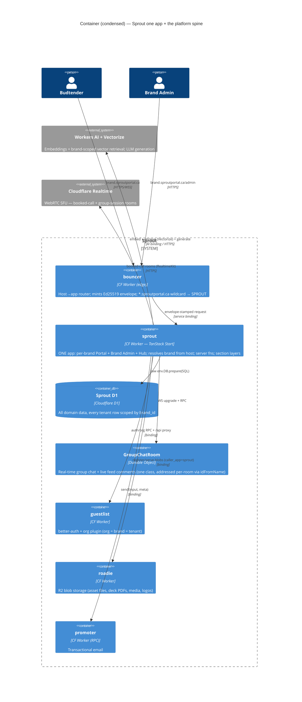

# 00 — Sprout: Executive Overview

> **Status:** plan (June 2026, spec v4.0). This is the entry point to the Sprout
> implementation plan. Docs 01–09 are the detailed blueprint; this doc is the
> map. Read this first, then follow the linked index below.

---

## The product in three sentences

Sprout is a white-label B2B platform that gives each cannabis brand its own
**budtender portal** — a single-page experience where retail staff learn the
brand's products (Drop Sheet, PK decks, quizzes/certifications), engage with the
brand (media feed, group chat, an AI assistant trained on the brand's own
content), request assets and book calls, and compete on an education-funded
leaderboard. One codebase runs every brand portal, skinned entirely at runtime
from per-brand configuration ("one engine, infinite skins") so a new brand is a
row of data, never a new deploy. Sprout itself stays invisible inside each
portal — the only Sprout-branded surface is the cross-brand **Hub**, plus a
"Powered by Sprout" footer credit.

---

## The ONE-APP architecture decision

Sprout ships as **a single TanStack Start app** (`workers/sprout`, worker
`sprout-sprout`, binding `SPROUT`) inside the greenroom monorepo. The
one app serves **every** brand portal, the **Brand Admin** dashboard, and the
Sprout **Hub**. It owns its own D1 for all domain data and leans on the existing
platform spine (bouncer = edge routing, guestlist = auth/orgs, roadie = R2 blob
storage, promoter = email). Two of its sections, Quizzes and Group Chat, began
as separate single-purpose apps (`apps/quiz`, `apps/chat`); both have since been
fully folded in as a schema move + UI re-host, not a rewrite, and neither
remains as a standalone app in this repo.

Why one app: the product _is_ one page (sections are layers over a persistent
shell, with no routing and exact scroll restoration), per-brand customisation is
**data not code**, Sprout stays invisible as an in-app boundary rather than a
domain hop, and the greenroom substrate charges a fixed registration cost per
app — paid once. See [01 §1](./01-architecture.md#1-the-one-app-decision).

---

## The brand-model tension, resolved

There are **two** brand mechanisms and conflating them is the #1 trap. The
**build-time fork brand** (`packages/config`) brands _Sprout
itself_ once — the Hub, the wordmark, the apex domain — and must NEVER carry
per-brand skins. **Per-brand portal skins are a runtime, DB-backed, per-org
mechanism**: a `brand_theme` row (plus a `portal_config` content row) in
Sprout's own D1, edited live in Brand Admin,
resolved per-request from the host, and applied by injecting scoped `--color-*`
CSS-variable overrides (`<BrandStyle>`) — never a rebuild. See
[01 §2](./01-architecture.md#2-the-brand-model-tension-read-this-first).

---

## The 14 surfaces, at a glance

Every product surface has a data + API + UI + test home. This table is the
"where do I find X" index across docs.

| #   | Surface                                                                      | Data (02) | API (05)                       | UI (04)                             | Invariant (08) | Phase (09)     |
| --- | ---------------------------------------------------------------------------- | --------- | ------------------------------ | ----------------------------------- | -------------- | -------------- |
| 1   | The Hub (Your Portals, leaderboard, Education Award, notifications)          | §11       | §1.11 `hub.functions.ts`       | Surface 1                           | INV-1, INV-6   | P5             |
| 2   | Landing screen (rotating hero + banners + AI bubble)                         | §1        | §1.1 `brand.functions.ts`      | Surface 2                           | INV-8, INV-9   | P1.C           |
| 3   | Section grid (six layers) + drop sheet                                       | §1        | §1.1                           | Surface 3                           | INV-7          | P1.A           |
| 4   | Drop Sheet (products, reviews HARD-delete)                                   | §2        | §1.2/§1.3                      | Surface 4                           | INV-3          | P2.A/B         |
| 5   | PK Decks (uploaded PDFs, flip-viewer)                                        | §3        | §1.4 + §5                      | Surface 5                           | INV-11         | P2.C           |
| 6   | Store Assets (viewers, download + request physical)                          | §4        | §1.5                           | Surface 6                           | INV-10         | P1.D + P4.A    |
| 7   | Quizzes (5 types, autosave, certifications)                                  | §5        | §1.6 + §1.11                   | Surface 7 + brand leaderboard panel | —              | P2.D/E         |
| 8   | Media Feed ("Enter the Grow", real-time comments)                            | §6        | §1.7 + §2                      | Surface 8                           | INV-13         | P3.B           |
| 9   | AI assistant + booked calls (RAG, booking-only)                              | §9/§10    | §1.10 + §4/§6                  | Surface 9                           | INV-2          | P4.C/D         |
| 10  | Contact (private notification reply) + Group Chat (community/Team-marker/DO) | §7/§8     | §1.8/§1.9                      | Surface 10                          | INV-12         | P3.C/P4.B      |
| 11  | Brand Admin (setup w/ live preview, Draft→Live)                              | §1        | across modules                 | Surface 11                          | INV-5          | P1.B + content |
| 12  | Analytics (per-budtender/deck/product/quiz, CSV)                             | §12       | §1.12 + §3                     | Surface 11d                         | —              | P6             |
| 13  | Sprout Admin (cross-brand monitoring, provisioning)                          | §1        | §1 `sprout-admin.functions.ts` | Surface 12                          | —              | P6.C           |
| 14  | Multi-tenant template engine / runtime brand skin                            | §1        | §1.1                           | Runtime theming                     | INV-4, INV-14  | Skeleton       |

---

## The 7-phase summary + walking-skeleton first slice

The build is sequenced as a **walking skeleton first**, then seven phases. The
skeleton is _not_ a phase — it is the thinnest vertical that proves the one-app
architecture end-to-end (one brand, one host, one section, one server fn, one D1
table, deployed and smoke-tested). It de-risks the highest-risk seam (the
runtime per-org brand skin, the #1 trap) plus the registration/CD/envelope
plumbing every later phase assumes. See
[09 §1](./09-roadmap-and-cadence.md#1-the-walking-skeleton-first-slice).

| Phase        | Theme                   | Headline deliverables                                                                                               |
| ------------ | ----------------------- | ------------------------------------------------------------------------------------------------------------------- |
| **Skeleton** | Prove the spine         | runtime brand resolution + `<BrandStyle>`; registration; CD; envelope                                               |
| **P1**       | Foundation              | one-page shell + layer system, Brand Admin setup + Draft→Live, landing, Store Assets (download), analytics scaffold |
| **P2**       | Product & Learning      | Drop Sheet, reviews (hard-delete), PK deck flip-viewer, quizzes + certs, brand leaderboard                          |
| **P3**       | Engagement              | Durable Object substrate, media feed + live comments, group chat, banner management                                 |
| **P4**       | Assistance & Connection | physical-asset fulfilment, contact, booking + group sessions, AI assistant (RAG)                                    |
| **P5**       | Community (the Hub)     | Hub shell + Your Portals, platform leaderboard + Education Award, notifications                                     |
| **P6**       | Intelligence            | full Brand Admin analytics, CSV export, Sprout Admin monitoring                                                     |
| **P7**       | Reach                   | past-session recordings, mobile wrapper + push                                                                      |

Everything lands on **staging continuously**; visibility is gated by
`portal_config.sections_json` toggles (plus the theme's Draft→Publish flip for
skin changes), so a section can ship dark, then be lit per-brand with no
redeploy.

---

## How to read docs 01–09

| Doc                                 | Title                              | Read it for                                                                                                                                                                                     |
| ----------------------------------- | ---------------------------------- | ----------------------------------------------------------------------------------------------------------------------------------------------------------------------------------------------- |
| [01](./01-architecture.md)          | Architecture & C4 View             | the one-app decision, the brand-model tension, C4 diagrams, request lifecycle, real-time + AI architecture, tenant isolation                                                                    |
| [02](./02-data-model.md)            | D1 Data Model                      | the complete authored Drizzle schema (every table), migrations strategy, R2-vs-D1 split, indexing/tenancy rules                                                                                 |
| [03](./03-app-structure.md)         | App Structure                      | the single `workers/sprout` tree, the one-page shell + section-layer mechanism, route map, server-fn organisation, theming, quiz/chat fold-in                                                   |
| [04](./04-ui.md)                    | UI: surfaces, screen by screen     | every surface's desktop/mobile layout, exact components (exists/variant/build-new), motion, a11y, the component inventory, the runtime theming model from the UI side                           |
| [05](./05-api-and-integrations.md)  | API Surface & Integrations         | every `createServerFn` by domain, the Durable-Object wire protocol, analytics ingest + CSV, the AI/RAG pipeline, PDF handling, booking, service-binding contracts                               |
| [06](./06-testing-strategy.md)      | Testing Strategy                   | the two test idioms; the risk-driven tests that catch silent breakage; browser (Playwright) journeys; post-deploy smoke; the seed strategy; CI integration                                      |
| [07](./07-deployment.md)            | Deployment, Environments & Cadence | registering `sprout` as a worker, D1 migrations-before-code, deploy ordering, the three environments, secrets, cadence + feature-gating                                                         |
| [08](./08-compliance-invariants.md) | Compliance & Product Invariants    | INV-1…INV-14 — every product law, enforced at its load-bearing point (schema constraint and/or server-side authz), with forbidden-string greps as a regression backstop for the two legal lines |
| [09](./09-roadmap-and-cadence.md)   | Delivery Roadmap & Cadence         | the walking skeleton, the phase-by-phase epic plan, dependency graph + critical path, parallelisable workstreams, the fold-in plan                                                              |

**Suggested reading order:** 00 → 01 → 02 → 03 give you the architecture and the
shape of the system; 04 and 05 are the surface-level detail (UI and API); 08 is
the rule set you must not violate; 09 is the build order; 06 and 07 are the
test/deploy machinery. A builder starting a feature reads the relevant row of
the [14-surfaces table](#the-14-surfaces-at-a-glance) above and follows the
links.

---

## Resolved decisions & risk register

This plan is **buildable as a phased plan.** The architecture is sound and
unusually well-grounded in real greenroom files; all 14 surfaces and all 14
product rules have a home. Every product rule is enforced at its load-bearing
point (a schema constraint and/or server-side authz), with forbidden-string
greps kept as a regression backstop for the two genuine legal lines (INV-1
Education-Award framing, INV-2 no-instant-calls). Each decision below is settled
(with rationale and, where a default was chosen, the condition that would change
it). The remaining provisioning facts are tracked in **Implementation
Prerequisites** at the end — they are account/infra setup steps, not design
unknowns.

### Names & topology (frozen)

1. **Durable Object topology — ONE class, `GroupChatRoom`.** Sprout ships a
   single DO class `GroupChatRoom` (binding `GROUP_CHAT_ROOM`); the v1 migration
   is frozen at `new_sqlite_classes:['GroupChatRoom']` only. The same class is
   addressed per-room via `idFromName`: group chat = `idFromName(brandId)` (one
   instance per brand); feed live-comments = `idFromName(`${brandId}:${postId}`)`
   (one instance per post). A brand chat room and a post-comment room are the
   same shape (durable message log in DO SQLite + presence + hearts), so a second
   class would duplicate code for zero behavioural gain and enlarge the
   irreversible v1 set. A `MediaFeedRoom` `tag:'v2'` class is documented as an
   additive future escape hatch only (if a single post's comment fan-out ever
   needs independent hibernation/sharding); it is **never** shipped in v1. Feed
   comments are durably logged to the D1 `comments` table; the DO holds only
   ephemeral per-post fan-out and is not mirrored to the presence/chat_rooms
   tables (those stay group-chat-only). (07 §1.1/§2.2, 09 §3.)

2. **App / worker / binding name — `sprout` (frozen across 11 surfaces).** Dir
   `workers/sprout`, worker `sprout-sprout` (= `sprout-sprout`), service
   binding `SPROUT`, D1 token `D1_SPROUT`, URL var `SPROUT_URL`, roadie
   `caller_app:"sprout"`. The `sprout-sprout` worker string is cosmetic
   (`workerPrefix=sprout` in `deploy.ts`; the doubling is mechanically identical
   to `sprout-guestlist`/`sprout-roadie` and is deploy-internal — users only ever
   hit `*.sproutportal.ca`). The name is load-bearing across `deploy.ts`
   (`workerPrefix`), each `wrangler.jsonc`, its `db:migrate:local` vp task, the bouncer
   config, the secrets manifest, and portless; 07 §8 is the single source of truth for the
   registration checklist. (07 §0/§9.)

### AI, real-time & sync (resolved)

3. **AI assistant substrate — native Cloudflare products.** (a) Vector retrieval
   uses **Cloudflare Vectorize** (a `[[vectorize]]` index binding, dimension
   **768** to match the embedding model); embeddings are generated with the
   **Workers AI** binding (`env.AI`) using `@cf/baai/bge-base-en-v1.5`, and each
   vector carries `brand_id` metadata so every query filters to the resolved org
   — RAG cannot cross brands. `ai_embeddings` (02 §10) keeps the chunk text +
   source provenance + the Vectorize vector id; Vectorize holds the vectors.
   **Generation** uses Workers AI via the AI module's single `generate()` seam
   with model `@cf/meta/llama-3.1-8b-instruct` (or the current CF-recommended
   instruct model at build time); the streaming client is the Vercel AI SDK
   (`ai` + `@ai-sdk/react` `useChat`). No AI secret is provisioned for v1 (binding
   path); an external-LLM `SecretSpec` is a documented opt-in (default — swap via
   the one-file `generate()` seam only if eval quality demands it). (b) The
   booked-call **video room transport** uses **Cloudflare Realtime** via
   **RealtimeKit** (Core SDK client + REST server, not the raw SFU push/pull-tracks
   API); recordings use RealtimeKit managed recording with an S3-compatible output
   to roadie's R2 bucket, registered with roadie on the recording-complete webhook
   to mint `recording_ref`. RealtimeKit app id + secret are `provided` wrangler
   secrets scoped to `['sprout']`. (01 §8, 05 §4/§6.)

4. **`org_brand_directory` sync path — guestlist webhook (push) primary +
   hourly cron reconcile.** On org create/update/slug-change/membership-change,
   guestlist fires a better-auth org `databaseHook` that RPC-calls the sprout
   `syncOrgDirectory({ orgId, slug, name, logoRef })` server fn, which upserts
   `org_brand_directory` and stamps `synced_at`; an hourly reconciliation cron in
   `jobs/cron.ts` re-syncs stale/missing rows as a self-healing backstop.
   `scripts/seed.ts` writes directory rows directly so tests don't depend on the
   live webhook. The webhook is authoritative for onboarding latency (a new
   brand's `<slug>.sproutportal.ca` must resolve immediately after provisioning);
   the cron bounds drift if a webhook is dropped. Isolation holds even with a
   stale mirror: the public render derives `brand_id` from the resolved org, never
   from input, so a stale row shows only an old name/logo, never another brand's
   data. If guestlist exposes no usable org-hook surface yet, building that
   emitter is a prerequisite; **until it lands, the sync runs cron-only at 5-min
   cadence** (default — switch to webhook the moment the emitter ships). (02 §1,
   05 §7.1, 09 §8.)

5. **Leaderboard composite-score formula — defined and pinned.** Per
   `(user, brand, period = calendar-month 'YYYY-MM')`: `quizPoints` =
   `100 * (Σ best passing-attempt grade% per quiz) / (published quizzes that
period)`, capped at 100; `deckPoints` = `100 * (decks fully read) /
(published decks)` + a 0–20 engagement bonus (`min(20, total deck
time_spent_seconds / 3600 * 5)`); `activityPoints` =
   `min(100, 4*comments + 2*post_likes + 10*session_join + 5*session_register +
1*chat_message)`. `score = round(0.55*quizPoints + 0.30*deckPoints +
0.15*activityPoints)`, with the three components persisted into
   `user_brand_scores.{quiz_points, deck_points, activity_points, score}`. Ties
   break deterministically by earliest `computed_at` then `user_id`. The Hub board
   sums `score` across the user's brands for the current period; "Last Month's
   Winner" / the Education Award reads the prior closed period. Weights front-load
   learning (quizzes + decks = 85%) per the education-funded framing; the weights
   - activity coefficients live in one `SCORE_WEIGHTS` const in `jobs/cron.ts` so
     retuning is one line. (02 §11, 09 P2.E.)

6. **PDF rendering — split by environment.** (a) The flip-**viewer** uses
   `pdfjs-dist` (pdf.js) in the browser, fetching the inline `getReadUrl` PDF and
   rasterising page N to canvas on demand. (b) The server-side **derive** job in
   `jobs/queue.ts` (`deck.derive`, async on finalize) uses `unpdf`
   (Workers-targeted) to read `page_count` + extract text for the AI corpus, and
   the **Cloudflare Browser Rendering** binding (headless screenshot of page 1)
   for the page-1 PNG thumbnail → roadie. The deck library card shows a `FileIcon`
   "processing" placeholder until the job completes. Browser Rendering is the
   supported CF path for PDF→image in a Worker; `unpdf` gives count + corpus text
   with no native deps; client-side viewing keeps Worker CPU free. (04 Surface 5,
   05 §5.)

7. **Wildcard `*.sproutportal.ca` — wildcard route + zone wildcard cert.** A
   single wildcard custom-domain route `*.sproutportal.ca` on the bouncer worker,
   backed by a zone wildcard TLS cert (Advanced Certificate Manager / Total TLS
   for `*.sproutportal.ca`) — **not** Cloudflare for SaaS custom hostnames. Every
   brand is a subdomain of the operator's own apex, so one wildcard cert + one
   route covers all brands with zero per-brand provisioning — exactly the "a new
   brand is a row of data" goal. (default — add Cloudflare for SaaS for a single
   brand only if it later brings its own apex/vanity domain.) Ordering the cert +
   confirming the route binds is a prerequisite before the first staging brand
   subdomain. (01 §11, 03, 07 §1.3, 09 §8.)

### Surfaces, primitives & UX (resolved)

- **Analytics charting — build a tiny token-driven SVG primitive set.** `BarChart`
  - `Sparkline` + `TopNBars` in `workers/sprout/components/admin/charts/`, composed
    from existing `--color-*` tokens; **no chart library** (no recharts/visx/plot).
    The per-budtender matrix and most-missed / top-AI-question rollups render as the
    existing identity admin **table**. The analytics needs are modest (trend bars,
    ranked lists) and the repo convention is token-driven composition. (default —
    adopt `@observablehq/plot` or visx later if rich interactive/exportable
    time-series charts are required; additive, no data-model impact.) (04, P6.)
- **Admin reorder — build ONE keyboard-first `SortableList` primitive.**
  Move-up/move-down buttons are the mandatory a11y baseline (writing `order_idx` /
  array order); pointer drag handles are a progressive enhancement via
  `@dnd-kit/core` + `@dnd-kit/sortable`. Reused for `hero_slides.order_idx`,
  `portal_config.sections_json` order, and `banner_cards.order_idx`. (default — ship
  buttons-only and skip the `@dnd-kit` drag layer if zero new deps is required;
  drag is enhancement-only.) (04, P1.B.)
- **Per-brand quiz leaderboard surface — ADDED inside the Quizzes section.** A
  brand-scoped leaderboard panel lives INSIDE the Quizzes section layer
  (`?section=quizzes`) as a "Quizzes | Leaderboard" tab — no new route (stays
  within the one-page shell, INV-7). It reuses the existing
  `getLeaderboard({ brandId: activeOrgId, period })` (05 §1.11), reading
  `user_brand_scores` brand-scoped via `user_brand_scores_leaderboard_idx` — no
  new data, server fn, or schema change. The UI is the same bordered top-N table
  the Hub uses, with the budtender's own rank pinned + a period selector. (04
  Surface 7, 09 P2.E.)
- **Brand-skin colour coverage — THREE roles only.** A brand retints
  `--color-primary` (= `--color-sprout`), one `--color-accent`, and
  `--color-background`/surfaces — plus optional `--font-display`/`--font-body` and
  `--radius-*`. The four other named accents (stigma=danger, growth=success,
  pistil=warn, haze=info) stay **fixed** Sprout semantic/status tokens, never
  brand identity: status colours carry fixed meaning (danger must read as danger
  across every brand for a11y/WCAG contrast). `brand_theme.live_theme_json` stores
  the v2 `BrandTheme` shape `{ modePolicy?, fixedMode?, light?, dark?, radius?,
spacing?, fonts? }` as opaque JSON. (default — full 5-accent control is a
  future opt-in gated behind a Sprout-Admin flag, accepting that status semantics
  become brand-overridable.) (04, 02 §1.)
- **Hub unread badges — poll in v1, push deferred to P7.** A lightweight
  `getUnreadCounts` GET on Hub mount + on window-focus + a 30s interval,
  `sessionStorage`-seeded to avoid a flash; the "pulse on increment" fires when a
  poll returns a higher count. The DO push channel stays reserved for in-section
  real-time (chat/feed). The Hub is the apex/cross-brand surface with no per-brand
  DO connection open, so a dedicated push channel for low-urgency unread counts is
  net-new infra; poll-on-focus matches the existing chat-bell poll concession.
  (default — change if the operator wants instant cross-brand badge updates
  pre-mobile, which means a net-new per-user notification DO/SSE channel in P5.C.)
  Push lands in P7 with the mobile wrapper + push provider (rides
  `notification_prefs`). (03, 04, 09 P5.C/P7.)

### Tenant isolation & channel separation (resolved)

- **Per-request DO `expectedHost` under wildcard brand subdomains.** In
  `room-server.ts` `onConnect`, `expectedHost` is derived per-connection from the
  incoming WS-upgrade Host header, validated against the `*.sproutportal.ca`
  single-label wildcard pattern (mirroring bouncer's single-label rule); the
  leftmost label resolves → org via `org_brand_directory`, and for authenticated
  connections the envelope principal's `activeOrgId` must equal the resolved
  `org_id` before the socket is admitted (reject 1008 otherwise). The public-read
  path requires only the label-shape match. Host + `activeOrgId` must both gate so
  a member of brand A cannot open brand B's room even if a room id leaks. (01, 03,
  05, 09.)
- **Three-channel separation (AI / Contact / Group Chat) is a named invariant.**
  The product law that the three channels strictly separate is folded into INV-12;
  its load-bearing enforcement is the **absence** of any cross-channel escalation
  path other than AI→`bookCall`. Surface 9/10 carry this: Contact is a private
  in-platform-notification reply, Group Chat is the community/Team-marker/DO
  channel. (08 INV-12.)
- **Roadie blob backfill — no-op for greenfield forks (default).** All sprout
  blobs are minted under `caller_app:"sprout"` from the skeleton onward, so a
  greenfield fork needs no move. A data-carrying fork (existing quiz/chat rows)
  runs a one-time migration that re-registers each legacy blob under
  `caller_app:"sprout"` with the right sprout `resourceType` and rewrites the D1
  `*_ref` handles; roadie dedup is global on content hash, so this is a
  metadata-only re-reference, not a byte copy. (default — greenfield = no-op;
  schedule the backfill only if a data-carrying fork exists, P2.D quiz / P3 chat.)
  (01 §9, 03, 09 §8.)

### Already-reconciled fixes (applied to docs 01–09)

- **Quiz fold-in schema.** Doc 03 corrected to describe the redesigned 6-table
  quiz model (`attempt_answers`, `certifications`, no `courses`/`lessons`/
  `completions`); **02 is canonical.**
- **`audit_log` table** added to 02 §12 (every mutation server fn calls
  `writeAudit`; `audit_log.brand_id` stays nullable for platform-wide actions).
- **Status-enum drift** reconciled in 02 to `draft|published|archived` for all
  content lifecycles; `brand_theme.state` stays `draft|live` (a publish-flip).
- **Feed first-comment preview** backed by a `first_comment_json` denormalised
  snapshot in 02 §6.
- **`workersDevSubdomain` value.** `deploy.ts:25` reads `sproutcannabis`
  (confirmed on disk), the `sproutcannabis` workers.dev subdomain; it is a value to verify
  against `wrangler whoami`, not a design unknown (see prerequisites).

---

## Implementation Prerequisites

These are account/infra provisioning steps (not design unknowns) that gate
non-local deploys. Complete the ones a given phase touches before that phase
ships to staging/production.

1. Provision the real Cloudflare account and set `cloudflareAccountId` in
   `packages/config/src/deploy.ts` (currently `'TODO-replace-with-your-cf-account-id'`).
2. `wrangler d1 create sprout` for staging/production; paste the UUIDs into the
   `database_id` fields of the sprout `wrangler.jsonc` (top level = staging,
   `env.production` = prod).
3. roadie's staging/production `database_id`s live directly in
   `workers/roadie/wrangler.jsonc` (top level = staging, `env.production` = prod;
   there is no `deploy.ts` `d1` field) and are already populated with the
   provisioned UUIDs.
4. Add `sproutportal.ca` as a Cloudflare zone and order/enable a
   `*.sproutportal.ca` Advanced/wildcard TLS cert (Total TLS or ACM), then confirm
   the wildcard custom-domain route binds on the bouncer worker before the first
   staging brand subdomain.
5. Provision roadie's R2 bucket + S3/SigV4 credentials (the `S3_*` roadie
   secrets) before any non-local roadie upload/serve.
6. Enable Cloudflare Browser Rendering on the account and add it (binding
   `BROWSER`) to the sprout `wrangler.jsonc` alongside `AI` and
   `VECTORIZE` — the full net-new binding set is `AI`, `VECTORIZE`, `BROWSER`
   (none exist in greenroom today).
7. Create the Vectorize index with dimension **768** (matching
   `@cf/baai/bge-base-en-v1.5`) and a `brand_id` metadata filter.
8. Provision RealtimeKit: create the app, capture app id + secret, add them as
   `provided` wrangler secrets scoped to `['sprout']` for all environments, and
   configure managed recording's S3-compatible output to target the project R2
   bucket.
9. Confirm via `wrangler whoami` / the CF dashboard that `deploy.ts:25`
   `workersDevSubdomain` `'sproutcannabis'` is the fork account's actual
   workers.dev subdomain; update `deploy.ts` only if it differs.
10. Build the guestlist org-hook emitter (better-auth org `databaseHook` → RPC to
    sprout's `syncOrgDirectory`) if guestlist exposes no usable hook surface yet;
    until it lands, run `org_brand_directory` sync cron-only at 5-min cadence.
11. Author `deploy-production.yml` per 07 §6 (`workflow_dispatch`, GitHub
    `environment: production` required-reviewer gate,
    `db:migrate:production`→leaf→apps incl. sprout→bouncer ordering,
    `concurrency: deploy-production` `cancel-in-progress:false`) — the one
    genuinely new CI file. PR preview deploys are a v1 non-goal (the local
    `*.sproutportal.localhost` dev-direct flow is the per-branch preview); error
    tracking relies on Cloudflare Workers observability for v1, not Sentry
    (default — add Sentry as a `['sprout']`-scoped secret only if production
    incident volume needs alerting/grouping).
12. Confirm whether any target fork carries existing quiz/chat production rows;
    if all greenfield, the roadie re-reference backfill and the chat/quiz
    staging-migrate backfill are no-ops; if a data-carrying fork exists, schedule
    the backfill as P2.D (quiz) / P3 (chat).
13. Add the brand/budtender identity constants (slugs, handles, ids for the two
    demo brands) to a single `workers/sprout/__tests__/demo-constants.ts` imported by
    both `__tests__/fixtures.ts` and `scripts/seed.ts` so names never drift.
