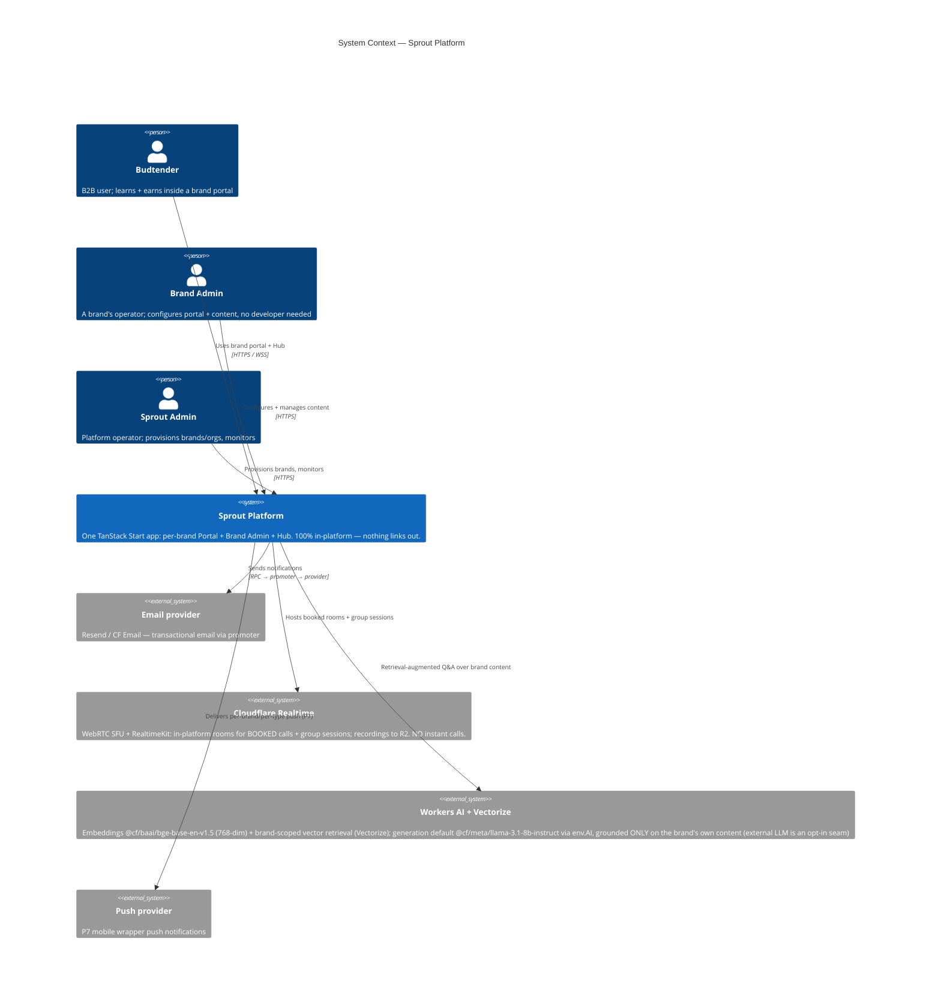
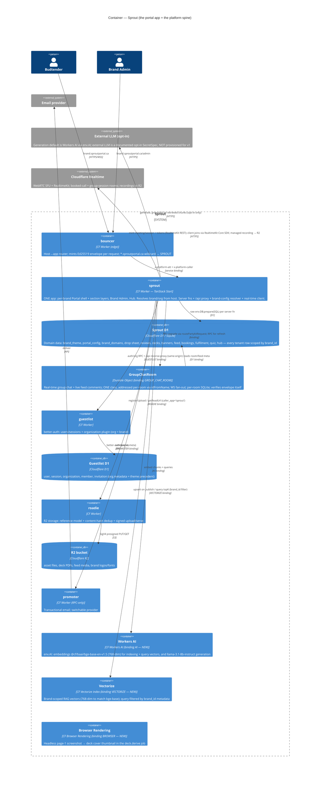
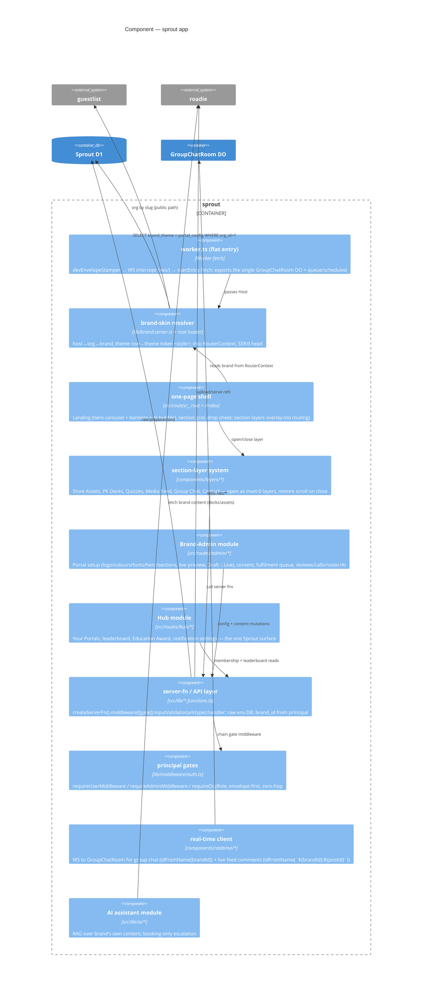

# Sprout Platform — Architecture & C4 View

> **Status:** plan (June 2025, spec v4.0). This is the buildable architecture for
> Sprout implemented as **one TanStack Start app** inside the greenroom monorepo.
> Every claim below is grounded in a real greenroom file; paths are cited inline.

---

## 1. The "one app" decision

### 1.1 Decision

Sprout ships as a **single TanStack Start app** — package `@greenroom/sprout-app`,
worker `sprout-sprout` (→ `sprout-sprout`), directory `workers/sprout/`,
service binding `SPROUT`. This one app serves:

> **Naming note.** Docs 03/05/06/07/08/09 and this doc use the canonical names
> `workers/sprout` / worker `sprout-sprout` / binding `SPROUT` / token `D1_SPROUT`
> / package `@greenroom/sprout-app` (doc 07 §8 is the single frozen source). The
> `sprout-sprout` worker string is cosmetic — `workerPrefix: "sprout"` in
> `deploy.ts` doubles into `sprout-sprout` mechanically identically to
> `sprout-guestlist` / `sprout-quiz`; it is deploy-internal and never user-facing
> (users hit `*.sproutportal.ca`). Do NOT rename to `portal` / `PORTAL` /
> `D1_PORTAL` / `apps/portal`; the name is load-bearing across 11 registration
> surfaces (07 §8).

- **Every brand portal** (MTL Cannabis, Dom Jackson, Lite Label, Lowkey, Rosin
  Heads …) as the same one-page shell, skinned at runtime per brand;
- **Brand Admin** (the dashboard each brand uses to configure its portal + manage
  content);
- **The Hub** (the single Sprout-branded community surface, post-login).

It owns its **own D1** for all domain data (portals, brand config, drop sheet,
reviews, decks, banners, feed, bookings, fulfilment, hub) and leans on the
existing platform spine for everything else:

| Concern                                                  | Owner                                                                    | How the portal reaches it                                                                |
| -------------------------------------------------------- | ------------------------------------------------------------------------ | ---------------------------------------------------------------------------------------- |
| Edge routing per brand subdomain                         | **bouncer**                                                              | host → `SPROUT` service binding, envelope minted (`workers/bouncer/src/index.ts`)        |
| Auth + multi-tenant orgs (= brands)                      | **guestlist** (better-auth + org plugin)                                 | `GUESTLIST` service binding via `createGuestlistFactory`                                 |
| Blob storage (asset files, deck PDFs, feed media, logos) | **roadie** (R2 + reference/dedup)                                        | `ROADIE` service binding via `createRoadieClient` (`workers/roadie/src/client/index.ts`) |
| Transactional email                                      | **promoter**                                                             | `PROMOTER` service binding, RPC `send(input, meta)`                                      |
| Real-time (group chat + live feed comments)              | **ONE Durable Object** class `GroupChatRoom` (binding `GROUP_CHAT_ROOM`) | `routePartykitRequest` intercept at the worker entry                                     |

Quiz and chat capabilities fold into this one app as **sections**, not separate
apps: Quizzes runs a near-complete LMS model with a `brand_id` multi-tenant
column, and Group Chat runs real-time on a Durable Object. Both patterns were
proven in prior-art apps that predated sprout, so folding them in was a schema
move + re-namespacing, not a rewrite.

### 1.2 Rationale

1. **The product is one page.** The non-negotiable product rule is "one page, one
   shell; sections are layers; closing restores scroll position; NO routing." A
   single app shell loaded once, with section layers stacked over it, is the
   literal architecture the spec demands. Splitting across apps would force
   cross-app navigation (full reloads) and break the "closing a layer restores
   exact scroll position" rule.

2. **One engine, infinite skins.** Per-brand customisation is **data, never
   code**. One codebase + one D1 of per-org brand config is exactly "one engine,
   infinite skins." A per-brand app would re-introduce code-per-client, which the
   spec forbids.

3. **Sprout stays invisible.** The only Sprout mark inside a portal is the
   "Powered by Sprout" footer; the Hub is the one Sprout surface. A single app
   makes the portal↔Hub boundary an in-app section transition, not a domain hop.

4. **The greenroom substrate rewards consolidation.** Adding an app costs
   several registration surfaces (its `wrangler.jsonc` d1/bindings, bouncer
   routes + bindings, a `db:migrate:local` vp task, portless) — see
   `workers/bouncer/wrangler.jsonc`.
   One app pays that cost once. Wildcard host routing (`*.sproutportal.ca`) is
   already supported by bouncer (`workers/bouncer/src/routes.ts:5,248`), so one
   binding serves every brand.

---

## 2. The brand-model tension (read this first)

There are **two distinct brand mechanisms** in this codebase. Conflating them is
the #1 trap.

### 2.1 Build-time fork brand (`packages/config`) — NOT for per-brand skins

`packages/config/src/{brand.ts,deploy.ts,app-brand.ts}` brand the **whole Sprout
fork once, at build time** (`workerPrefix: "sprout"`,
`baseDomain: "sproutportal.ca"` — `packages/config/src/deploy.ts`). Each
worker's `wrangler.jsonc` is a checked-in source file carrying those literal
names/domains directly. This system answers "which fork am I?" —
it brands _Sprout itself_, the Hub, the logo wordmark
(`packages/ui/.../logo/logo.tsx` reads `platformConfig.brand` at build time).

**Per-brand portal skins must NEVER be wired through `packages/config`
(`deploy.ts` / `brand.ts`).** That would mean a rebuild per brand — the opposite of "configuration,
never code."

### 2.2 Runtime per-org brand config (DB + Brand Admin) — the new mechanism

Per-brand skins are a **runtime, DB-backed, per-org** mechanism layered on the
better-auth `organization` plugin (org = brand = tenant). The precedent already
exists: org `metadata` already carries theme color tokens as JSON, parsed in
`workers/identity/src/routes/_dashboard/admin/orgs/$id.tsx:42-52`
(`parseThemePrimary` reads `theme.light["--color-primary"]`). The new mechanism
_extends_ this: `brand_theme` + `portal_config` rows set in the **portal's own
D1**, keyed by `org_id`, edited via Brand Admin, and resolved per-request from
the host.

The design token system already emits every brand color as a `--color-*` CSS
custom property on `:root` / `[data-theme="dark"]`
(`packages/design/generated/css/tokens.css:6,131`), and `theme.css` maps shadcn
semantic names onto Sprout tokens (`--color-primary` = `--color-sprout`,
`packages/design/src/theme.css:38`). So a runtime skin is applied by **injecting a
scoped inline `<style>`** that redefines the relevant `--color-*` (and optionally
`--font-display`/`--font-body` via roadie-hosted `@font-face`, and `--radius-*`)
on the portal root — SSR'd in `__root.tsx` head to avoid FOUC, alongside the
existing theme-init script.

### 2.3 Runtime brand-config resolution path

```
incoming Host (e.g. mtlcannabis.sproutportal.ca)
  → bouncer matches *.sproutportal.ca → SPROUT binding, mints envelope
  → portal worker: resolveBrand(host)
       extract leftmost label = org slug ("mtlcannabis")
       look up org by slug → org_id
         signed-in path:   context.principal.activeOrgId (zero-hop envelope)
         public/unauth:    org_brand_directory mirror row (org.slug UNIQUE),
                           kept fresh by guestlist org-hook push + hourly cron
  → load the slim brand SKIN WHERE org_id = ? from the portal's OWN D1
       (one db.batch: brand_theme live/draft theme JSON + state, plus
        portal_config name/logo_ref identity overrides)
  → derive theme token overrides → inject scoped <style> in __root head (SSR)
  → render the one-page shell; the portal shell loader fetches the CONTENT
    config (portal_config tagline/feed label/sections) + banners in parallel,
    and the landing streams hero_slides
```

Resolution runs in a **route loader** so SSR has the brand before first paint;
the loader returns the brand skin into `RouterContext` (mirrors the loader
pattern at `workers/identity/src/routes/_dashboard/admin/orgs/$id.tsx:35`).
`brand_theme`/`portal_config` are keyed by `org_id` (= organization.id by value), and write
authz on it gates on the org `theme:["update"]` permission already defined in
`packages/auth/src/server.ts:48-68` (the `orgAdminRole`/`orgOwnerRole` grant
`theme: ["update"]`).

---

## 3. C4 — System Context



The three external automated channels stay strictly separate (a product law):
**AI** (instant automated), **Contact** (private to brand team), **Group Chat**
(community). The AI escalates **only** to a _booked_ call — there is no
"Start Call Now" anywhere, for budtenders or the AI.

---

## 4. C4 — Container



Key contracts visible here: bouncer stamps `x-platform-att` (the signed
envelope) + `x-platform-caller` onto the upstream request
(`workers/bouncer/src/index.ts:114`); the portal verifies the envelope offline
(zero-hop) and reaches guestlist/roadie/promoter only over **service bindings**,
never cross-origin.

---

## 5. C4 — Component (inside `sprout`)



The entry is **flat and hand-written** — never wrapped in a kit factory, because
the static `@tanstack/react-start/server-entry` import must live in the app's own
`worker.ts` or `@cloudflare/vite-plugin` HMR breaks. The WS upgrade
is intercepted **before** `startEntry.fetch` because TSS chokes on 101 responses.

---

## 6. Request lifecycle

A signed-in budtender opens `mtlcannabis.sproutportal.ca`:

1. **Host → bouncer.** bouncer resolves the routing host
   (`workers/bouncer/src/index.ts:34`), matches `*.sproutportal.ca` (wildcard
   tier; exact > wildcard > any, `workers/bouncer/src/routes.ts:7`), selects the
   `SPROUT` binding, and **mints the Ed25519 envelope** for this request.

2. **Envelope/session.** bouncer stamps `x-platform-att` (signed envelope) +
   `x-platform-caller` on the upstream request
   (`workers/bouncer/src/index.ts:114`). The envelope carries the safe identity
   subset: `actor {id, role}`, `session {id, userId, expiresAt}`, and
   `activeOrgId` (`packages/kit/src/react-start/envelope-middleware.ts:26-33`).

3. **App entry.** The portal worker's flat `fetch` runs `devEnvelopeStamper` (a
   hard no-op outside `ENVIRONMENT=development`; required in dev-direct topology
   where bouncer isn't in front locally), intercepts `/ws/*`, else calls
   `startEntry.fetch(stamped, { context: extractPlatformStartContext(stamped) })`.

4. **Envelope verify (zero-hop).** `envelopeMiddleware` — installed globally in
   `start.ts`'s `requestMiddleware` — verifies the envelope offline against the
   committed public-key set and projects `context.principal`
   (`packages/kit/src/react-start/envelope-middleware.ts:55-73`). Prod rejects
   missing/invalid with 403; dev/staging fall back to anonymous. No guestlist RPC.

5. **Org context.** For writes, `context.principal.activeOrgId` is the active
   brand (zero-hop). For the public/unauth render, `resolveBrand(host)` maps the
   subdomain label → org slug → org_id via the `org_brand_directory` mirror in the
   portal's own D1 (kept fresh by a guestlist org-hook push + hourly reconciliation
   cron; `organization.slug` is UNIQUE), so no per-request guestlist RPC is needed.

6. **Brand-skin load.** The root loader runs `getBrandForHost()` → reads the
   slim skin (`brand_theme` + `portal_config` identity columns) from the
   portal's own D1 keyed by `org_id`, returns it into `RouterContext` (loader
   pattern per `workers/identity/src/routes/_dashboard/admin/orgs/$id.tsx:35`).

7. **Render.** `__root.tsx` SSRs the one-page shell, injecting the brand's
   `--color-*` / font / radius overrides as a scoped `<style>` in `<head>`
   alongside the theme-init script (no FOUC). Section layers mount client-side
   over the shell; opening/closing a layer never routes and restores scroll.

---

## 7. Real-time architecture (group chat + live feed comments)

Real-time is **ONE Durable Object** class bound to the app: `GroupChatRoom`
(binding `GROUP_CHAT_ROOM`), exported from the worker entry. A single class backs
both signature surfaces, addressed per-room via `idFromName`:

- **Group Chat** — one persistent room per brand, `idFromName(brandId)` (every
  connected budtender + brand team); team messages carry a Team marker; history
  persists.
- **Media Feed live comments** — one room per post, `idFromName(`${brandId}:${postId}`)`;
  chronological, real-time for everyone, hearts on comments; authors delete own,
  admins delete any.

**One class, not two.** A brand chat room and a post-comment room are the same
shape (durable message log in DO SQLite + presence + hearts), so a second class
duplicates code for zero behavioural gain and enlarges the irreversible `v1` set.
`MediaFeedRoom` is named ONLY as a documented future `tag: "v2"`
`new_sqlite_classes: ["MediaFeedRoom"]` escape hatch — to be used **only** if a
single post's comment fan-out ever needs independent hibernation/sharding; it is
additive and allowed, never shipped in v1.

The `GroupChatRoom` DO is built around these design points:

- **DO design.** `class GroupChatRoom extends Server<Env>` with
  `static options = { hibernate: true }` — a room with zero traffic costs
  ~nothing. `onStart` creates DO-local SQLite tables idempotently with
  `IF NOT EXISTS` because DOs hibernate and `onStart` re-fires on every wake.
  One DO **instance per room**; group chat is `idFromName(brandId)` and the
  feed-comment stream for a given feed post is `idFromName(`${brandId}:${postId}`)`.
  Feed-comment real-time is DO-local ephemeral fan-out keyed by post id and is
  **NOT** mirrored to the presence / `chat_rooms` tables (those stay
  group-chat-only); the durable comment log is the D1 `comments` table.

- **Transport (WS).** The WS upgrade is intercepted at the **worker entry** via
  `routePartykitRequest(stamped, env, { prefix: "ws" })` **before**
  `startEntry.fetch`, because TSS crashes on 101 responses. The stamper runs
  _before_ the WS branch so DO upgrades also carry an envelope.

- **Auth at the DO.** The DO **verifies the envelope itself** in `onConnect`
  using `createBouncerEnvelopeVerifier`. Because one worker serves N brand
  hosts, `expectedHost` cannot be statically pinned to a single value — it is
  derived **per-connection** from the incoming WS-upgrade `Host` header. The
  verifier:
  1. validates the host matches the `*.sproutportal.ca` **single-label** wildcard
     pattern (mirroring bouncer's single-label rule, `workers/bouncer/src/routes.ts:248`);
  2. resolves the leftmost label → org via `org_brand_directory`;
  3. for **authenticated** connections, asserts the envelope principal's
     `activeOrgId === the resolved org_id` before admitting the socket (reject
     `1008` otherwise) — the public-read path requires only the label-shape match.

  This ties the DO's per-room `brand_id` scope to the verified envelope and closes
  the cross-brand seam: a member of brand A cannot open brand B's room even if a
  room id leaks. Accepting any `*.sproutportal.ca` host alone would permit
  cross-brand access, so host **and** `activeOrgId` must both gate — tenant
  isolation makes this non-negotiable.

- **Fan-out.** The DO holds open connections and broadcasts frames to all
  connected clients in the room (message rows, reaction summaries, presence
  joined/left, deletions, archive). Server fns that mutate room/feed state in D1
  then call an RPC on the DO (e.g. `refreshRoomState()`) so the live DO
  reflects the D1 change.

- **Persistence to D1.** Two layers: (1) DO-local SQLite holds the hot message
  log for fast history snapshots in `session.init`; (2) the room/feed **metadata
  and membership** live in the **portal's own D1** (`binding DB`), read by the DO
  via `getDb()`. Durable history that
  must survive a DO reset (and feed comments tied to a post) is written through to
  the portal D1 scoped by `brand_id`.

**Wrangler wiring:** `durable_objects.bindings[{ name: "GROUP_CHAT_ROOM",
class_name: "GroupChatRoom" }]` + `migrations: [{ tag: "v1", new_sqlite_classes:
["GroupChatRoom"] }]`, repeated in every `env` block (CF does not inherit bindings
into named envs). **The v1 migration is FROZEN at the single `GroupChatRoom` class
and is effectively irreversible once deployed.** A second class (`MediaFeedRoom`)
is only ever added later as its own additive `tag: "v2"`
`new_sqlite_classes: ["MediaFeedRoom"]` without touching the v1 set.

---

## 8. AI assistant architecture

The persistent bottom-right bubble, always on, **trained on the brand's OWN
content** — Drop Sheet, PK decks, product info. No AI/streaming primitive exists
in the repo today (grep-confirmed: no `ai-sdk`, `useChat`), so this is a fresh
build using the **Vercel AI SDK** (`ai` + `@ai-sdk/react`); the `ai-sdk` skill is
available.

- **Where it runs.** Server-side in the portal worker, behind a principal gate, as
  a server fn (`src/lib/ai/*`). Never reads `env` at module top level
  (`createServerOnlyFn` for any binding access).

- **Retrieval over the brand's own content.** The corpus is **scoped to the
  resolved brand/org** — Drop Sheet products (THC/CBD, terpenes, effects, talking
  points), PK deck text, asset metadata, plus Brand-Admin custom Q&A. Source
  blobs (deck PDFs, assets) live in roadie under `caller_app='sprout'`; the AI
  module fetches their text via `roadie.getReadUrl(...)`. Chunks are embedded with
  the **Workers AI** binding (`env.AI`) and stored in a **Cloudflare Vectorize**
  index (dimension **768**, matching `@cf/baai/bge-base-en-v1.5`, with a
  `brand_id` metadata filter); every vector carries `brand_id` metadata, so each
  query filters `brand_id = activeOrgId` and retrieval **cannot cross brand
  boundaries** — the
  same isolation rule as every other tenant row (§10). `ai_embeddings`
  ([02 §10](./02-data-model.md#10-ai-assistant)) is the D1 source-of-truth: chunk
  text + source provenance + the Vectorize vector id (Vectorize holds the vectors;
  D1 holds the citable text). The AI
  answers product/strain questions ("strongest indica?", "what for a customer who
  wants sleep?") and navigation ("where are display templates?").

- **Generation.** **Default: Workers AI** via `env.AI` behind the AI module's
  single `generate()` seam — generation model `@cf/meta/llama-3.1-8b-instruct` (or
  the current CF-recommended instruct model at build time). No AI secret is
  provisioned for v1 (binding path); an **external LLM is a documented opt-in**
  (provided `SecretSpec` scoped to `["sprout"]`, NOT provisioned). The `generate()`
  seam makes swapping to an external LLM a one-file change if eval quality demands
  it. The streaming client is the **Vercel AI SDK** (`ai` + `@ai-sdk/react`
  `useChat`); `askAssistant` returns a streamed `Response`. Retrieval is on-platform
  (Vectorize + roadie content); only the optional external generation call may leave
  the platform.

- **Booking-only escalation.** The AI escalates **only** to a _booked_ call — it
  surfaces the brand's published slot picker (booked slots vanish; Join is enabled
  when `now >= slot_starts_at`, opening an in-platform **Cloudflare Realtime** room
  via the **RealtimeKit Core SDK** client + **RealtimeKit REST** server calls — NOT
  the raw SFU push/pull-tracks API). There is **no "Start Call Now" anywhere**, for
  budtenders or the AI (product law; the legacy MTL "instant video call" copy is
  being removed). Group sessions follow Register → reminders → Join; recordings use
  RealtimeKit managed recording with S3-compatible output to the project R2 bucket,
  registered with roadie under `caller_app: "sprout"` on the recording-complete
  webhook.

- **Question log.** Every AI question is logged (scoped by `brand_id`) to feed the
  Brand-Admin analytics "top questions" view — what budtenders don't know + what
  customers ask on the floor.

---

## 9. Cross-service contracts

- **`caller_app`.** Every cross-service call carries the portal's identity.
  bouncer stamps `x-platform-caller` (`workers/bouncer/src/index.ts:114`); the
  portal sets `callerApp: "sprout"` on its service clients. roadie references are
  **scoped by `caller_app`** — a `referenceId` minted under a different caller is
  treated as not-found (`workers/roadie/src/methods/read.ts`,
  `validateMeta` in `workers/roadie/src/meta.ts:42-48`). roadie scopes by
  `caller_app` **first**, so do not rely on `resourceType` namespacing alone.
  **Migration note:** for a **greenfield fork** this is a **no-op** — no legacy
  blobs exist; all sprout blobs are minted under `caller_app: "sprout"` from the
  skeleton onward (09 §7 "greenfield brands need no move"). For a fork **carrying
  existing** quiz/chat data, run a one-time migration script in `workers/sprout` that
  re-registers each legacy blob under `caller_app: "sprout"` with the appropriate
  sprout `resourceType` and rewrites the D1 `*_ref` handles; because roadie dedup
  is global on content hash, this is a **metadata-only re-reference, NOT a byte
  copy** (P2.D quiz / P3 chat). Gate it on the 09 §8 "does any fork carry existing
  quiz/chat rows?" prerequisite — if all target brands are greenfield, the script
  is unnecessary.

- **Envelope.** The single trust source. `x-platform-att` is the signed Ed25519
  payload verified offline by `envelopeMiddleware`
  (`packages/kit/src/react-start/envelope-middleware.ts`). Handlers read identity
  **only** from `context.principal` — never from client input.

- **Roadie upload/serve.** Wrap the binding with
  `createRoadieClient(env.ROADIE, { callerApp: "sprout", getRequestId, getActor })`
  (`workers/roadie/src/client/index.ts:47`). Every RPC takes a required `meta`
  object `{ actor, requestId, callerApp }` as the **last** argument
  (`workers/roadie/src/meta.ts:6-18`).
  - **Upload:** `registerUpload({ hash, size, contentType, application: { app:
"sprout", resourceType: "deck"|"asset"|"feed-media"|"brand-logo", resourceId }})`
    → `{ referenceId, status, upload }` → client PUTs bytes to the presigned URL →
    `finalize({ referenceId })`. Store **only** the returned `referenceId` (text)
    on the domain row. Dedup is automatic, global on content hash. Large files use
    the multipart path (`signPart`/`recordPart`/`finalize`).
  - **Serve:** `getReadUrl({ referenceId, disposition: "inline"|"attachment",
filename, permissionScope, lifetimeSeconds })` → presigned GET (cached). PK
    decks open in the in-platform flip-viewer; assets open in-platform.
  - roadie has **no public HTTP** — everything is the service binding.

- **Promoter.** Bind `{ binding: "PROMOTER", service: "sprout-promoter",
entrypoint: "Promoter" }`; call `env.PROMOTER.send(input, meta)`. New templates
  (e.g. contact-reply, access-request, fulfilment-status) = a new union arm in
  promoter + redeploy.

---

## 10. Multi-tenant isolation model

One app instance serves every brand. Isolation rests on a single invariant:
**every tenant-scoped domain row carries `brand_id` (= `organization.id` by
value), indexed, and `brand_id` is ALWAYS derived from the verified envelope or
the host-resolved org — NEVER from client input.**

- **The column.** Every authoring/tenant row carries a `brand_id text` column,
  indexed, denormalized onto leaf rows to avoid hot-path joins. It is
  `.notNull()` where the row is always-scoped (a host always resolves to a
  brand, so a `NULL` `brand_id` on
  `products`/`decks`/`posts` would be unreachable); it is **nullable only** on
  `quizzes` and its denormalized children `attempts` (`NULL` = public/platform-wide,
  per the `listQuizzes` "`brand_id IS NULL OR caller is a member`" query) and on
  `audit_log` (platform actions are brand-less). The guestlist org tables
  (`organization`/`member`/`invitation`) live in **guestlist's D1**, so `brand_id`
  is a **loose text reference** — no cross-database FK, no JOIN across D1s.

- **How leakage is prevented.** In every server fn, the tenant key comes from
  `context.principal.activeOrgId` (or the host-resolved org for public reads),
  never from `data`. The **public, unauthenticated** reads — `getBrandForHost` /
  `getPortalContent` for the landing render — run WITHOUT a principal gate (no
  `requireUser`) and resolve `brand_id` from `resolveBrandForHost(host)`
  (`org_brand_directory` slug→org_id), never from `context.principal`;
  `envelopeMiddleware` projecting an
  anonymous principal in prod is fine because these fns never read the principal, and
  the prod 403-on-missing-envelope applies only to **gated** fns. Host-resolution
  gives `brand_id` without a principal, so isolation is preserved. Passing
  `brand_id` via input would let a client forge cross-brand writes, so create
  handlers instead read `activeOrgId` off the principal, not the body. Reads
  bind the caller's id into the visibility query so a row is returned only
  when it is public OR the caller has a membership row.

- **Two role layers, kept separate.** The **platform** role on the envelope
  (`actor.role`, a **comma-separated string** — gate with `isAdminRole`, never
  `=== "admin"`) is god-mode and distinct from the **org-plugin** role
  (owner/admin/member). The org role requires a guestlist round-trip
  (`getActiveMemberRole`) and is skipped when the decision wouldn't use it.
  Brand-Admin config writes gate on the org `theme:["update"]` permission
  (`packages/auth/src/server.ts:48-68`), not platform admin.

- **Real-time isolation.** The DO verifies the envelope per connection and is
  keyed per room (per brand); D1 reads inside the DO are `brand_id`-scoped. The AI
  retrieval index is `brand_id`-partitioned (§8) so RAG cannot cross brands.

- **Edge isolation.** The wildcard is a single `*.sproutportal.ca` custom-domain
  route on the bouncer worker, backed by a **zone wildcard TLS cert** (Advanced
  Certificate Manager / Total TLS for `*.sproutportal.ca`) — NOT Cloudflare for
  SaaS custom hostnames. Every brand is a subdomain of the operator's own apex, so
  one wildcard cert + one route covers all brands with zero per-brand provisioning
  (exactly "a new brand is a row of data"). bouncer's wildcard matches a **single
  label only** — `*.sproutportal.ca` matches `mtlcannabis.sproutportal.ca` but not
  `a.b.sproutportal.ca` (`workers/bouncer/src/routes.ts:248`), and exact-host
  routes outrank the wildcard, so verify no brand slug collides with an existing
  app hostname. (Cloudflare for SaaS is reserved for the future case where a brand
  brings its OWN apex/vanity domain — a later, additive step, not part of v1.)

---

## 11. Settled architecture decisions

Every item below is a settled decision — there are no open questions left in this
doc.

- **Wildcard domain mechanism → settled.** A single `*.sproutportal.ca`
  custom-domain route on the bouncer worker, backed by a **zone wildcard TLS cert**
  (Advanced Certificate Manager / Total TLS), NOT Cloudflare for SaaS custom
  hostnames (§10 Edge isolation). All brands live under the operator's own apex, so
  one cert + one route covers every brand with zero per-brand provisioning.
  _(default — add Cloudflare for SaaS for a single brand only if it later needs its
  own apex/vanity domain.)_

- **Per-request `expectedHost` for the DO verifier → settled.** `expectedHost` is
  derived **per-connection** from the incoming WS-upgrade `Host` header, validated
  against the single-label `*.sproutportal.ca` pattern, resolved to an org via
  `org_brand_directory`, and (for authenticated connections) gated on
  `principal.activeOrgId === resolved org_id` before the socket is admitted (§7
  Auth at the DO). Host **and** `activeOrgId` both gate; this is non-negotiable for
  tenant isolation, not a toggle.

- **Public-org lookup source → settled.** Host→org for the unauth landing render
  reads `org_brand_directory` (the cached mirror in the portal's own D1), kept fresh
  by a **guestlist org-hook push** (primary, for onboarding latency) + an **hourly
  reconciliation cron** (drop-recovery backstop). The signed-in path uses the
  zero-hop `principal.activeOrgId` (§2.3, §6). The public landing fn resolves
  `brand_id` from the host, never the principal (§10).

- **roadie reference backfill → settled.** **Greenfield fork = no-op** (all sprout
  blobs minted under `caller_app: "sprout"` from the skeleton onward). A
  **data-carrying fork** runs a one-time re-register-under-sprout backfill (a
  metadata-only re-reference, not a byte copy, since roadie dedup is global on
  content hash) — P2.D quiz / P3 chat (§9). Gate on the 09 §8 "does any fork carry
  existing quiz/chat rows?" prerequisite.

- **Booking/video room → settled: Cloudflare Realtime.** The in-platform
  booked-call + group-session rooms run on Cloudflare Realtime via the **RealtimeKit
  Core SDK** (client) + **RealtimeKit REST** (server, to mint meeting/session + auth
  tokens) — NOT the raw SFU push/pull-tracks API. Recordings use RealtimeKit managed
  recording with S3-compatible output to the project R2 bucket, registered with
  roadie on the recording-complete webhook (§8). The RealtimeKit app id + secret are
  new wrangler secrets (provided `SecretSpec` scoped to `["sprout"]`).

## 12. Implementation prerequisites

Concrete provisioning tasks this architecture depends on (not design unknowns):

1. **Cloudflare account.** Provision the real CF account and set
   `cloudflareAccountId` in `packages/config/src/deploy.ts` (currently
   `TODO-replace-with-your-cf-account-id`).
2. **Sprout D1.** Run `wrangler d1 create sprout` for staging/production, paste
   the UUIDs into the `database_id` fields of the sprout `wrangler.jsonc` (top
   level = staging, `env.production` = prod).
3. **roadie D1.** roadie's staging/production `database_id`s live directly in
   `workers/roadie/wrangler.jsonc` (top level = staging, `env.production` = prod)
   — there is no `deploy.ts` `d1` field — and are already populated with the
   provisioned UUIDs.
4. **Wildcard cert + route.** Add `sproutportal.ca` as a CF zone, order/enable a
   `*.sproutportal.ca` Advanced/wildcard TLS cert (Total TLS or ACM), and confirm the
   wildcard `custom_domain` route binds on the bouncer worker before the first
   staging brand subdomain.
5. **roadie R2.** Provision roadie's R2 bucket + S3/SigV4 credentials (the `S3_*`
   secrets) before any non-local upload/serve.
6. **NEW bindings.** Enable Cloudflare Browser Rendering on the account and add the
   `BROWSER` binding to the sprout `wrangler.jsonc` alongside the two other
   new bindings `AI` and `VECTORIZE` (none of the three exist in greenroom today).
7. **Vectorize index.** Create the Vectorize index with dimension **768** (matching
   `@cf/baai/bge-base-en-v1.5`) and a `brand_id` metadata filter.
8. **RealtimeKit.** Create the RealtimeKit app, capture app id + secret, add them as
   `provided` wrangler secrets scoped to `["sprout"]` for all envs, and configure
   managed recording's S3-compatible output to target the project R2 bucket.
9. **workers.dev subdomain.** Confirm via `wrangler whoami` / the CF dashboard that
   `deploy.ts:25` `workersDevSubdomain: "sproutcannabis"` (its current value on disk)
   is the fork account's actual workers.dev subdomain; update `deploy.ts` only if it
   differs.
10. **guestlist org-hook emitter.** Build the better-auth org `databaseHook` → RPC
    to sprout's `syncOrgDirectory` if guestlist exposes no usable hook surface yet;
    until it lands, run the `org_brand_directory` sync cron-only at 5-min cadence.
