# 02 — Sprout Portal: D1 Data Model

The Sprout **portal** app owns a single Cloudflare D1 (SQLite) database for all
of its domain data — brand config, products, decks, assets, quizzes, the media
feed, chat metadata, contact, booking, AI logs, the Hub, and analytics. This
document is the complete authored Drizzle schema (`workers/sprout/src/schema.ts`),
grouped by domain, plus the migration strategy, indexing/tenancy rules, the
R2-vs-D1 split, and conventions.

> **Naming note.** This doc uses the canonical names `workers/sprout` / token
> `D1_SPROUT` (per doc 07 §0). Earlier drafts wrote `apps/portal` / `D1_PORTAL`;
> those are superseded. **This is the canonical schema** — where doc 03's prose
> describes the quiz fold-in differently, defer to the tables authored here.

It is grounded in greenroom's real schemas — roadie
(`workers/roadie/src/schema.ts`) and guestlist
(`workers/guestlist/src/schema.ts`) — and matches their style: text ULID PKs,
nullable+indexed `brand_id`, snake_case columns, integer epoch-ms timestamps.
Sprout's quiz and real-time-chat domains also carry forward design choices
from two earlier in-repo apps (a quiz app and a chat app) that have since
been removed; this document states those choices directly rather than citing
their now-dead file paths.

---

## Conventions (read first)

These mirror what every D1-bearing package in the repo already does. Each rule
cites the file that establishes it.

- **Schema file & dialect.** One authored `src/schema.ts` per app, Drizzle
  `sqlite` dialect, `drizzle.config.ts` is the same 7-line
  `defineConfig({ dialect: "sqlite", schema: "./src/schema.ts", out: "./migrations" })`
  as every other package (`workers/guestlist/drizzle.config.ts`).
- **IDs.** Text ULIDs minted in app code via `ulid()` from `@greenroom/kit/ids`.
  `id: text("id").primaryKey()`. ULIDs
  are lexicographically time-sortable, so a PK index doubles as a rough
  insertion-order index.
- **Timestamps.** The **app layer** stores plain `integer(...)` epoch-ms and
  writes `Date.now()` directly —
  **not** the services' `integer({ mode: "timestamp_ms" })` Date-object style
  used by roadie/guestlist. We follow the **app** convention here:
  `createdAt: integer("created_at").notNull()`.
- **Booleans.** Stored as `integer` 0/1 with `.default(0)` (quiz `is_correct`,
  `shuffle_questions`). We use `{ mode: "boolean" }` only where a column is
  read in Drizzle query-builder paths; raw-SQL paths read the integer directly.
- **Tenancy.** Tenant-scoped rows carry `brand_id text` (= a guestlist
  `organization.id` **by value**) and an index on it. The column is `.notNull()` where the row is
  **always** brand-scoped; it is **nullable only on `quizzes`/`attempts`** (and
  any denormalized children carrying their brand_id) where a platform/public
  variant exists (`NULL` = public/platform-wide), and on `audit_log` where a
  platform action is brand-less. This is enforced by the `listQuizzes`
  `brand_id IS NULL OR caller is a member` query. A `NULL` `brand_id` on
  always-scoped tables (products, decks, posts)
  would be unreachable because the host always resolves to a brand, so universal
  nullability is wrong — only quizzes have a documented public variant.
  There is **NO** foreign key to guestlist's `organization`/`user`/`member` —
  those live in **guestlist's** D1, a different database. We reference
  `org_id`/`user_id` as loose text. `brand_id` is **always** derived from the
  verified envelope (`context.principal.activeOrgId`) or the host→org
  resolution — **never** from server-fn input (a forgery surface guarded at
  every mutation server fn).
- **DB access.** The authored Drizzle schema is the single source of truth for
  **both** migration generation **and** runtime queries. Server fns build their
  reads/writes with the **Drizzle query-builder** via `createDb(env.DB)`
  (`workers/sprout/src/lib/db.ts`, the services' style — see
  `workers/roadie/src/methods/*` and `workers/guestlist/src/db.ts`): type-safe
  and schema-mapped (rows come back keyed by the schema's camelCase TS fields, so
  there is **no** hand-written snake→camel `mapRow`). Genuinely complex
  aggregate/window/`json_extract`/PRAGMA queries use Drizzle's `sql` template tag
  through the same client. Raw `env.DB.prepare(SQL)` is **not** the app query path.
- **Append-only audit / analytics.** No code path UPDATEs or DELETEs the
  `audit_log` / `analytics_events` tables.
- **Soft-delete policy.** Most content uses a nullable `deleted_at` (or
  `archived_at`) soft-delete column so the analytics history survives.
  **Exception — reviews are HARD delete** (see [Reviews](#23-reviews--hard-delete-by-compliance)).
- **Do not duplicate auth/org.** `user`, `session`, `organization`, `member`,
  `invitation` are owned by guestlist. The portal mirrors **nothing** of them as
  a source of truth; where it needs a denormalized copy for joinless reads it is
  explicitly a read-mirror (see `org_brand_directory`).

---

## ER overview

```mermaid
erDiagram
    org_brand_directory ||--o| brand_theme          : "skins (org_id)"
    org_brand_directory ||--o| portal_config        : "configures (org_id)"
    org_brand_directory ||--o{ hero_slides          : "has"
    org_brand_directory ||--o{ banner_cards         : "has"
    org_brand_directory ||--o{ products             : "scopes (brand_id)"
    products            ||--o{ reviews              : "receives"
    products            ||--o{ drops                : "released as"
    products            ||--o{ decks                : "documented by"
    decks               ||--o{ deck_progress        : "tracked by"
    org_brand_directory ||--o{ assets              : "scopes"
    assets              ||--o{ physical_requests    : "requested as"
    org_brand_directory ||--o{ quizzes             : "scopes"
    quizzes             ||--o{ questions            : "has"
    questions           ||--o{ question_options     : "has"
    quizzes             ||--o{ attempts             : "taken as"
    attempts            ||--o{ attempt_answers      : "records"
    quizzes             ||--o{ certifications       : "awards"
    org_brand_directory ||--o{ posts               : "scopes"
    posts               ||--o{ post_media           : "carries"
    posts               ||--o{ post_likes           : "liked via"
    posts               ||--o{ comments             : "discussed via"
    comments            ||--o{ comment_likes        : "hearted via"
    org_brand_directory ||--o| chat_rooms           : "has one"
    chat_rooms          ||--o{ chat_messages        : "logs"
    chat_rooms          ||--o{ presence             : "DO-held"
    org_brand_directory ||--o{ contact_threads      : "receives"
    org_brand_directory ||--o{ availability_windows : "publishes"
    availability_windows||--o{ bookings             : "fills"
    org_brand_directory ||--o{ group_sessions       : "schedules"
    group_sessions      ||--o{ session_attendance   : "tracks"
    org_brand_directory ||--o{ ai_qa_log            : "answers"
    org_brand_directory ||--o{ ai_custom_qa         : "trained by"
    org_brand_directory ||--o{ ai_embeddings        : "grounded by (RAG)"
    org_brand_directory ||--o{ education_award       : "funds"
    org_brand_directory ||--o{ notifications        : "emits"
    org_brand_directory ||--o{ portal_access_requests: "queues"
    user_brand_scores   }o--|| org_brand_directory  : "ranks within"
    notification_prefs  }o--|| org_brand_directory  : "scoped per"
    analytics_events    }o--|| org_brand_directory  : "scoped per"
    audit_log           }o--|| org_brand_directory  : "accounts per (append-only)"
```



`user`/`organization`/`member` are intentionally **outside** this diagram —
they belong to guestlist's database and are referenced by value only.

---

## 1. Tenancy & brand config

Organizations (brands/tenants) are owned by **guestlist's** org plugin
(`organization`, `member`, `invitation` in `workers/guestlist/src/schema.ts:305-359`).
The portal does **not** redefine them. Instead, every portal table references
`org_id`/`brand_id` by value, and per-org runtime config splits into two tables
keyed by that org id: the **theme skin** (colours, radius/spacing, fonts) in
`brand_theme`, and the **portal content config** (name, tagline, logo, section
toggles, feed label) in `portal_config`.

```ts
import { sql } from "drizzle-orm";
import {
  index,
  integer,
  primaryKey,
  real,
  sqliteTable,
  text,
  unique,
  uniqueIndex,
} from "drizzle-orm/sqlite-core";

/**
 * Read-only mirror of guestlist's org plugin. Lets the public/unauth portal
 * render resolve host→org WITHOUT a cross-service hop on every cold request.
 * Source of truth is ALWAYS guestlist; never written by Brand Admin directly.
 *
 * Refresh path (per D-ORG-DIRECTORY-SYNC): guestlist org-hook push is the
 * AUTHORITATIVE path for onboarding latency + an hourly cron reconcile is the
 * drop-recovery backstop. On org create/update/slug-change/membership-change,
 * guestlist fires a better-auth org databaseHook (afterCreate/afterUpdate) that
 * RPC-calls sprout's `syncOrgDirectory({ orgId, slug, name, logoRef })`, which
 * upserts this table and stamps `synced_at`. The cron re-syncs rows whose
 * `synced_at` is stale/missing. `scripts/seed.ts` writes directory rows directly
 * (it owns the demo orgs) so tests don't depend on the live webhook. Isolation
 * is preserved because the public render derives `brand_id` from the RESOLVED
 * org, never from input — a stale mirror only shows an old name/logo, never
 * another brand's data. (If guestlist exposes no usable org-hook surface yet,
 * fall back to cron-only at 5-minute cadence until the emitter ships — per
 * D-GUESTLIST-HOOK-EMITTER.)
 */
export const orgBrandDirectory = sqliteTable(
  "org_brand_directory",
  {
    orgId: text("org_id").primaryKey(), // = guestlist organization.id (by value)
    slug: text("slug").notNull(), // = organization.slug (UNIQUE host label)
    name: text("name").notNull(),
    logoRef: text("logo_ref"), // roadie referenceId, or null
    syncedAt: integer("synced_at").notNull(),
  },
  (t) => [uniqueIndex("org_brand_dir_slug_idx").on(t.slug)],
);

/**
 * The runtime brand SKIN for ONE org's portal — theme tokens ONLY (colours,
 * radius/spacing, fonts, mode policy). This is the per-org runtime mechanism
 * (NOT the build-time wrangler-render brand). The THEME path (this table)
 * blocks first paint via the root route, while portal CONTENT config
 * (`portal_config`) is fetched by the portal page in parallel. Loaded per
 * request from host→org; the tokens are injected as a scoped <style> that
 * redefines --color-* / --font-* in __root.tsx.
 *
 * Draft-vs-live: Brand Admin edits the DRAFT column; "Publish" copies draft →
 * live and stamps live_published_at. The public portal reads only live; the
 * admin preview reads draft. The theme is the only surface with the draft/live
 * lifecycle — content config is live-edit (like hero slides).
 */
export const brandTheme = sqliteTable(
  "brand_theme",
  {
    id: text("id").primaryKey(), // ULID
    orgId: text("org_id").notNull(), // = organization.id (by value, indexed unique)

    // Theme — v2 BrandTheme JSON: { modePolicy, fixedMode, light, dark, radius,
    // spacing, fonts } (see lib/brand.ts parseBrandTheme).
    liveThemeJson: text("live_theme_json").notNull().default("{}"),
    draftThemeJson: text("draft_theme_json").notNull().default("{}"),

    // Draft/live lifecycle
    state: text("state").notNull().default("draft"), // draft | live
    livePublishedAt: integer("live_published_at"),
    createdAt: integer("created_at").notNull(),
    updatedAt: integer("updated_at").notNull(),
  },
  (t) => [uniqueIndex("brand_theme_org_idx").on(t.orgId)],
);

/**
 * Portal CONTENT config for ONE org — display identity overrides (name,
 * tagline, logo) and the portal-shape knobs (section toggles, feed label).
 * LIVE-EDIT: every save is immediately public (no draft/live flip), matching
 * hero slides' per-item `enabled` model. Read by the portal page loader in
 * parallel with hero slides — never by the root route, so editing content
 * can't invalidate the skin path.
 */
export const portalConfig = sqliteTable(
  "portal_config",
  {
    id: text("id").primaryKey(), // ULID
    orgId: text("org_id").notNull(), // = organization.id (by value, indexed unique)

    // Display identity. `name`/`logo_ref` override the org_brand_directory
    // mirror when set; tagline is hero copy.
    name: text("name").notNull(),
    tagline: text("tagline").notNull().default(""),
    logoRef: text("logo_ref"), // roadie referenceId (R2); D1 holds the handle only

    // Section toggles + order. JSON array of { key, enabled, order } where key ∈
    // assets | decks | quizzes | feed | chat | contact. The ONE canonical six-key
    // enum used 1:1 for both sections_json AND the ?section= URL param
    // (per D-SECTION-KEYS, no mapping table).
    sectionsJson: text("sections_json").notNull().default("[]"),

    // The brand-renameable media feed label ("Enter the Grow" by default).
    feedLabel: text("feed_label").notNull().default(DEFAULT_FEED_LABEL),

    createdAt: integer("created_at").notNull(),
    updatedAt: integer("updated_at").notNull(),
  },
  (t) => [uniqueIndex("portal_config_org_idx").on(t.orgId)],
);

/**
 * Rotating HERO carousel slides behind logo+tagline on the landing screen.
 * Brand-uploaded images (R2 via roadie). Ordered; each slide carries a category.
 */
export const heroSlides = sqliteTable(
  "hero_slides",
  {
    id: text("id").primaryKey(),
    brandId: text("brand_id").notNull(), // = org_id
    imageRef: text("image_ref").notNull(), // roadie referenceId (R2)
    category: text("category"), // brand image category tag
    headline: text("headline"),
    orderIdx: integer("order_idx").notNull(),
    enabled: integer("enabled").notNull().default(1),
    createdAt: integer("created_at").notNull(),
  },
  (t) => [index("hero_slides_brand_order_idx").on(t.brandId, t.orderIdx)],
);

/**
 * Brand banner cards flanking the hero (side columns desktop / top strip
 * mobile). Each is a small promo: category tag, headline, one line, a link into
 * a section. Live/expiry windowed, dismissible, with impression + click counts
 * maintained transactionally for analytics.
 */
export const bannerCards = sqliteTable(
  "banner_cards",
  {
    id: text("id").primaryKey(),
    brandId: text("brand_id").notNull(),
    categoryTag: text("category_tag"), // e.g. "NEW DROP", "EVENT"
    headline: text("headline").notNull(),
    line: text("line").notNull().default(""), // one supporting line
    // Link target into a section: { section, params } JSON, NEVER an external URL
    // (the platform is 100% in-platform — nothing links out).
    linkJson: text("link_json").notNull().default("{}"),
    dismissible: integer("dismissible").notNull().default(1),
    liveFrom: integer("live_from"), // epoch-ms; null = live now
    expiresAt: integer("expires_at"), // epoch-ms; null = no expiry
    impressions: integer("impressions").notNull().default(0),
    clicks: integer("clicks").notNull().default(0),
    orderIdx: integer("order_idx").notNull().default(0),
    createdAt: integer("created_at").notNull(),
  },
  (t) => [
    index("banner_cards_brand_idx").on(t.brandId),
    index("banner_cards_window_idx").on(t.brandId, t.liveFrom, t.expiresAt),
  ],
);

/**
 * Per-user dismissal of a dismissible banner (so it stays dismissed across
 * sessions). Composite PK; no audit value, so a hard row is fine.
 */
export const bannerDismissals = sqliteTable(
  "banner_dismissals",
  {
    bannerId: text("banner_id")
      .notNull()
      .references(() => bannerCards.id, { onDelete: "cascade" }),
    userId: text("user_id").notNull(),
    dismissedAt: integer("dismissed_at").notNull(),
  },
  (t) => [primaryKey({ columns: [t.bannerId, t.userId] })],
);
```

---

## 2. Products / Drop Sheet

The Drop Sheet (`// CURRENT LINEUP`) is the product + review + rotation hub.

### 2.1 Products

```ts
/**
 * A SKU on the Drop Sheet. `category` ∈ Flower | Pre-Roll | Infused | Hash |
 * Limited. Limited SKUs carry an `available_note` ("when available"). Rich,
 * variable fields (terpenes, effects, talking points) are JSON arrays of text.
 */
export const products = sqliteTable(
  "products",
  {
    id: text("id").primaryKey(),
    brandId: text("brand_id").notNull(),
    category: text("category").notNull(), // Flower | Pre-Roll | Infused | Hash | Limited
    name: text("name").notNull(),
    thcPct: real("thc_pct"), // nullable — not every SKU lists a number
    cbdPct: real("cbd_pct"),
    terpenesJson: text("terpenes_json").notNull().default("[]"), // string[]
    effectsJson: text("effects_json").notNull().default("[]"), // string[]
    talkingPointsJson: text("talking_points_json").notNull().default("[]"), // string[]
    format: text("format"), // e.g. "3.5g jar", "1g pre-roll x3"
    batch: text("batch"),
    heroImageRef: text("hero_image_ref"), // roadie referenceId (R2)
    availability: text("availability").notNull().default("available"), // available | limited | sold_out | upcoming
    availableNote: text("available_note"), // Limited "when available" copy
    deckId: text("deck_id"), // optional "Full PK →" jump to a PK deck
    status: text("status").notNull().default("draft"), // draft | published | archived
    orderIdx: integer("order_idx").notNull().default(0),
    createdAt: integer("created_at").notNull(),
    updatedAt: integer("updated_at").notNull(),
    archivedAt: integer("archived_at"), // soft-delete (history preserved)
  },
  (t) => [
    index("products_brand_cat_idx").on(t.brandId, t.category),
    index("products_brand_status_idx").on(t.brandId, t.status),
  ],
);
```

### 2.2 Drops / limited releases

```ts
/**
 * A timed drop / limited release that surfaces a product on the Drop Sheet
 * first. Separate from `products.availability` so a product can be dropped more
 * than once (re-release) and so drop windows are queryable for the banner/hero.
 */
export const drops = sqliteTable(
  "drops",
  {
    id: text("id").primaryKey(),
    brandId: text("brand_id").notNull(),
    productId: text("product_id")
      .notNull()
      .references(() => products.id, { onDelete: "cascade" }),
    headline: text("headline"),
    dropsAt: integer("drops_at").notNull(), // epoch-ms go-live
    endsAt: integer("ends_at"), // null = open-ended
    isLimited: integer("is_limited").notNull().default(1),
    createdAt: integer("created_at").notNull(),
  },
  (t) => [
    index("drops_brand_window_idx").on(t.brandId, t.dropsAt),
    index("drops_product_idx").on(t.productId),
  ],
);
```

### 2.3 Reviews — HARD delete by compliance

Reviews are the credibility feature: **one per budtender per product**, 1-5
stars, ≤300 chars, name/store/date + average. Budtenders edit/delete **their
own**; admins may **DELETE** guideline violations but may **NEVER edit, NEVER
hide**. This is the only place in the schema that breaks the soft-delete rule:
there is **no `deleted_at`** — removal is a real SQL `DELETE`. Modelling a
hidden flag would let a brand silently suppress negative reviews, which defeats
the entire feature.

```ts
/**
 * Product review. UNIQUE (brand_id, product_id, user_id) enforces one review
 * per budtender per product. NO soft-delete column by design: a guideline
 * violation is removed with a real DELETE (admin) or by the author. Admins
 * CANNOT edit or hide — only delete. `store` / `author_name` are denormalized
 * snapshots so the displayed attribution survives roster changes.
 */
export const reviews = sqliteTable(
  "reviews",
  {
    id: text("id").primaryKey(),
    brandId: text("brand_id").notNull(),
    productId: text("product_id")
      .notNull()
      .references(() => products.id, { onDelete: "cascade" }),
    userId: text("user_id").notNull(),
    authorName: text("author_name").notNull(), // snapshot
    store: text("store"), // snapshot of budtender's store
    rating: integer("rating").notNull(), // 1..5 (CHECK enforced in migration)
    body: text("body").notNull().default(""), // <= 300 chars (validated at edge)
    createdAt: integer("created_at").notNull(),
    updatedAt: integer("updated_at").notNull(),
  },
  (t) => [
    uniqueIndex("reviews_one_per_user_idx").on(t.brandId, t.productId, t.userId),
    index("reviews_product_idx").on(t.productId),
  ],
);
```

> The `rating BETWEEN 1 AND 5` and `length(body) <= 300` CHECK constraints are
> authored in a **separate hand-written sibling migration** (e.g.
> `NNNN_reviews_checks.sql`), **not** as an in-place edit to the
> drizzle-generated `CREATE TABLE` (per D-REVIEWS-CHECK-MIGRATION) — drizzle-kit
> regenerates the whole generated file on the next `reviews` schema change and
> would silently drop an in-place hand edit, so a sibling migration is durable.
> The edge `inputValidator` (arktype) remains the primary guard and the CHECK is
> defence-in-depth.

---

## 3. PK Decks

Uploaded sell-deck PDFs flipped page-by-page. The platform **auto-generates**
the cover thumbnail and page count from the uploaded PDF — no field-by-field
rebuild. The PDF and thumbnail are **R2 blobs (roadie)**; D1 holds only the
reference handles and derived metadata. Replace = new PDF, same listing row.

```ts
/**
 * A PK deck = one uploaded PDF (roadie R2). cover_thumb_ref + page_count are
 * derived ASYNCHRONOUSLY by the `deck.derive` queue job (enqueued by
 * finalizeDeckUpload, NOT registerDeckUpload — per D-DECK-UPLOAD-HANDOFF), so
 * both stay their defaults (null / 0) until the job completes; the library card
 * shows a FileIcon "processing" placeholder until then. The derive job uses
 * `unpdf` (Workers-targeted) to read page_count AND extract text for the AI RAG
 * corpus, and the Cloudflare Browser Rendering binding (headless screenshot of
 * page 1) for the page-1 PNG thumbnail → roadie put; the client flip-viewer
 * rasterises pages on demand with `pdfjs-dist` (per D-PDF-RENDERER). The listing
 * row is stable across PDF replacement. download_allowed gates the viewer's
 * download button.
 */
export const decks = sqliteTable(
  "decks",
  {
    id: text("id").primaryKey(),
    brandId: text("brand_id").notNull(),
    title: text("title").notNull(),
    productLine: text("product_line"),
    pdfRef: text("pdf_ref"), // roadie referenceId (R2) — null until finalizeDeckUpload sets it (registerDeckUpload inserts null; per D-DECK-UPLOAD-HANDOFF)
    coverThumbRef: text("cover_thumb_ref"), // roadie referenceId (R2) — async page-1 render (deck.derive job)
    pageCount: integer("page_count").notNull().default(0), // async-derived by deck.derive (0 = processing)
    downloadAllowed: integer("download_allowed").notNull().default(0),
    status: text("status").notNull().default("draft"), // draft | published | archived
    publishedAt: integer("published_at"),
    createdAt: integer("created_at").notNull(),
    updatedAt: integer("updated_at").notNull(),
    archivedAt: integer("archived_at"),
  },
  (t) => [index("decks_brand_status_idx").on(t.brandId, t.status)],
);

/**
 * Per-user flip-depth state — the analytics signal. last_page = furthest page
 * reached; time_spent_seconds accumulates across sessions. UNIQUE (deck_id,
 * user_id) so progress is upserted, not appended.
 */
export const deckProgress = sqliteTable(
  "deck_progress",
  {
    id: text("id").primaryKey(),
    brandId: text("brand_id").notNull(), // denormalized from deck
    deckId: text("deck_id")
      .notNull()
      .references(() => decks.id, { onDelete: "cascade" }),
    userId: text("user_id").notNull(),
    lastPage: integer("last_page").notNull().default(1),
    timeSpentSeconds: integer("time_spent_seconds").notNull().default(0),
    openedAt: integer("opened_at").notNull(),
    updatedAt: integer("updated_at").notNull(),
  },
  (t) => [
    uniqueIndex("deck_progress_user_idx").on(t.deckId, t.userId),
    index("deck_progress_brand_idx").on(t.brandId),
  ],
);
```

---

## 4. Store assets & physical requests

The asset library opens everything **in-platform** (PDF viewer / lightbox /
native player / ZIP download). Two actions per asset: **download** (counted) and
**request physical** (printed → brand fulfilment queue).

```ts
/**
 * A library asset. The file itself is an R2 blob (roadie); D1 holds metadata +
 * the reference handle. `type` is the rendered kind (pdf | image | video | zip)
 * driving the in-platform opener. download_count is the per-file counter.
 * Physical-availability flags + limits are admin-set per asset.
 */
export const assets = sqliteTable(
  "assets",
  {
    id: text("id").primaryKey(),
    brandId: text("brand_id").notNull(),
    name: text("name").notNull(),
    category: text("category"), // brand-defined library category
    type: text("type").notNull(), // pdf | image | video | zip
    fileRef: text("file_ref").notNull(), // roadie referenceId (R2)
    thumbRef: text("thumb_ref"), // roadie referenceId (R2)
    sizeBytes: integer("size_bytes").notNull().default(0),
    physicalAvailable: integer("physical_available").notNull().default(0),
    physicalMaxQty: integer("physical_max_qty"), // per-request cap; null = no cap
    downloadCount: integer("download_count").notNull().default(0),
    status: text("status").notNull().default("published"),
    createdAt: integer("created_at").notNull(),
    updatedAt: integer("updated_at").notNull(),
    archivedAt: integer("archived_at"),
  },
  (t) => [
    index("assets_brand_cat_idx").on(t.brandId, t.category),
    index("assets_brand_physical_idx").on(t.brandId, t.physicalAvailable),
  ],
);

/**
 * A physical-print request → the brand FULFILMENT QUEUE. Shipping address is
 * captured inline (no separate address table — these are one-shot snapshots).
 * status flows Requested → Approved → Shipped, or Declined (with reason).
 * tracking + reason are nullable until the relevant transition.
 */
export const physicalRequests = sqliteTable(
  "physical_requests",
  {
    id: text("id").primaryKey(),
    brandId: text("brand_id").notNull(),
    assetId: text("asset_id")
      .notNull()
      .references(() => assets.id, { onDelete: "cascade" }),
    userId: text("user_id").notNull(),
    quantity: integer("quantity").notNull().default(1),
    store: text("store").notNull(), // pre-filled from roster
    shipStreet: text("ship_street").notNull(),
    shipCity: text("ship_city").notNull(),
    shipProvince: text("ship_province").notNull(),
    shipPostal: text("ship_postal").notNull(),
    contactName: text("contact_name").notNull(),
    contactPhone: text("contact_phone").notNull(),
    note: text("note"),
    status: text("status").notNull().default("Requested"), // Requested | Approved | Shipped | Declined
    tracking: text("tracking"), // set on Shipped (optional)
    declineReason: text("decline_reason"), // set on Declined
    createdAt: integer("created_at").notNull(),
    updatedAt: integer("updated_at").notNull(),
  },
  (t) => [
    index("physical_requests_brand_status_idx").on(t.brandId, t.status),
    index("physical_requests_user_idx").on(t.userId),
    index("physical_requests_asset_idx").on(t.assetId),
  ],
);
```

---

## 5. Quizzes

Built in-platform via the admin question builder. Five question types:
`multiple_choice`, `select_all`, `true_false`, `image` (strain-ID from an R2
photo), `matching` (terpene→effect). Attempts autosave/resume. Certification
quizzes unlock a named badge. The question/attempt model is namespaced to the
portal's `brand_id` tenancy per the spec's question-type set.

```ts
/**
 * A quiz. brand_id-scoped (no separate course wrapper — the portal's quizzes
 * stand alone). brand_id is NULLABLE here (NULL = a public/platform-wide quiz);
 * the `listQuizzes` "brand_id IS NULL OR caller is a member" query enforces
 * this — quizzes are the one authoring table with a documented public variant
 * (per D-BRANDID-NULLABILITY).
 * Settings mirror the admin builder toggles: pass threshold, retakes, cert name,
 * leaderboard inclusion, time limit, draft/live.
 */
export const quizzes = sqliteTable(
  "quizzes",
  {
    id: text("id").primaryKey(),
    brandId: text("brand_id"), // nullable: NULL = public/platform-wide quiz
    title: text("title").notNull(),
    description: text("description").notNull().default(""),
    passThreshold: integer("pass_threshold").notNull().default(80), // percent
    retakesAllowed: integer("retakes_allowed").notNull().default(1),
    maxAttempts: integer("max_attempts"), // null = unlimited when retakes on
    timeLimitSeconds: integer("time_limit_seconds"), // null = untimed
    certName: text("cert_name"), // non-null => certification quiz
    onLeaderboard: integer("on_leaderboard").notNull().default(1),
    shuffleQuestions: integer("shuffle_questions").notNull().default(1),
    status: text("status").notNull().default("draft"), // draft | published | archived (matches products/decks — content lifecycle vocab is uniform)
    createdAt: integer("created_at").notNull(),
    updatedAt: integer("updated_at").notNull(),
    createdBy: text("created_by").notNull(),
  },
  (t) => [index("quizzes_brand_status_idx").on(t.brandId, t.status)],
);

/**
 * A question. `type` ∈ multiple_choice | select_all | true_false | image |
 * matching. `image_ref` is the roadie R2 handle for image-based strain-ID
 * questions. `config_json` carries type-specific shape (e.g. matching pairs).
 * `explanation` is the Brand Admin's reveal shown for wrong answers.
 */
export const questions = sqliteTable(
  "questions",
  {
    id: text("id").primaryKey(),
    quizId: text("quiz_id")
      .notNull()
      .references(() => quizzes.id, { onDelete: "cascade" }),
    orderIdx: integer("order_idx").notNull(),
    type: text("type").notNull(),
    prompt: text("prompt").notNull(),
    imageRef: text("image_ref"), // roadie referenceId (R2) for image questions
    points: real("points").notNull().default(1),
    explanation: text("explanation"),
    configJson: text("config_json").notNull().default("{}"),
    createdAt: integer("created_at").notNull(),
    updatedAt: integer("updated_at").notNull(),
  },
  (t) => [index("questions_quiz_order_idx").on(t.quizId, t.orderIdx)],
);

/**
 * An option for a question. For matching, `config_json` carries the right-side
 * value of the pair. is_correct marks
 * correct options; weight supports partial credit on select_all.
 */
export const questionOptions = sqliteTable(
  "question_options",
  {
    id: text("id").primaryKey(),
    questionId: text("question_id")
      .notNull()
      .references(() => questions.id, { onDelete: "cascade" }),
    orderIdx: integer("order_idx").notNull(),
    text: text("text").notNull(),
    imageRef: text("image_ref"), // optional R2 handle for image-option matching
    isCorrect: integer("is_correct").notNull().default(0),
    weight: real("weight").notNull().default(1),
    configJson: text("config_json").notNull().default("{}"),
  },
  (t) => [index("question_options_question_idx").on(t.questionId, t.orderIdx)],
);

/**
 * One quiz-taking session. Autosave/resume: `answers_json` holds the in-flight
 * answer map; `current_question` the resume cursor; status open → submitted
 * (or expired/abandoned). On submit, score/passed are written. brand_id is
 * denormalized from the quiz for hot-path leaderboard queries; it is
 * NULLABLE — a public quiz (brand_id NULL) yields a public
 * attempt (per D-BRANDID-NULLABILITY). shuffle_seed is set at attempt start so
 * question/option order is deterministic + reproducible across autosave/resume
 * (per D-SHUFFLE-SEED).
 */
export const attempts = sqliteTable(
  "attempts",
  {
    id: text("id").primaryKey(),
    brandId: text("brand_id"), // denormalized from quiz; nullable (NULL = public attempt)
    quizId: text("quiz_id")
      .notNull()
      .references(() => quizzes.id, { onDelete: "cascade" }),
    userId: text("user_id").notNull(),
    shuffleSeed: integer("shuffle_seed").notNull(), // set at start; deterministic, resumable order
    answersJson: text("answers_json").notNull().default("{}"), // autosave buffer
    currentQuestion: integer("current_question").notNull().default(0), // resume cursor
    score: real("score"),
    maxScore: real("max_score").notNull(),
    passed: integer("passed"), // null until graded
    status: text("status").notNull().default("open"), // open | submitted | expired | abandoned
    startedAt: integer("started_at").notNull(),
    deadlineAt: integer("deadline_at"),
    submittedAt: integer("submitted_at"),
    timeSpentSeconds: integer("time_spent_seconds"),
  },
  (t) => [
    index("attempts_user_quiz_idx").on(t.userId, t.quizId, t.status),
    index("attempts_brand_submitted_idx").on(t.brandId, t.submittedAt),
  ],
);

/**
 * Per-question graded answer (one row per question per submitted attempt).
 * `payload_json` shape varies by question type. Kept separate from the
 * autosave buffer so the graded record is immutable post-submit.
 */
export const attemptAnswers = sqliteTable(
  "attempt_answers",
  {
    id: text("id").primaryKey(),
    attemptId: text("attempt_id")
      .notNull()
      .references(() => attempts.id, { onDelete: "cascade" }),
    questionId: text("question_id").notNull(),
    payloadJson: text("payload_json").notNull(),
    isCorrect: integer("is_correct").notNull(),
    pointsAwarded: real("points_awarded").notNull(),
  },
  (t) => [index("attempt_answers_attempt_idx").on(t.attemptId)],
);
```

> **Graded-immutability invariant (per D-GRADED-IMMUTABLE).** `attempt_answers`
> stores `pointsAwarded` + `isCorrect` at submit, so question/option edits while
> attempts exist do **not** retro-change already-submitted attempts — graded rows
> are frozen. Admins create new question rows rather than mutating graded ones; a
> builder must never re-grade an existing attempt against the live quiz. No
> `quizVersion` column is needed — the denormalized awarded points are the record.

```ts
/**
 * A named certification badge unlocked by passing a certification quiz. UNIQUE
 * (brand_id, user_id, quiz_id) so a re-pass doesn't duplicate the badge. Shown
 * instantly on the user's profile.
 */
export const certifications = sqliteTable(
  "certifications",
  {
    id: text("id").primaryKey(),
    brandId: text("brand_id").notNull(),
    quizId: text("quiz_id")
      .notNull()
      .references(() => quizzes.id, { onDelete: "cascade" }),
    userId: text("user_id").notNull(),
    name: text("name").notNull(), // snapshot of quizzes.cert_name at award time
    attemptId: text("attempt_id")
      .notNull()
      .references(() => attempts.id, { onDelete: "cascade" }),
    awardedAt: integer("awarded_at").notNull(),
  },
  (t) => [
    uniqueIndex("certifications_unique_idx").on(t.brandId, t.userId, t.quizId),
    index("certifications_user_idx").on(t.userId),
  ],
);
```

---

## 6. Media feed ("Enter the Grow")

Private Instagram-style feed. Brand posts carry media (R2), a caption, and
denormalized like/comment counters. Comments are real-time (≤500 chars),
heartable, author-deletable / admin-deletable, with a brand-team flag for
visually-distinct brand replies.

```ts
/**
 * A feed post. media_count + like_count + comment_count are denormalized
 * counters maintained transactionally so the feed cell renders without joins.
 * brand_team marks a post authored by the brand team (always true for feed
 * posts today, but explicit for future budtender UGC). brand_team is derived
 * SERVER-SIDE in createPost from the caller's resolved org role
 * (getCallerOrgRole == owner|admin ⇒ team=1), NEVER from client input — same
 * forgery-surface rule as brand_id (per D-TEAM-MARKER-SERVER). first_comment_json is a
 * denormalized snapshot { authorName, body } of the most recent comment so the
 * feed cell's "first-comment preview" renders with no join; it is refreshed
 * transactionally on addComment/deleteComment.
 */
export const posts = sqliteTable(
  "posts",
  {
    id: text("id").primaryKey(),
    brandId: text("brand_id").notNull(),
    authorId: text("author_id").notNull(),
    caption: text("caption").notNull().default(""),
    productId: text("product_id"), // optional "View Product Details →" target
    likeCount: integer("like_count").notNull().default(0),
    commentCount: integer("comment_count").notNull().default(0),
    firstCommentJson: text("first_comment_json"), // { authorName, body } preview snapshot, or null
    brandTeam: integer("brand_team").notNull().default(1),
    createdAt: integer("created_at").notNull(),
    deletedAt: integer("deleted_at"), // soft-delete (admin/author)
  },
  (t) => [index("posts_brand_created_idx").on(t.brandId, t.createdAt)],
);

/**
 * Ordered media items on a post (single, video, or 2-3 image strip). Each item
 * is an R2 blob (roadie); `kind` drives the renderer. order_idx preserves the
 * carousel order.
 */
export const postMedia = sqliteTable(
  "post_media",
  {
    id: text("id").primaryKey(),
    postId: text("post_id")
      .notNull()
      .references(() => posts.id, { onDelete: "cascade" }),
    mediaRef: text("media_ref").notNull(), // roadie referenceId (R2)
    kind: text("kind").notNull(), // image | video
    orderIdx: integer("order_idx").notNull(),
  },
  (t) => [index("post_media_post_idx").on(t.postId, t.orderIdx)],
);

/**
 * A like on a post. Composite PK (post_id, user_id) makes a like idempotent;
 * the post.like_count counter is bumped/decremented transactionally.
 */
export const postLikes = sqliteTable(
  "post_likes",
  {
    postId: text("post_id")
      .notNull()
      .references(() => posts.id, { onDelete: "cascade" }),
    userId: text("user_id").notNull(),
    createdAt: integer("created_at").notNull(),
  },
  (t) => [primaryKey({ columns: [t.postId, t.userId] })],
);

/**
 * A comment (≤500 chars, text-only). Real-time delivery is a channel of the
 * SINGLE GroupChatRoom Durable Object keyed by `${brandId}:${postId}`
 * (idFromName); D1 (this table) is the durable log. Feed-comment fan-out is
 * DO-local ephemeral state keyed by post id and is NOT mirrored to the
 * presence/chat_rooms tables (those stay group-chat-only — per D-DO-TOPOLOGY).
 * brand_team flags a brand reply (rendered with the Team marker) and is derived
 * SERVER-SIDE in addComment from the caller's resolved org role, NEVER from
 * client input — same forgery-surface rule as brand_id (per D-TEAM-MARKER-SERVER).
 * heart_count is denormalized. author deletes own / admin deletes any →
 * soft-delete via deleted_at.
 */
export const comments = sqliteTable(
  "comments",
  {
    id: text("id").primaryKey(),
    brandId: text("brand_id").notNull(),
    postId: text("post_id")
      .notNull()
      .references(() => posts.id, { onDelete: "cascade" }),
    userId: text("user_id").notNull(),
    authorName: text("author_name").notNull(), // snapshot
    store: text("store"), // snapshot
    body: text("body").notNull(), // <= 500 chars (validated at edge)
    brandTeam: integer("brand_team").notNull().default(0),
    heartCount: integer("heart_count").notNull().default(0),
    createdAt: integer("created_at").notNull(),
    deletedAt: integer("deleted_at"), // soft-delete (author/admin)
  },
  (t) => [index("comments_post_created_idx").on(t.postId, t.createdAt)],
);

/**
 * A heart on a comment. Idempotent via composite PK; comment.heart_count is the
 * denormalized total.
 */
export const commentLikes = sqliteTable(
  "comment_likes",
  {
    commentId: text("comment_id")
      .notNull()
      .references(() => comments.id, { onDelete: "cascade" }),
    userId: text("user_id").notNull(),
    createdAt: integer("created_at").notNull(),
  },
  (t) => [primaryKey({ columns: [t.commentId, t.userId] })],
);
```

---

## 7. Real-time chat

One persistent group room per brand. Real-time fan-out runs on a **single
Durable Object class — `GroupChatRoom`** (binding `GROUP_CHAT_ROOM`) — bound to
the sprout worker (per D-DO-TOPOLOGY). The same class serves both keyspaces via `idFromName`: group
chat = `idFromName(brandId)` (one instance per brand), feed live-comments =
`idFromName(`${brandId}:${postId}`)` (one instance per post). The v1 DO
migration is FROZEN at `migrations: [{ tag: 'v1', new_sqlite_classes:
['GroupChatRoom'] }]`; a second class (`MediaFeedRoom`) is a documented future
`tag: 'v2'` escape hatch only, never shipped in v1. D1 holds the durable room
metadata and the message log; **live presence is held in the DO**, not D1
(writing presence to D1 on every connect/disconnect would thrash). The
`presence` + `chat_rooms` tables are **group-chat-only** — feed-comment
real-time is a channel of the same single DO keyed by post id and is **NOT**
mirrored to presence (its durable log is the `comments` table in [§6](#6-media-feed-enter-the-grow)).
A small `presence` mirror table exists only for "last seen" snapshots the DO
flushes periodically.

```ts
/**
 * One chat room per brand (UNIQUE on brand_id). The single GroupChatRoom DO
 * instance for this brand — addressed `idFromName(brandId)` — holds the live
 * socket fan-out + ephemeral state; this row is the durable identity + config.
 */
export const chatRooms = sqliteTable(
  "chat_rooms",
  {
    id: text("id").primaryKey(),
    brandId: text("brand_id").notNull(),
    title: text("title").notNull().default("Group Chat"),
    createdAt: integer("created_at").notNull(),
    archivedAt: integer("archived_at"),
  },
  (t) => [uniqueIndex("chat_rooms_brand_idx").on(t.brandId)],
);

/**
 * Durable message log (the DO streams live; this is the persisted history).
 * team marks a brand-team message (rendered with the Team marker). Author
 * name/store snapshotted for stable attribution.
 */
export const chatMessages = sqliteTable(
  "chat_messages",
  {
    id: text("id").primaryKey(),
    roomId: text("room_id")
      .notNull()
      .references(() => chatRooms.id, { onDelete: "cascade" }),
    brandId: text("brand_id").notNull(), // denormalized for scoping/analytics
    userId: text("user_id").notNull(),
    authorName: text("author_name").notNull(),
    store: text("store"),
    body: text("body").notNull(),
    team: integer("team").notNull().default(0), // brand-team marker
    createdAt: integer("created_at").notNull(),
    deletedAt: integer("deleted_at"), // soft-delete (author/admin)
  },
  (t) => [index("chat_messages_room_created_idx").on(t.roomId, t.createdAt)],
);

/**
 * "Last seen" mirror. Authoritative live presence is DO-held; the DO flushes a
 * coarse snapshot here so the Hub can show "N online" without a socket. Not on
 * a hot write path.
 */
export const presence = sqliteTable(
  "presence",
  {
    roomId: text("room_id")
      .notNull()
      .references(() => chatRooms.id, { onDelete: "cascade" }),
    userId: text("user_id").notNull(),
    lastSeenAt: integer("last_seen_at").notNull(),
  },
  (t) => [primaryKey({ columns: [t.roomId, t.userId] })],
);
```

---

## 8. Contact

"Get in Touch" lands an in-platform message in the Brand Admin inbox. A reply
does **not** create a new channel — it is recorded as a `contact_replies` row
and **emitted as a notification** (see [§10](#10-hub--gamification)) to the
thread's author.

```ts
/**
 * A contact thread → Brand Admin inbox. topic ∈ Restocking | Events | Assets |
 * Feedback | General. status tracks the admin workflow. name/store/email are
 * snapshots (pre-filled at send time).
 */
export const contactThreads = sqliteTable(
  "contact_threads",
  {
    id: text("id").primaryKey(),
    brandId: text("brand_id").notNull(),
    userId: text("user_id").notNull(),
    authorName: text("author_name").notNull(),
    store: text("store"),
    email: text("email").notNull(),
    topic: text("topic").notNull(), // Restocking | Events | Assets | Feedback | General
    message: text("message").notNull(),
    status: text("status").notNull().default("open"), // open | replied | closed
    createdAt: integer("created_at").notNull(),
    updatedAt: integer("updated_at").notNull(),
  },
  (t) => [
    index("contact_threads_brand_status_idx").on(t.brandId, t.status),
    index("contact_threads_user_idx").on(t.userId),
  ],
);

/**
 * A reply on a contact thread (brand → budtender, or follow-up). Writing a
 * brand reply ALSO inserts a `notifications` row (type = "contact_reply") for
 * the thread author — that is how a reply reaches the budtender in-platform
 * (no email client).
 */
export const contactReplies = sqliteTable(
  "contact_replies",
  {
    id: text("id").primaryKey(),
    threadId: text("thread_id")
      .notNull()
      .references(() => contactThreads.id, { onDelete: "cascade" }),
    authorId: text("author_id").notNull(),
    fromBrand: integer("from_brand").notNull().default(1),
    body: text("body").notNull(),
    createdAt: integer("created_at").notNull(),
  },
  (t) => [index("contact_replies_thread_idx").on(t.threadId, t.createdAt)],
);
```

---

## 9. Booking & sessions

**Booking only — no instant calls, ever** (including from the AI). A booking is
a slot picked from the brand's published availability windows; the slot vanishes
once taken. Group sessions are Register → reminders → Join, with a recording
archived after. The live room is in-platform: the Join action is enabled when
`now >= slot_starts_at` (a computed gate — there is no `join_at` column), and
the Cloudflare Realtime session is created lazily on first join with its id
stored in `realtime_session_id` (per D-JOIN-AT). The register/join/leave/cancel
server fns (and the lifecycle cron flipping scheduled→live→ended /
booked→completed around slot times, tying recording-archive to "ended") are
authored in [05 §6](./05-api-and-integrations.md) per D-SESSION-FNS; the status
enums here (`booked | cancelled | completed`, `scheduled | live | ended |
cancelled`) are driven by those fns.

```ts
/**
 * A published availability window from which 1:1 booking slots are derived. The
 * brand sets the window; the picker offers slots inside it. capacity > 1 with
 * group=1 makes it a group-session window instead.
 */
export const availabilityWindows = sqliteTable(
  "availability_windows",
  {
    id: text("id").primaryKey(),
    brandId: text("brand_id").notNull(),
    hostId: text("host_id").notNull(), // brand team member running the slot
    startsAt: integer("starts_at").notNull(),
    endsAt: integer("ends_at").notNull(),
    slotMinutes: integer("slot_minutes").notNull().default(30),
    isGroup: integer("is_group").notNull().default(0),
    capacity: integer("capacity").notNull().default(1),
    createdAt: integer("created_at").notNull(),
  },
  (t) => [index("availability_windows_brand_time_idx").on(t.brandId, t.startsAt)],
);

/**
 * A 1:1 booking. UNIQUE (window_id, slot_starts_at) makes a slot single-use —
 * once booked it vanishes from the picker. This 1:1 model + the slot UNIQUE
 * apply ONLY to isGroup=0 windows; group windows surface as group_sessions rows
 * registered via session_attendance, NOT a bookings row. The Join action is
 * gated by computing `now >= slot_starts_at` (there is NO join_at column — per
 * D-JOIN-AT); the in-platform Cloudflare Realtime session is created lazily on
 * first join and its id stored in realtime_session_id. NO instant-call path.
 * host_id is denormalized from the window at INSERT (bookCall) so host-
 * attribution analytics need no join (per D-BOOKINGS-HOSTID).
 */
export const bookings = sqliteTable(
  "bookings",
  {
    id: text("id").primaryKey(),
    brandId: text("brand_id").notNull(),
    windowId: text("window_id")
      .notNull()
      .references(() => availabilityWindows.id, { onDelete: "cascade" }),
    hostId: text("host_id").notNull(), // denormalized from availability_windows.host_id at bookCall
    userId: text("user_id").notNull(),
    slotStartsAt: integer("slot_starts_at").notNull(),
    slotEndsAt: integer("slot_ends_at").notNull(),
    status: text("status").notNull().default("booked"), // booked | cancelled | completed
    note: text("note"),
    realtimeSessionId: text("realtime_session_id"), // Cloudflare Realtime (SFU) session id; created lazily on first join (now >= slot_starts_at), not at a stored join_at
    createdAt: integer("created_at").notNull(),
  },
  (t) => [
    uniqueIndex("bookings_slot_idx").on(t.windowId, t.slotStartsAt),
    index("bookings_user_idx").on(t.userId),
    index("bookings_brand_time_idx").on(t.brandId, t.slotStartsAt),
    index("bookings_host_idx").on(t.hostId, t.slotStartsAt), // host-attribution analytics (per D-BOOKINGS-HOSTID)
  ],
);

/**
 * A scheduled group session in an in-platform Cloudflare Realtime room
 * (realtime_session_id). Register → reminders → Join; after it ends, a recording
 * is archived via RealtimeKit → roadie R2 (recording_ref). Distinct from bookings
 * so capacity + the recording live on one row.
 */
export const groupSessions = sqliteTable(
  "group_sessions",
  {
    id: text("id").primaryKey(),
    brandId: text("brand_id").notNull(),
    hostId: text("host_id").notNull(),
    title: text("title").notNull(),
    description: text("description").notNull().default(""),
    startsAt: integer("starts_at").notNull(),
    endsAt: integer("ends_at").notNull(),
    capacity: integer("capacity"), // null = unlimited
    recordingRef: text("recording_ref"), // roadie referenceId (R2), set after the session (RealtimeKit recording)
    realtimeSessionId: text("realtime_session_id"), // Cloudflare Realtime (SFU) session id; set when the room goes live
    status: text("status").notNull().default("scheduled"), // scheduled | live | ended | cancelled
    createdAt: integer("created_at").notNull(),
  },
  (t) => [index("group_sessions_brand_time_idx").on(t.brandId, t.startsAt)],
);

/**
 * Registration + attendance for a group session. registered_at on insert;
 * joined_at + left_at track actual attendance (join duration = left - joined,
 * feeds the per-budtender analytics). UNIQUE (session_id, user_id).
 */
export const sessionAttendance = sqliteTable(
  "session_attendance",
  {
    id: text("id").primaryKey(),
    brandId: text("brand_id").notNull(),
    sessionId: text("session_id")
      .notNull()
      .references(() => groupSessions.id, { onDelete: "cascade" }),
    userId: text("user_id").notNull(),
    registeredAt: integer("registered_at").notNull(),
    joinedAt: integer("joined_at"),
    leftAt: integer("left_at"),
  },
  (t) => [
    uniqueIndex("session_attendance_unique_idx").on(t.sessionId, t.userId),
    index("session_attendance_user_idx").on(t.userId),
  ],
);
```

---

## 10. AI assistant

The AI answers from the brand's **own** content (Drop Sheet, PK decks, product
info) and helps navigate; it **escalates to booking**, never an instant call.
Two tables: an append-only **question log** (the analytics gold mine) and
admin-added **custom Q&A** that augments the model's grounding.

```ts
/**
 * Append-only log of every AI question + the answer it gave. source records
 * what grounded the answer (product | deck | custom_qa | navigation). kind tags
 * customer-floor questions ("what for a customer who wants sleep?") vs
 * navigation help ("where are display templates?") — the per-brand "what
 * budtenders don't know / what customers ask" analytics. NEVER updated/deleted.
 */
export const aiQaLog = sqliteTable(
  "ai_qa_log",
  {
    id: text("id").primaryKey(),
    brandId: text("brand_id").notNull(),
    userId: text("user_id").notNull(),
    question: text("question").notNull(),
    answer: text("answer").notNull(),
    source: text("source"), // product | deck | custom_qa | navigation | none
    sourceId: text("source_id"), // referenced product/deck/custom_qa id, if any
    kind: text("kind").notNull().default("customer"), // customer | navigation
    escalatedBookingId: text("escalated_booking_id"), // set if it led to a booking
    createdAt: integer("created_at").notNull(),
  },
  (t) => [
    index("ai_qa_log_brand_created_idx").on(t.brandId, t.createdAt),
    index("ai_qa_log_brand_kind_idx").on(t.brandId, t.kind),
  ],
);

/**
 * Admin-added custom Q&A that augments the AI's brand grounding. enabled gates
 * inclusion. body is the canonical answer; question is the trigger phrasing.
 */
export const aiCustomQa = sqliteTable(
  "ai_custom_qa",
  {
    id: text("id").primaryKey(),
    brandId: text("brand_id").notNull(),
    question: text("question").notNull(),
    answer: text("answer").notNull(),
    enabled: integer("enabled").notNull().default(1),
    createdBy: text("created_by").notNull(),
    createdAt: integer("created_at").notNull(),
    updatedAt: integer("updated_at").notNull(),
  },
  (t) => [index("ai_custom_qa_brand_idx").on(t.brandId, t.enabled)],
);

/**
 * The brand-scoped RAG grounding store: one row per indexed content chunk. This
 * is the table that makes "the AI answers from the brand's OWN content" real
 * (architecture [01 §8](./01-architecture.md#8-ai-assistant-architecture),
 * pipeline [05 §4.3](./05-api-and-integrations.md#43-retrieval-pipeline-grounded-brand-scoped)).
 * Populated by a queue job on content change (a product/deck/asset/custom-QA
 * edit). source_type/source_id point back at the chunk's origin so an answer can
 * cite it. The VECTORS live in a Cloudflare Vectorize index (one index, with
 * `brand_id` in each vector's metadata for filtered retrieval); this D1 table is
 * the source-of-truth metadata — chunk text + provenance + `vectorize_id` (the
 * vector's id in Vectorize). Embeddings are produced by the Workers AI binding
 * (`env.AI`) using `@cf/baai/bge-base-en-v1.5` (768-dim; the Vectorize index
 * dimension MUST be set to 768 to match) and generation runs via the same
 * `env.AI` binding (`@cf/meta/llama-3.1-8b-instruct`, or the current
 * CF-recommended instruct model at build time) behind the AI module's single
 * `generate()` seam — no external-LLM secret is provisioned for v1 (per
 * D-AI-MODEL). Retrieval ALWAYS filters `brand_id = context.principal.activeOrgId`
 * (Vectorize metadata filter) — RAG cannot cross brands, the same isolation rule
 * as every other tenant row.
 */
export const aiEmbeddings = sqliteTable(
  "ai_embeddings",
  {
    id: text("id").primaryKey(),
    brandId: text("brand_id").notNull(),
    sourceType: text("source_type").notNull(), // product | deck | asset | custom_qa
    sourceId: text("source_id").notNull(),
    chunkIdx: integer("chunk_idx").notNull().default(0),
    content: text("content").notNull(), // the raw chunk text fed to the prompt
    vectorizeId: text("vectorize_id").notNull(), // this chunk's vector id in the Cloudflare Vectorize index
    model: text("model"), // embedding model used (e.g. @cf/baai/bge-base-en-v1.5)
    createdAt: integer("created_at").notNull(),
  },
  (t) => [
    index("ai_embeddings_brand_idx").on(t.brandId),
    index("ai_embeddings_source_idx").on(t.brandId, t.sourceType, t.sourceId),
  ],
);
```

---

## 11. Hub & gamification

The Hub is the one Sprout-branded surface: leaderboard (composite learning
score), the **Education Award** of the month, last month's winner, "portals you
can join", and granular per-brand/per-type notifications.

The composite learning score (quiz grades, decks read, deck time, feed/session
activity) is **derived**. Rather than recompute it on every read by scanning
`attempts`/`deck_progress`/etc., a scheduled job materialises a period-keyed
snapshot into `user_brand_scores`. The leaderboard reads the snapshot; the
platform-wide Hub leaderboard sums `score` across the user's brands for the
current period, and "Last Month's Winner" / the Education Award reads the prior
closed period's row.

**Composite score formula (per D-LEADERBOARD-FORMULA — the single canonical
formula).** Per `(user, brand, period = calendar-month "YYYY-MM")`, three
sub-scores are computed then weighted:

- `quizPoints` = `100 * (sum of best passing-attempt grade% per quiz) /
(number of published quizzes that period)`, capped at 100.
- `deckPoints` = `100 * (decks with deck_progress.last_page >= page_count) /
(published decks)` + a `0..20` engagement bonus
  `= min(20, total deck time_spent_seconds / 3600 * 5)`.
- `activityPoints` = `min(100, 4*comments + 2*post_likes + 10*session_join +
5*session_register + 1*chat_message)` over the period.
- `score = round(0.55*quizPoints + 0.30*deckPoints + 0.15*activityPoints)`.

The three components are written alongside `score` into
`user_brand_scores.{quiz_points, deck_points, activity_points, score}`. Ties
break deterministically by earliest `computed_at` then `user_id`. The three
weights + activity coefficients live in a single `SCORE_WEIGHTS` const in
`jobs/cron.ts` so retuning is one line. Weights front-load learning
(quizzes+decks = 85%) over social activity per the education-funded framing;
normalization makes a brand with 3 quizzes comparable to one with 30; the hard
caps stop activity farming. All inputs read from tables already authored here.

```ts
/**
 * Materialized composite learning score per (user, brand, period). period is a
 * month key "YYYY-MM". The cron (jobs/cron.ts) is the ONE place the leaderboard
 * math runs (per D-LEADERBOARD-FORMULA): it recomputes quiz_points / deck_points
 * / activity_points from attempts / deck_progress / posts / session_attendance /
 * chat_messages and writes the weighted `score`. The Hub leaderboard and
 * Education Award gap read from here — never a live scan.
 */
export const userBrandScores = sqliteTable(
  "user_brand_scores",
  {
    id: text("id").primaryKey(),
    brandId: text("brand_id").notNull(),
    userId: text("user_id").notNull(),
    period: text("period").notNull(), // "YYYY-MM"
    score: real("score").notNull().default(0),
    quizPoints: real("quiz_points").notNull().default(0),
    deckPoints: real("deck_points").notNull().default(0),
    activityPoints: real("activity_points").notNull().default(0),
    computedAt: integer("computed_at").notNull(),
  },
  (t) => [
    uniqueIndex("user_brand_scores_unique_idx").on(t.brandId, t.userId, t.period),
    index("user_brand_scores_leaderboard_idx").on(t.brandId, t.period, t.score),
    index("user_brand_scores_period_score_idx").on(t.period, t.score), // platform-wide Hub board
  ],
);

/**
 * The Education Award per brand per period. fund_description is the education-
 * fund framing copy (NEVER prize/reward/cash — a product rule). winner_user_id
 * is set when the period closes; semi-anonymous leader is computed live from
 * user_brand_scores during the period.
 */
export const educationAward = sqliteTable(
  "education_award",
  {
    id: text("id").primaryKey(),
    brandId: text("brand_id").notNull(),
    period: text("period").notNull(), // "YYYY-MM"
    fundDescription: text("fund_description").notNull(),
    coversText: text("covers_text"), // "what it covers" copy
    closesAt: integer("closes_at").notNull(), // countdown target
    winnerUserId: text("winner_user_id"), // set when period closes
    winnerName: text("winner_name"), // snapshot
    createdAt: integer("created_at").notNull(),
  },
  (t) => [uniqueIndex("education_award_period_idx").on(t.brandId, t.period)],
);

/**
 * A per-user, per-brand, per-type notification. type is a CLOSED enum
 * (new_post | new_comment | chat | contact_reply | session_reminder | award |
 * access_approved | fulfilment_status — per D-NOTIF-ENUM) so the per-type
 * notification_prefs settings grid is finite and the cron/server emitters are
 * unambiguous; `fulfilment_status` names the fulfilment-status notification
 * emitted by the physical-request workflow. This is a DISTINCT vocabulary from
 * analytics_events.type (chat_message, deck_flip, session_register, ...) — the
 * two enums are intentionally separate. type drives rendering + the per-type
 * pref check. read_at toggles the unread badge. ref_* points at the source (a
 * comment, a contact reply, a new post, a session reminder, etc.).
 * Notifications are emitted, among other things, when a contact reply is posted.
 */
export const notifications = sqliteTable(
  "notifications",
  {
    id: text("id").primaryKey(),
    brandId: text("brand_id").notNull(),
    userId: text("user_id").notNull(),
    type: text("type").notNull(), // CLOSED enum: new_post | new_comment | chat | contact_reply | session_reminder | award | access_approved | fulfilment_status (per D-NOTIF-ENUM)
    title: text("title").notNull(),
    body: text("body").notNull().default(""),
    refType: text("ref_type"), // post | comment | thread | session | award | ...
    refId: text("ref_id"),
    readAt: integer("read_at"),
    createdAt: integer("created_at").notNull(),
  },
  (t) => [
    index("notifications_user_unread_idx").on(t.userId, t.readAt),
    index("notifications_brand_user_idx").on(t.brandId, t.userId),
  ],
);

/**
 * Granular notification preference: per user, per brand, per type. Default-on;
 * a row marks an explicit choice. There is NO single global switch (product
 * rule). UNIQUE (user_id, brand_id, type).
 */
export const notificationPrefs = sqliteTable(
  "notification_prefs",
  {
    userId: text("user_id").notNull(),
    brandId: text("brand_id").notNull(),
    type: text("type").notNull(),
    enabled: integer("enabled").notNull().default(1),
    updatedAt: integer("updated_at").notNull(),
  },
  (t) => [primaryKey({ columns: [t.userId, t.brandId, t.type] })],
);

/**
 * A "Request Access" entry queued for a Brand Admin (Portals You Can Join).
 * UNIQUE (brand_id, user_id) so a user can't double-queue. status flows
 * pending → approved | declined; on approval the app calls guestlist to add the
 * org membership (the org plugin's `member` row — guestlist-owned, NOT here)
 * and emits an access_approved notification.
 */
export const portalAccessRequests = sqliteTable(
  "portal_access_requests",
  {
    id: text("id").primaryKey(),
    brandId: text("brand_id").notNull(),
    userId: text("user_id").notNull(),
    message: text("message"),
    status: text("status").notNull().default("pending"), // pending | approved | declined
    decidedBy: text("decided_by"),
    decidedAt: integer("decided_at"),
    createdAt: integer("created_at").notNull(),
  },
  (t) => [
    uniqueIndex("portal_access_requests_unique_idx").on(t.brandId, t.userId),
    index("portal_access_requests_brand_status_idx").on(t.brandId, t.status),
  ],
);
```

> **Memberships note.** A user's brand memberships ("Your Portals") are the
> guestlist org plugin's `member` rows — **NOT** stored here. The Hub reads them
> via a guestlist call (or the `org_brand_directory` mirror joined against the
> session's org list). `portal_access_requests` is only the _join queue_;
> approval results in a guestlist `member` insert, which is the authoritative
> membership record.

---

## 12. Analytics events

A single generic event table feeds every dashboard and the CSV export. It is
**append-only** (no UPDATE/DELETE), `brand_id`-scoped, and indexed for the two
dominant query shapes: per-budtender (actor + brand + time) and
per-target/per-type (brand + type + time). Counters that need to be cheap at
read time (downloads, impressions, like counts) are **also** denormalized onto
their owning rows; this table is the immutable event stream the dashboards
aggregate and CSV exports stream from.

**D1 vs Analytics Engine split (per D-ANALYTICS-SINK-SPLIT).** D1
`analytics_events` is the **SOURCE OF TRUTH** that dashboards + `exportCsv` read
— an event is **always** one D1 row. Cloudflare Analytics Engine (AE) is an
**optional, write-mostly firehose for the two high-rate types ONLY** —
`deck_flip` dwell + session join duration — used for sampled trend charts and
**never** read by `exportCsv` or any product surface. "Also writes AE" is a
**MAY, not a MUST**; `deck_flip` defaults to D1-only unless AE telemetry is
explicitly enabled. Pinning D1 as authoritative and AE as an optional sampled
mirror removes the double-count/gap ambiguity of dual-writing every event. (The
wire identifiers — AE binding `AE` / dataset `sprout_sprout_events`,
queue binding `SPROUT_JOBS_QUEUE`, DO class `GroupChatRoom` → binding
`GROUP_CHAT_ROOM` — are pinned canonically in
[07 §1.1](./07-deployment.md); the `deck.derive` / `attempt.completed` /
embedding jobs and the leaderboard cron run on `SPROUT_JOBS_QUEUE` and
`jobs/cron.ts`.)

```ts
/**
 * Append-only analytics event stream. metadata_json carries type-specific
 * detail (e.g. { page, durationSeconds } for a deck flip). target_type/target_id
 * point at the subject (deck, product, quiz, asset, session, ...). NEVER
 * updated or deleted, matching the audit_log table's append-only invariant.
 */
export const analyticsEvents = sqliteTable(
  "analytics_events",
  {
    id: text("id").primaryKey(),
    brandId: text("brand_id").notNull(),
    actorId: text("actor_id").notNull(), // the budtender (or admin)
    type: text("type").notNull(), // see event-type list below
    targetType: text("target_type"), // deck | product | quiz | asset | session | post | ai | ...
    targetId: text("target_id"),
    metadataJson: text("metadata_json").notNull().default("{}"),
    createdAt: integer("created_at").notNull(),
  },
  (t) => [
    index("analytics_events_brand_actor_idx").on(t.brandId, t.actorId, t.createdAt),
    index("analytics_events_brand_type_idx").on(t.brandId, t.type, t.createdAt),
    index("analytics_events_target_idx").on(t.targetType, t.targetId),
  ],
);

/**
 * Append-only audit log — the accountability sink distinct from the engagement
 * stream above. EVERY mutation server fn calls `writeAudit({ brandId, action,
 * actorId, ... })` ([05 §0](./05-api-and-integrations.md#0-the-server-fn-contract-every-fn-obeys-this)).
 * NEVER UPDATEd/DELETEd. `action` is a dotted verb ("drop.upsert",
 * "review.delete", "request.decide"); `meta_json` carries the before/after or
 * decision detail. This is the table `deleteReview` writes to so an admin
 * hard-delete is accountable without being reversible-into-suppression.
 */
export const auditLog = sqliteTable(
  "audit_log",
  {
    id: text("id").primaryKey(),
    brandId: text("brand_id"), // nullable: platform-level actions are brand-less
    actorId: text("actor_id").notNull(),
    action: text("action").notNull(), // dotted verb, e.g. "review.delete"
    targetType: text("target_type"),
    targetId: text("target_id"),
    metaJson: text("meta_json").notNull().default("{}"),
    createdAt: integer("created_at").notNull(),
  },
  (t) => [
    index("audit_log_brand_created_idx").on(t.brandId, t.createdAt),
    index("audit_log_actor_idx").on(t.actorId, t.createdAt),
  ],
);
```

**Event `type` vocabulary** (from the spec's analytics inventory):

| `type`                | emitted when                          | key `metadata_json`              |
| --------------------- | ------------------------------------- | -------------------------------- |
| `deck_open`           | a PK deck viewer opens                | `{ deckId }`                     |
| `deck_flip`           | a page is flipped (flip-depth signal) | `{ deckId, page, dwellMs }`      |
| `deck_download`       | a deck is downloaded (where allowed)  | `{ deckId }`                     |
| `product_view`        | a Drop Sheet product detail opens     | `{ productId, category }`        |
| `review_left`         | a review is created                   | `{ productId, rating }`          |
| `quiz_attempt_start`  | an attempt begins                     | `{ quizId, attemptId }`          |
| `quiz_attempt_submit` | an attempt is submitted               | `{ quizId, score, passed }`      |
| `cert_awarded`        | a certification badge unlocks         | `{ quizId, certName }`           |
| `asset_download`      | an asset is downloaded                | `{ assetId, type }`              |
| `physical_request`    | a physical-print request is submitted | `{ assetId, qty }`               |
| `ai_question`         | the AI answers a question             | `{ kind, source }`               |
| `post_view`           | a feed post is expanded               | `{ postId }`                     |
| `post_like`           | a post is liked                       | `{ postId }`                     |
| `comment_create`      | a feed comment is posted              | `{ postId }`                     |
| `chat_message`        | a group-chat message is sent          | `{ roomId }`                     |
| `session_register`    | a group session is registered for     | `{ sessionId }`                  |
| `session_join`        | a session/booking is joined           | `{ sessionId, durationSeconds }` |
| `booking_created`     | a 1:1 booking is made                 | `{ bookingId, windowId }`        |
| `banner_impression`   | a banner card is shown                | `{ bannerId }`                   |
| `banner_click`        | a banner card is clicked              | `{ bannerId, section }`          |

> `banner_impression`/`banner_click` and `asset_download` also bump the
> denormalized counters on `banner_cards`/`assets` in the same transaction; the
> event row is the per-actor/per-time detail the CSV export and "most-missed
> question" / "top AI questions" reports aggregate.

---

## R2 (roadie) vs D1 split

**Every binary blob lives in R2 via roadie**; D1 stores only the roadie
`referenceId` handle (text) plus derived metadata. The portal mints references
under `callerApp: "sprout"` (so `resourceType` namespaces stay private to this
app, per `workers/roadie/src/schema.ts:57` caller scoping).

| Blob (R2, roadie)                    | D1 column holding the handle                             |
| ------------------------------------ | -------------------------------------------------------- |
| Brand logo                           | `portal_config.logo_ref`, `org_brand_directory.logo_ref` |
| Hero slide images                    | `hero_slides.image_ref`                                  |
| Product hero images                  | `products.hero_image_ref`                                |
| PK deck PDFs + auto cover thumbnails | `decks.pdf_ref`, `decks.cover_thumb_ref`                 |
| Store-asset files + thumbnails       | `assets.file_ref`, `assets.thumb_ref`                    |
| Quiz image-question / option images  | `questions.image_ref`, `question_options.image_ref`      |
| Feed post media (images, video)      | `post_media.media_ref`                                   |
| Session recordings                   | `group_sessions.recording_ref`                           |

Everything else — text, counters, JSON config, timestamps, status enums — is
**D1**. Notably the _page count_ and _cover thumbnail_ for a deck are derived
**from** the R2 PDF by a queue handler and stored back into D1
(`decks.page_count`, `decks.cover_thumb_ref`); the PDF bytes never touch D1.

---

## Migrations strategy

Identical mechanism to every other D1 package in the repo.

1. **Author** `workers/sprout/src/schema.ts` (this document) + the standard 7-line
   `workers/sprout/drizzle.config.ts` (`dialect: "sqlite"`, `schema: "./src/schema.ts"`,
   `out: "./migrations"` — copied verbatim from `workers/guestlist/drizzle.config.ts`).
2. **Generate** with `drizzle-kit generate` (the `db:generate` script) →
   `workers/sprout/migrations/NNNN_name.sql`. Generated SQL is **never hand-edited**.
   The two `reviews` CHECK constraints noted under
   [Reviews](#23-reviews--hard-delete-by-compliance) (`reviews.rating BETWEEN 1
AND 5`, `length(reviews.body) <= 300`) — which drizzle-kit/SQLite doesn't emit
   from the schema — live in a **separate hand-authored sibling migration**
   (`NNNN_reviews_checks.sql`), so a later `reviews` schema change can't clobber
   them (per D-REVIEWS-CHECK-MIGRATION).
3. **Apply (local)** via each D1 worker's `db:migrate:local` vp task
   (`vite.config.ts` `run.tasks`, `cache: false`); root `bun run migrate` =
   `vp run -r db:migrate:local` fans out to every worker that defines it, and
   `bun run dev` runs it before starting the stack. A new D1-bearing worker
   must define the same task in its own `vite.config.ts` or it silently gets
   _no_ local migrations.
4. **Apply (remote)** via the `db:migrate:staging` / `db:migrate:production`
   package scripts — `wrangler d1 migrations apply DB --remote` for staging (the
   `wrangler.jsonc` top level **is** staging, so no `--env`) and
   `... --remote --env production` for production.
5. **CD — migrations before code.** Each RWX deploy lane runs the worker's
   `db:migrate:<env>` **before** its deploy via `scripts/deploy-worker.sh ship`
   (`.rwx/promote-staging.yml` for staging), and the app deploys **after** leaf
   services + guestlist but **before** bouncer (bouncer is always last so it only
   ever points at already-migrated, already-deployed upstreams). This keeps the DB
   schema ahead of the code that reads it.

D1 binding is **always named `DB`** with `migrations_dir: "migrations"` in
`wrangler.jsonc`. The `database_id` is set directly in the app's `wrangler.jsonc`
(top level = staging id, `env.production` = prod id); local dev keys on
`database_name`, so any placeholder id works there.

---

## Indexing & org-scoping (isolation + perf)

- **Tenancy is `brand_id` on every authoring/leaf row, always indexed** — the
  leading column of the composite index so a brand's data is one index range.
  The column is `.notNull()` where always-scoped and **nullable only on
  `quizzes`/`attempts`** (public variant) and `audit_log` (platform actions) —
  per [Conventions](#conventions-read-first) — but it is present and indexed on
  all of them. Cross-brand reads are impossible at the query layer because every
  server fn binds `brand_id = context.principal.activeOrgId` (host-resolved for
  public render); the index makes that filter free.
- **Denormalize `brand_id` onto hot leaf rows** (`attempts`, `deck_progress`,
  `chat_messages`, `session_attendance`) to avoid a join to the parent on the
  leaderboard / analytics hot paths.
- **Composite indexes match the dominant query shapes:** `(brand_id, status)`
  for admin content lists, `(brand_id, period, score)` for leaderboards,
  `(brand_id, actor, created_at)` + `(brand_id, type, created_at)` for the two
  analytics dashboard axes, `(user_id, read_at)` for the unread-notification
  badge.
- **Uniqueness encodes the product invariants:** one review per
  budtender/product, one cert per user/quiz, one chat room per brand, one
  booking per slot, one score row per (user, brand, period).
- **Isolation is enforced at the server-fn boundary, not by the DB** (no D1
  row-level security): every read/write filters on the envelope-derived
  `brand_id`; `brand_id` from client input is rejected (a forgery surface
  guarded at every mutation server fn).

---

## ID & timestamp conventions (summary)

- **PKs:** `text("id").primaryKey()`, value = `ulid()` from `@greenroom/kit/ids`
  (time-sortable). Composite PKs (`(post_id, user_id)`, `(user_id, brand_id,
type)`, etc.) for natural-key join tables that need no surrogate.
- **Foreign refs to guestlist:** plain `text` columns (`brand_id`/`org_id`,
  `user_id`) — **no** cross-database FK.
- **Intra-portal FKs:** real `.references(() => parent.id, { onDelete:
"cascade" })` (same database).
- **Timestamps:** `integer("..._at")` epoch-ms, written with `Date.now()` (app
  convention, not the services' `timestamp_ms` Date mode).
- **Booleans/flags:** `integer` 0/1, `.default(0)`/`.default(1)`.
- **Variable-shape data:** `*_json text` columns (terpenes, effects, theme
  tokens, section order, answer payloads) — stored as text so SQLite indexing
  stays simple (quiz `config_json` precedent).

---

## Soft-delete policy (summary)

- **Default — soft delete.** Content tables carry a nullable `deleted_at` (or
  `archived_at` for admin-archivable content: products, decks, assets, quizzes,
  chat rooms). Soft-deleted rows are filtered at read time but preserved so
  analytics history (and the audit story) survives.
- **Exception — `reviews` are HARD delete (compliance).** There is no
  `deleted_at` on `reviews`. An admin removes a guideline violation with a real
  SQL `DELETE`; an admin can **never edit and never hide**. Review credibility
  is the feature, so suppression must be impossible by construction.
- **Append-only — never deleted.** `analytics_events` and `audit_log` (both
  authored in [§12](#12-analytics-events)) are append-only: no code path UPDATEs
  or DELETEs them. `audit_log` is the accountability sink every mutation server
  fn writes via `writeAudit`; `analytics_events` is the engagement stream.
